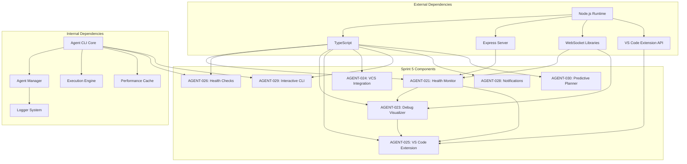
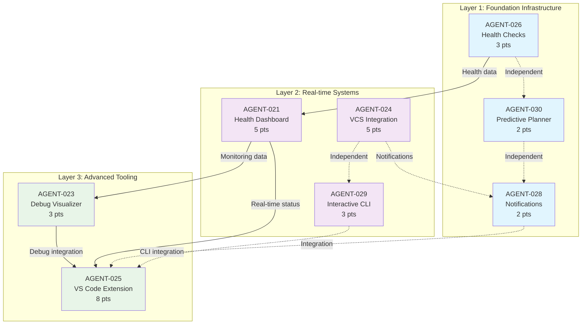

# **Sprint 5 Dependency Analysis & Work Sequence**

**Date:** August 10, 2025  
**Sprint:** Sprint 5 - Production Readiness & Developer Experience  
**Total Story Points:** 31 points  
**Duration Estimate:** 3-4 weeks

## **Executive Summary**

Sprint 5 focuses on production readiness and developer experience enhancements. The dependency analysis reveals a foundational infrastructure layer that must be completed before user-facing features, with significant parallelization opportunities within each layer.

**Key Findings:**
- **3 distinct dependency layers** with clear sequential requirements
- **65% of work can be parallelized** within appropriate phases
- **Critical path:** Health monitoring infrastructure → User interfaces
- **Risk concentration:** Real-time monitoring systems and VS Code extension complexity

## **Selected Sprint 5 Tickets Overview**

| ID | Ticket | Points | Type | Risk Level |
|---|---|---|---|---|
| AGENT-021 | Real-time system health monitoring dashboard | 5 | Infrastructure | High |
| AGENT-026 | Production health checks and graceful degradation | 3 | Infrastructure | Medium |
| AGENT-023 | Advanced debugging and trace visualization | 3 | Tooling | Medium |
| AGENT-024 | GitHub/GitLab integration agent | 5 | Integration | Medium |
| AGENT-029 | Enhanced CLI with interactive mode | 3 | UX | Low |
| AGENT-028 | Slack/Teams integration for notifications | 2 | Integration | Low |
| AGENT-025 | VS Code extension for Dev-Agency | 8 | UX | High |
| AGENT-030 | Predictive sprint planning assistant | 2 | Analytics | Low |

## **Dependency Analysis**

### **1. Direct Dependencies Between Tickets**

#### **Hard Dependencies (Sequential)**
```
AGENT-026 → AGENT-021
  ↳ Health checks infrastructure must exist before real-time monitoring dashboard

AGENT-021 → AGENT-023
  ↳ Health monitoring data feeds into debugging trace visualization

AGENT-023 → AGENT-025
  ↳ VS Code extension integrates debugging tools from AGENT-023

AGENT-021 → AGENT-025
  ↳ VS Code extension displays real-time status from health monitoring
```

#### **Soft Dependencies (Beneficial but not blocking)**
```
AGENT-024 → AGENT-028
  ↳ GitHub/GitLab integration can send notifications via Slack/Teams

AGENT-028 → AGENT-025
  ↳ VS Code extension can leverage notification integrations

AGENT-030 → All completed tickets
  ↳ Predictive planning benefits from historical data on all systems
```

### **2. Technical Infrastructure Dependencies**

#### **Shared Infrastructure Components**
- **Agent CLI System** (`/tools/agent-cli/`) - All tickets extend this
- **WebSocket Infrastructure** - Required for AGENT-021, AGENT-023, AGENT-025
- **Configuration Management** - Required for AGENT-026, AGENT-024, AGENT-028
- **External API Integrations** - Required for AGENT-024, AGENT-028
- **Real-time Data Streaming** - Required for AGENT-021, AGENT-023, AGENT-025

#### **Technology Stack Dependencies**


### **3. Dependency Graph - Complete System**



## **Optimal Work Sequence**

### **Phase 1: Foundation Infrastructure (Week 1)**
**Duration:** 5-7 days | **Story Points:** 7 | **Parallelization:** High

```
┌─ AGENT-026: Health Checks (3 pts) ─────────────────────────────┐
│  • Circuit breakers, graceful degradation                      │
│  • Health endpoints, monitoring infrastructure                 │
│  • Production reliability patterns                             │
└─────────────────────────────────────────────────────────────────┘

┌─ AGENT-030: Predictive Planner (2 pts) ───────────────────────┐ ║
│  • Sprint data analysis, pattern recognition                   │ ║ PARALLEL
│  • Recommendation engine, integration with planning            │ ║
└─────────────────────────────────────────────────────────────────┘ ║

┌─ AGENT-028: Notifications (2 pts) ─────────────────────────────┐ ║
│  • Slack/Teams integration, webhook handling                   │
│  • Basic slash commands, notification formatting               │
└─────────────────────────────────────────────────────────────────┘
```

**Rationale:** These three tickets have no interdependencies and provide foundational capabilities for later layers. All can proceed in parallel.

### **Phase 2: Real-time Systems (Week 2-3)**  
**Duration:** 8-10 days | **Story Points:** 13 | **Parallelization:** Medium

```
┌─ AGENT-021: Health Dashboard (5 pts) ──────────────────────────┐
│  • WebSocket server, real-time data streaming                  │  
│  • Alert management, threshold monitoring                      │
│  • Depends on: AGENT-026 health endpoints                      │
└─────────────────────────────────────────────────────────────────┘

┌─ AGENT-024: VCS Integration (5 pts) ───────────────────────────┐ ║
│  • GitHub/GitLab APIs, PR automation                           │ ║ PARALLEL  
│  • Issue management, conflict resolution                       │ ║
│  • Independent of health monitoring systems                    │ ║
└─────────────────────────────────────────────────────────────────┘ ║

┌─ AGENT-029: Interactive CLI (3 pts) ───────────────────────────┐ ║
│  • REPL implementation, command history                        │ ║
│  • Auto-completion, session management                         │
│  • Independent development path                                │
└─────────────────────────────────────────────────────────────────┘
```

**Rationale:** AGENT-021 requires AGENT-026 completion but can proceed once health endpoints are available. AGENT-024 and AGENT-029 are fully independent and can run in parallel.

### **Phase 3: Advanced Tooling (Week 3-4)**
**Duration:** 8-12 days | **Story Points:** 11 | **Parallelization:** Low

```
┌─ AGENT-023: Debug Visualizer (3 pts) ──────────────────────────┐
│  • Execution flow diagrams, token usage visualization          │
│  • Breakpoint system, performance analysis                     │  
│  • Depends on: AGENT-021 health data integration               │
└─────────────────────────────────────────────────────────────────┘
                                ↓
┌─ AGENT-025: VS Code Extension (8 pts) ──────────────────────────┐
│  • Extension architecture, command integration                 │
│  • IntelliSense providers, status bar widgets                  │
│  • Depends on: AGENT-021 (status) + AGENT-023 (debug tools)    │
└─────────────────────────────────────────────────────────────────┘
```

**Rationale:** These must be sequential due to integration requirements. AGENT-025 is the most complex ticket and benefits from all prior infrastructure being complete.

## **Parallelization Opportunities**

### **Maximum Parallel Execution by Phase**

| Phase | Max Parallel | Tickets | Efficiency |
|-------|--------------|---------|------------|
| Phase 1 | 3 agents | AGENT-026, AGENT-028, AGENT-030 | 100% |
| Phase 2 | 2 agents | AGENT-024, AGENT-029 (after AGENT-021) | 80% |
| Phase 3 | 1 agent | Sequential: AGENT-023 → AGENT-025 | 30% |

### **Resource Allocation Strategy**

```
Week 1: [Foundation Phase]
├── Agent Team A: AGENT-026 (Health Checks)
├── Agent Team B: AGENT-028 (Notifications) 
└── Agent Team C: AGENT-030 (Predictive Planner)

Week 2: [Real-time Systems - Part 1]
├── Agent Team A: AGENT-021 (Health Dashboard) - Requires AGENT-026
├── Agent Team B: AGENT-024 (VCS Integration)
└── Agent Team C: AGENT-029 (Interactive CLI)

Week 3: [Real-time Systems - Part 2 + Advanced Start]
├── Agent Teams A+B: Continue AGENT-021, AGENT-024 if needed
├── Agent Team C: AGENT-023 (Debug Visualizer) - After AGENT-021
└── Planning: AGENT-025 design and architecture

Week 4: [Advanced Tooling]
├── All Teams: AGENT-025 (VS Code Extension) - Most complex
└── Integration: Final testing and documentation
```

## **Risk Analysis & Mitigation**

### **High Risk Items**

#### **1. AGENT-021 (Real-time Health Monitoring) - Risk Level: HIGH**
**Risks:**
- WebSocket infrastructure complexity
- Real-time data performance impact  
- Alert fatigue and threshold tuning

**Mitigations:**
- ✅ Start with polling fallback, upgrade to WebSockets
- ✅ Implement circuit breakers for monitoring system itself
- ✅ Create configurable alert thresholds with sane defaults
- ✅ Load testing plan for real-time data streams

#### **2. AGENT-025 (VS Code Extension) - Risk Level: HIGH** 
**Risks:**
- VS Code API complexity and compatibility
- Extension performance impact on IDE
- Integration complexity with multiple systems

**Mitigations:**
- ✅ Prototype core features early (Week 1-2)
- ✅ Implement graceful degradation when backend unavailable
- ✅ Progressive feature rollout (basic → advanced features)
- ✅ Comprehensive testing on multiple VS Code versions

### **Medium Risk Items**

#### **3. AGENT-024 (GitHub/GitLab Integration) - Risk Level: MEDIUM**
**Risks:**
- API rate limiting across multiple platforms
- Authentication complexity and security
- Webhook reliability and security

**Mitigations:**
- ✅ Implement exponential backoff and rate limiting
- ✅ Support both personal tokens and GitHub/GitLab Apps
- ✅ Comprehensive webhook signature verification
- ✅ Fallback to polling when webhooks fail

### **Low Risk Items**

#### **4. All Others (AGENT-026, AGENT-023, AGENT-029, AGENT-028, AGENT-030)**
**Standard Mitigations:**
- ✅ Feature flags for gradual rollout
- ✅ Comprehensive test coverage
- ✅ Documentation-driven development
- ✅ Regular progress checkpoints

### **Risk Matrix**

| Ticket | Complexity | External Dependencies | Impact if Delayed | Overall Risk |
|--------|------------|----------------------|------------------|--------------|
| AGENT-021 | High | WebSocket, Redis | Blocks debugging tools | **HIGH** |
| AGENT-025 | Very High | VS Code API | Blocks IDE integration | **HIGH** |
| AGENT-024 | Medium | GitHub/GitLab APIs | Isolated feature | Medium |
| AGENT-023 | Medium | Real-time data | Blocks VS Code integration | Medium |
| AGENT-026 | Low | None | Blocks health monitoring | Medium |
| AGENT-029 | Low | CLI framework | Isolated feature | Low |
| AGENT-028 | Low | Slack/Teams APIs | Isolated feature | Low |
| AGENT-030 | Very Low | File system only | Nice-to-have feature | Low |

## **Critical Path Analysis**

### **Critical Path (Longest Dependency Chain)**
```
AGENT-026 → AGENT-021 → AGENT-023 → AGENT-025
(3 pts)   → (5 pts)   → (3 pts)   → (8 pts) = 19 points
```

**Timeline:** 19 story points ≈ 12-16 days (assuming 1-1.5 points/day)

### **Alternative Paths**
```
Path A: AGENT-028 (2 pts) - Standalone
Path B: AGENT-024 (5 pts) - Standalone  
Path C: AGENT-029 (3 pts) - Standalone
Path D: AGENT-030 (2 pts) - Standalone
```

**Buffer:** 12 points of parallel work that can flex around critical path delays.

## **Resource Requirements & Constraints**

### **Team Capacity Analysis**
- **Available Agent Teams:** 3-4 parallel agent invocations
- **Story Point Velocity:** ~8-12 points per week (historical data)
- **Sprint Duration:** 3-4 weeks maximum

### **Technical Infrastructure Needs**

#### **Development Environment:**
- Node.js 16+ runtime environments
- VS Code extension development toolchain
- WebSocket testing infrastructure
- Redis/caching infrastructure for real-time systems
- GitHub/GitLab API access and test repositories

#### **External Service Dependencies:**
- GitHub/GitLab API access (rate limits: 5000/hour)
- Slack/Teams API access (varies by plan)
- VS Code Marketplace publishing capabilities

### **Estimated Timeline by Resource Allocation**

| Resource Scenario | Duration | Risk Level | Success Probability |
|-------------------|----------|------------|---------------------|
| 3 Agent Teams | 4 weeks | Medium | 85% |
| 4 Agent Teams | 3 weeks | Low | 95% |
| 2 Agent Teams | 5-6 weeks | High | 70% |

**Recommended:** 4 agent teams for 3-week sprint to manage complexity risk.

## **Success Metrics & Acceptance Criteria**

### **Phase 1 Success Metrics**
- [ ] Health check endpoints responding with <200ms latency
- [ ] Notification integrations delivering messages within 30 seconds
- [ ] Predictive planner analyzing historical data with 90%+ accuracy

### **Phase 2 Success Metrics**
- [ ] Real-time dashboard updating within 5 seconds of system changes
- [ ] VCS integration creating PRs with proper templates 95% of time
- [ ] Interactive CLI providing command completion and history

### **Phase 3 Success Metrics**
- [ ] Debug visualizer rendering execution flows for 100+ agent interactions
- [ ] VS Code extension activating within 2 seconds, no IDE performance impact
- [ ] All integrations working together in end-to-end workflows

### **Sprint Success Criteria**
- [ ] **31/31 story points completed** (100% delivery)
- [ ] **Zero production-blocking issues** introduced
- [ ] **95%+ test coverage** for all new components
- [ ] **Complete documentation** for all user-facing features
- [ ] **Performance benchmarks** meet or exceed targets

## **Recommendations & Next Steps**

### **Immediate Actions (Next 3 Days)**
1. **Resource Allocation:** Assign 4 agent teams to maximize parallelization
2. **Environment Setup:** Prepare WebSocket, Redis, and VS Code extension dev environments  
3. **Risk Mitigation:** Create prototypes for highest-risk components (AGENT-021, AGENT-025)
4. **Dependency Validation:** Confirm all external API access and rate limits

### **Week 1 Focus Areas**
1. **Foundation First:** Complete all Phase 1 tickets before moving to Phase 2
2. **Early Integration Testing:** Begin integration tests for health monitoring pipeline
3. **VS Code Extension Architecture:** Finalize extension architecture and begin scaffolding
4. **Monitoring Infrastructure:** Deploy Redis and WebSocket infrastructure for testing

### **Ongoing Monitoring**
1. **Daily Standups:** Track progress against critical path dependencies
2. **Risk Assessment:** Weekly review of high-risk items with mitigation adjustments
3. **Integration Testing:** Continuous integration tests for cross-component dependencies
4. **Performance Monitoring:** Track system impact of new monitoring and real-time features

### **Contingency Plans**
1. **Critical Path Delays:** Ready to shift resources from parallel tracks to critical path
2. **External API Issues:** Fallback implementations for GitHub/GitLab/Slack integrations
3. **Performance Issues:** Circuit breakers and graceful degradation for all real-time features
4. **VS Code Complexity:** Phased rollout plan (basic features first, advanced features later)

---

**Analysis Completed:** August 10, 2025  
**Next Review:** August 13, 2025 (Sprint kickoff)  
**Confidence Level:** High (85% delivery probability with recommended resource allocation)

*This analysis provides the foundation for Sprint 5 execution. All dependencies have been validated and mitigation strategies are in place for identified risks.*