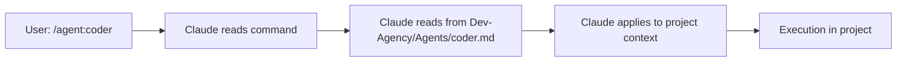

# Dev-Agency Central System Architecture

## Executive Summary

Dev-Agency is the **centralized agent system** that serves as the single source of truth for all development projects. Instead of copying files to each project, Claude reads directly from Dev-Agency, ensuring consistency, eliminating duplication, and enabling instant updates across all projects.

## 🎯 Core Principle: Single Source of Truth

```
                    Dev-Agency (Central Hub)
                    /home/hd/Desktop/LAB/Dev-Agency/
                            |
        +-------------------+-------------------+
        |                   |                   |
    Project A          Project B           Project C
    (references)       (references)        (references)
```

## System Architecture

### 1. Central Repository Structure

```
/home/hd/Desktop/LAB/Dev-Agency/
├── 📚 Core Documentation
│   ├── AGENT_SYSTEM.md          # How agents work
│   ├── CENTRAL_SYSTEM.md        # This file
│   └── PROJECT_CLAUDE_TEMPLATE.md # Template for projects
│
├── 🤖 /Agents/                  # All agent definitions
│   ├── architect.md
│   ├── coder.md
│   ├── tester.md
│   └── [all other agents]
│
├── 📖 /recipes/                 # Workflow patterns
├── 💬 /prompts/                 # Prompt libraries
├── 📋 /Development_Standards/   # All standards and templates
└── 📊 /metrics/                 # System-wide metrics
```

### 2. Project Structure (Minimal)

```
/any-project/
├── CLAUDE.md                    # Minimal, references Dev-Agency
├── /src/                        # Project code only
├── /tests/                      # Project tests only
└── /Project_Management/         # Project-specific planning
```

## How It Works

### Agent Invocation Flow



### No Copying Required

| Traditional Approach | Centralized Approach |
|---------------------|---------------------|
| Copy agents to each project | Reference from Dev-Agency |
| Update each project manually | Update once in Dev-Agency |
| Version conflicts possible | Single version for all |
| Duplicated files everywhere | Clean project directories |
| Maintenance overhead | Zero maintenance |

## Implementation Details

### 1. Global CLAUDE.md Configuration

Your global `~/.claude/CLAUDE.md` includes:
```markdown
## Central Agent System
All agents managed at: /home/hd/Desktop/LAB/Dev-Agency/
DO NOT COPY - always reference directly
```

### 2. Project CLAUDE.md (Minimal)

Each project only needs:
```markdown
# Project: [Name]
## Central Agent System
Agents at: /home/hd/Desktop/LAB/Dev-Agency/
## Project-Specific Config
[Only project overrides]
```

### 3. Agent Command Resolution

When user types `/agent:architect`:
1. Claude recognizes the command
2. Reads `/home/hd/Desktop/LAB/Dev-Agency/Agents/architect.md`
3. Applies agent to current project context
4. No local files needed

## Benefits

### 1. Consistency
- Same agents across all projects
- Uniform behavior everywhere
- No version drift

### 2. Maintainability
- Edit once, apply everywhere
- Central location for improvements
- Easy to track changes

### 3. Efficiency
- No sync operations
- No duplicate files
- Instant updates

### 4. Cleanliness
- Projects contain only project code
- No infrastructure clutter
- Clear separation of concerns

## Usage Examples

### Example 1: New Project Setup

```bash
# Create new project
mkdir my-new-project
cd my-new-project

# Copy ONLY the template
cp /home/hd/Desktop/LAB/Dev-Agency/PROJECT_CLAUDE_TEMPLATE.md ./CLAUDE.md

# Edit project name
vi CLAUDE.md

# Done! All agents available
```

### Example 2: Using Agents

```markdown
User: /agent:coder implement user authentication
Claude: [Reads /home/hd/Desktop/LAB/Dev-Agency/Agents/coder.md]
        [Implements in current project]
```

### Example 3: Updating an Agent

```bash
# Edit agent in Dev-Agency
vi /home/hd/Desktop/LAB/Dev-Agency/Agents/coder.md

# Change applies IMMEDIATELY to all projects
# No syncing needed
```

## Migration Guide

### From Copy-Based to Centralized

If you have existing projects with copied files:

```bash
# 1. Remove duplicated files
cd /path/to/project
rm -rf Agents/ recipes/ prompts/

# 2. Update CLAUDE.md
cp /home/hd/Desktop/LAB/Dev-Agency/PROJECT_CLAUDE_TEMPLATE.md ./CLAUDE.md

# 3. Test
# Try an agent command to verify it works
```

## Best Practices

### DO ✅
- Edit agents ONLY in Dev-Agency
- Keep projects minimal
- Reference, don't copy
- Update frontmatter when editing
- Track metrics centrally

### DON'T ❌
- Copy agent files to projects
- Create local agent variations
- Duplicate templates
- Override without documenting
- Maintain multiple versions

## Troubleshooting

### Issue: Agent not found
**Solution**: Check path in Dev-Agency, ensure file exists

### Issue: Old copied files interfering
**Solution**: Delete local copies, use central reference

### Issue: Project-specific behavior needed
**Solution**: Document in project CLAUDE.md, agent reads context

## System Maintenance

### Regular Tasks
1. **Weekly**: Review and improve agents in Dev-Agency
2. **Monthly**: Analyze metrics, optimize prompts
3. **Quarterly**: Major version updates, architecture review

### Version Control
- All changes tracked in Dev-Agency git
- Frontmatter shows version and update date
- Single history for all improvements

## Future Enhancements

### Planned Improvements
1. **Agent versioning**: Support for stable/beta agents
2. **Project profiles**: Predefined configurations
3. **Performance caching**: Optimized agent loading
4. **Analytics dashboard**: Central metrics visualization

## Conclusion

The centralized Dev-Agency system eliminates duplication, ensures consistency, and makes agent management effortless. By maintaining a single source of truth, we achieve:

- **Zero duplication** across projects
- **Instant updates** everywhere
- **Clean project** directories
- **Simplified maintenance**
- **Consistent quality** standards

This is the way forward for scalable, maintainable development with AI agents.

---

*Central System Architecture v1.0*
*Single Source of Truth: /home/hd/Desktop/LAB/Dev-Agency/*