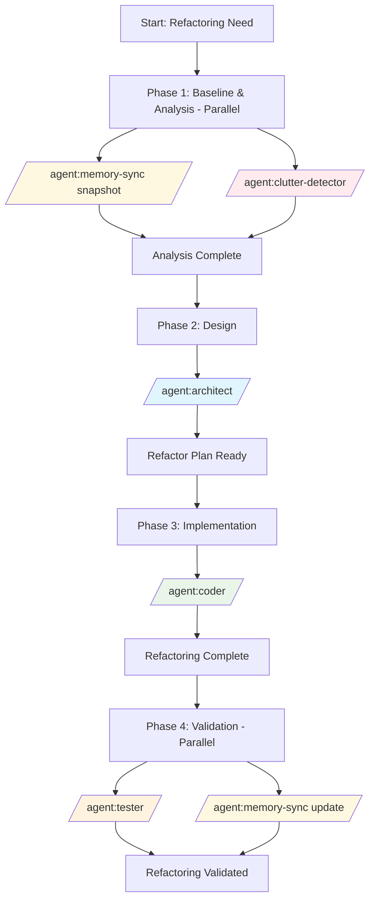

# Recipe: Complex Refactoring Workflow

## Overview
A systematic approach to large-scale code reorganization that prioritizes safety, backward compatibility, and code quality improvements through strategic parallel agent execution.

## Philosophy
**"Snapshot, Analyze, Refactor, Validate"** - Ensure safe refactoring through comprehensive analysis, incremental changes, and continuous validation with rollback capabilities at every step.

## Use Case
- Monolithic to modular architecture transformation
- Legacy code modernization
- Technical debt reduction
- Performance-critical refactoring
- Dead code elimination
- Duplicate code consolidation
- Architecture smell resolution

## Agent Sequence



## Step-by-Step Process

### Phase 1: Baseline & Analysis (Parallel Agents)
**Status**: `BACKLOG` → `TODO` → `IN_PROGRESS`
**Duration**: 30-45 minutes (parallel)

#### `/agent:memory-sync` (Snapshot Creation)
**Anti-Clutter Check**: Create comprehensive snapshot before changes
- Capture current code structure in knowledge graph
- Document existing relationships and dependencies
- Create rollback reference point
- Index current performance metrics

#### `/agent:clutter-detector` (Code Analysis)
**Anti-Clutter Check**: Identify all redundancy and technical debt
- Identify duplicate code patterns
- Find dead code and unused dependencies
- Detect architecture smells
- Analyze complexity metrics
- Generate refactoring opportunities list

**Output**: Complete analysis report with snapshot reference

### Phase 2: Refactoring Design (Solo Agent)
**Agent**: `/agent:architect`
**Duration**: 45-60 minutes

1. **Target Architecture Design**
   - Define new module boundaries
   - Design interface contracts
   - Plan migration phases
   - Create dependency graph

2. **Migration Strategy**
   - Define incremental refactoring steps
   - Plan feature flag implementation
   - Design backward compatibility layer
   - Create rollback triggers

3. **Risk Assessment**
   - Identify high-risk changes
   - Define validation criteria
   - Plan performance benchmarks
   - Create testing strategy

**Output**: Comprehensive refactoring plan with risk mitigation

### Phase 3: Implementation (Solo Agent)
**Agent**: `/agent:coder`
**Duration**: 2-4 hours

1. **Incremental Refactoring**
   - Extract interfaces and abstractions
   - Move code to new module structure
   - Implement adapter patterns for compatibility
   - Add feature flags for gradual rollout

2. **Code Quality Improvements**
   - Apply SOLID principles
   - Reduce cyclomatic complexity
   - Improve naming conventions
   - Add comprehensive comments

3. **Technical Debt Resolution**
   - Remove dead code identified in Phase 1
   - Consolidate duplicate patterns
   - Update deprecated dependencies
   - Optimize performance bottlenecks

**Output**: Refactored codebase with backward compatibility

### Phase 4: Validation & Tracking (Parallel Agents)
**Duration**: 45-60 minutes (parallel)

#### `/agent:tester` (Comprehensive Testing)
- Run existing test suite for regression
- Create new tests for refactored modules
- Performance comparison testing
- Integration testing with feature flags
- Backward compatibility validation

#### `/agent:memory-sync` (Update Tracking)
- Sync refactored code structure
- Update relationships in knowledge graph
- Document architectural decisions
- Track performance improvements
- Create searchable refactoring history

**Output**: Validated refactoring with complete tracking

## Parallel Execution Opportunities

### High-Impact Parallel Phases
1. **Phase 1**: `memory-sync` + `clutter-detector` (30-45 min parallel)
2. **Phase 4**: `tester` + `memory-sync` (45-60 min parallel)

### Time Savings
- Sequential execution: ~6-8 hours
- Parallel execution: ~4-6 hours
- **Efficiency gain**: ~33% time reduction

## Common Context Template

```markdown
## Refactoring Context
- **Current State**: [Description of existing code]
- **Target State**: [Desired architecture]
- **Scope**: [Files/modules affected]
- **Constraints**: [Backward compatibility requirements]

## Technical Details
- **Language/Framework**: [Technology stack]
- **Test Coverage**: [Current coverage %]
- **Performance Baseline**: [Current metrics]
- **Dependencies**: [External systems affected]

## Risk Factors
- **Critical Paths**: [Business-critical functionality]
- **Integration Points**: [External dependencies]
- **Data Migration**: [If applicable]
- **Rollback Strategy**: [Defined triggers and procedures]
```

## Anti-Clutter Checks

### Before Refactoring
- [ ] Run clutter-detector to identify all redundancy
- [ ] Check for existing similar implementations
- [ ] Verify no parallel refactoring efforts
- [ ] Confirm single source of truth for each concept

### During Refactoring
- [ ] Consolidate duplicate code patterns
- [ ] Remove all identified dead code
- [ ] Ensure DRY principle compliance
- [ ] Create reusable abstractions

### After Refactoring
- [ ] Verify no new duplication introduced
- [ ] Confirm all tests still pass
- [ ] Check performance hasn't degraded
- [ ] Update documentation (don't create new)

## Success Criteria

- [ ] All existing tests pass
- [ ] Code coverage maintained or improved
- [ ] Performance metrics equal or better
- [ ] Zero production incidents
- [ ] Backward compatibility maintained
- [ ] Technical debt measurably reduced
- [ ] Complexity metrics improved
- [ ] Dead code eliminated
- [ ] Duplicates consolidated
- [ ] Knowledge graph updated

## Time Estimates

### Small Refactoring (1-3 files)
- Phase 1: 15-20 minutes
- Phase 2: 30 minutes
- Phase 3: 1-2 hours
- Phase 4: 30 minutes
- **Total**: 2-3 hours

### Medium Refactoring (Module-level)
- Phase 1: 30-45 minutes
- Phase 2: 45-60 minutes
- Phase 3: 2-4 hours
- Phase 4: 45-60 minutes
- **Total**: 4-6 hours

### Large Refactoring (System-wide)
- Phase 1: 60-90 minutes
- Phase 2: 2-3 hours
- Phase 3: 6-8 hours
- Phase 4: 90-120 minutes
- **Total**: 10-14 hours

## Common Issues and Solutions

| Issue | Solution | Prevention |
|-------|----------|------------|
| Breaking changes | Use feature flags and adapters | Comprehensive impact analysis |
| Performance degradation | Benchmark before/after, optimize | Performance tests in Phase 4 |
| Test failures | Fix incrementally, maintain coverage | Run tests continuously |
| Merge conflicts | Small, frequent commits | Coordinate with team |
| Rollback needed | Use snapshot from Phase 1 | Clear rollback triggers |
| Scope creep | Stick to refactoring plan | Well-defined Phase 2 plan |

## Example Invocation

### Monolithic Service to Modules Refactoring

```bash
# Phase 1: Parallel Analysis
/agent:memory-sync
Create comprehensive snapshot of UserService monolith before refactoring

/agent:clutter-detector
Analyze UserService.js (2000+ lines) for:
- Duplicate patterns
- Dead code
- Complexity hotspots
- Coupling issues

# Phase 2: Architecture Design
/agent:architect
Design modular architecture for UserService refactoring:
Current: Single 2000-line class handling auth, profile, preferences
Target: Separate modules with clear boundaries
Constraints: Must maintain API compatibility

# Phase 3: Implementation
/agent:coder
Refactor UserService based on architecture plan:
- Extract AuthenticationModule
- Extract ProfileModule  
- Extract PreferencesModule
- Create UserServiceFacade for compatibility
- Add feature flags for gradual rollout

# Phase 4: Parallel Validation
/agent:tester
Comprehensive testing of refactored modules:
- Regression tests for all endpoints
- Integration tests with feature flags
- Performance comparison tests

/agent:memory-sync
Update knowledge graph with new modular structure
```

## Rollback Strategies

### Immediate Rollback (Critical Issues)
1. Disable feature flags
2. Revert to snapshot reference
3. Restore from Phase 1 baseline
4. Notify stakeholders

### Gradual Rollback (Performance Issues)
1. Reduce feature flag percentage
2. Monitor metrics
3. Fix issues in parallel
4. Re-enable gradually

### Partial Rollback (Specific Module Issues)
1. Rollback affected module only
2. Keep successful refactorings
3. Fix and re-deploy module
4. Maintain overall progress

## Recipe Variations

### Database Schema Refactoring
- Add `/agent:integration` for data migration
- Extended validation phase
- Blue-green deployment strategy

### Frontend Component Refactoring
- Focus on UI/UX consistency
- Visual regression testing
- Component library extraction

### API Refactoring
- Versioning strategy
- Deprecation notices
- Client compatibility testing

### Microservice Extraction
- Add `/agent:integration` for service boundaries
- Network latency considerations
- Distributed transaction handling

---

*This recipe ensures safe, systematic refactoring with comprehensive analysis, incremental implementation, and continuous validation while maintaining rollback capabilities throughout the process.*