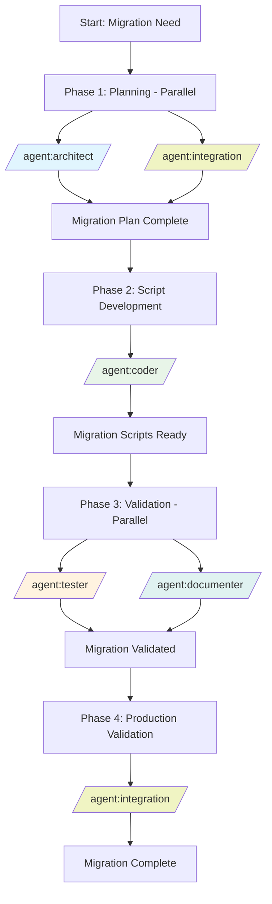

# Recipe: Database Migration Workflow

## Overview
A systematic approach to executing complex database schema changes with zero downtime, data integrity preservation, and comprehensive rollback capabilities using parallel agent coordination.

## Philosophy
**"Plan Twice, Migrate Once, Validate Always"** - Ensure database migrations are thoroughly planned, safely executed, and continuously validated with multiple rollback points throughout the process.

## Use Case
- Schema restructuring and optimization
- Single-tenant to multi-tenant migration
- Database platform migration (MySQL to PostgreSQL)
- Table partitioning implementation
- Index optimization and reorganization
- Data type migrations
- Denormalization for performance
- Compliance-driven schema changes

## Agent Sequence



## Step-by-Step Process

### Phase 1: Planning & Analysis (Parallel Agents)
**Status**: `BACKLOG` → `TODO` → `IN_PROGRESS`
**Duration**: 60-90 minutes (parallel)

#### `/agent:architect` (Schema Design)
- **Current State Analysis**
  - Document existing schema
  - Identify dependencies and constraints
  - Analyze data volumes and growth patterns
  - Review application touchpoints

- **Target Schema Design**
  - Design optimized schema structure
  - Plan data transformation logic
  - Define migration phases
  - Create compatibility matrix

#### `/agent:integration` (System Impact Analysis)
- **Application Integration**
  - Identify all dependent services
  - Map ORM/query impacts
  - Plan API versioning strategy
  - Design backward compatibility layer

- **Infrastructure Planning**
  - Estimate migration duration
  - Calculate resource requirements
  - Plan replication topology changes
  - Design monitoring strategy

**Output**: Complete migration plan with risk assessment

### Phase 2: Migration Script Development (Solo Agent)
**Agent**: `/agent:coder`
**Duration**: 2-3 hours

1. **Schema Migration Scripts**
   ```sql
   -- Forward migration
   BEGIN TRANSACTION;
   
   -- Add new columns with defaults
   ALTER TABLE users ADD COLUMN tenant_id UUID DEFAULT gen_random_uuid();
   
   -- Create new indexes
   CREATE INDEX CONCURRENTLY idx_users_tenant ON users(tenant_id);
   
   -- Add constraints after backfill
   ALTER TABLE users ALTER COLUMN tenant_id SET NOT NULL;
   
   COMMIT;
   ```

2. **Data Migration Scripts**
   ```sql
   -- Batch data migration to prevent locks
   DO $$
   DECLARE
     batch_size INTEGER := 10000;
     offset_val INTEGER := 0;
   BEGIN
     LOOP
       UPDATE users 
       SET tenant_id = organizations.tenant_id
       FROM organizations
       WHERE users.org_id = organizations.id
       AND users.id IN (
         SELECT id FROM users 
         WHERE tenant_id IS NULL
         LIMIT batch_size
       );
       
       EXIT WHEN NOT FOUND;
       PERFORM pg_sleep(0.1); -- Prevent replication lag
     END LOOP;
   END $$;
   ```

3. **Rollback Scripts**
   ```sql
   -- Rollback migration
   BEGIN TRANSACTION;
   
   -- Remove constraints first
   ALTER TABLE users DROP CONSTRAINT IF EXISTS users_tenant_id_fkey;
   
   -- Drop indexes
   DROP INDEX IF EXISTS idx_users_tenant;
   
   -- Remove columns
   ALTER TABLE users DROP COLUMN IF EXISTS tenant_id;
   
   COMMIT;
   ```

**Output**: Complete migration, rollback, and validation scripts

### Phase 3: Testing & Documentation (Parallel Agents)
**Duration**: 60-90 minutes (parallel)

#### `/agent:tester` (Migration Testing)
- **Test Environment Validation**
  - Execute migration on test database
  - Verify data integrity
  - Performance benchmark testing
  - Rollback procedure testing
  - Application integration testing

- **Test Scenarios**
  ```javascript
  describe('Database Migration Tests', () => {
    it('should preserve all existing data', async () => {
      const preMigrationCount = await db.query('SELECT COUNT(*) FROM users');
      await runMigration();
      const postMigrationCount = await db.query('SELECT COUNT(*) FROM users');
      expect(postMigrationCount).toBe(preMigrationCount);
    });
    
    it('should maintain referential integrity', async () => {
      // Test foreign key constraints
    });
    
    it('should complete within performance targets', async () => {
      // Test migration duration
    });
  });
  ```

#### `/agent:documenter` (Migration Documentation)
- **Runbook Creation**
  - Step-by-step execution guide
  - Monitoring checkpoints
  - Rollback triggers and procedures
  - Post-migration validation steps

- **Communication Plan**
  - Stakeholder notifications
  - Maintenance window announcement
  - Status update templates
  - Incident response procedures

**Output**: Tested migration with complete runbook

### Phase 4: Production Validation (Solo Agent)
**Agent**: `/agent:integration`
**Duration**: 30-60 minutes (post-migration)

1. **Pre-Migration Validation**
   - Backup verification
   - Replication health check
   - Application readiness verification
   - Monitoring systems active

2. **Migration Execution Monitoring**
   - Real-time progress tracking
   - Performance metrics monitoring
   - Replication lag monitoring
   - Error detection and alerting

3. **Post-Migration Validation**
   - Data integrity verification
   - Application functionality testing
   - Performance comparison
   - Rollback readiness confirmation

**Output**: Production validation report with go/no-go decision

## Zero-Downtime Strategies

### Strategy 1: Blue-Green Database Migration
```sql
-- Step 1: Create shadow schema
CREATE SCHEMA green_schema;

-- Step 2: Replicate structure
-- Copy all tables to green_schema

-- Step 3: Set up triggers for dual writes
CREATE TRIGGER sync_to_green
AFTER INSERT OR UPDATE OR DELETE ON blue_schema.users
FOR EACH ROW EXECUTE FUNCTION sync_green_schema();

-- Step 4: Backfill historical data
-- Batch copy with monitoring

-- Step 5: Validate and switch
-- Update application connection strings
```

### Strategy 2: Expand-Contract Pattern
1. **Expand Phase**: Add new schema elements without removing old
2. **Transition Phase**: Dual-write to both old and new
3. **Contract Phase**: Remove old schema after validation

### Strategy 3: Rolling Migration with Read Replicas
1. Migrate read replicas first
2. Validate on read traffic
3. Promote replica to primary
4. Migrate former primary

## Parallel Execution Opportunities

### High-Impact Parallel Phases
1. **Phase 1**: Architecture + Integration planning (saves 45-60 min)
2. **Phase 3**: Testing + Documentation (saves 45-60 min)

### Sequential Requirements
- Planning must complete before script development
- Scripts must complete before testing
- Testing must complete before production execution

## Common Context Template

```markdown
## Migration Context
- **Database Platform**: [PostgreSQL/MySQL/MongoDB]
- **Current Version**: [Database version]
- **Data Volume**: [Table sizes and row counts]
- **Migration Type**: [Schema/Data/Platform]

## Technical Requirements
- **Downtime Tolerance**: [Zero/Minimal/Maintenance Window]
- **Rollback Time**: [RTO requirement]
- **Data Loss Tolerance**: [RPO requirement]
- **Performance Impact**: [Acceptable degradation]

## Risk Factors
- **Critical Tables**: [High-traffic tables]
- **Peak Usage Times**: [When to avoid migration]
- **Dependent Systems**: [Services that need notification]
- **Compliance Requirements**: [Audit/regulatory needs]
```

## Safety Measures & Rollback Procedures

### Pre-Migration Safety
- [ ] Full backup completed and verified
- [ ] Rollback scripts tested
- [ ] Migration tested in staging
- [ ] Monitoring alerts configured
- [ ] Team on standby

### Rollback Triggers
| Trigger | Threshold | Action |
|---------|-----------|--------|
| Migration duration | >2x estimate | Evaluate rollback |
| Replication lag | >5 seconds | Pause migration |
| Error rate | >1% | Immediate rollback |
| Application errors | Any critical | Immediate rollback |
| Data corruption | Any detected | Immediate rollback |

### Rollback Procedures
```bash
# Immediate Rollback (<5 minutes)
./rollback_immediate.sh

# Standard Rollback (<30 minutes)
./rollback_standard.sh --validate

# Point-in-time Recovery (>30 minutes)
./restore_from_backup.sh --timestamp="2025-08-09 10:00:00"
```

## Success Criteria

### Migration Success
- [ ] All schema changes applied successfully
- [ ] Data integrity validated (checksums match)
- [ ] Zero data loss confirmed
- [ ] Application functionality verified
- [ ] Performance targets met or exceeded
- [ ] Rollback capability maintained

### Validation Metrics
- [ ] Row counts match pre-migration
- [ ] Foreign key constraints valid
- [ ] Indexes rebuilt successfully
- [ ] Query performance acceptable
- [ ] Replication caught up
- [ ] No orphaned data

## Time Estimates

### Small Migration (<1GB, <10 tables)
- Phase 1: 45-60 minutes
- Phase 2: 1-2 hours
- Phase 3: 45-60 minutes
- Phase 4: 30 minutes
- **Total**: 3-4 hours

### Medium Migration (1-50GB, 10-50 tables)
- Phase 1: 60-90 minutes
- Phase 2: 2-3 hours
- Phase 3: 60-90 minutes
- Phase 4: 45-60 minutes
- **Total**: 5-6 hours

### Large Migration (>50GB, >50 tables)
- Phase 1: 2-3 hours
- Phase 2: 4-6 hours
- Phase 3: 2-3 hours
- Phase 4: 1-2 hours
- **Total**: 9-14 hours

## Common Issues and Solutions

| Issue | Detection | Solution | Prevention |
|-------|-----------|----------|------------|
| Lock contention | Slow queries | Use CONCURRENTLY option | Off-peak execution |
| Replication lag | Monitoring alerts | Reduce batch size | Smaller batches |
| Disk space | Space monitoring | Pre-allocate space | Capacity planning |
| Index bloat | Size increase >50% | REINDEX CONCURRENTLY | Regular maintenance |
| Constraint violations | Migration errors | Data cleanup first | Pre-validation |
| Application timeouts | Error logs | Increase timeouts | Load testing |

## Example Invocation

### Multi-Tenant Migration Example

```bash
# Phase 1: Parallel Planning
/agent:architect
Design multi-tenant schema migration:
- Current: Single-tenant with separate databases
- Target: Multi-tenant with row-level security
- Tables: users, organizations, projects, documents
- Constraints: Zero downtime, maintain performance

/agent:integration
Analyze system impact:
- 15 microservices affected
- 3 different ORMs in use
- API versioning required
- Real-time features must continue

# Phase 2: Script Development
/agent:coder
Develop migration scripts based on plans:
[Include architecture and integration plans]

Requirements:
- Batch processing for 10M+ rows
- Maintain referential integrity
- Progressive rollout capability
- Monitoring hooks included

# Phase 3: Parallel Validation
/agent:tester
Test migration scripts:
- Data integrity validation
- Performance benchmarking
- Rollback testing
- Application integration tests

/agent:documenter
Create migration runbook:
- Execution checklist
- Monitoring guide
- Rollback procedures
- Communication templates

# Phase 4: Production Validation
/agent:integration
Monitor and validate production migration:
- Real-time monitoring
- Progressive validation
- Performance verification
- Go/no-go decision points
```

## Advanced Patterns

### Online Schema Change Tools
```bash
# Using pt-online-schema-change (MySQL)
pt-online-schema-change \
  --alter "ADD COLUMN tenant_id VARCHAR(36)" \
  --execute \
  D=mydb,t=users

# Using pg-osc (PostgreSQL)
pg-osc \
  --table users \
  --alter "ADD COLUMN tenant_id UUID" \
  --execute
```

### Migration State Machine
```python
class MigrationState(Enum):
    PENDING = "pending"
    RUNNING = "running"
    VALIDATING = "validating"
    COMPLETED = "completed"
    FAILED = "failed"
    ROLLED_BACK = "rolled_back"
```

### Progressive Rollout
```sql
-- Feature flag based migration
UPDATE users 
SET use_new_schema = true
WHERE id IN (
  SELECT id FROM users 
  WHERE org_id IN (SELECT id FROM organizations WHERE pilot_program = true)
);
```

## Recipe Variations

### Read-Heavy System Migration
- Migrate read replicas first
- Validate with read traffic
- Minimal write downtime

### Write-Heavy System Migration
- Use change data capture (CDC)
- Queue writes during migration
- Replay after migration

### Cross-Platform Migration
- Use ETL tools
- Schema translation layer
- Data type mapping

### Compliance-Driven Migration
- Audit trail for all changes
- Encryption during migration
- Data residency compliance

---

*This recipe ensures safe, systematic database migrations with zero downtime through comprehensive planning, testing, and validation with multiple rollback points throughout the process.*