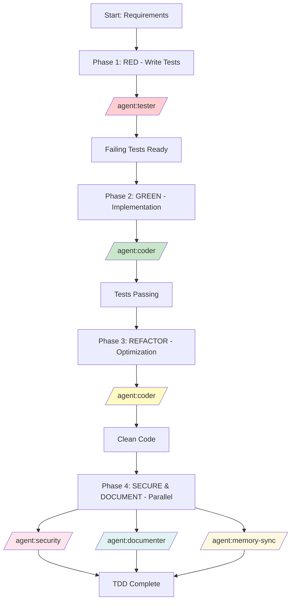

# Recipe: TDD Development Cycle

## Overview
A disciplined test-driven development approach that ensures code quality, maintainability, and correctness by writing tests before implementation, with integrated security review and documentation.

## Philosophy
**"Red, Green, Refactor, Secure"** - Write failing tests first (Red), implement minimal code to pass (Green), improve code quality (Refactor), then validate security and document thoroughly (Secure).

## Use Case
- New feature development requiring high reliability
- Algorithm implementation with complex logic
- API endpoint development with strict contracts
- Refactoring with confidence
- Bug fixes with regression prevention
- Mission-critical code requiring high coverage
- Educational development for best practices

## Agent Sequence



## Step-by-Step Process

### Phase 1: RED - Write Failing Tests (Solo Agent)
**Status**: `BACKLOG` → `TODO` → `IN_PROGRESS`
**Agent**: `/agent:tester`
**Duration**: 30-60 minutes

1. **Test Specification**
   ```javascript
   // Define test cases before any implementation
   describe('PaymentProcessor', () => {
     it('should process valid credit card payment', () => {
       // Test will fail - no implementation yet
     });
     
     it('should reject expired cards', () => {
       // Test will fail - no implementation yet
     });
     
     it('should handle network failures gracefully', () => {
       // Test will fail - no implementation yet
     });
   });
   ```

2. **Edge Cases & Error Scenarios**
   - Boundary conditions testing
   - Error handling scenarios
   - Invalid input validation
   - Concurrency issues
   - Performance requirements

3. **BDD Scenarios (Optional)**
   ```gherkin
   Feature: Payment Processing
     Scenario: Successful payment
       Given a valid credit card
       When the payment is processed
       Then the transaction should be approved
       And the receipt should be generated
   ```

**Output**: Complete test suite with all tests failing (RED state)

### Phase 2: GREEN - Minimal Implementation (Solo Agent)
**Agent**: `/agent:coder`
**Duration**: 45-90 minutes

1. **Minimal Code to Pass Tests**
   ```javascript
   // Write ONLY enough code to make tests pass
   class PaymentProcessor {
     processPayment(card, amount) {
       // Minimal implementation
       if (this.isExpired(card)) {
         throw new Error('Card expired');
       }
       return { status: 'approved', transactionId: '12345' };
     }
   }
   ```

2. **No Over-Engineering**
   - Focus only on passing tests
   - Avoid premature optimization
   - Don't add untested features
   - Keep implementation simple

3. **Verify All Tests Pass**
   - Run complete test suite
   - Ensure 100% test passage
   - No skipped tests allowed

**Output**: Minimal working implementation with all tests passing (GREEN state)

### Phase 3: REFACTOR - Code Improvement (Solo Agent)
**Agent**: `/agent:coder`
**Duration**: 30-45 minutes

1. **Code Quality Improvements**
   ```javascript
   // Refactored for better design
   class PaymentProcessor {
     constructor(gateway, validator, logger) {
       this.gateway = gateway;
       this.validator = validator;
       this.logger = logger;
     }
     
     async processPayment(card, amount) {
       // Clean, SOLID principles applied
       await this.validator.validate(card);
       const transaction = await this.gateway.charge(card, amount);
       await this.logger.logTransaction(transaction);
       return transaction;
     }
   }
   ```

2. **Design Pattern Application**
   - Apply SOLID principles
   - Extract methods/classes
   - Remove duplication
   - Improve naming
   - Add appropriate abstractions

3. **Performance Optimization**
   - Only if tests require it
   - Maintain test passage
   - Document optimizations

**Output**: Clean, maintainable code with all tests still passing

### Phase 4: SECURE & DOCUMENT (Parallel Agents)
**Duration**: 30-45 minutes (parallel)

#### `/agent:security` (Security Review)
- Validate input sanitization
- Check for injection vulnerabilities
- Review authentication/authorization
- Verify sensitive data handling
- Assess cryptographic implementations
- Generate security report

#### `/agent:documenter` (Documentation)
- Generate API documentation
- Create usage examples
- Document design decisions
- Write integration guides
- Update README files

#### `/agent:memory-sync` (Knowledge Update)
- Sync new code patterns
- Update test patterns library
- Document TDD learnings
- Index reusable components

**Output**: Secure, well-documented code with knowledge graph updated

## Parallel Execution Opportunities

### High-Impact Parallel Phase
- **Phase 4**: Run security, documentation, and memory-sync simultaneously
- **Time Savings**: 30-45 minutes (50% reduction for this phase)

### Sequential Requirements
- Phase 1 must complete before Phase 2 (need tests to implement against)
- Phase 2 must complete before Phase 3 (need working code to refactor)
- Phase 3 must complete before Phase 4 (need final code for review)

## Common Context Template

```markdown
## Feature Requirements
- **Feature Name**: [What to build]
- **Acceptance Criteria**: [Success conditions]
- **User Stories**: [User perspectives]
- **Non-Functional Requirements**: [Performance, security, etc.]

## Technical Context
- **Language/Framework**: [Tech stack]
- **Testing Framework**: [Jest, Mocha, pytest, etc.]
- **Coverage Requirements**: [Minimum percentage]
- **Style Guide**: [Coding standards]

## TDD Constraints
- **Test-First**: No production code without failing test
- **Single Test**: One test at a time
- **Minimal Code**: Just enough to pass
- **Continuous Refactoring**: After each green
```

## Test Categories & Coverage

### Test Pyramid
```
        /\
       /  \  E2E Tests (10%)
      /----\
     /      \  Integration Tests (30%)
    /--------\
   /          \  Unit Tests (60%)
  /____________\
```

### Coverage Requirements
| Type | Target | Purpose |
|------|--------|---------|
| Line Coverage | >90% | Code execution |
| Branch Coverage | >85% | Decision paths |
| Function Coverage | >95% | Method testing |
| Statement Coverage | >90% | Logic validation |

## Success Criteria

### Phase Completion
- [ ] **RED**: All tests written and failing
- [ ] **GREEN**: All tests passing with minimal code
- [ ] **REFACTOR**: Code quality improved, tests still pass
- [ ] **SECURE**: No security vulnerabilities found
- [ ] **DOCUMENT**: Complete documentation generated

### Overall Success
- [ ] 100% of requirements have tests
- [ ] All tests pass consistently
- [ ] Coverage targets achieved
- [ ] Code follows SOLID principles
- [ ] Security review passed
- [ ] Documentation complete
- [ ] Knowledge graph updated

## Time Estimates

### Simple Feature (1-3 functions)
- Phase 1 (RED): 20-30 minutes
- Phase 2 (GREEN): 30-45 minutes
- Phase 3 (REFACTOR): 20-30 minutes
- Phase 4 (SECURE): 20-30 minutes
- **Total**: 1.5-2.5 hours

### Medium Feature (Module/Component)
- Phase 1 (RED): 45-60 minutes
- Phase 2 (GREEN): 60-90 minutes
- Phase 3 (REFACTOR): 30-45 minutes
- Phase 4 (SECURE): 30-45 minutes
- **Total**: 2.5-4 hours

### Complex Feature (System/Service)
- Phase 1 (RED): 90-120 minutes
- Phase 2 (GREEN): 2-3 hours
- Phase 3 (REFACTOR): 60-90 minutes
- Phase 4 (SECURE): 45-60 minutes
- **Total**: 5-7 hours

## Common Issues and Solutions

| Issue | Phase | Solution | Prevention |
|-------|-------|----------|------------|
| Tests too broad | RED | Break into smaller units | One assertion per test |
| Implementation complex | GREEN | Simplify, fake it first | Minimal code principle |
| Tests breaking during refactor | REFACTOR | Refactor tests too | Keep tests maintainable |
| Low coverage | Any | Add missing test cases | Coverage monitoring |
| Slow tests | Any | Use mocks, optimize | Test performance matters |
| Security issues found | SECURE | Fix and add security tests | Security test cases upfront |

## Example Invocation

### Payment Processing Feature with TDD

```bash
# Phase 1: RED - Write Failing Tests
/agent:tester

Create comprehensive test suite for payment processing feature:

Requirements:
- Process credit card payments
- Validate card details
- Handle multiple currencies
- Implement retry logic for failures
- Generate receipts

Test Categories:
1. Unit tests for validation logic
2. Integration tests for payment gateway
3. Edge cases (expired cards, network failures)
4. Security tests (PCI compliance)

Use Jest framework with mocks for external services.

# Phase 2: GREEN - Minimal Implementation
/agent:coder

Implement payment processing to pass all tests:

Test Suite: [Include test file from Phase 1]

Requirements:
- Make all tests pass with minimal code
- Don't add features not covered by tests
- Use simple implementations first
- Focus on correctness, not optimization

# Phase 3: REFACTOR - Improve Code Quality
/agent:coder

Refactor payment processing implementation:

Current Code: [Include implementation from Phase 2]

Improvements:
- Apply SOLID principles
- Extract payment gateway interface
- Implement strategy pattern for currencies
- Improve error handling
- Optimize performance where needed

Keep all tests passing during refactoring.

# Phase 4: SECURE & DOCUMENT (Parallel)
/agent:security
Review payment processing for security vulnerabilities:
- PCI DSS compliance
- Input validation
- Encryption of sensitive data

/agent:documenter
Create comprehensive documentation:
- API reference
- Integration guide
- Security considerations

/agent:memory-sync
Update knowledge graph with payment processing patterns
```

## TDD Best Practices

### Writing Good Tests
1. **Arrange-Act-Assert (AAA)**
   ```javascript
   it('should calculate tax correctly', () => {
     // Arrange
     const order = new Order(100);
     
     // Act
     const tax = order.calculateTax(0.08);
     
     // Assert
     expect(tax).toBe(8);
   });
   ```

2. **One Assertion Per Test**
3. **Descriptive Test Names**
4. **Test Behavior, Not Implementation**
5. **Use Test Doubles Appropriately**

### Mocking Strategies
```javascript
// Mock external dependencies
const paymentGateway = {
  charge: jest.fn().mockResolvedValue({ status: 'success' })
};

// Stub time-dependent code
const clock = { now: () => new Date('2025-08-09') };

// Spy on method calls
const spy = jest.spyOn(logger, 'log');
```

## Recipe Variations

### API Endpoint TDD
- Focus on request/response contracts
- Mock database and external services
- Test middleware and authentication
- Include API documentation generation

### Algorithm TDD
- Emphasis on edge cases and boundaries
- Performance benchmarks in tests
- Mathematical correctness validation
- Complexity analysis documentation

### UI Component TDD
- Component testing with React Testing Library
- Accessibility tests included
- Visual regression tests
- Storybook documentation generation

### Database Layer TDD
- Repository pattern testing
- Transaction rollback tests
- Query performance tests
- Migration testing included

---

*This recipe ensures high-quality, well-tested code through disciplined TDD practices with integrated security validation and comprehensive documentation.*