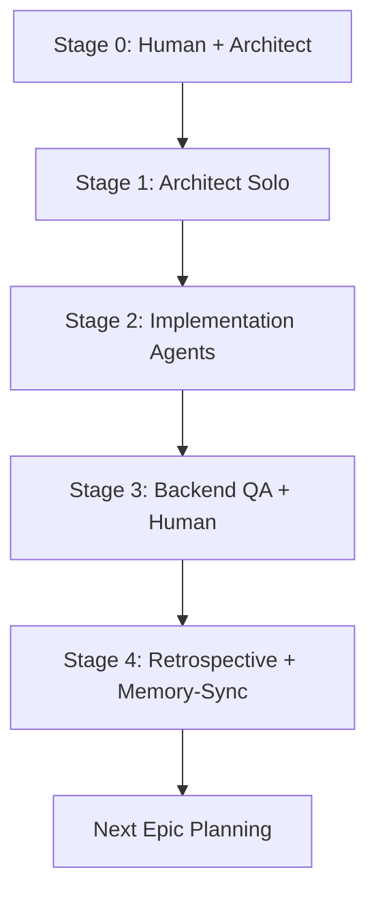

# STAD-010 Specification: Document Complete STAD Protocol Sprint Lifecycle

**Ticket ID:** STAD-010  
**Story Points:** 3  
**Epic:** Documentation  
**Sprint:** 8  
**Created:** 08-14-2025  
**Updated:** 08-17-2025  
**STAD Stage Focus:** Stage 1 (Sprint Preparation)

---

## Description

Create comprehensive documentation of the complete STAD Protocol 5-stage sprint lifecycle, including how agents work together within each stage, how stage gates ensure quality, and how the entire system creates autonomous AI-driven development. This will be the definitive guide for using STAD Protocol v5.1 with our agent system.

## Current State

Currently:
- STAD Protocol documented but not integrated with agent system
- No clear guide on stage-based agent collaboration
- Stage gate enforcement not documented
- Missing examples of complete sprint workflow
- No troubleshooting guide for STAD implementation
- Sprint-level continuous improvement cycle not defined

## Acceptance Criteria

- [ ] Complete STAD Protocol v5.1 user guide created
- [ ] Stage-based agent collaboration workflow documented
- [ ] Stage gate validation process explained
- [ ] Step-by-step sprint examples provided
- [ ] Troubleshooting section for STAD implementation
- [ ] Best practices for each STAD stage documented
- [ ] Quick reference guide for STAD commands
- [ ] Visual diagrams of STAD sprint flow
- [ ] FAQ section for STAD Protocol added
- [ ] Sprint-level continuous improvement cycle defined

## STAD 5-Stage Breakdown

### Stage 0: Strategic Planning (Human-Led)
**Purpose:** Define epics and roadmap
**Duration:** Variable (business cycles)
**Participants:** Human + Architect Agent for feasibility
**Outputs:** 
- Epic definitions with story point estimates (13, 21, 34+ points)
- Strategic roadmap
- Resource allocation

### Stage 1: Sprint Preparation (Architect Agent)
**Purpose:** Create comprehensive technical specifications
**Duration:** 1-2 days per sprint
**Lead Agent:** Architect Agent
**Outputs:**
- Technical specifications for all tickets
- Dependency DAG
- Edge case documentation
- Context packages for Stage 2

### Stage 2: Sprint Execution (Implementation Agents)
**Purpose:** Autonomous development with zero intervention
**Duration:** Sprint length (1-4 weeks)
**Lead Agents:** Coder, Tester, Documenter, Specialists
**Outputs:**
- Feature implementations
- Test suites
- Documentation updates
- Agent handoff reports

### Stage 3: Sprint Validation (Backend QA Agent)
**Purpose:** Comprehensive quality assurance
**Duration:** 1-3 days
**Lead Agent:** Backend QA Agent
**Outputs:**
- Validation reports
- Quality gate results
- Performance metrics
- Security assessments

### Stage 4: Release & Retrospective (Retrospective Agent)
**Purpose:** Deploy and capture learnings
**Duration:** 0.5-1 day
**Lead Agent:** Retrospective Agent
**Outputs:**
- Deployment confirmation
- Sprint retrospective
- Knowledge graph updates
- Process improvements

## Dependencies

### Depends On:
- STAD-001 through STAD-009 (All STAD components defined)
- STAD Protocol v5.1 architecture

### Blocks:
- Sprint execution (teams need accurate STAD documentation)

## Agent Assignment

**Recommended Agent:** Documenter Agent (with Main Claude orchestration)  
**Reason:** Primary documentation task requiring comprehensive system knowledge

## STAD Documentation Structure

```markdown
# STAD Protocol User Guide v5.1

## Table of Contents
1. Introduction to STAD Protocol
2. The 5-Stage Sprint Lifecycle
3. Agent System Integration by Stage
4. Stage Gate Validation Process
5. Sprint Planning & Execution
6. Examples & Scenarios
7. Troubleshooting STAD Implementation
8. Best Practices by Stage
9. Quick Reference Guide
10. FAQ

## 1. Introduction to STAD Protocol

### What is STAD Protocol v5.1?
- **S**tateful & **T**raceable **A**gentic **D**evelopment
- 5-stage sprint lifecycle (Stages 0-4)
- Autonomous AI-driven development
- Enterprise-grade quality gates
- Knowledge graph integration

### Core Principles
- Plan everything upfront (Stage 1)
- Execute without intervention (Stage 2)
- Validate comprehensively (Stage 3)
- Learn continuously (Stage 4)
- Archive, never delete

## 2. The 5-Stage Sprint Lifecycle

### Stage 0: Strategic Planning 🎯
**Purpose:** Define epics and strategic direction
**Duration:** Business cycles (quarterly/monthly)
**Who:** Human + Architect Agent (feasibility)

#### Process:
1. Business goal definition
2. Technical feasibility assessment
3. Epic creation (13, 21, 34+ points)
4. Resource allocation
5. Roadmap planning

#### Outputs:
- Epic definitions in `/Project_Management/Epics/`
- Strategic roadmap
- Resource commitments

### Stage 1: Sprint Preparation 📋
**Purpose:** Create comprehensive specifications
**Duration:** 1-2 days
**Who:** Architect Agent (autonomous)

#### Process:
1. Epic breakdown into tickets (≤5 points each)
2. Technical specification creation
3. Dependency mapping (DAG)
4. Edge case documentation
5. Context package preparation

#### Outputs:
- Technical specs in `/Project_Management/Specs/`
- Dependency DAG
- Context packages for Stage 2

#### Stage Gate: All tickets ≤5 points, no ambiguity

### Stage 2: Sprint Execution 🚀
**Purpose:** Autonomous development
**Duration:** Sprint length (1-4 weeks)
**Who:** Implementation agents (Coder, Tester, etc.)

#### Process:
1. Parallel ticket execution
2. Implementation based on Stage 1 specs
3. Agent handoffs
4. Continuous integration
5. Work report generation

#### Outputs:
- Feature implementations in `/src/`
- Test suites in `/tests/`
- Documentation in `/docs/`
- Agent handoffs in `/Project_Management/Sprint_Execution/Sprint_[N]/agent_handoffs/`

#### Stage Gate: All tests pass, all tickets complete

### Stage 3: Sprint Validation ✅
**Purpose:** Comprehensive quality assurance
**Duration:** 1-3 days
**Who:** Backend QA Agent + Human review

#### Process:
1. Automated test execution
2. Performance validation
3. Security assessment
4. Human functional review
5. Quality gate validation

#### Outputs:
- Validation reports in `/Project_Management/Sprint_Validation/Sprint_[N]/`
- Quality metrics
- Performance assessments

#### Stage Gate: All acceptance criteria met, human approval

### Stage 4: Release & Retrospective 📊
**Purpose:** Deploy and learn
**Duration:** 0.5-1 day
**Who:** Retrospective Agent

#### Process:
1. Merge to main branch
2. Deployment (if configured)
3. Sprint retrospective generation
4. Knowledge graph updates
5. Process improvement identification

#### Outputs:
- Deployment confirmation
- Retrospective in `/Project_Management/Sprint_Retrospectives/`
- Knowledge graph updates
- Process improvements

#### Stage Gate: Deployment successful, learnings captured

## 3. Agent System Integration by Stage

### Stage-Based Agent Roles
| STAD Stage | Primary Agent | Responsibility | Support Agents |
|------------|---------------|----------------|----------------|
| **Stage 0** | Human | Strategic planning | Architect (feasibility) |
| **Stage 1** | Architect | Technical specs | None (autonomous) |
| **Stage 2** | Coder | Implementation | Tester, Documenter, Specialists |
| **Stage 3** | Backend QA | Validation | Debug (if issues) |
| **Stage 4** | Retrospective | Analysis | Memory-Sync |

### Agent Collaboration Within Stages


## 4. Stage Gate Validation Process

### Purpose of Stage Gates
- Ensure quality at each transition
- Prevent cascade failures
- Maintain autonomous execution
- Enable rollback if needed

### Stage Gate Checklist
- **Stage 0 → 1**: Epic defined, resources allocated
- **Stage 1 → 2**: All specs complete, tickets ≤5 points
- **Stage 2 → 3**: All implementations complete, tests pass
- **Stage 3 → 4**: Quality validated, human approved
- **Stage 4 → Next**: Retrospective complete, learnings captured

## 5. Sprint Planning & Execution

### Sprint Planning (Stage 0 → Stage 1)
1. Select epic for sprint
2. Run `/stad:prep [EPIC-ID]`
3. Architect Agent creates comprehensive specs
4. Human reviews and approves for Stage 2

### Sprint Execution (Stage 1 → Stage 2)
1. Run `/stad:execute`
2. Implementation agents work autonomously
3. Zero human intervention required
4. All decisions based on Stage 1 specs

### Sprint Validation (Stage 2 → Stage 3)
1. Run `/stad:validate`
2. Backend QA Agent performs comprehensive testing
3. Human reviews functional requirements
4. Quality gates validate readiness

### Sprint Completion (Stage 3 → Stage 4)
1. Run `/stad:release`
2. Merge and deploy
3. Retrospective Agent analyzes sprint
4. Knowledge graph updated

## 6. Examples & Scenarios

### Example 1: Feature Development Sprint
**Epic:** User Authentication System (21 points)

**Stage 0:** Business defines authentication requirements
**Stage 1:** Architect creates specs for login, registration, security
**Stage 2:** Coder implements, Tester validates, Documenter updates
**Stage 3:** Backend QA validates security, performance, integration
**Stage 4:** Deploy to production, capture security learnings

### Example 2: Bug Bash Sprint
**Epic:** Critical Bug Fixes (13 points)

**Stage 0:** Prioritize critical bugs from backlog
**Stage 1:** Architect analyzes root causes, creates fix specs
**Stage 2:** Debug Agent fixes issues, Tester validates
**Stage 3:** Backend QA ensures no regressions
**Stage 4:** Deploy fixes, analyze prevention strategies

## 7. Troubleshooting STAD Implementation

### Common Issues

1. **Issue:** Stage 1 specs incomplete
   **Solution:** Run `/stad:gate 1` to validate readiness

2. **Issue:** Stage 2 agents request clarification
   **Solution:** Return to Stage 1, improve specifications

3. **Issue:** Stage 3 validation failures
   **Solution:** Return to Stage 2, fix implementations

4. **Issue:** Human intervention needed in Stage 2
   **Solution:** Pause sprint, improve Stage 1 planning

### Diagnostic Commands
```bash
/stad:health        # Check sprint health
/stad:gate [N]      # Validate specific stage gate
/stad:handoff       # Review agent communications
/stad:override      # Human intervention (emergency only)
```

## 8. Best Practices by Stage

### Stage 0: Strategic Planning
- Start with business value
- Keep epics focused (single domain)
- Estimate conservatively
- Consider technical debt

### Stage 1: Sprint Preparation
- Be exhaustively detailed
- Document edge cases
- Create clear acceptance criteria
- Plan for parallel execution

### Stage 2: Sprint Execution
- Trust the process
- Avoid intervention
- Monitor progress only
- Let agents communicate

### Stage 3: Sprint Validation
- Test thoroughly
- Validate performance
- Check security
- Get human approval

### Stage 4: Release & Retrospective
- Deploy confidently
- Capture learnings
- Update knowledge graph
- Plan improvements

## 9. Quick Reference Guide

### STAD Commands
```bash
# Core workflow
/stad:epic          # Create new epic (Stage 0)
/stad:prep          # Prepare sprint (Stage 1)
/stad:execute       # Run sprint (Stage 2)
/stad:validate      # QA sprint (Stage 3)
/stad:release       # Release sprint (Stage 4)

# Monitoring
/stad:health        # Check sprint health
/stad:standup       # Daily progress report
/stad:gate [N]      # Validate stage gate

# Control (emergency only)
/stad:pause         # Pause execution
/stad:override      # Human intervention
```

### File Locations (STAD Structure)
```
/Project_Management/
├── /Epics/                    # Stage 0 outputs
├── /Specs/                    # Stage 1 outputs
├── /Sprint_Execution/         # Stage 2 outputs
├── /Sprint_Validation/        # Stage 3 outputs
└── /Sprint_Retrospectives/    # Stage 4 outputs
```

### Semantic Commit Format
```bash
feat([module]): [TICKET] [description] | Sprint:[N] | Stage:[0-4]
```

## 10. FAQ

**Q: Can I skip a stage if it doesn't apply?**
A: No. Each stage has specific quality gates. Mark outputs as N/A with justification if needed.

**Q: What if I need to intervene during Stage 2?**
A: Use `/stad:pause` and `/stad:override`. This indicates Stage 1 planning was insufficient.

**Q: How detailed should Stage 1 specifications be?**
A: Detailed enough that Stage 2 agents need zero clarification. When in doubt, add more detail.

**Q: Can multiple sprints run in parallel?**
A: Yes, but each sprint follows the complete 5-stage lifecycle independently.

**Q: What if Stage 3 validation fails?**
A: Return to Stage 2 for fixes. Never skip validation.
```

## Success Metrics

- Documentation enables 90% autonomous execution in Stage 2
- Stage gate failures reduced by 80%
- Sprint velocity increased through better Stage 1 planning
- Human intervention in Stage 2 approaches zero
- Knowledge graph learning improves sprint planning over time
- Troubleshooting section resolves 90% of STAD issues

## Notes

- STAD Protocol v5.1 replaces all previous 7-stage workflows
- Focus on stage-based autonomous execution
- Emphasize quality gates and validation
- Provide practical examples for each stage
- Keep documentation aligned with actual STAD implementation
- Update with process improvements from retrospectives