# Sprint 8 Plan - STAD Protocol Migration

## Metadata
- **Sprint Dates:** 08-13-2025 to 08-27-2025 (2-week sprint)
- **Total Points:** 37 story points
- **Ticket Count:** 10 tickets
- **Sprint Goal:** Complete migration from legacy 7-stage workflow to STAD Protocol 5-stage lifecycle
- **Plan Created:** 08-20-2025
- **STAD Stage:** Stage 1 (Sprint Preparation)

## Sprint Overview

### Sprint Objectives
1. **Primary Goal:** Fully align Dev-Agency with STAD Protocol 5-stage lifecycle
2. **Foundation Work:** Create templates and folder organization (STAD-005, STAD-006)
3. **Agent Alignment:** Update all core agents for STAD stages (STAD-001 through STAD-004, STAD-007)
4. **New Agents:** Create specialized agents for validation and retrospective (STAD-007, STAD-008)
5. **Documentation:** Complete integration guide and sprint planning template (STAD-009, STAD-010)

### Current Status (as of 08-20-2025)
- **Completed:** STAD-005, STAD-006, STAD-001 (3 tickets, 11 points)
- **Remaining:** STAD-002 through STAD-010 (7 tickets, 26 points)
- **Progress:** 29.7% complete (11/37 points)

## Selected Tickets

### Batch 1: Foundation (COMPLETED)
| Priority | ID | Title | Points | Status | Spec | Dependencies |
|----------|-----|-------|--------|--------|------|--------------|
| 1 | STAD-005 | Create stage-specific output templates | 5 | ✅ DONE | ✅ | None |
| 2 | STAD-006 | Implement folder organization rules | 3 | ✅ DONE | ✅ | None |

### Batch 2: Agent Alignment (IN PROGRESS)
| Priority | ID | Title | Points | Status | Spec | Dependencies |
|----------|-----|-------|--------|--------|------|--------------|
| 3 | STAD-001 | Align Architect Agent with Stage 1 | 3 | ✅ DONE | ✅ | STAD-005, STAD-006 |
| 4 | STAD-002 | Align Coder Agent with Stage 2 | 3 | TODO | ✅ | STAD-005, STAD-006 |
| 5 | STAD-003 | Align Tester Agent with Stage 2 | 3 | TODO | ✅ | STAD-005, STAD-006 |
| 6 | STAD-004 | Align Documenter Agent (Stages 2-4) | 3 | TODO | ✅ | STAD-005, STAD-006 |
| 7 | STAD-007 | Create Backend QA Agent for Stage 3 | 5 | TODO | ✅ | STAD-005, STAD-006 |

### Batch 3: Sprint Tools
| Priority | ID | Title | Points | Status | Spec | Dependencies |
|----------|-----|-------|--------|--------|------|--------------|
| 8 | STAD-008 | Create Retrospective Agent for Stage 4 | 5 | TODO | ✅ | All Batch 2 |
| 9 | STAD-009 | Build sprint planning template | 3 | TODO | ✅ | STAD-005, STAD-001 |

### Batch 4: Documentation
| Priority | ID | Title | Points | Status | Spec | Dependencies |
|----------|-----|-------|--------|--------|------|--------------|
| 10 | STAD-010 | Document agent alignment guide | 3 | TODO | ✅ | All others |

## Dependency Graph

```mermaid
graph TD
    subgraph "Batch 1 - Foundation (DONE)"
        STAD-005[STAD-005: Templates<br/>✅ DONE]
        STAD-006[STAD-006: Folders<br/>✅ DONE]
    end
    
    subgraph "Batch 2 - Agent Alignment"
        STAD-001[STAD-001: Architect<br/>✅ DONE]
        STAD-002[STAD-002: Coder<br/>TODO]
        STAD-003[STAD-003: Tester<br/>TODO]
        STAD-004[STAD-004: Documenter<br/>TODO]
        STAD-007[STAD-007: Backend QA<br/>TODO]
    end
    
    subgraph "Batch 3 - Sprint Tools"
        STAD-008[STAD-008: Retrospective<br/>TODO]
        STAD-009[STAD-009: Sprint Template<br/>TODO]
    end
    
    subgraph "Batch 4 - Documentation"
        STAD-010[STAD-010: Integration Guide<br/>TODO]
    end
    
    STAD-005 --> STAD-001
    STAD-006 --> STAD-001
    STAD-005 --> STAD-002
    STAD-006 --> STAD-002
    STAD-005 --> STAD-003
    STAD-006 --> STAD-003
    STAD-005 --> STAD-004
    STAD-006 --> STAD-004
    STAD-005 --> STAD-007
    STAD-006 --> STAD-007
    
    STAD-001 --> STAD-009
    STAD-005 --> STAD-009
    
    STAD-002 --> STAD-008
    STAD-003 --> STAD-008
    STAD-004 --> STAD-008
    STAD-007 --> STAD-008
    
    STAD-008 --> STAD-010
    STAD-009 --> STAD-010
```



## Work Sequence

### Week 1 (08-13 to 08-19) - COMPLETED
1. **Day 1-2:** STAD-005 (Templates) - ✅ DONE
2. **Day 2:** STAD-006 (Folder Organization) - ✅ DONE
3. **Day 3:** STAD-001 (Architect Agent) - ✅ DONE

### Week 2 (08-20 to 08-27) - CURRENT
4. **Day 4 (08-20):** STAD-002, STAD-003, STAD-004 (Agent alignments - parallel)
5. **Day 5 (08-21):** STAD-007 (Backend QA Agent)
6. **Day 6 (08-22):** STAD-008 (Retrospective Agent)
7. **Day 7 (08-23):** STAD-009 (Sprint Planning Template)
8. **Day 8 (08-24):** STAD-010 (Integration Guide)
9. **Day 9-10 (08-25 to 08-27):** Buffer for testing and refinement

## Parallel Work Opportunities
- **Batch 2 Parallel:** STAD-002, STAD-003, STAD-004 can be done simultaneously (different agent files)
- **Documentation:** STAD-010 can begin as soon as other tickets complete

## Risk Management

| Risk | Probability | Impact | Mitigation |
|------|-------------|--------|------------|
| Agent alignment complexity | Medium | High | Templates from STAD-005 provide clear structure |
| Retrospective Agent creation | Medium | Medium | Can reuse patterns from existing agents |
| Time constraints (7 tickets in 7 days) | High | Medium | Parallel execution and clear specs enable efficiency |
| Integration testing | Low | High | Buffer time allocated for testing |

## Documentation Roadmap

| Ticket | Docs to Read | Docs to Update | Docs to Create |
|--------|--------------|----------------|----------------|
| STAD-002 | coder.md, STAD specs | coder.md | None |
| STAD-003 | tester.md, STAD specs | tester.md | None |
| STAD-004 | documenter.md, STAD specs | documenter.md | None |
| STAD-007 | backend-qa.md template | None | backend-qa.md (update) |
| STAD-008 | retrospective template | None | retrospective.md (update) |
| STAD-009 | sprint_preparation_recipe.md | None | sprint_planning_template.md |
| STAD-010 | All agent docs | None | integration_guide.md |

## Success Metrics
- [x] Foundation templates created (STAD-005)
- [x] Folder organization implemented (STAD-006)
- [x] Architect aligned with Stage 1 (STAD-001)
- [ ] All core agents aligned with STAD stages
- [ ] Specialized agents created for validation and retrospective
- [ ] Sprint planning template ready for use
- [ ] Complete integration guide documented
- [ ] 100% sprint completion
- [ ] All agents following STAD Protocol

## Agent Assignment Strategy

### Completed Assignments
- **STAD-005:** Main Claude (documenter support)
- **STAD-006:** Main Claude (documenter support)
- **STAD-001:** Main Claude (architect support)

### Remaining Assignments
- **STAD-002:** Main Claude (direct agent file modification)
- **STAD-003:** Main Claude (direct agent file modification)
- **STAD-004:** Main Claude (direct agent file modification)
- **STAD-007:** Main Claude (create/update backend-qa agent)
- **STAD-008:** Main Claude (update retrospective agent)
- **STAD-009:** Main Claude with documenter agent
- **STAD-010:** documenter agent with Main Claude review

## Stage Gate Requirements

### Stage 1 → Stage 2 Gate (PASSED)
- ✅ All specs written and complete
- ✅ Dependencies mapped
- ✅ Execution plan created
- ✅ Risk assessment done

### Stage 2 → Stage 3 Gate (For Remaining Work)
- [ ] All agent alignments complete
- [ ] New agents created and tested
- [ ] Templates integrated
- [ ] No blocking issues

### Stage 3 → Stage 4 Gate
- [ ] All acceptance criteria met
- [ ] Documentation updated
- [ ] Integration tested
- [ ] Ready for retrospective

## Handoff Preparation

### Initial Handoffs Created
- `/Project_Management/Sprint_Execution/Sprint_8-Test/agent_handoffs/batch1_foundation_handoff.md`

### Handoffs Needed
- Batch 2 agent alignment handoffs
- Batch 3 sprint tools handoffs
- Final integration handoff for STAD-010

## Zero-Intervention Execution Model

### Autonomous Execution (Stage 2-3 Combined):
- Build all features per specs (Stage 2)
- Validate all implementations automatically (Stage 3)
- **If issues found, follow established process:**
  - **Bug/Test Failure:** Use bug_fix_recipe.md
  - **Complex Issues:** Activate debug agent for root cause analysis
  - **Design Questions:** Mark ticket BLOCKED, escalate to human
  - **Never apply workarounds** - only proper fixes
- Re-validate until 100% passing
- Complete ALL tickets to DONE status
- Only then request human review

### Human Involvement Only When:
- All 10 tickets marked DONE
- All automated tests passing
- Coverage targets exceeded (>85%)
- Zero known issues remaining
- Ready for UI/UX and business validation

### Issue Resolution Process:
When issues are encountered during Stage 2-3:

1. **Type 1: Bugs/Test Failures (Fixable)**
   - Follow `/recipes/bug_fix_recipe.md`
   - Activate debug agent for complex issues
   - Implement proper fix (NO WORKAROUNDS)
   - Add regression test
   - Document in work report

2. **Type 2: Design Decisions Needed (BLOCKED)**
   - If spec is unclear or incomplete
   - If new requirement emerges
   - If architectural choice needed
   - **Action:** Mark ticket BLOCKED, document issue, wait for human decision
   
   **Examples that MUST trigger BLOCKED status:**
   - UI library has critical bug, considering switching (e.g., React → Vue)
   - Package compatibility issues requiring alternative library
   - Performance problems requiring architecture change
   - Security vulnerability requiring design decision
   - Database schema changes not in spec
   - API design choices not specified
   - Dependency conflicts needing resolution strategy
   - Edge cases not covered in original spec
   - Framework limitations discovered during implementation
   - Third-party service integration decisions

3. **Type 3: Integration Issues**
   - Use architect agent for impact analysis
   - Debug agent for root cause
   - Fix per established patterns

### BLOCKER Escalation SOP (Standard Operating Procedure):

When ANY decision not in spec is needed:

1. **IMMEDIATELY STOP** work on the ticket
2. **DOCUMENT** the exact decision needed:
   - Create decision request using `/docs/reference/templates/decision_request_template.md`
   - Save to `/Project_Management/Decision_Requests/Sprint_[N]/[TICKET]_decision.md`
3. **UPDATE** ticket status to BLOCKED in PROJECT_PLAN.md
4. **CREATE** handoff with full context
5. **MOVE** to next unblocked ticket
6. **NEVER** make the decision autonomously

**Critical Rule:** It's ALWAYS better to BLOCK and ask than to make assumptions that require rework.

### Workflow:
```
While (Sprint Not 100% Complete):
  1. Build next ticket per spec
  2. Run automated validation
  3. If issues found:
     - Identify issue type (Bug vs Design Question)
     - Bug: Fix properly using recipe/agents
     - Design: Mark BLOCKED, escalate to HD
     - Re-validate after fix
  4. Mark ticket DONE only when fully validated
  5. Continue to next ticket

Final: "Sprint 100% Complete - Ready for Human Review"
```

## Notes
- Sprint 8 uses "Sprint_8-Test" folder structure (already created)
- All specs are complete and validated for STAD alignment
- Focus on maintaining zero-intervention execution through Stage 2 AND Stage 3
- Complete all tickets to 100% DONE before requesting human review
- Ensure all work reports are filed for retrospective analysis
- This sprint establishes the foundation for all future STAD Protocol sprints

---

*Sprint 8 Plan created following STAD Stage 1 requirements. Ready for Stage 2 execution.*