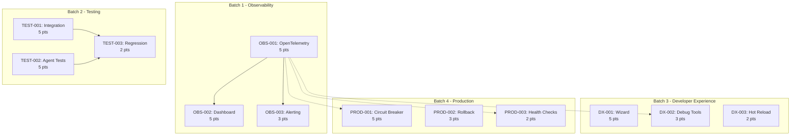

# Sprint 9 Plan - Post-STAD System Enhancement

## Metadata
- **Sprint Number:** 9
- **Sprint Dates:** 08-28-2025 to 09-10-2025 (2-week sprint)
- **Total Points:** 45 story points
- **Ticket Count:** 12 tickets
- **Sprint Goal:** Enhance production readiness with monitoring, testing infrastructure, and developer experience improvements
- **Sprint Theme:** Production Hardening & Developer Experience
- **Plan Created:** 08-21-2025
- **STAD Stage:** Stage 1 (Sprint Preparation)

## Sprint Overview

### Sprint Objectives
1. **Primary Goal:** Make Dev-Agency production-ready with comprehensive monitoring and testing
2. **Observability:** Implement OpenTelemetry and performance dashboards (OBS-001, OBS-002, OBS-003)
3. **Testing Infrastructure:** Build comprehensive test suites for STAD workflow (TEST-001, TEST-002, TEST-003)
4. **Developer Experience:** Streamline onboarding and debugging (DX-001, DX-002, DX-003)
5. **Production Hardening:** Implement failure recovery mechanisms (PROD-001, PROD-002, PROD-003)

### Success Criteria
- [ ] All agent activities tracked via OpenTelemetry
- [ ] Test coverage > 85% for STAD workflow
- [ ] Developer onboarding time < 30 minutes
- [ ] Zero production incidents from agent failures
- [ ] All monitoring dashboards operational
- [ ] Circuit breakers prevent cascade failures

## Selected Tickets

### Batch 1: Monitoring & Observability (13 points)
| Priority | ID | Title | Points | Status | Dependencies |
|----------|-----|-------|--------|--------|--------------|
| 1 | OBS-001 | Implement OpenTelemetry instrumentation for agent tracking | 5 | TODO | None |
| 2 | OBS-002 | Create agent performance metrics dashboard | 5 | TODO | OBS-001 |
| 3 | OBS-003 | Build error tracking and alerting system | 3 | TODO | OBS-001 |

### Batch 2: Testing Infrastructure (12 points)
| Priority | ID | Title | Points | Status | Dependencies |
|----------|-----|-------|--------|--------|--------------|
| 4 | TEST-001 | Create integration test suite for STAD workflow | 5 | TODO | None |
| 5 | TEST-002 | Build agent behavior test framework | 5 | TODO | None |
| 6 | TEST-003 | Implement regression test automation | 2 | TODO | TEST-001, TEST-002 |

### Batch 3: Developer Experience (10 points)
| Priority | ID | Title | Points | Status | Dependencies |
|----------|-----|-------|--------|--------|--------------|
| 7 | DX-001 | Create project initialization wizard | 5 | TODO | None |
| 8 | DX-002 | Build agent debugging tools | 3 | TODO | OBS-001 |
| 9 | DX-003 | Implement hot-reload for agent development | 2 | TODO | None |

### Batch 4: Production Readiness (10 points)
| Priority | ID | Title | Points | Status | Dependencies |
|----------|-----|-------|--------|--------|--------------|
| 10 | PROD-001 | Implement circuit breaker for agent failures | 5 | TODO | OBS-001 |
| 11 | PROD-002 | Create rollback mechanism for failed sprints | 3 | TODO | None |
| 12 | PROD-003 | Build agent health check system | 2 | TODO | OBS-001 |

## Agent Execution Matrix

| Ticket | Phase | Agent | Context Required | Output | Parallel? |
|--------|-------|-------|------------------|--------|-----------|
| OBS-001 | Research | Main | OpenTelemetry docs, agent architecture | research_findings.md | Yes |
| OBS-001 | Design | architect | research_findings.md | telemetry_architecture.md | No |
| OBS-001 | Build | coder | telemetry_architecture.md | implementation code | No |
| OBS-001 | Test | tester | implementation | test_results.md | Yes |
| OBS-001 | Document | documenter | all outputs | docs updated | Yes |
| TEST-001 | Research | Main | STAD workflow, testing patterns | research_findings.md | Yes |
| TEST-001 | Design | architect | research_findings.md | test_plan.md | No |
| TEST-001 | Build | coder | test_plan.md | test suite | No |
| TEST-001 | Validate | tester | test suite | validation_report.md | Yes |
| DX-001 | Research | Main | User feedback, onboarding patterns | research_findings.md | Yes |
| DX-001 | Design | architect | research_findings.md | wizard_design.md | No |
| DX-001 | Build | coder | wizard_design.md | wizard implementation | No |
| DX-001 | Test | tester | wizard implementation | test_results.md | Yes |
| PROD-001 | Research | Main | Circuit breaker patterns | research_findings.md | Yes |
| PROD-001 | Design | architect | research_findings.md | circuit_breaker_design.md | No |
| PROD-001 | Build | coder | circuit_breaker_design.md | implementation | No |

## Documentation Roadmap

| Ticket | Docs to Read | Docs to Update | Docs to Create |
|--------|--------------|----------------|----------------|
| OBS-001 | Agent architecture docs | README.md | Monitoring guide |
| OBS-002 | OBS-001 output | Dashboard docs | Dashboard user guide |
| TEST-001 | STAD workflow docs | Testing guide | Integration test guide |
| DX-001 | Onboarding feedback | Getting started guide | Wizard documentation |
| PROD-001 | Production guidelines | Operations guide | Circuit breaker docs |

## Work Sequence & Parallelization

### Week 1 (08-28 to 09-03)
| Day | Morning (Parallel) | Afternoon (Parallel) | Agents |
|-----|-------------------|---------------------|---------|
| 1 | Spec creation for all tickets | Research: OBS-001, TEST-001, DX-001 | 3 |
| 2 | Design: OBS-001 + Research: OBS-002, TEST-002 | Build: OBS-001 | 4 |
| 3 | Build: OBS-001 (cont.) + Design: TEST-001, DX-001 | Test: OBS-001 | 4 |
| 4 | Build: TEST-001, DX-001 + Research: PROD-001 | Design: OBS-002 | 5 |
| 5 | Build: OBS-002 + Test: TEST-001, DX-001 | Documentation updates | 5 |

### Week 2 (09-04 to 09-10)
| Day | Tasks | Agents |
|-----|-------|---------|
| 6 | Build: PROD-001, OBS-003 + Design: PROD-002 | 4 |
| 7 | Build: TEST-002, DX-002 + Test: PROD-001 | 5 |
| 8 | Build: PROD-002, PROD-003, DX-003 | 4 |
| 9 | Build: TEST-003 + Final testing | 3 |
| 10 | Documentation, retrospective prep | 2 |

## Parallel Execution Rules

### Safe Parallel Groups
- **Group A:** OBS-001, TEST-001, DX-001 (different subsystems)
- **Group B:** Documentation can run alongside testing
- **Group C:** Research phases for any tickets

### Resource Locks
- **Configuration files:** Read-only during execution
- **Test suite:** Sequential execution only
- **Agent files:** One modifier at a time
- **Database:** Read-many, write-one

### Conflict Avoidance
- Never: Two agents modifying same configuration
- Never: Parallel test suite execution
- Always: Lock check before resource access

## Dependency Graph



## Risk Management

| Risk | Probability | Impact | Mitigation |
|------|-------------|--------|------------|
| New ticket specs needed | High | Medium | Day 1 dedicated to spec creation |
| OpenTelemetry complexity | Medium | High | Research phase extended, expert consultation |
| Sprint 8 carryover | Low | Medium | 5-point buffer reserved |
| Integration test complexity | Medium | High | Incremental test building |
| Agent conflicts | Low | High | Strict resource locking |

## Agent Context Packages

### Location
All context packages stored in: `/Project_Management/Sprint_Execution/Sprint_9/agent_context/`

### Package Structure per Ticket
```
/agent_context/
├── OBS-001/
│   ├── research_context.md
│   ├── design_context.md
│   ├── implementation_context.md
│   └── test_context.md
├── TEST-001/
│   └── [similar structure]
└── [other tickets]/
```

### Context Package Contents
- Required file paths with line numbers
- Code snippets for reference
- Environment variables needed
- Success criteria from spec
- Known constraints and gotchas

## Agent Handoffs

### Location
All handoffs stored in: `/Project_Management/Sprint_Execution/Sprint_9/agent_handoffs/`

### Naming Convention
`[TICKET]_[from-agent]_to_[to-agent]_handoff.md`

### Critical Handoffs
- OBS-001_research_to_architect: OpenTelemetry integration points
- TEST-001_architect_to_coder: Test framework structure
- DX-001_research_to_architect: User journey mapping
- PROD-001_architect_to_coder: Circuit breaker patterns

## Success Metrics

### Technical Metrics
- [ ] OpenTelemetry capturing 100% of agent operations
- [ ] Dashboard showing real-time agent performance
- [ ] Test coverage > 85% for all STAD stages
- [ ] Circuit breaker response time < 100ms
- [ ] Zero false positive alerts

### Process Metrics
- [ ] All specs created before implementation
- [ ] 100% of tickets have context packages
- [ ] All handoffs documented
- [ ] No resource conflicts during parallel execution
- [ ] Sprint velocity maintained at 45 points

### Business Metrics
- [ ] Developer onboarding time < 30 minutes
- [ ] Mean time to recovery (MTTR) < 5 minutes
- [ ] Zero production incidents from agent failures
- [ ] 50% reduction in debugging time

## Stage Gate Requirements

### Stage 1 → Stage 2 Gate
- [ ] All 12 ticket specs written and reviewed
- [ ] Dependencies mapped and validated
- [ ] Agent execution matrix complete
- [ ] Context packages prepared
- [ ] Risk assessment documented

### Stage 2 → Stage 3 Gate
- [ ] All implementation complete
- [ ] Unit tests passing (>85% coverage)
- [ ] Integration tests passing
- [ ] No blocking issues

### Stage 3 → Stage 4 Gate
- [ ] All acceptance criteria met
- [ ] Performance benchmarks achieved
- [ ] Documentation updated
- [ ] Security review passed

## Notes

### Sprint Context
- First sprint after STAD Protocol implementation
- Focus on production readiness and developer experience
- Heavy emphasis on observability and testing
- Building on lessons learned from Sprint 8

### Special Considerations
- All new tickets need specs created (Day 1 priority)
- OpenTelemetry integration is critical path - blocks multiple tickets
- Test infrastructure enables future development velocity
- Developer experience improvements based on actual pain points

### Buffer Management
- 5 points reserved for potential Sprint 8 carryover
- If not needed, can add small enhancement tickets
- Focus on completing high-priority items first

---

*Sprint 9 Plan created following enhanced STAD Stage 1 requirements with detailed agent planning and context preparation.*