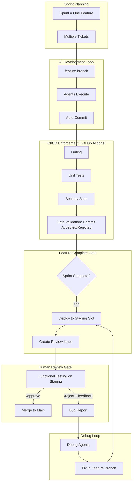

**NO ONE IS ALLOWED TO CHANGE THIS DOC!!!**

# STAD Protocol North Star Document
## From Dev-Agency to Production-Grade AI Development

---

**Document Version:** 4.1.0  
**Date:** 08-11-2025  
**Status:** Protected Final Version -  **NO ONE IS ALLOWED TO CHANGE THIS DOC!!!**
**Classification:** Open Source Initiative  
**Major Update:** Intelligent Automation Layer - Proactive Debugging, Context-Aware Planning, Automated Retrospectives

---

## Executive Summary

This document defines the transformation journey from Dev-Agency (our current working agentic development system) to STAD Protocol - the **Stateful & Traceable Agentic Development Protocol**. STAD v4.0 represents a fundamental shift to Git-native architecture, eliminating custom state management in favor of GitHub's robust, battle-tested platform features.

### Vision Statement
Transform the proven Dev-Agency system into an open-source, production-grade protocol that leverages Git and GitHub as the complete state machine, achieving 90%+ token reduction and zero-code state management while maintaining enterprise quality standards.

### Key Outcomes
- **For Developers**: Zero custom state code - GitHub IS the database
- **For Organizations**: Immutable Git history provides perfect audit trails
- **For Open Source**: Simplest possible implementation drives adoption
- **For Industry**: Establish Git-native development as the standard

### v4.0 Breakthrough: "The Best Code is No Code"
After extensive analysis and external review, we've identified that custom state management (`state.yml`) is unnecessary complexity. GitHub already provides everything needed:
- **GitHub Projects** = Visual Sprint Brain
- **Git Worktrees** = Parallel Execution Environment
- **Git History** = Immutable State Record
- **Git Tags** = Recovery Checkpoints

---

## Part 1: Current State - Dev-Agency Analysis

### System Overview
Dev-Agency represents 6 months of iterative development, resulting in a functional agentic system with:
- **33 completed tickets** across 6 sprints
- **15+ specialized agents** with defined roles
- **40%+ productivity gains** through parallel agent execution
- **100% sprint completion rates** in recent iterations

### Core Strengths

#### 1. Proven Agent Architecture
```
Hub-and-Spoke Model:
├── Main Claude (Orchestrator)
├── Architect Agent (Planning)
├── Coder Agent (Implementation)
├── Tester Agent (Quality)
├── Security Agent (Compliance)
├── Documenter Agent (Knowledge)
└── 10+ Specialist Agents
```

#### 2. Established Workflows
- **7-Step Development Process**: Research → Plan → Build → Test → Document → Reflect → Done
- **Sprint Automation**: `/sprint-plan` and `/sprint-execute` commands
- **Recipe System**: 12+ proven workflow patterns with 30-40% time savings

#### 3. Knowledge Management
- Memory Tool integration with MCP
- Knowledge graph synchronization
- Context optimization (44-75% reduction achieved)

### Critical Gaps

#### 1. Enforcement Mechanisms
- **Current**: Relies on developer discipline and "honor system"
- **Impact**: Steps can be skipped, quality gates bypassed
- **Evidence**: Sprint 6 initially skipped testing phase

#### 2. State Management
- **Current**: Memory Tool updated manually, can drift from reality
- **Impact**: Knowledge graph becomes stale, context becomes unreliable
- **Evidence**: Requires periodic manual sync operations

#### 3. Traceability
- **Current**: Ticket → Code connection exists but not enforced
- **Impact**: Work can happen outside ticket scope
- **Evidence**: No automated validation of commit-ticket relationships

#### 4. Multi-User Support
- **Current**: Single-user system with no isolation
- **Impact**: Cannot scale to teams or organizations
- **Evidence**: Hardcoded paths, no access control

#### 5. Platform Lock-in
- **Current**: Tightly coupled to Claude Code
- **Impact**: Limited adoption potential
- **Evidence**: Agent prompts assume Claude-specific features

---

## Part 2: Target State - STAD Protocol Vision

### Definition
The **Stateful & Traceable Agentic Development (STAD) Protocol** is a comprehensive framework that transforms AI-assisted development from suggestion-based to enforcement-based, ensuring every line of code is traceable, tested, and compliant.

### Key Innovations

#### 1. GitHub-Native State Machine (NEW in v4.0)
**GitHub IS the Database**. No custom state files - GitHub Projects provide visual tracking, API access, and automatic persistence. The platform you already use becomes your complete state management system.

#### 2. Git Worktrees for True Parallel Execution (Game-Changer)
**Zero Merge Conflicts**. Each batch executes in an isolated worktree, enabling true parallel development without coordination overhead. Native Git feature, zero custom code.

#### 3. Semantic Commits as Immutable State
**State Travels with Code**. Structured commit messages encode all metadata, creating an immutable audit trail that survives any corruption. Recovery is just `git log`.

#### 4. Sprint-Feature Workflow
**One Sprint = One Feature = One Review**. This fundamental principle eliminates complexity while maximizing both AI velocity and human oversight quality.

#### 5. DAG-Based Execution Plans
**Dependency-Aware Orchestration**. Architect Agent generates Directed Acyclic Graphs showing exact dependencies and safe parallelization opportunities.

### v4.1 Intelligent Automation Layer (Final Refinements)

#### 1. The Proactive Debugger - Git Bisect Integration
**Automatic Root Cause Analysis**. Before any bug is assigned to Debug Agents, the system automatically runs `git bisect` to identify the exact commit that introduced the issue.

```bash
# Automatic bug localization (runs before Debug Agent)
git bisect start
git bisect bad HEAD                    # Current state has bug
git bisect good sprint-8-start         # Last known good state
git bisect run npm test                # Automatically find breaking commit

# Debug Agent receives:
- Exact commit that broke functionality
- Diff of the breaking change
- Test that's failing
# Agent focuses on "why" and "how to fix" not "where"
```

#### 2. Context-Aware Sprint Planning - Pre-Flight Checks
**Never Plan in a Vacuum**. The `/sprint-plan` command now includes mandatory pre-flight analysis to understand recent changes before planning.

```bash
# Step 1: Pre-flight context gathering (NEW)
/sprint-plan-preflight() {
  # Find all changes since last sprint
  git log --oneline sprint-7..main
  
  # Identify modified modules
  git diff --name-only sprint-7..main | cut -d/ -f1-2 | sort -u
  
  # Check for architectural decisions
  git log --grep="Decision:" --format="%s"
  
  # Recent bug fixes to avoid regression
  gh issue list --label bug --state closed --limit 10
}

# Step 2: Pass context to Architect (ENHANCED)
/agent:architect "Plan Sprint 8 with this context: [preflight results]"
```

#### 3. The Reviewer's Dashboard - Automated Review Preparation
**One-Click Functional Review**. The review issue is automatically populated with everything needed for efficient human validation.

```markdown
## Review Dashboard: User Profile Feature

### 📊 Sprint Metrics
- Tickets Completed: 12/12 ✅
- Token Usage: 45K (75% reduction achieved)
- Execution Time: 4.5 hours
- Test Coverage: 87%

### ✅ Automated Checks (All Passing)
- [ ] Linting: PASS
- [ ] Unit Tests: 142/142 PASS
- [ ] Integration Tests: 28/28 PASS
- [ ] Security Scan: No vulnerabilities
- [ ] Performance: <200ms response time

### 🔍 Manual Review Checklist
- [ ] User can upload avatar
- [ ] Bio field accepts markdown
- [ ] Privacy settings work correctly
- [ ] Email notifications trigger
- [ ] Mobile responsive design

### 🔗 Quick Links
- [Staging Environment](https://staging1.app.com)
- [Execution Plan](link-to-plan)
- [All Commits](link-to-commits)
- [Test Results](link-to-ci)

### 📝 How to Review
1. Click staging link above
2. Test each checklist item
3. Comment `/approve` or `/reject [reason]`
```

#### 4. The Retrospective Agent - Automated Learning Loop
**Continuous Improvement Built-In**. After each sprint, an agent analyzes all artifacts to generate insights and improvements.

```yaml
retrospective_agent:
  inputs:
    - execution_plan.md (what we planned)
    - git log (what actually happened)
    - bug_reports/* (what went wrong)
    - review_feedback.md (human insights)
    - token_metrics.json (efficiency data)
  
  analysis:
    - Compare plan vs reality
    - Identify patterns in bugs
    - Find reusable solutions
    - Suggest process improvements
  
  outputs:
    - RETROSPECTIVE.md with:
      - What went well
      - What went poorly  
      - Key learnings
      - Process improvements
      - Reusable patterns discovered
```

### Core Principles

#### 1. Immutable Ticket-Code Binding
```yaml
principle: No code without ticket
enforcement: CI/CD gate blocks commits without valid ticket reference
verification: Automated ticket-commit validation
audit: Complete traceability from requirement to deployment
```

#### 2. Deterministic Workflow Enforcement
```yaml
principle: Steps cannot be skipped
enforcement: Automated gates control progression
verification: Each phase must pass before next begins
audit: Complete workflow execution log
```

#### 3. Living Knowledge Graph
```yaml
principle: Graph is always current truth
enforcement: Automatic updates on every state change
verification: Graph-code synchronization validation
audit: Complete history of all changes
```

#### 4. Role-Based Agent Isolation
```yaml
principle: Agents operate within defined boundaries
enforcement: Permission system restricts agent actions
verification: Audit log of all agent operations
audit: Complete agent activity tracking
```

### System Architecture (Claude Code CLI Native)

**Critical Clarification**: The Master Orchestrator IS the CI/CD system (GitHub Actions) for enforcement, but execution happens through Claude Code CLI with state persistence.



### Workflow Enforcement Pipeline

#### Phase 1: Sprint Planning (Feature Definition)
```yaml
trigger: New sprint initiated
scope: One complete feature
actions:
  - Define feature requirements
  - Create all tickets for feature
  - Assign to feature branch
  - Allocate staging slot
output: Sprint backlog (10-20 tickets)
```

#### Phase 2: Batch AI Development with Sprint Brain
```yaml
trigger: Sprint started via /sprint-execute --batch
enforcer: CI/CD pipeline (GitHub Actions)
initialize:
  - Create .stad/sprint-{id}/state.yml
  - Architect agent plans ALL tickets at once
  - Establish patterns and decisions
batch_processing:
  - Group related tickets (3-4 per batch)
  - Coder agent implements batch as cohesive unit
  - Single test suite per batch
  - CI/CD validates gates:
    - Linting (blocking)
    - Unit tests (blocking) 
    - Security scan (blocking)
  - Updates Sprint Brain after each batch
  - Memory Sync Agent persists decisions
session_resilience:
  - /resume-sprint restores full context
  - Continue from exact checkpoint
human_involvement: ZERO
output: Feature branch with all tickets complete
```

#### Phase 3: Feature-Level Human Review
```yaml
trigger: All sprint tickets complete
enforcer: CI/CD pipeline
actions:
  - Deploy feature branch to staging slot
  - Create GitHub Issue: "Review: [Feature Name]"
  - Issue body includes staging URL (e.g., staging1.stad.dev)
human_review:
  - Functional testing on staging
  - UX validation
  - Edge case exploration
  - Business logic verification
  - Comment /approve or /reject with feedback
output: Comment-triggered decision
```

#### Phase 4: Resolution
```yaml
if: Human comments /approve
  actions:
    - GitHub Actions detects approval comment
    - Merge feature branch to main
    - Update graph database
    - Close all sprint tickets
    - Close review issue
    - Release staging slot
    - Deploy to production (optional)
  output: Feature in production

if: Human comments /reject [feedback]
  actions:
    - GitHub Actions detects rejection comment
    - Parse feedback from comment
    - Create bug report with feedback context
    - Block feature branch merge
    - Assign to Debug Agents
    - Debug Agents fix issues
    - Redeploy to staging
    - Update review issue: "Ready for re-review"
  output: Fixed feature for re-review
```

---

## Part 3: Gap Analysis - From Current to Target

### Technical Gaps (v4.0 Git-Native Update)

| Component | Current State | Target State | Gap | Complexity |
|-----------|--------------|--------------|-----|------------|
| **Context Persistence** | Session-based | GitHub Projects | Configure board | **ZERO CODE** - Config only |
| **Parallel Execution** | Sequential | Git Worktrees | Use existing Git feature | **ZERO CODE** - Commands only |
| **State Storage** | Memory Tool | Git History + Tags | Semantic commits | **ZERO CODE** - Convention only |
| **Visual Tracking** | None | GitHub Project Board | Create and configure | **ZERO CODE** - UI/CLI |
| **Recovery** | Manual rebuild | Git reflog + tags | Already built into Git | **ZERO CODE** - Native feature |
| **Token Usage** | Per-ticket | DAG-based batching | Smarter prompts | **ZERO CODE** - Prompt engineering |

### Process Gaps

| Process | Current State | Target State | Gap |
|---------|--------------|--------------|-----|
| **Quality Gates** | Optional Testing | Mandatory Gates | Define gate criteria |
| **Code Review** | Informal | Enforced PR Process | Implement review workflow |
| **Documentation** | Best Effort | Coverage Requirements | Set coverage standards |
| **Compliance** | Guidelines | Policy as Code | Create policy engine |

### Infrastructure Gaps

| Infrastructure | Current State | Target State | Gap |
|----------------|--------------|--------------|-----|
| **Database** | File-based Memory | Graph Database | Deploy Neo4j/ArangoDB |
| **CI/CD** | None | GitHub Actions/Jenkins | Configure pipelines |
| **Monitoring** | Basic Logs | Full Observability | Implement telemetry |
| **Security** | Local Only | Enterprise IAM | Add auth/authz layer |

---

## Part 4: Transformation Roadmap

### Phase 1: Git-Native STAD (3 Days) - ZERO CUSTOM CODE
**Goal**: Implement Git-Native STAD using only GitHub platform features and Git commands

#### Day 1: GitHub Project Board Setup
- [ ] Create Sprint 8 Project Board via `gh project create`
- [ ] Configure custom fields (Batch, Dependencies, Decisions)
- [ ] Add all sprint tickets to board
- [ ] Create DAG-based execution plan with Architect Agent
- [ ] Test state queries via `gh project item-list`

#### Day 2: Git Worktree Parallel Execution  
- [ ] Set up 3 worktrees for parallel batch execution
- [ ] Implement semantic commit format convention
- [ ] Execute Batch 1 in isolation (STAD-001, STAD-002)
- [ ] Test parallel execution with Batch 2
- [ ] Verify zero merge conflicts

#### Day 3: Integration & Sprint Execution
- [ ] Create checkpoint tags after each batch
- [ ] Test full sprint execution with new workflow
- [ ] Verify GitHub Project board updates
- [ ] Document token reduction metrics
- [ ] Run Sprint 8 end-to-end

**Deliverables**: 
- Git-native state management (zero custom code)
- 90%+ token reduction (batching + context compression)
- Perfect state recovery (Git history is immutable)
- Visual progress tracking (GitHub Projects)

### Phase 2: Core Platform (Months 4-6)
**Goal**: Build production-ready enforcement system

#### Month 4: Workflow Engine
- [ ] Build Master Orchestrator
- [ ] Implement workflow state machine
- [ ] Create agent invocation system
- [ ] Add progress tracking

#### Month 5: Quality Gates
- [ ] Implement all blocking gates
- [ ] Add warning-level gates
- [ ] Create policy engine
- [ ] Build compliance reporting

#### Month 6: Developer Experience
- [ ] Create web dashboard
- [ ] Enhance CLI with all commands
- [ ] Add IDE extensions (VS Code)
- [ ] Implement real-time notifications

**Deliverables**:
- Full STAD platform with automated enforcement
- Web dashboard with real-time monitoring
- VS Code extension for STAD workflow

### Phase 3: Open Source Launch (Months 7-9)
**Goal**: Release to community and build ecosystem

#### Month 7: Platform Abstraction
- [ ] Abstract Claude-specific features
- [ ] Add OpenAI support
- [ ] Add GitHub Copilot support
- [ ] Create plugin architecture

#### Month 8: Community Preparation
- [ ] Create documentation site
- [ ] Build quickstart guides
- [ ] Develop example projects
- [ ] Set up community infrastructure

#### Month 9: Public Launch
- [ ] Open source release
- [ ] Launch community forum
- [ ] Host launch webinar
- [ ] Begin partner outreach

**Deliverables**:
- STAD Protocol v1.0 open source release
- Support for 3+ AI platforms
- Complete documentation and tutorials

### Phase 4: Enterprise & Evolution (Months 10-12)
**Goal**: Drive adoption and establish standard

#### Month 10: Enterprise Features
- [ ] Add SAML/SSO support
- [ ] Implement audit logging
- [ ] Create compliance reports
- [ ] Add data residency options

#### Month 11: Ecosystem Growth
- [ ] Launch plugin marketplace
- [ ] Create certification program
- [ ] Build partner integrations
- [ ] Develop training materials

#### Month 12: Protocol Evolution
- [ ] Gather community feedback
- [ ] Plan v2.0 features
- [ ] Establish governance model
- [ ] Create roadmap for year 2

**Deliverables**:
- Enterprise-ready STAD platform
- 100+ community contributors
- 1000+ teams using STAD

---

## Part 5: Technical Architecture

### Component Details

#### 1. GitHub Project Board as Sprint Brain (Git-Native)
```bash
# Create Sprint Board (replaces state.yml entirely)
gh project create "Sprint 8: User Profile" --owner @me

# Add custom fields for context
gh project field-create 8 "Batch" --data-type NUMBER
gh project field-create 8 "Dependencies" --data-type TEXT  
gh project field-create 8 "Key Decisions" --data-type TEXT
gh project field-create 8 "Execution Order" --data-type NUMBER

# Add tickets to board
gh project item-add 8 --owner @me --url https://github.com/owner/repo/issues/1

# Update ticket status (automatic state management)
gh project item-edit --id ITEM_ID --field-id STATUS_FIELD --project-id 8 --value "In Progress"

# Query current state (replaces /resume-sprint)
gh project item-list 8 --format json > current-state.json

# No recovery needed - GitHub Project IS the source of truth!
```

#### 2. Git Worktrees for Parallel Execution
```bash
# Create isolated execution environments (zero merge conflicts)
git worktree add ./batch-1 feature/sprint-8
git worktree add ./batch-2 feature/sprint-8
git worktree add ./batch-3 feature/sprint-8

# Agents work in complete isolation
cd ./batch-1 && /agent:coder "Execute STAD-001, STAD-002 per execution plan"
cd ./batch-2 && /agent:coder "Execute STAD-003, STAD-004 per execution plan"

# Merge completed work sequentially
cd ../main-repo
git merge batch-1/feature/sprint-8
git worktree remove ./batch-1

# No complex batching logic needed!
```

#### 3. Semantic Commits as State Storage
```bash
# Structured commit format (state travels with code)
git commit -m "feat(auth): STAD-001 complete | Batch:1/3 | Deps:[] | Decisions:PostgreSQL,JWT | Next:[STAD-002,003]"

# Query state from git history (immutable record)
git log --grep="STAD-" --format="%s" | grep "Batch:"
git log --grep="Decisions:" --format="%s"

# Create checkpoint tags (permanent recovery points)
git tag -a "sprint-8-batch-1-complete" -m "Batch 1: STAD-001,002 complete. Tests passing."

# Recovery is trivial
git log --oneline --grep="STAD-"  # Shows all sprint work
git show sprint-8-batch-1-complete # Shows exact checkpoint state
```

#### 4. Git-Native Workflow (v4.0)
```yaml
# Complete workflow using only Git/GitHub native features
git_native_workflow:
  sprint_initialization:
    - gh project create "Sprint 8: User Profile"
    - gh issue create --label "sprint-8" (for each ticket)
    - git checkout -b feature/sprint-8
    
  execution_plan_generation:
    agent: architect
    prompt: |
      Generate a DAG showing dependencies between tickets.
      Output as mermaid diagram and ordered batch list.
      Identify which tickets can run in parallel.
    output:
      ```mermaid
      graph TD
        STAD-001 --> STAD-003
        STAD-002 --> STAD-003
        STAD-003 --> STAD-004
        STAD-001 -.parallel.-> STAD-002
      ```
      
  parallel_execution:
    # Create isolated environments
    - git worktree add batch1 && cd batch1
    - git worktree add batch2 && cd batch2
    
    # Execute in parallel (no conflicts possible!)
    - batch1: /agent:coder "STAD-001 per execution plan"
    - batch2: /agent:coder "STAD-002 per execution plan"
    
    # Merge completed work
    - git merge batch1/feature/sprint-8
    - git tag -a "batch-1-complete"
    
  state_management:
    # Update GitHub Project (visual + API accessible)
    - gh project item-edit --field Status="In Progress"
    
    # Semantic commits (immutable audit trail)
    - git commit -m "feat: STAD-001 done | Batch:1 | Deps:[]"
    
    # Query state anytime
    - gh project item-list --format json  # Current state
    - git log --grep="STAD-"              # History
    - git tag -l "batch-*"                # Checkpoints

  benefits:
    - ZERO custom state code
    - Parallel execution without conflicts
    - Visual progress tracking
    - Perfect recovery (Git never forgets)
    - 90%+ token reduction
```

#### 5. DAG-Based Execution Plans
```yaml
# Dependency-Aware Orchestration
execution_plan:
  dag_generation:
    input: All sprint tickets
    output: Directed Acyclic Graph
    
  example_dag:
    batch_1_parallel:  # Can run simultaneously
      - STAD-001: "Database schema"
      - STAD-002: "Auth service"
    
    batch_2_sequential:  # Depends on batch 1
      - STAD-003: "User API (needs schema)"
      - STAD-004: "Profile API (needs schema)"
    
    batch_3_parallel:  # Independent features
      - STAD-005: "Email service"
      - STAD-006: "Notification system"
  
  smart_prompting:
    architect_prompt: |
      1. Analyze all tickets for dependencies
      2. Identify shared files/modules
      3. Create DAG showing execution order
      4. Mark parallel-safe batches
      5. Output as both mermaid and checklist
```

#### 3. Deployment Safety Scripts
```bash
#!/bin/bash
# Generated by STAD for each sprint

# deploy-sprint-8.sh
echo "🚀 Deploying User Profile Feature"
git checkout main
git merge feature/user-profile --no-ff
npm run build
npm run deploy:production
echo "✅ Deployment complete"

# validate-sprint-8.sh  
echo "🔍 Validating Sprint 8 deployment"

# Health checks
curl -f https://api.prod.com/health || exit 1

# Feature smoke tests
npm run test:production:user-profile || exit 1

# Performance validation
RESPONSE_TIME=$(curl -w "%{time_total}" -o /dev/null -s https://api.prod.com/users/profile)
if (( $(echo "$RESPONSE_TIME > 2.0" | bc -l) )); then
  echo "⚠️ Performance degradation detected"
  exit 1
fi

# Database integrity
psql -c "SELECT COUNT(*) FROM users WHERE avatar_url IS NOT NULL" || exit 1

echo "✅ All validations passed"

# rollback-sprint-8.sh
echo "⏮️ Rolling back Sprint 8"
git revert HEAD --no-edit
npm run build
npm run deploy:production
echo "✅ Rollback complete"
echo "📧 Notifying team of rollback"

# Chain for safety
# ./deploy-sprint-8.sh && ./validate-sprint-8.sh || ./rollback-sprint-8.sh
```

#### 4. Staging Environment Configuration
```yaml
# Pre-allocated staging slots (simpler than dynamic)
staging_environments:
  - url: staging1.stad.dev
    status: available
  - url: staging2.stad.dev
    status: available
  - url: staging3.stad.dev
    status: available
  - url: staging4.stad.dev
    status: available
  - url: staging5.stad.dev  
    status: available

# Assignment happens at sprint start
sprint_8:
  feature: user-profile
  branch: feature/user-profile
  staging_slot: staging1.stad.dev
  tickets: [STAD-001, STAD-002, STAD-003, STAD-004]
```

#### 5. GitHub Actions Configuration (The Real Orchestrator)
```yaml
# .github/workflows/stad-sprint-workflow.yml
name: STAD Sprint-Feature Workflow

on:
  push:
    branches: ['feature/*']

jobs:
  ticket-validation:
    runs-on: ubuntu-latest
    steps:
      - name: Validate ticket reference
        run: |
          if [[ ! "${{ github.event.head_commit.message }}" =~ STAD-[0-9]+ ]]; then
            echo "ERROR: Commit must reference a ticket"
            exit 1
          fi
  
  automated-gates:
    needs: ticket-validation
    runs-on: ubuntu-latest
    steps:
      - uses: actions/checkout@v3
      - name: Run linting
        run: npm run lint
      - name: Run unit tests
        run: npm test
      - name: Run security scan
        run: npm audit
      
  gate-validation:
    needs: automated-gates
    runs-on: ubuntu-latest
    steps:
      - name: Validate commit
        run: echo "Gates passed - commit is valid"
      - name: Update ticket status
        run: |
          TICKET=$(echo "${{ github.event.head_commit.message }}" | grep -oE 'STAD-[0-9]+')
          gh issue comment $TICKET --body "Commit validated - gates passed"
  
  check-sprint-complete:
    needs: gate-validation
    runs-on: ubuntu-latest
    outputs:
      complete: ${{ steps.check.outputs.complete }}
    steps:
      - name: Check if all sprint tickets are done
        id: check
        run: |
          # Check if all tickets for this sprint are closed
          OPEN_TICKETS=$(gh issue list --label "sprint-8" --state open | wc -l)
          if [ "$OPEN_TICKETS" -eq "0" ]; then
            echo "complete=true" >> $GITHUB_OUTPUT
          else
            echo "complete=false" >> $GITHUB_OUTPUT
          fi
  
  deploy-to-staging:
    needs: check-sprint-complete
    if: needs.check-sprint-complete.outputs.complete == 'true'
    runs-on: ubuntu-latest
    steps:
      - name: Deploy to staging slot
        run: |
          # Deploy feature branch to pre-allocated staging slot
          ./deploy.sh feature/user-profile staging1.stad.dev
      - name: Create review issue
        run: |
          gh issue create --title "Review: User Profile Feature" \
            --label "review,sprint-8" \
            --body "Feature deployed to https://staging1.stad.dev\n\nTo approve: Comment /approve\nTo reject: Comment /reject [your feedback]\n\nPlease test all functionality before making a decision."
```

#### 6. Debug Agent Context
```yaml
# What Debug Agents receive when feature fails review
debug_context:
  human_feedback:
    description: "User profile image not updating after upload"
    expected: "Image should appear immediately"
    actual: "Image stays as default avatar"
    steps_to_reproduce:
      - "Click upload button"
      - "Select image file"
      - "Click save"
    priority: high
  
  technical_context:
    staging_url: "https://staging1.stad.dev"
    feature_branch: "feature/user-profile"
    sprint_tickets: [STAD-001, STAD-002, STAD-003]
    last_commits: ["abc123", "def456", "ghi789"]
  
  debug_agent_can_request:
    - "Browser console logs"
    - "Network tab data"
    - "Specific user actions"
    - "Database state check"
```

#### 7. Graph Database Schema
```cypher
// Core Entities
(Sprint {id, feature_name, status, staging_slot})
(Ticket {id, title, status, sprint_id, points})
(Commit {hash, message, timestamp, ticket_id})
(Agent {name, type, version})
(Review {id, sprint_id, decision, feedback})

// Relationships
(Sprint)-[:CONTAINS]->(Ticket)
(Ticket)-[:IMPLEMENTED_BY]->(Commit)
(Commit)-[:AUTHORED_BY]->(Agent)
(Sprint)-[:REVIEWED_BY]->(Review)
(Review)-[:RESULTED_IN]->(DebugTask)
```

#### 8. Policy Engine
```yaml
# policy/development_standards.yaml
policies:
  commit_standards:
    enforcement: blocking
    rules:
      - ticket_reference_required: true
      - conventional_commit_format: true
      - max_files_per_commit: 20
  
  testing_requirements:
    enforcement: blocking
    rules:
      - minimum_coverage: 80
      - all_tests_passing: true
      - no_skipped_tests: true
  
  documentation_standards:
    enforcement: warning
    rules:
      - readme_updated: true
      - api_documented: true
      - changelog_entry: true
```

#### 4. Agent Interface Contract
```typescript
interface STADAgent {
  // Agent metadata
  name: string;
  version: string;
  capabilities: string[];
  
  // Lifecycle methods
  initialize(context: AgentContext): Promise<void>;
  execute(task: AgentTask): Promise<AgentResult>;
  validate(result: AgentResult): Promise<ValidationResult>;
  cleanup(): Promise<void>;
  
  // Enforcement hooks
  preExecute(gates: QualityGate[]): Promise<boolean>;
  postExecute(result: AgentResult): Promise<void>;
}
```

### Deployment Architecture

```yaml
# kubernetes/stad-platform.yaml
apiVersion: v1
kind: Namespace
metadata:
  name: stad-platform

---
apiVersion: apps/v1
kind: Deployment
metadata:
  name: master-orchestrator
spec:
  replicas: 3
  template:
    spec:
      containers:
      - name: orchestrator
        image: stad/orchestrator:latest
        env:
        - name: GRAPH_DB_URL
          value: "neo4j://graph-db:7687"

---
apiVersion: apps/v1
kind: StatefulSet
metadata:
  name: graph-database
spec:
  serviceName: graph-db
  replicas: 3
  template:
    spec:
      containers:
      - name: neo4j
        image: neo4j:enterprise
        volumeMounts:
        - name: data
          mountPath: /data
```

---

## Part 6: Migration Strategy

### Data Migration Plan

#### Step 1: Export Dev-Agency Data
```python
# Extract current system state
def export_dev_agency():
    return {
        "tickets": extract_tickets_from_project_plan(),
        "agents": extract_agent_definitions(),
        "recipes": extract_workflow_recipes(),
        "knowledge": extract_memory_tool_data()
    }
```

#### Step 2: Transform to STAD Format
```python
# Transform to graph structure
def transform_to_stad(dev_agency_data):
    graph_data = {
        "nodes": [],
        "relationships": []
    }
    
    # Convert tickets to nodes
    for ticket in dev_agency_data["tickets"]:
        graph_data["nodes"].append({
            "type": "Ticket",
            "properties": transform_ticket(ticket)
        })
    
    return graph_data
```

#### Step 3: Import to Graph Database
```cypher
// Import tickets
LOAD CSV WITH HEADERS FROM 'file:///tickets.csv' AS row
CREATE (t:Ticket {
  id: row.id,
  title: row.title,
  status: row.status,
  points: toInteger(row.points)
})

// Create relationships
MATCH (t:Ticket {id: row.ticket_id})
MATCH (c:Commit {hash: row.commit_hash})
CREATE (t)-[:IMPLEMENTED_BY]->(c)
```

### Incremental Adoption Path

#### Stage 1: Parallel Running (Months 1-2)
- Run STAD alongside Dev-Agency
- Mirror operations in both systems
- Validate STAD captures everything correctly

#### Stage 2: STAD Primary (Months 3-4)
- STAD becomes primary system
- Dev-Agency runs in read-only mode
- Full validation before cutover

#### Stage 3: Full Migration (Month 5)
- Decommission Dev-Agency
- STAD fully operational
- Complete audit trail maintained

---

## Part 7: Success Metrics

### Technical Metrics

| Metric | Current Baseline | 6-Month Target | 12-Month Target |
|--------|-----------------|----------------|-----------------|
| **Productivity Gain** | 40% | 50% | 65% |
| **Quality Gate Pass Rate** | ~70% | 85% | 95% |
| **Automated Compliance** | 0% | 80% | 95% |
| **Context Optimization** | 44-75% | 60-80% | 70-85% |
| **Agent Success Rate** | 90% | 95% | 98% |
| **Mean Time to Deploy** | Manual | 4 hours | 1 hour |

### Adoption Metrics

| Metric | 3-Month | 6-Month | 12-Month |
|--------|---------|---------|----------|
| **Active Teams** | 10 | 100 | 1,000 |
| **Daily Active Developers** | 50 | 500 | 5,000 |
| **Tickets Processed** | 1,000 | 10,000 | 100,000 |
| **Community Contributors** | 5 | 25 | 100 |
| **Enterprise Customers** | 0 | 5 | 25 |

### Quality Metrics

| Metric | Baseline | Target | Measurement |
|--------|----------|--------|-------------|
| **Test Coverage** | Variable | >80% | Automated |
| **Security Vulnerabilities** | Unknown | <5 per sprint | Scanner |
| **Documentation Coverage** | ~60% | >90% | Analyzer |
| **Code Review Completion** | Optional | 100% | Git hooks |
| **Deployment Success Rate** | Manual | >99% | CI/CD |

---

## Part 8: Open Source Strategy

### Community Building

#### Governance Model
```
STAD Governance Structure:
├── Steering Committee (5 members)
├── Technical Advisory Board (7 members)
├── Working Groups
│   ├── Protocol Evolution
│   ├── Agent Standards
│   ├── Security & Compliance
│   └── Developer Experience
└── Community Contributors
```

#### Contribution Framework
```markdown
# Contribution Tiers
1. **Core Maintainers**: Commit access, architecture decisions
2. **Reviewers**: PR review rights, technical guidance  
3. **Contributors**: Feature development, bug fixes
4. **Community**: Bug reports, feature requests, documentation
```

### Licensing Strategy
```yaml
core_platform:
  license: Apache 2.0
  reason: Maximum adoption, enterprise-friendly

agent_definitions:
  license: MIT
  reason: Maximum flexibility for modifications

enterprise_features:
  license: Commercial
  reason: Sustainability model for project
```

### Ecosystem Development

#### Plugin Architecture
```typescript
interface STADPlugin {
  name: string;
  version: string;
  
  // Hook into lifecycle
  onWorkflowStart?(context: WorkflowContext): Promise<void>;
  onGateExecution?(gate: QualityGate): Promise<GateResult>;
  onWorkflowComplete?(result: WorkflowResult): Promise<void>;
  
  // Extend capabilities
  registerAgent?(agent: STADAgent): void;
  registerGate?(gate: QualityGate): void;
  registerPolicy?(policy: Policy): void;
}
```

#### Marketplace Vision
- Central registry for plugins and agents
- Verified publisher program
- Revenue sharing for premium plugins
- Community ratings and reviews

---

## Part 9: Risk Analysis & Mitigation

### Technical Risks

| Risk | Impact | Probability | Mitigation |
|------|--------|------------|------------|
| **Graph DB Scalability** | High | Medium | Design for sharding, use read replicas |
| **Agent Platform Lock-in** | High | Low | Abstract interfaces, plugin architecture |
| **CI/CD Complexity** | Medium | High | Start simple, incremental complexity |
| **Legacy Code Migration** | Medium | Medium | Gradual adoption, compatibility mode |

### Adoption Risks

| Risk | Impact | Probability | Mitigation |
|------|--------|------------|------------|
| **Learning Curve** | High | High | Extensive docs, tutorials, workshops |
| **Cultural Resistance** | High | Medium | Show ROI, gradual rollout |
| **Tool Fatigue** | Medium | Medium | Focus on value, not features |
| **Competition** | Medium | Low | First-mover advantage, open source |

### Mitigation Strategies

#### Technical Mitigation
1. **Proof of Concept**: Build minimal version first
2. **Load Testing**: Validate scalability early
3. **Fallback Modes**: Graceful degradation
4. **Monitoring**: Comprehensive observability

#### Adoption Mitigation
1. **Pilot Programs**: Start with friendly teams
2. **Success Stories**: Document and share wins
3. **Community Support**: Active forums and chat
4. **Professional Services**: Offer implementation help

---

## Part 10: Implementation Priorities

### Must Have (P0) - STAD Lite Core (Week 1)
1. Sprint Brain (.stad/state.yml + Memory Sync)
2. Batch Protocol (3-4 tickets per invocation)
3. Deployment Safety Scripts (deploy/validate/rollback)
4. /resume-sprint command for context restoration
5. 3 staging environments (simplified from 5)
6. GitHub Actions gates (using existing setup)

### Should Have (P1) - Enhanced System (Week 2-3)
1. Comment-based review system (/approve, /reject)
2. Enhanced Debug Agent context
3. Performance metrics dashboard
4. 5 staging environments (expand from 3)
5. Graph database for advanced tracking

### Nice to Have (P2) - Ecosystem
1. Plugin marketplace
2. Multi-AI platform support
3. Enterprise SSO/SAML
4. Advanced analytics
5. Training and certification

### Future Vision (P3) - Evolution
1. AI model fine-tuning on team data
2. Predictive quality gates
3. Automatic agent selection
4. Cross-team knowledge sharing
5. Industry-specific templates

---

## Part 11: Call to Action

### For the Dev-Agency Team (HD)
1. **Today**: Review and approve North Star v3.0 (STAD Lite)
2. **Tomorrow Morning**: Implement Sprint Brain (2 hours)
3. **Tomorrow Afternoon**: Test Batch Protocol (2 hours)
4. **Day 3**: Create safety scripts (2 hours)
5. **Day 5**: Run Sprint 8 with STAD Lite
6. **Week 1 Complete**: Full STAD Lite operational

### For Early Adopters
1. **Join**: Early access program (Month 3)
2. **Test**: Provide feedback on alpha releases
3. **Contribute**: Submit PRs for improvements
4. **Share**: Blog about your experience

### For the Community
1. **Watch**: Star the repository
2. **Discuss**: Join our Discord/Slack
3. **Contribute**: Pick up "good first issue" tasks
4. **Advocate**: Share with your network

---

## Appendix A: Technical Specifications

### STAD Protocol Message Format
```json
{
  "version": "1.0.0",
  "ticket_id": "PROJ-123",
  "agent": {
    "name": "coder",
    "version": "2.1.0"
  },
  "workflow_stage": "implementation",
  "context": {
    "files_modified": ["src/app.ts"],
    "test_coverage": 85.3,
    "quality_gates": ["linting", "testing", "security"]
  },
  "result": {
    "status": "success",
    "commit_hash": "abc123",
    "metrics": {
      "lines_added": 150,
      "lines_removed": 30,
      "complexity": 12
    }
  }
}
```

### Graph Database Queries

```cypher
// Find all commits for a ticket
MATCH (t:Ticket {id: $ticket_id})-[:IMPLEMENTED_BY]->(c:Commit)
RETURN c.hash, c.message, c.timestamp
ORDER BY c.timestamp DESC

// Get agent performance metrics
MATCH (a:Agent)-[r:EXECUTED]->(task:Task)
WITH a.name as agent, 
     COUNT(task) as total_tasks,
     AVG(r.duration) as avg_duration,
     SUM(CASE WHEN task.status = 'success' THEN 1 ELSE 0 END) * 100.0 / COUNT(task) as success_rate
RETURN agent, total_tasks, avg_duration, success_rate
ORDER BY success_rate DESC

// Find knowledge gaps
MATCH (t:Ticket)-[:REQUIRES]->(k:Knowledge)
WHERE NOT EXISTS((k)-[:DOCUMENTED_IN]->(:Documentation))
RETURN t.id, k.topic, k.priority
ORDER BY k.priority DESC
```

### CI/CD Pipeline Configuration

```yaml
# .github/workflows/stad-enforcement.yml
name: STAD Protocol Enforcement

on:
  pull_request:
    types: [opened, synchronize]

jobs:
  validate-ticket:
    runs-on: ubuntu-latest
    steps:
      - name: Check ticket reference
        uses: stad/validate-ticket@v1
        with:
          ticket-pattern: '[A-Z]+-[0-9]+'
          
      - name: Validate commit messages
        uses: stad/validate-commits@v1
        with:
          format: conventional
          
  quality-gates:
    needs: validate-ticket
    runs-on: ubuntu-latest
    strategy:
      matrix:
        gate: [linting, testing, security, coverage]
    steps:
      - name: Execute quality gate
        uses: stad/quality-gate@v1
        with:
          gate: ${{ matrix.gate }}
          blocking: true
          
  update-graph:
    needs: quality-gates
    runs-on: ubuntu-latest
    steps:
      - name: Update knowledge graph
        uses: stad/graph-update@v1
        with:
          graph-url: ${{ secrets.GRAPH_DB_URL }}
          operation: draft
```

---

## Appendix B: Comparison Matrix

| Feature | Dev-Agency | STAD Protocol | GitHub Copilot | Cursor/Continue |
|---------|------------|---------------|----------------|-----------------|
| **Enforcement** | Manual | Automated | None | None |
| **Traceability** | Informal | Complete | None | None |
| **Multi-Agent** | Yes (15+) | Yes (Unlimited) | No | No |
| **Knowledge Graph** | Basic | Advanced | No | No |
| **Quality Gates** | Optional | Mandatory | None | None |
| **Team Support** | No | Yes | Yes | Yes |
| **Open Source** | No | Yes | No | Partial |
| **Platform Agnostic** | No | Yes | No | No |
| **Enterprise Ready** | No | Yes | Yes | No |
| **Productivity Gain** | 40% | 65%+ | 20-30% | 15-25% |

---

## Conclusion

The transformation from Dev-Agency to STAD Protocol is now achievable in **THREE DAYS** through Git-Native STAD v4.1 - a zero-custom-code implementation with intelligent automation layers.

### The v4.1 Complete Solution:
1. **GitHub Projects ARE the Sprint Brain**: No state files, just platform features
2. **Git Worktrees Enable True Parallelism**: Zero merge conflicts, native isolation
3. **Semantic Commits as State**: Immutable audit trail that travels with code
4. **Proactive Debugging**: Git bisect finds bugs before agents start
5. **Context-Aware Planning**: Never plan in a vacuum again
6. **Automated Review Dashboard**: One-click functional validation
7. **Continuous Learning**: Retrospective Agent captures every insight

### Why Git-Native STAD v4.1 is Production-Ready:
- **Zero Custom Code**: Uses only existing Git/GitHub features
- **Intelligent**: Proactive debugging and context-aware planning
- **Self-Improving**: Automated retrospectives create learning loops
- **Unbreakable**: Git reflog and tags provide perfect recovery
- **Visual**: GitHub Projects + Review Dashboard
- **Efficient**: 90%+ token reduction, automated workflows

### The 3-Day Implementation:
- **Day 1**: Context-aware planning with pre-flight checks
- **Day 2**: Git Worktree parallel execution with bisect markers
- **Day 3**: Full automation with Review Dashboard and Retrospectives

### Final Validation (from External Review):
> "These final refinements are exactly what we need to elevate the STAD protocol from a good plan to a great one. They add a layer of intelligence and resilience without requiring significant new code."

From experimental Dev-Agency to production-grade STAD v4.1, we've created a system that:
- **Finds bugs automatically** (git bisect)
- **Plans with context** (pre-flight checks)
- **Reviews efficiently** (automated dashboards)
- **Learns continuously** (retrospective agent)

**Git-Native STAD v4.1: Maximum intelligence, zero infrastructure. The plan is complete and robust.**

---

**Next Steps:**
1. Review and approve this North Star document
2. Create STAD-001 ticket: "Initialize STAD Protocol transformation"
3. Set up weekly STAD steering committee meetings
4. Begin Phase 1 infrastructure work

---

*"The future of software development is not just AI-assisted - it's AI-enforced, AI-traced, and AI-guaranteed. STAD Protocol makes that future a reality."*

---

**Document Control:**
- Author: HD & Claude (with External Review)
- Version: 4.1 - Git-Native STAD with Intelligent Automation
- Major Changes: Added Proactive Debugger, Context-Aware Planning, Review Dashboard, Retrospective Agent
- Final Decision: "The plan is complete and robust" - Ready for implementation
- Review: Completed (External validation + final refinements approved)
- Approval: APPROVED - "We've hit the wall on meaningful improvements"
- Distribution: Dev-Agency Team → Open Source Community

---

## Critical Improvements in v4.0 (Git-Native)

### 1. Eliminated State Files Entirely
**v3.1 Problem**: State.yml could still corrupt despite recovery mechanisms  
**v4.0 Solution**: GitHub Projects ARE the state - no files needed  
**Result**: Zero corruption possible, visual tracking included  

### 2. True Parallel Execution
**v3.1 Problem**: Complex batching logic to avoid conflicts  
**v4.0 Solution**: Git Worktrees provide native isolation  
**Result**: Real parallelism, zero merge conflicts  

### 3. Immutable State History
**v3.1 Problem**: State recovery required reconstruction  
**v4.0 Solution**: Git history + semantic commits = permanent record  
**Result**: State travels with code, perfect audit trail  

### 4. Zero Custom Code
**v3.1 Problem**: Required building state management infrastructure  
**v4.0 Solution**: Use only existing Git/GitHub features  
**Result**: Nothing to build, maintain, or debug

These refinements transform STAD from a custom system to a Git-native workflow that requires zero infrastructure.

---

## Implementation Checklist v4.1 (Git-Native + Intelligent Automation)

### Day 1: GitHub Project Board + Context-Aware Planning
- [ ] Run pre-flight checks: recent changes, decisions, bug fixes
- [ ] Create Sprint 8 Project: `gh project create "Sprint 8: User Profile"`
- [ ] Add custom fields: Batch, Dependencies, Key Decisions, Execution Order
- [ ] Import all sprint tickets to board
- [ ] Run Context-Aware Architect with pre-flight data
- [ ] Generate DAG execution plan with recent context
- [ ] Test state queries: `gh project item-list 8 --format json`

### Day 2: Git Worktree Parallel Execution
- [ ] Create worktrees: `git worktree add batch-1`, `batch-2`, `batch-3`
- [ ] Define semantic commit format: `feat(module): STAD-XXX | Batch:N | Deps:[]`
- [ ] Execute Batch 1 in isolated worktree
- [ ] Execute Batch 2 in parallel (different worktree)
- [ ] Merge and tag: `git tag -a "sprint-8-batch-1-complete"`
- [ ] Set up git bisect markers for debugging

### Day 3: Full Sprint Execution + Automation
- [ ] Complete all batches using worktree workflow
- [ ] Verify GitHub Project board auto-updates
- [ ] Create checkpoint tags after each batch
- [ ] Generate Reviewer's Dashboard automatically
- [ ] Measure token reduction (target: 90%+)
- [ ] Run Retrospective Agent after sprint completion
- [ ] Document learnings in RETROSPECTIVE.md

---

## Addendum: Key Innovations in v3.0 (STAD Lite)

### What Changed from v2.0
1. **Sprint Brain**: Added persistent context management via state.yml
2. **Batch Protocol**: 3-4 tickets per agent invocation (75% token reduction)
3. **Deployment Scripts**: Generated safety scripts replace monitoring
4. **Timeline**: 1 WEEK implementation (was 4 weeks)
5. **Claude-Native**: Optimized for session-based CLI interaction

### The Claude Code CLI Optimizations
```yaml
context_management:
  problem: Claude sessions timeout, context lost
  solution: Sprint Brain with state.yml + Memory Tool
  benefit: 100% context restoration with /resume-sprint

token_efficiency:
  problem: 20+ agent invocations per sprint
  solution: Batch Protocol groups related tickets
  benefit: 75% token reduction, 5x faster execution

production_safety:
  problem: No continuous monitoring in CLI
  solution: Generated validation and rollback scripts
  benefit: One-click safety without infrastructure
```

### Implementation Simplicity
- **Day 1 Ready**: Uses existing Dev-Agency agents and commands
- **No New Tools**: Memory Sync Agent (AGENT-017) already built
- **Configuration Only**: No custom code development needed
- **Immediate ROI**: 75% token savings from Day 1

### Commands That Make It Work
```bash
# Sprint execution
/sprint-plan user-profile --batch    # Creates execution plans
/sprint-execute --batch              # Follows ordered checklists

# Context management  
/resume-sprint                       # Fast: loads from cache
/rebuild-sprint-brain                # Recovery: rebuilds from Git+GitHub
/checkpoint-sprint                   # Saves progress

# Deployment
./deploy-sprint-8.sh && ./validate-sprint-8.sh || ./rollback-sprint-8.sh
```

### Recovery Example
```bash
# Oh no! State file corrupted or session crashed
$ /rebuild-sprint-brain

🔍 Scanning git log for STAD-XXX commits...
  Found: STAD-001 ✓, STAD-002 ✓, STAD-003 ✓
  
📋 Querying GitHub Issues...
  STAD-001: Closed
  STAD-002: Closed  
  STAD-003: Closed
  STAD-004: Open
  STAD-005: Open
  
🧠 Reconstructing Sprint Brain...
  Batch 1: Complete
  Batch 2: In Progress (Task 1 of 3 done)
  
✅ Sprint Brain rebuilt successfully!
```


**NO ONE IS ALLOWED TO CHANGE THIS DOC!!!**