# STAD Agent Playbook: Implementation Guide

**Document Version:** 1.0  
**Status:** Active Implementation Guide  
**Purpose:** Tactical guide for implementing STAD Protocol with AI agents  
**Created:** 08-16-2025  
**Relationship:** Implements the vision defined in STAD_PROTOCOL_NORTH_STAR.md

---

## Introduction

This playbook provides the operational details for implementing the STAD Protocol using AI agents. While the North Star document defines the "why" and "what," this playbook defines the "how" and "who."

**Key Principle:** Agents are specialists. Each has a focused role, specific tools, and clear success criteria.

---

## STAD 5-Stage Lifecycle Overview

### Stage 0: Strategic Planning
- **Goal:** Define epics and roadmap
- **Lead:** Human + Architect Agent
- **Output:** Prioritized backlog of epics (13, 21, 34+ points)

### Stage 1: Sprint Preparation
- **Goal:** Create comprehensive specifications
- **Lead:** Architect Agent
- **Output:** Technical specs, execution plan, all decisions made

### Stage 2: Sprint Execution
- **Goal:** Zero-intervention implementation
- **Lead:** Coder, Tester, Documenter Agents
- **Output:** Completed feature branch with tests and docs

### Stage 3: Sprint Validation
- **Goal:** Quality assurance and human review
- **Lead:** Backend QA, Debug Agents + Human
- **Output:** Validated, production-ready feature

### Stage 4: Release & Retrospective
- **Goal:** Deploy and capture learnings
- **Lead:** Retrospective Agent
- **Output:** Released feature, retrospective report

---

## Part 1: Core Agent Roster

### Required Agents (STAD Minimum Viable Team)

| Agent | Stage | Primary Responsibility |
|-------|-------|----------------------|
| **Scrum Master** | All Stages | Validates STAD Protocol compliance and coordinates agent handoffs |
| **Architect** | Stage 1 | Translates epics into technical specifications and execution plans |
| **Coder** | Stage 2 | Implements features according to specifications |
| **Tester** | Stage 2 | Creates and executes comprehensive test suites |
| **Backend QA** | Stage 3 | Validates API, database, and performance requirements |
| **Debug Agent** | Stage 3 | Diagnoses and fixes identified bugs |
| **Documenter** | Stage 2-4 | Creates user-facing and technical documentation |
| **Retrospective** | Stage 4 | Analyzes sprint data and generates learnings |

### Supporting Agents (Enhanced Capability)

| Agent | Use Case | Value Add |
|-------|----------|-----------|
| **Security** | Production code | Security scanning and vulnerability assessment |
| **Performance** | High-traffic features | Optimization and bottleneck analysis |
| **Integration** | External services | API integration and webhook management |
| **MCP-Dev** | Tool development | MCP protocol implementation |
| **Memory-Sync** | Knowledge management | Maintains knowledge graph of codebase |

---

## Part 2: Universal Agent Rules & Knowledge Base

### Core Rules for ALL Agents

Every agent MUST follow these universal rules:

1. **Archive, Don't Delete**
   - NEVER delete files - move to `/Archive/` folder
   - Create archive reason: `[SUBJECT]_archive_reason_[DATE].md`
   - Link: `/Archive/README.md` for archive procedures

2. **Single Source of Truth**
   - Check for existing implementations before creating new
   - Update existing documentation rather than creating new files
   - Consolidate scattered information

3. **Knowledge Graph Usage**
   - Graph Structure: `Entities (nodes) → Relations (edges) → Observations (properties)`
   - Query before creating: `mcp__memory__search_nodes({ query: "term" })`
   - Update after changes: `mcp__memory__add_observations()`
   - See: `/docs/guides/knowledge_graph_guide.md`

4. **Context Passing Protocol**
   - Each agent creates a handoff document for the next agent
   - Location: `/Project_Management/Sprint_Execution/Sprint_[N]/agent_handoffs/[FROM]_to_[TO]_[TICKET].md`
   - Include: Work done, decisions made, open questions, next steps

5. **Status Updates**
   - Update GitHub Project board after each significant step
   - Use semantic commits: `type(scope): message [TICKET-ID]`
   - Log progress in agent-specific log files

### Agent-Specific Knowledge Bases

| Agent | Best Practices Doc | Templates Location | Special Tools |
|-------|-------------------|-------------------|---------------|
| **Scrum Master** | `/docs/guides/scrum_master_guide.md` | `/templates/scrum/` | gh project, git log |
| **Architect** | `/docs/guides/architecture_best_practices.md` | `/templates/architecture/` | mermaid, draw.io |
| **Coder** | `/docs/guides/coding_standards.md` | `/templates/code/` | linters, formatters |
| **Tester** | `/docs/guides/testing_strategy.md` | `/templates/tests/` | coverage tools |
| **Backend QA** | `/docs/guides/qa_standards.md` | `/templates/qa/` | API validators |
| **Debug Agent** | `/docs/guides/debugging_guide.md` | `/templates/debug/` | debuggers, profilers |
| **Documenter** | `/docs/guides/documentation_standards.md` | `/templates/docs/` | markdown tools |
| **Retrospective** | `/docs/guides/retrospective_guide.md` | `/templates/retro/` | analytics tools |

---

## Part 3: Agent Specification Sheets

### 👮 Scrum Master Agent

**Role:** Ensures STAD Protocol compliance, validates stage transitions, and coordinates agent handoffs.

**Stage:** All Stages (Continuous Monitoring)

**Required Tools:**
```bash
- gh (GitHub CLI for board management)
- git (for commit verification)
- jq (for JSON processing)
- validation scripts (custom STAD validators)
```

**Universal Context (Included for ALL Agents):**
```markdown
## UNIVERSAL AGENT CONTEXT

### Project Information
- Project: [Project Name]
- Sprint: [Current Sprint ID]
- Stage: [Current STAD Stage]

### Universal Rules
1. Archive files to /Archive/ (never delete)
2. Update knowledge graph after changes
3. Create handoff document for next agent
4. Follow semantic commit format
5. Update GitHub Project board
6. Submit work report to /Project_Management/Sprint_Execution/Sprint_[N]/work_reports/[agent]_[TICKET]_report.md
7. Distinguish blocker types:
   - **Bugs/Tool Failures**: FIX properly (NO WORKAROUNDS)
   - **Design Decisions**: Mark BLOCKED for human review

### Your Workspace
- Work Reports: /Project_Management/Sprint_Execution/Sprint_[N]/work_reports/
- Temp Files: /Project_Management/TEMP/[YourAgent]/
- Handoffs: /Project_Management/Sprint_Execution/Sprint_[N]/agent_handoffs/

### Knowledge Base Access
- Your Best Practices: [Link to agent-specific guide]
- Templates: [Link to agent templates]
- Knowledge Graph: mcp__memory commands available
- Archive Folder: /Archive/

### Communication Protocol
- Previous Agent Handoff: [Link if exists]
- Next Agent in Chain: [Agent name]
- Work Report: REQUIRED at task completion
```

**Scrum Master Specific Context:**
```markdown
## SCRUM MASTER CONTEXT

### YOUR MANDATES (MUST ENFORCE)
- **ENFORCE** protocol compliance - NO EXCEPTIONS
- **VALIDATE** every handoff - BLOCK if incomplete
- **BLOCK** stage transitions if gates not met
- **TRACK** velocity and blockers continuously
- **ESCALATE** violations immediately

### Current Sprint State
- Active Tickets: [List with status]
- Blocked Items: [List with reasons]
- Stage Transitions Pending: [List]

### Validation Checklist
- [ ] All tickets have story points (1-13)
- [ ] Dependencies are respected
- [ ] No ticket exceeds 5 points
- [ ] Agent handoffs documented
- [ ] Status transitions follow STAD flow
- [ ] Commits follow semantic format
- [ ] Tests passing before stage transition
- [ ] Definition of Done met COMPLETELY

### Protocol Violations to Check
- Skipped stages
- Missing documentation
- Improper status transitions
- Missing handoff documents
- Deleted files (should be archived)
- Hardcoded paths in code
- Missing test coverage

### Required Outputs
1. Compliance Report
2. Stage Transition Approval/Denial
3. Agent Coordination Instructions
4. Violation Notifications
```

**Success Criteria:**
- ✅ STAD Protocol followed completely
- ✅ All agents have required context
- ✅ Handoffs occur smoothly
- ✅ No protocol violations missed
- ✅ Sprint stays on track

---

## Part 3: Agent Specification Sheets

### 🏗️ Architect Agent

**Role:** Translates feature requests into detailed technical specifications and dependency-aware execution plans.

**Stage:** 1 (Sprint Preparation)

**Required Tools:**
```bash
- git (for codebase analysis)
- grep/rg (for pattern searching)
- tree (for structure visualization)
- gh (for GitHub integration)
- mermaid-cli (for diagram generation)
```

**Best Practices:** `/docs/guides/architecture_best_practices.md`
**Templates:** `/templates/architecture/`

**Context Template:**
```markdown
## ARCHITECT AGENT CONTEXT

[UNIVERSAL AGENT CONTEXT - See Part 2]

### Architect-Specific Context

#### YOUR MANDATES (MUST FOLLOW)
- **SEARCH** for existing patterns FIRST - no duplicates
- **PLAN** with "why" as first-class citizen
- **SPLIT** any ticket >5 points into smaller tickets
- **DOCUMENT** all edge cases and fallback strategies
- **CREATE** comprehensive handoff for Coder

#### Epic/Feature Request
[Epic title and description from Stage 0]

#### Current System State
- Recent commits: [git log output from main branch]
- Related files: [list of files that may be affected]
- Existing patterns: [code patterns found in codebase]
- Dependencies: [package.json, requirements.txt analysis]
- Knowledge Graph Query Results: [Relevant entities and relations]

#### Constraints
- Performance requirements: [if specified]
- Security requirements: [if specified]
- Compatibility requirements: [browser, node versions, etc.]
- Architectural principles: [from POLICY.md]
- Best Practices Reference: /docs/guides/architecture_best_practices.md

#### Required Outputs
1. Technical Specification (use: /docs/reference/templates/technical_specification_template.md)
2. Execution Plan (DAG structure)
3. Test Strategy
4. Risk Assessment
5. Story Point Estimates (1, 2, 3, 5, 8, 13)
6. Handoff Document for Coder Agent

#### Edge Cases to Consider
[List of potential edge cases based on epic]

#### Handoff Requirements
Create: /Project_Management/Sprint_Execution/Sprint_[N]/agent_handoffs/architect_to_coder_[TICKET].md
(Use: /docs/reference/templates/agent_handoff_template.md)
Include:
- Design decisions and rationale
- Critical implementation notes
- Identified risks and mitigations
- Dependencies and order
- Suggested implementation approach

### Success Criteria Checklist
- [ ] All user stories have acceptance criteria
- [ ] Dependencies are mapped in correct order
- [ ] Each task is ≤5 story points
- [ ] Test coverage strategy defined
- [ ] Rollback plan documented
- [ ] Handoff document created for Coder
- [ ] Knowledge graph updated with architecture decisions
```

**Success Criteria:**
- ✅ Specification covers all functional requirements
- ✅ Execution plan has no circular dependencies
- ✅ All tasks estimated with story points
- ✅ Edge cases identified and addressed
- ✅ Clear success metrics defined

**Example Invocation:**
```bash
/agent:architect --epic "EPIC-001" --context-depth full --output-format detailed
```

---

### 💻 Coder Agent

**Role:** Implements features according to specifications with high code quality and appropriate patterns.

**Stage:** 2 (Sprint Execution)

**Required Tools:**
```bash
- git (version control)
- Language-specific tools (npm, pip, cargo, etc.)
- Linters (eslint, black, rustfmt, etc.)
- Testing frameworks (jest, pytest, etc.)
- gh (for status updates)
```

**Best Practices:** `/docs/guides/coding_standards.md`
**Templates:** `/templates/code/`

**Context Template:**
```markdown
## CODER AGENT CONTEXT

[UNIVERSAL AGENT CONTEXT - See Part 2]

### Coder-Specific Context

#### YOUR MANDATES (MUST FOLLOW)
- **FOLLOW** /docs/guides/coding_standards.md EXACTLY
- **RUN** `npm run lint && npm run typecheck` before marking complete
- **COMMIT** semantically: type(scope): message [TICKET-ID]
- **UPDATE** GitHub board after EACH component
- **NEVER** hardcode paths - use configs/environment variables
- **SUBMIT** work report to `/Project_Management/Sprint_Execution/Sprint_[N]/work_reports/coder_[TICKET]_report.md`
- **FIX** bugs/tool failures properly (NO WORKAROUNDS)
- **ESCALATE** design decisions as BLOCKED for review
- **CREATE** comprehensive handoff for Tester

#### Input Handoff
- Previous Agent: Architect
- Handoff Document: /Project_Management/Sprint_Execution/Sprint_[N]/agent_handoffs/architect_to_coder_[TICKET].md
- Key Decisions from Architect: [Summarized from handoff]

#### Current Task
- Ticket ID: [STAD-XXX]
- Title: [Task title]
- Story Points: [1-5]
- Dependencies: [List of blocking tickets]

#### Technical Specification
[Relevant section from Architect's spec]

#### Implementation Guidelines
- Code Standards: /docs/guides/coding_standards.md
- Patterns to follow: [Existing patterns in codebase]
- Libraries available: [From package.json/requirements.txt]
- Target files: [Files to modify/create]
- Templates to use: /templates/code/

#### Test Requirements
- Unit tests required: [Yes/No]
- Coverage target: [XX%]
- Test patterns: [Examples from codebase]

#### Git Requirements
- Branch name: feature/[ticket-id]-[brief-description]
- Commit format: type(scope): message [TICKET-ID]
- Push frequency: After each logical unit of work

#### Fallback Strategies (from Architect)
- If dependency unavailable: [Strategy]
- If performance issue: [Strategy]
- If test failure: [Strategy]

#### Handoff Requirements
Create: /Project_Management/Sprint_Execution/Sprint_[N]/agent_handoffs/coder_to_tester_[TICKET].md
(Use: /docs/reference/templates/agent_handoff_template.md)
Include:
- Implementation decisions made
- Any deviations from spec and why
- Known limitations or technical debt
- Test coverage achieved
- Performance characteristics observed

### Success Criteria Checklist
- [ ] All acceptance criteria met
- [ ] Tests written and passing
- [ ] Code follows project patterns and standards
- [ ] No linting errors
- [ ] Documentation updated
- [ ] Handoff document created for Tester
- [ ] Knowledge graph updated with implementation details
- [ ] GitHub board status updated
```

**Success Criteria:**
- ✅ Feature works as specified
- ✅ All tests pass
- ✅ Code review ready (clean, documented)
- ✅ No security vulnerabilities introduced
- ✅ Performance within requirements

---

### 🧪 Tester Agent

**Role:** Creates comprehensive test suites and validates functionality against specifications.

**Stage:** 2 (Sprint Execution)

**Required Tools:**
```bash
- Testing frameworks (jest, pytest, cypress, etc.)
- Coverage tools (nyc, coverage.py, etc.)
- Load testing tools (k6, locust, etc.)
- API testing tools (curl, httpie, postman-cli)
```

**Context Template:**
```markdown
## TESTER AGENT CONTEXT

[UNIVERSAL AGENT CONTEXT - See Part 2]

### Tester-Specific Context

#### YOUR MANDATES (MUST FOLLOW)
- **ACHIEVE** coverage targets - NO EXCEPTIONS
- **ELIMINATE** all flaky tests
- **VALIDATE** requirements, not just code
- **DOCUMENT** test patterns for reuse
- **CREATE** comprehensive handoff for QA

#### Feature Under Test
- Implementation PR: [Link]
- Specification: [Link to spec]
- Acceptance criteria: [List]

### Test Strategy
- Unit test coverage target: [XX%]
- Integration test requirements: [List]
- E2E test scenarios: [List]
- Performance benchmarks: [If applicable]

### Existing Test Patterns
[Examples from codebase]

### Test Data Requirements
- Sample data needed: [Description]
- Edge cases to test: [List]
- Error scenarios: [List]

### Success Criteria Checklist
- [ ] Unit tests cover all functions
- [ ] Integration tests verify workflows
- [ ] Edge cases have test coverage
- [ ] Performance meets requirements
- [ ] Test documentation complete
```

**Success Criteria:**
- ✅ Coverage meets or exceeds target
- ✅ All test scenarios documented
- ✅ No flaky tests
- ✅ Clear failure messages
- ✅ Tests run in CI/CD pipeline

---

### 🔍 Backend QA Agent

**Role:** Validates API contracts, database integrity, and system performance.

**Stage:** 3 (Sprint Validation)

**Required Tools:**
```bash
- API testing tools (newman, httpie)
- Database clients (psql, mongo, redis-cli)
- Performance tools (ab, siege, k6)
- Monitoring tools (curl for health checks)
- Contract testing (pact, dredd)
```

**Context Template:**
```markdown
## BACKEND QA AGENT CONTEXT

[UNIVERSAL AGENT CONTEXT - See Part 2]

### Backend QA-Specific Context

#### YOUR MANDATES (MUST FOLLOW)
- **VERIFY** all API contracts - NO EXCEPTIONS
- **VALIDATE** security - MANDATORY for production
- **CHECK** performance against SLAs
- **ENSURE** database integrity
- **CREATE** Review Dashboard for human validation

#### System Under Test
- API endpoints: [List with methods]
- Database changes: [Migrations, schema updates]
- External integrations: [Third-party services]

### Validation Requirements
- API contract tests: [OpenAPI/Swagger spec]
- Database integrity checks: [Constraints, indexes]
- Performance benchmarks: [Response time, throughput]
- Security validations: [Auth, rate limiting]

### Test Environment
- Staging URL: [URL]
- Database connection: [Connection string]
- Test accounts: [Credentials]

### Success Criteria Checklist
- [ ] All API endpoints return correct status codes
- [ ] Response payloads match contracts
- [ ] Database constraints enforced
- [ ] Performance within SLA
- [ ] No security vulnerabilities
```

**Success Criteria:**
- ✅ API contract validated
- ✅ Database integrity maintained
- ✅ Performance requirements met
- ✅ Security checks passed
- ✅ Backward compatibility confirmed

---

### 🐛 Debug Agent

**Role:** Diagnoses and fixes bugs identified during validation phase.

**Stage:** 3 (Sprint Validation - on demand)

**Required Tools:**
```bash
- git bisect (for finding breaking commits)
- Debuggers (node --inspect, pdb, gdb)
- Profilers (for performance issues)
- Log analysis tools (grep, awk, jq)
- Reproduction tools (curl, scripts)
```

**Context Template:**
```markdown
## DEBUG AGENT CONTEXT

[UNIVERSAL AGENT CONTEXT - See Part 2]

### Debug-Specific Context

#### YOUR MANDATES (MUST FOLLOW)
- **USE** `git bisect` to find root cause
- **ADD** regression tests for EVERY bug
- **DOCUMENT** WHY bug occurred, not just how to fix
- **UPDATE** knowledge graph with findings
- **CREATE** handoff with complete fix details

#### Bug Report
- Issue ID: [BUG-XXX]
- Description: [What's broken]
- Expected behavior: [What should happen]
- Actual behavior: [What's happening]
- Reproduction steps: [How to reproduce]

### Diagnostic Information
- Error messages: [Full stack traces]
- Logs: [Relevant log entries]
- Environment: [OS, versions, config]
- Recent changes: [Commits since last working]

### Git Bisect Results
- Last known good: [Commit SHA]
- First bad commit: [Commit SHA]
- Changed files: [List]

### Investigation Strategy
1. Reproduce locally
2. Isolate the component
3. Identify root cause
4. Implement fix
5. Verify fix doesn't break other features

### Success Criteria Checklist
- [ ] Bug reproduced locally
- [ ] Root cause identified
- [ ] Fix implemented
- [ ] Regression test added
- [ ] No side effects introduced
```

**Success Criteria:**
- ✅ Bug no longer reproducible
- ✅ Root cause documented
- ✅ Fix includes test coverage
- ✅ No performance regression
- ✅ Code review approved

---

### 📚 Documenter Agent

**Role:** Creates and maintains user-facing and technical documentation.

**Stage:** 2-4 (Continuous)

**Required Tools:**
```bash
- Markdown processors (marked, pandoc)
- API doc generators (swagger, apidoc)
- Diagram tools (mermaid, plantuml)
- Screenshot tools (if UI documentation)
- Spell checkers (aspell, hunspell)
```

**Context Template:**
```markdown
## DOCUMENTER AGENT CONTEXT

[UNIVERSAL AGENT CONTEXT - See Part 2]

### Documenter-Specific Context

#### YOUR MANDATES (MUST FOLLOW)
- **UPDATE** existing docs - DON'T create new files
- **MAINTAIN** single source of truth
- **INCLUDE** complete frontmatter with dates
- **EXPLAIN** "why" not just "how"
- **CONSOLIDATE** scattered information

#### Documentation Requirements
- Type: [API|User Guide|Technical|README]
- Audience: [Developers|End Users|Admins]
- Scope: [Feature|Module|System]

### Source Material
- Code changes: [Files modified]
- Specifications: [Technical spec]
- Existing docs: [Files to update]

### Documentation Standards
- Style guide: [Link to guide]
- Template: [Link to template]
- Examples: [Links to good examples]

### Required Sections
- Overview
- Prerequisites
- Installation/Setup
- Usage examples
- API reference (if applicable)
- Troubleshooting
- FAQ

### Success Criteria Checklist
- [ ] All new features documented
- [ ] Code examples tested
- [ ] Screenshots current (if UI)
- [ ] Links validated
- [ ] Spelling/grammar checked
```

**Success Criteria:**
- ✅ Documentation complete and accurate
- ✅ Examples are runnable
- ✅ Follows project style guide
- ✅ Reviewed by stakeholder
- ✅ Accessible to target audience

---

### 📊 Retrospective Agent

**Role:** Analyzes sprint data to generate insights and improvement recommendations.

**Stage:** 4 (Release & Retrospective)

**Required Tools:**
```bash
- gh (for GitHub data)
- git log (for commit analysis)
- jq (for JSON processing)
- Data analysis tools (python/pandas optional)
- Markdown generators
```

**Context Template:**
```markdown
## RETROSPECTIVE AGENT CONTEXT

[UNIVERSAL AGENT CONTEXT - See Part 2]

### Retrospective-Specific Context

#### YOUR MANDATES (MUST FOLLOW)
- **MEASURE** everything - numbers don't lie
- **IDENTIFY** patterns in failures and successes
- **CONSOLIDATE** all agent work reports from `/Project_Management/Sprint_Execution/Sprint_[N]/work_reports/`
- **DOCUMENT** all bugs, root causes, and FIXES (NO WORKAROUNDS)
- **TRACK** tool issues and demand fixes
- **FEED** improvements back to Architect
- **UPDATE** templates based on learnings

#### Sprint Data
- Sprint ID: [Sprint-X]
- Duration: [Start date - End date]
- Team size: [Number of agents/developers]
- Tickets completed: [Count and list]
- Tickets carried over: [Count and list]
- Agent Reports Location: /Project_Management/Sprint_Execution/Sprint_[N]/work_reports/

### Metrics to Analyze
- Velocity: [Planned vs Actual story points]
- Cycle time: [Average time per ticket]
- Bug rate: [Bugs found vs tickets completed]
- Test coverage: [Before vs After]
- Code quality: [Linting, complexity metrics]

### Bugs & Solutions Analysis
- Total bugs encountered: [Count by agent]
- Root causes identified: [List with frequency]
- Fixes applied: [Permanent solutions, NOT workarounds]
- Regression tests added: [Count]
- Tool issues resolved: [List of fixes implemented]

### Tool & Environment Issues
- Tool failures: [List with impact]
- Environment problems: [Configuration issues]
- Required fixes: [What needs to be fixed]
- NO WORKAROUNDS: [Demand proper solutions]

### Git History Analysis
- Commit frequency: [Commits per day]
- Commit size: [Average lines changed]
- Rework rate: [Reverted/amended commits]

### Process Observations
- Blockers encountered: [List]
- Process violations: [If any]
- Tool issues: [Problems with tools/automation]

### Questions to Answer
1. What went well?
2. What could be improved?
3. What should we start doing?
4. What should we stop doing?
5. What puzzles us?

### Output Format
- RETROSPECTIVE.md following template (save to /Project_Management/Sprint_Retrospectives/Sprint_[N]_retrospective.md)
- Consolidated agent work reports summary
- Bug analysis with root causes and fixes
- Tool issues requiring resolution
- Key metrics summary
- Action items for next sprint
- Process improvements recommended
- Template updates needed

### Success Criteria Checklist
- [ ] All metrics calculated
- [ ] Patterns identified
- [ ] Actionable recommendations made
- [ ] Learnings documented
- [ ] Format follows template
```

**Success Criteria:**
- ✅ Comprehensive metrics provided
- ✅ Clear insights generated
- ✅ Actionable improvements identified
- ✅ Knowledge captured for future
- ✅ Stakeholders informed

---

## Part 4: Context Flow & Handoff Chain

### Context Document Lifecycle

```mermaid
graph LR
    Epic[Epic Context] --> Architect[Architect Context]
    Architect --> AC[Architect Creates Handoff]
    AC --> Coder[Coder Context]
    Coder --> CC[Coder Creates Handoff]
    CC --> Tester[Tester Context]
    Tester --> TC[Tester Creates Handoff]
    TC --> QA[Backend QA Context]
    QA --> Review[Review Dashboard]
```



### Handoff Document Template

Every handoff document MUST include:

```markdown
# Agent Handoff: [FROM] to [TO]

## Sprint & Ticket Information
- Sprint: [ID]
- Ticket: [ID]
- Stage: [Current STAD Stage]
- Date: [Creation Date]

## Work Completed
- [List of completed items]
- [Decisions made]
- [Files modified/created]

## Critical Information for Next Agent
- [Key insights]
- [Warnings or gotchas]
- [Performance observations]

## Open Questions/Concerns
- [Unresolved issues]
- [Potential risks]

## Suggested Next Steps
- [Recommended approach]
- [Priority items]

## Knowledge Graph Updates
- Entities Added: [List]
- Relations Created: [List]
- Observations Recorded: [List]

## Attachments
- Technical Spec: [Link]
- Code Reviews: [Links]
- Test Results: [Links]
```

### Context Accumulation Pattern

Each agent receives:
1. **Universal Context** - Standard rules and knowledge base
2. **Previous Handoffs** - Chain of decisions and work done
3. **Agent-Specific Context** - Role-specific requirements
4. **Accumulated Knowledge** - Growing understanding through stages

Example Flow:
```
Epic → Architect gets Epic + Universal
     → Coder gets Epic + Architect Handoff + Universal
     → Tester gets Epic + Architect Handoff + Coder Handoff + Universal
     → QA gets Full Chain + Universal
```

### Handoff Validation (Scrum Master Role)

The Scrum Master validates each handoff:
- ✅ Contains all required sections
- ✅ Knowledge graph updated
- ✅ Next agent identified correctly
- ✅ No critical information missing
- ✅ Format follows template

---

## Part 5: Agent Coordination Patterns

### Sequential Execution Pattern
```
Architect → Coder → Tester → Documenter
```
Used for: Single feature implementation

### Parallel Execution Pattern
```
        ┌→ Coder Team A → Tester A ┐
Architect                           → Integration → Documenter
        └→ Coder Team B → Tester B ┘
```
Used for: Multi-component features

### Debug Loop Pattern
```
Bug Report → Debug Agent → Coder → Tester → Validation
     ↑                                           ↓
     └───────────── If Still Broken ────────────┘
```
Used for: Bug fixes

### Review Pattern
```
Implementation → Backend QA → Human Review → Decision
                     ↓              ↓            ↓
                  Automated      Dashboard    /approve
                    Tests         Generated   /revise
                                             /bug
```
Used for: Quality gates

---

## Part 4: Project-Specific Customizations

### Adding Domain-Specific Agents

#### Example: Data Science Agent
```markdown
**Role:** Implements data analysis and ML pipelines
**Tools:** jupyter, pandas, scikit-learn, tensorflow
**Context:** Dataset specs, model requirements, accuracy targets
**Success:** Model meets accuracy, pipeline is reproducible
```

#### Example: DevOps Agent
```markdown
**Role:** Manages infrastructure and deployment pipelines
**Tools:** terraform, ansible, docker, kubernetes, helm
**Context:** Infrastructure requirements, scaling needs, SLAs
**Success:** Infrastructure as code, automated deployments
```

### Customization Guidelines

1. **Identify Gap:** What specialized knowledge is needed?
2. **Define Role:** Single, clear responsibility
3. **List Tools:** Specific CLI tools required
4. **Create Template:** Structured context format
5. **Set Criteria:** Measurable success metrics
6. **Test Integration:** Verify coordination with core agents

---

## Part 5: Context Template Standards

### Universal Context Elements

Every agent context should include:
```markdown
1. **Task Definition** - What needs to be done
2. **Input Sources** - Where to get information
3. **Constraints** - Limitations and requirements
4. **Quality Standards** - Expected quality level
5. **Output Format** - How to structure results
6. **Success Criteria** - Checklist for completion
```

### Context Sizing Guidelines

| Context Size | Use Case | Token Estimate |
|--------------|----------|----------------|
| **Minimal** | Simple tasks, clear requirements | <1K tokens |
| **Standard** | Most development tasks | 1-4K tokens |
| **Comprehensive** | Complex features, many dependencies | 4-8K tokens |
| **Maximum** | Full system context needed | 8-16K tokens |

### Context Optimization Tips

1. **Pre-process Information:** Don't dump raw data, summarize intelligently
2. **Include Examples:** Show patterns from the codebase
3. **Prioritize Relevance:** Most important information first
4. **Use References:** Link to detailed docs rather than inline everything
5. **Template Reuse:** Create reusable context templates per project

---

## Part 6: Quality Assurance

### Agent Output Validation

Each agent's output should be validated:

1. **Structural Validation:** Does output match expected format?
2. **Content Validation:** Are all required elements present?
3. **Quality Validation:** Does it meet success criteria?
4. **Integration Validation:** Does it work with next agent in chain?

### Common Failure Modes & Mitigations

| Failure Mode | Symptoms | Mitigation |
|--------------|----------|------------|
| **Context Overload** | Agent confusion, irrelevant output | Reduce context, focus on essentials |
| **Ambiguous Requirements** | Agent asks many questions | Improve specification clarity |
| **Tool Failures** | Commands not working | Provide fallback commands |
| **Pattern Mismatch** | Output doesn't match codebase style | Include more examples |
| **Coordination Breakdown** | Agents working at cross purposes | Clarify handoff points |

---

## Part 7: Evolution & Improvement

### Agent Performance Metrics

Track for each agent:
- **Success Rate:** % of tasks completed successfully
- **Rework Rate:** % requiring revision
- **Time to Complete:** Average duration
- **Context Efficiency:** Tokens used vs. output quality
- **Error Rate:** Failures requiring human intervention

### Continuous Improvement Process

1. **Measure:** Collect metrics after each sprint
2. **Analyze:** Identify patterns in failures
3. **Adjust:** Update context templates
4. **Test:** Validate improvements
5. **Document:** Update this playbook

### Template Version Control

```markdown
contexts/
├── v1.0/
│   ├── architect_context.md
│   ├── coder_context.md
│   └── ...
├── v1.1/
│   ├── architect_context.md (improved)
│   ├── coder_context.md
│   └── ...
└── current -> v1.1/
```

---

## Part 8: Template References

### Complete Template Library

All templates are located in `/home/hd/Desktop/LAB/Dev-Agency/docs/reference/templates/`

#### Entry Point Templates
- **Epic Template:** `epic_template.md` - Feature request standardization
- **Bug Report:** `bug_report_template.md` - Bug reporting from validation
- **Decision Request:** `decision_request_template.md` - Architectural blockers

#### Agent Output Templates
- **Technical Specification:** `technical_specification_template.md` - Architect's main output
- **Execution Plan:** `execution_plan_template.md` - DAG task structure
- **Test Strategy:** `test_strategy_template.md` - Testing approach
- **Risk Assessment:** `risk_assessment_template.md` - Risk analysis
- **Retrospective Report:** `retrospective_report_template.md` - Sprint retrospective

#### Communication Templates
- **Agent Handoff:** `agent_handoff_template.md` - Inter-agent context transfer
- **Work Report:** `work_report_template.md` - Individual agent reports
- **Blocker Escalation:** `blocker_escalation_template.md` - Escalation for blockers

#### Quality Gate Templates
- **Reviewer Dashboard:** `reviewer_dashboard_template.md` - Human review interface
- **Stage Gate Checklist:** `stage_gate_checklist_template.md` - Stage transition validation
- **Definition of Done:** `definition_of_done_checklist.md` - Completion criteria

#### Operational Templates
- **Staging Deployment:** `staging_deployment_checklist.md` - Deployment procedures
- **Archive Reason:** `archive_reason_template.md` - Archive documentation
- **Knowledge Graph Update:** `knowledge_graph_update_template.md` - Graph updates

---

## Part 9: Implementation Checklist

### Phase 1: Setup (One-time)
- [ ] Create agent context templates
- [ ] Set up GitHub Project boards
- [ ] Configure GitHub Actions
- [ ] Install required CLI tools
- [ ] Create POLICY.md for project

### Phase 2: Per Sprint
- [ ] Prepare epic with clear requirements
- [ ] Run pre-flight checks
- [ ] Generate architect context
- [ ] Review and approve plan
- [ ] Monitor execution progress

### Phase 3: Per Feature
- [ ] Validate context completeness
- [ ] Check tool availability
- [ ] Verify success criteria clarity
- [ ] Review agent outputs
- [ ] Update templates based on learnings

---

## Appendix A: Tool Installation Guide

### Core Tools Required
```bash
# Version Control
git >= 2.30
gh >= 2.0 (GitHub CLI)

# Languages (project-specific)
node >= 18.0
python >= 3.9
rust >= 1.70

# Testing
jest or pytest
coverage tools

# Documentation
markdown processors
mermaid-cli

# Analysis
ripgrep (rg)
jq
tree
```

### Tool Verification Script
```bash
#!/bin/bash
# verify_tools.sh - Check all required tools are installed

echo "Checking STAD Agent tools..."

check_tool() {
  if command -v $1 &> /dev/null; then
    echo "✅ $1: $(command -v $1)"
  else
    echo "❌ $1: Not found"
  fi
}

check_tool git
check_tool gh
check_tool node
check_tool python3
check_tool rg
# ... add all required tools
```

---

## Appendix B: Example Sprint Execution

### Sprint 8: STAD Implementation
```markdown
1. Epic: "Implement STAD Protocol Foundation"
2. Architect Context: Generated with codebase analysis
3. Plan: 10 tickets, 47 story points, 3 batches
4. Execution: Parallel batches with dependencies
5. Validation: Automated + Human review
6. Retrospective: 85% velocity, 2 bugs found, 3 process improvements
```

---

*This playbook is a living document. Update it based on real-world experience and lessons learned. The goal is continuous improvement toward the North Star vision.*

**Remember:** The North Star defines WHERE we're going. This playbook defines HOW we get there.