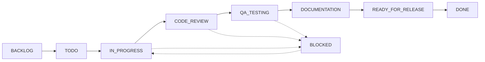

# The STAD Protocol: A Git-Native Framework for Agentic Development

**Document Version:** 5.1 (North Star Vision)  
**Status:** Planning & Refinement  
**Architecture:** Git-Native with Intelligent Automation  
**Created:** 08-16-2025  
**Purpose:** Define the ideal end-state for autonomous AI-driven development

---

## Part 1: Guiding Philosophy

The Stateful & Traceable Agentic Development (STAD) Protocol is a framework for managing AI-driven software development. Its design is guided by a set of core principles aimed at achieving maximum power and reliability with minimum complexity.

1. **Configuration Over Code**: We leverage the native, battle-tested features of our platform (Git, GitHub) before writing custom tooling. The best code is the code we don't have to write.

2. **The Platform is the Database**: We do not build custom state management systems. The GitHub platform, with its Project boards, API, and immutable Git history, serves as our complete, resilient, and authoritative source of truth.

3. **Automate the Process, Not the Judgment**: We automate tedious work (running tests, gathering context, finding bugs) to empower faster, better human decisions. Automation prepares information; the human director provides the judgment.

4. **Make the "Why" a First-Class Citizen**: A record of what change was made is useless without the context of why. The system is designed to capture and surface the original requirement and architectural intent at every stage.

5. **Elegance is Simplicity**: The most robust solution is the one with the fewest moving parts. We relentlessly replace complex ideas with simpler, more elegant implementations that achieve the same goals.

---

## Part 2: The Complete STAD Lifecycle

The protocol is organized into five distinct stages, taking a project from a high-level idea to a deployed and documented feature.

### Stage 0: Strategic Planning (The Roadmap)
*Human-Driven Vision Setting*

**Goal:** Define a new project or major initiative and create a high-level roadmap.

**Director's Role:** Strategist. The User works with their lead AI agents to brainstorm, research, and define the project's long-term goals.

**Process:**
1. **Brainstorming & Research**: The User and their agents explore ideas, research technologies, and define the project's purpose and guiding principles (captured in POLICY.md)
2. **Roadmap Creation**: Strategic work captured in a GitHub Project board named "Product Roadmap"
3. **Epic Definition**: Major bodies of work created as "Epics" (e.g., "Implement User Authentication System")
4. **Story Point Estimation**: Each Epic roughly sized using Fibonacci scale (13, 21, 34+ points)

**Output:** A prioritized backlog of Epics representing the long-term vision.

---

### Stage 1: Sprint Preparation (The Plan)
*Complete Context Gathering for Zero-Intervention Execution*

**Goal:** Translate a high-level feature request into a concrete, machine-readable plan with all context needed for autonomous execution.

**Director's Role:** Initiator & Context Provider. The User provides all requirements, constraints, and architectural decisions upfront.

**Process (The `/sprint-plan` Command):**

1. **Pre-Flight Check**: System analyzes main branch for recent, relevant changes
2. **Architectural Design**: Architect Agent produces:
   - Technical Specification with all design decisions
   - Execution Plan: Dependency-aware (DAG) task checklist
   - Edge case handling strategies
   - Fallback approaches for common issues
3. **Ticket Generation**: 
   - Automatic ticket creation on GitHub
   - Story points assigned (1, 2, 3, 5, 8, 13)
   - Tickets >5 points automatically split
   - Dependencies mapped
4. **Sprint Brain Creation**: Tickets added to "STAD Sprints" board with sprint label

**Key Innovation:** All clarifications and decisions made here, enabling Stage 2 autonomy.

**Output:** Fully prepared sprint with complete context for autonomous execution.

---

### Stage 2: Sprint Execution (The Build)
*Zero Human Intervention Development*

**Goal:** Execute the plan autonomously with agents making informed decisions based on Stage 1 context.

**Director's Role:** Observer Only. Monitor via Project board or `/sprint-standup` command. No intervention.

**Process (The `/sprint-execute` Command):**

1. **Autonomous Execution**:
   - Coder Agent works through Execution Plan
   - Uses Git Worktrees for parallel batch execution (when configured)
   - Makes decisions based on Stage 1 context
   - Falls back to documented strategies for edge cases

2. **Real-time Updates**:
   - Semantic commits linking to tickets
   - GitHub Project board status updates via gh CLI
   - Automatic ticket status transitions

3. **Quality Gates**:
   - GitHub Actions triggered on every commit
   - Linting, unit tests, security scans
   - Failures handled according to Phase 1 fallback strategies

**Ticket Status Flow:**
```
BACKLOG → TODO → IN_PROGRESS → CODE_REVIEW → 
QA_TESTING → DOCUMENTATION → READY_FOR_RELEASE
```

**Output:** Feature branch with completed, technically-validated feature.

---

### Stage 3: Sprint Validation (The Review)
*Human Quality Gate & Feedback Loop*

**Goal:** Perform functional review and make GO/NO-GO decision.

**Director's Role:** Director & Quality Assurance. Final human gate.

**Process:**

1. **Automated Backend Validation** (Future):
   - Backend QA Agent runs API tests, database checks, performance benchmarks
   - Failures trigger Debug Loop automatically

2. **Human UI Validation**:
   - "Review Required" GitHub Issue created
   - Backend QA-generated Reviewer's Dashboard provided
   - User tests on staging environment (when available)

3. **Decision Commands**:
   - `/bug <description>`: Triggers Proactive Debugger (git bisect) → Debug Agent
   - `/revise <feedback>`: Returns to Architect Agent for plan revision
   - `/approve`: Proceeds to Phase 4

**Output:** Approved and fully validated feature.

---

### Stage 4: Release & Retrospective (The Launch & Learn)
*Deployment & Continuous Improvement*

**Goal:** Safely release the feature and capture learnings.

**Director's Role:** Publisher & Student. Final release command and learning review.

**Process (Triggered by `/approve`):**

1. **Release**:
   - Feature branch merged to main
   - Deployment Safety Scripts executed (when configured)
   - GitHub Release created with version tag
   - Ticket status → DONE

2. **Retrospective**:
   - Retrospective Agent analyzes sprint
   - Generates RETROSPECTIVE.md
   - Captures decisions, learnings, improvements

**Output:** Live feature in production with captured knowledge.

---

## Part 3: Core Architecture & Intelligent Automation

### Git-Native Foundation

1. **GitHub Projects as "Sprint Brain"**: Single source of truth for sprint state
2. **Git Worktrees for Parallel Execution**: Perfect isolation for concurrent work (project-configurable)
3. **GitHub Actions as "Enforcer"**: Automated quality gates on every commit
4. **Semantic Commits & Tags**: Immutable audit trail with machine-readable metadata

### Intelligent Automation Layer

1. **Proactive Debugger** (To Be Developed):
   - Automated git bisect integration
   - Pinpoints exact commit introducing bugs
   - Feasibility: Yes, through git bisect run with test scripts

2. **Context-Aware Architect**:
   - Pre-flight checks for recent changes
   - Ensures planning with current context

3. **Reviewer's Dashboard**:
   - Auto-generated comprehensive summary
   - Checklists, stats, and links in review issue

4. **Retrospective Agent**:
   - Automated sprint analysis
   - Formal learning documentation

---

## Part 4: Implementation Strategy

### Current Reality vs North Star

| Component | Current State | North Star | Path Forward |
|-----------|--------------|------------|--------------|
| Planning | Manual with templates | `/sprint-plan` command | Build command system |
| Execution | Guided with clarifications | Zero intervention | Complete context in Phase 1 |
| Worktrees | Not used | Project template option | Create configurable templates |
| Staging Deploy | Manual | Automated | GitHub Actions templates |
| Debug Loop | Manual debugging | Automated with git bisect | Develop Debug Agent |
| Backend QA | Manual testing | Automated validation | Create Backend QA Agent |
| Story Points | In use (1-13) | Maintained with auto-split | Implement splitting logic |
| Status Transitions | Defined | Automated | GitHub Actions integration |

### Agent Coordination Model

**Reality:** Main Claude (you) acts as the hub in hub-and-spoke architecture
- Coordinates all specialist agents
- Agents cannot communicate directly
- GitHub hooks and triggers assist coordination
- No separate coordination model needed

### Project Template Components

For open-source adoption, templates will include:
1. **Git Worktree Configuration** (optional, for large projects)
2. **Staging Deployment Pipeline** (customizable per project)
3. **GitHub Actions Workflows** (quality gates, status updates)
4. **Project Board Templates** (with custom fields)
5. **POLICY.md Template** (project principles)

---

## Part 5: Feasibility Assessment

### Achievable Now
- ✅ Phase 0-1 with current tools
- ✅ Semi-autonomous Phase 2 with checkpoints
- ✅ GitHub Project board integration
- ✅ Semantic commits and tagging
- ✅ Basic retrospectives

### Requires Development
- 🔨 Command system (`/sprint-plan`, `/sprint-execute`, etc.)
- 🔨 Debug Agent and Debug Loop
- 🔨 Backend QA Agent
- 🔨 Proactive Debugger with git bisect
- 🔨 Automated staging deployment
- 🔨 Reviewer's Dashboard generation

### Design Decisions

1. **Zero Intervention Strategy**: Achieved through comprehensive Stage 1 planning capturing all context, constraints, and fallback strategies upfront.

2. **Git Worktrees**: Configured per project via templates, especially beneficial for large projects with parallel development needs.

3. **Story Points**: Maintained with automatic splitting of large tickets (>5 points) into manageable chunks.

4. **Status Transitions**: Fully defined pipeline supporting the new STAD flow while maintaining compatibility with existing tools.

---

## Part 6: Critical Success Factors

### For Zero Human Intervention (Phase 2)
1. **Complete Requirements** in Phase 1
2. **Documented Edge Cases** with handling strategies
3. **Clear Fallback Approaches** for common issues
4. **Comprehensive Test Coverage** for validation
5. **Well-defined Success Criteria** for each ticket

### For Project Success
1. **Incremental Implementation** - Build toward vision iteratively
2. **Template-based Configuration** - Enable project customization
3. **Clear Documentation** - For open-source adoption
4. **Robust Error Handling** - Graceful degradation
5. **Continuous Learning** - Retrospectives improve system

---

## Part 7: Next Steps

### Priority 1 (High Complexity - ~21 Points)
1. Implement basic command structure
2. Create project template system
3. Develop Debug Agent specification
4. Design staging deployment pipeline

### Priority 2 (Medium Complexity - ~34 Points)
1. Build Backend QA Agent
2. Implement Proactive Debugger
3. Create Reviewer's Dashboard
4. Develop auto-splitting for large tickets

### Priority 3 (Future Epics)
1. Achieve true Stage 2 zero intervention
2. Open-source the framework
3. Create project-type specific templates
4. Build community adoption

---

## Appendix A: Command Reference (To Be Implemented)

| Command | Purpose | Phase |
|---------|---------|-------|
| `/sprint-plan <epic>` | Create sprint from epic | Phase 1 |
| `/sprint-execute` | Begin autonomous execution | Phase 2 |
| `/sprint-standup` | View current progress | Phase 2 |
| `/bug <description>` | Report bug for debugging | Phase 3 |
| `/revise <feedback>` | Request plan revision | Phase 3 |
| `/approve` | Approve for release | Phase 3 |
| `/sprint-retro` | Generate retrospective | Phase 4 |

---

## Appendix B: Ticket Status Transitions



---

*This North Star document represents our vision for the STAD Protocol. It will evolve as we learn through implementation, always balancing ambition with pragmatism.*

**Remember:** This is a North Star - we build toward it incrementally while maintaining working software at each step.