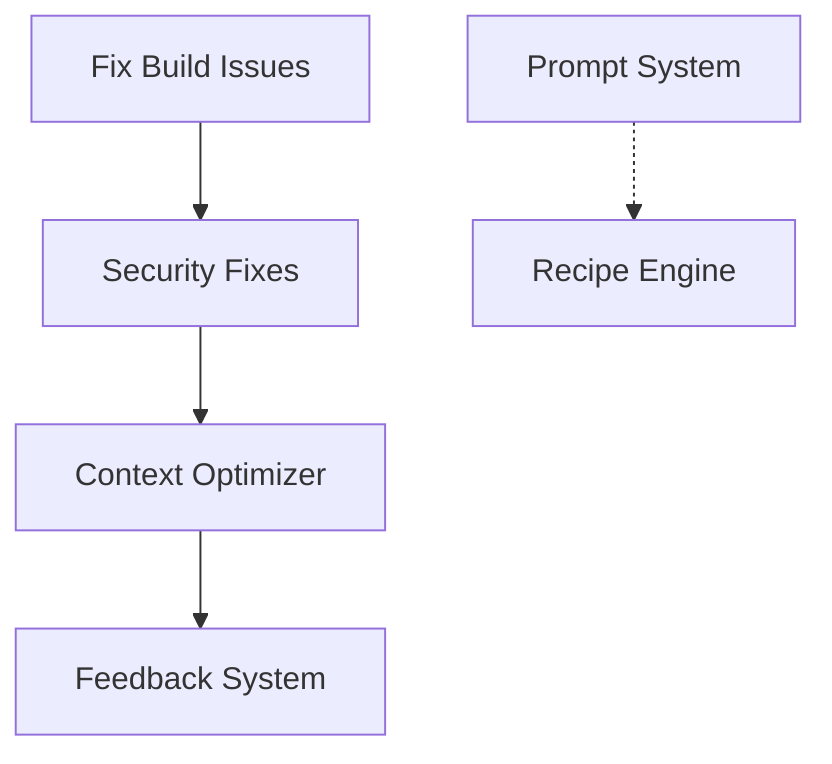

# Sprint Management Guide

> This guide provides comprehensive instructions for planning and executing sprints using Dev-Agency's intelligent agent system. Learn how to leverage the `/sprint-plan` and `/sprint-execute` commands for maximum productivity and success.

## Quick Start

For immediate sprint management, use these commands:

```bash
# Plan your next sprint
/sprint-plan

# Execute a prepared sprint
/sprint-execute --max-agents 4
```

## Overview

Sprint management in Dev-Agency combines data-driven planning with intelligent execution. Our system uses historical data, predictive analytics, and specialized agents to optimize sprint outcomes.

### Core Philosophy

**"Plan the work, then work the plan"** - Dev-Agency's sprint management follows a two-phase approach:

1. **Planning Phase**: Research-Plan-Specs workflow with predictive analytics
2. **Execution Phase**: Implement-Test-Document-Commit workflow with parallel agents

### Success Metrics from Real Sprints

Dev-Agency has achieved exceptional results:

- **Sprint 6**: 18/18 points (100% success)
- **Sprint 5**: 31/31 points (100% success) 
- **Sprint 4**: 44/44 points (100% success)
- **Sprint 3**: 16/16 points (100% success)
- **Sprint 2**: 15/23 points (65% success - learning sprint)

## Sprint Planning with `/sprint-plan`

### Planning Overview

Sprint planning uses the **Research-Plan-Specs** workflow to ensure comprehensive preparation before any implementation begins.

### Planning Phases

#### Phase 1: Sprint Analysis & Context Loading
- Load project context and historical data
- Review previous sprint velocity
- Identify carry-over work and blockers
- Check items ready for release

#### Phase 2: Predictive Analytics
- Uses `/agent:predictive-planner` for data-driven insights
- Analyzes velocity trends and confidence intervals
- Recommends optimal sprint composition
- Predicts potential blockers with mitigation strategies

#### Phase 3: Ticket Selection & Prioritization
- Uses `/agent:architect` for informed ticket selection
- Evaluates business value, risk, and dependencies
- Follows successful sprint patterns from historical data
- Targets 30-35 story points (adjustable based on velocity)

#### Phase 4: Automated Spec Writing
- Uses `/agent:documenter` in parallel for missing specs
- Configurable agent limits (default: 5 parallel agents)
- Creates complete specifications with feature boundaries
- Defines owned resources and safe modification strategies

#### Phase 5: Documentation Mapping
- Identifies documents to read for context
- Maps documents to update during implementation
- Plans new documentation requirements
- Creates comprehensive documentation roadmap

#### Phase 6: Dependency Analysis & Risk Assessment
- Uses `/agent:architect` for dependency mapping
- Creates Mermaid dependency graphs
- Identifies parallelization opportunities
- Develops risk mitigation strategies

#### Phase 7: Context Preparation & Sprint Plan Generation
- Prepares agent context packages for each ticket
- Generates comprehensive sprint plan
- Defines work sequence and timing
- Creates success metrics and monitoring plans

### Planning Commands

#### Basic Planning
```bash
/sprint-plan
```

#### Advanced Options
```bash
/sprint-plan --points 40        # Custom point target
/sprint-plan --priority security # Focus on specific epic
/sprint-plan --continue         # Include in-progress work
/sprint-plan --team-size 3      # Adjust for team capacity
/sprint-plan --duration 1-week  # Shorter sprint
/sprint-plan --max-agents 3     # Limit parallel planning agents
```

### Planning Output

A complete sprint plan includes:

```markdown
# Sprint [N] Plan

## Sprint Overview
- **Dates:** [Start] - [End]
- **Total Points:** [Total from predictive analysis]
- **Ticket Count:** [Optimal count based on patterns]
- **Sprint Goal:** [Data-driven goal alignment]

## Selected Tickets
[Prioritized table with dependencies and specs]

## Documentation Roadmap
[Complete mapping of all documentation work]

## Work Sequence
[Optimal implementation order with parallelization]

## Risk Management
[Predicted risks with mitigation strategies]

## Success Metrics
[Measurable outcomes and quality gates]
```

## Sprint Execution with `/sprint-execute`

### Execution Overview

Sprint execution uses the **Implement-Test-Document-Commit** workflow with intelligent agent orchestration and parallel processing.

### Execution Phases

#### Phase 1: Sprint Loading & Analysis
- Loads prepared sprint plan and ticket specs
- Identifies dependencies and execution order
- Creates agent assignment matrix
- Plans parallel execution groups

#### Phase 2: Agent Assignment Strategy
- Maps specialized agents to appropriate tickets
- Creates parallel execution groups (max 5 agents)
- Schedules work to optimize resource utilization
- Defines recipe application per ticket type

#### Phase 3: Implementation with Boundary Enforcement
- Sets feature boundaries with file permissions
- Validates modification safety before implementation
- Applies appropriate recipes per ticket type
- Monitors implementation progress and quality

#### Phase 4: Parallel Execution Management
- Uses dynamic scheduling algorithm
- Manages up to 5 concurrent agents
- Monitors dependencies and blockers
- Automatically adjusts execution order

#### Phase 5: Quality Gates & Testing
- Enforces comprehensive quality checks
- Validates feature isolation and boundaries
- Runs security scans and performance tests
- Ensures all acceptance criteria are met

#### Phase 6: Memory Sync & Knowledge Update
- Uses `/agent:memory-sync` to update knowledge graph
- Creates entities for new components and patterns
- Syncs code changes to memory system
- Updates knowledge with lessons learned

#### Phase 7: Commit Workflow & DONE Verification
- Generates conventional commit messages
- Updates ticket status in real-time
- Verifies Definition of DONE criteria
- Prepares release documentation

### Execution Commands

#### Basic Execution
```bash
/sprint-execute
```

#### Advanced Options
```bash
/sprint-execute --max-agents 3      # Limit parallel agents
/sprint-execute --tickets AGENT-010 # Execute specific tickets
/sprint-execute --dry-run          # Preview execution plan
/sprint-execute --recipe-override  # Use custom recipes
/sprint-execute --continue          # Resume interrupted execution
```

### Agent Assignment Matrix Example

| Ticket Type | Research | Design | Implementation | Testing | Security | Documentation |
|-------------|----------|--------|----------------|---------|----------|---------------|
| Security Fix | Main | architect | security | tester | security | documenter |
| Bug Fix | Main | - | coder | tester | - | - |
| Feature | Main | architect | coder | tester | - | documenter |
| Performance | Main | architect | performance | tester | - | documenter |
| Infrastructure | Main | architect | integration | tester | security | documenter |

## Sprint Patterns & Best Practices

### Successful Sprint Patterns

Based on our 100% success rate in recent sprints:

#### Pattern 1: Foundation First
- Prioritize blocking issues (BUILD, SECURITY)
- Complete infrastructure before features
- Resolve dependencies early in sprint

#### Pattern 2: Parallel Development
- Group independent tickets for parallel execution
- Use agent specialization effectively
- Maintain clear communication channels

#### Pattern 3: Quality Gates
- Enforce boundary validation
- Require comprehensive testing
- Maintain documentation currency

### Optimal Sprint Composition

Based on historical analysis:

- **Total Points**: 30-35 (adjustable based on velocity)
- **Ticket Count**: 6-8 tickets
- **Size Distribution**: 60% small (1-3 pts), 30% medium (5 pts), 10% large (8 pts)
- **Risk Balance**: 70% low-risk, 20% medium-risk, 10% high-risk
- **Epic Focus**: 2-3 epics maximum per sprint

### Agent Utilization Strategy

#### Resource Management
- **Maximum Agents**: 5 concurrent (configurable)
- **Average Utilization**: Maintain 4.2/5 agents busy
- **Peak Hours**: 14:00-16:00 for complex work
- **Buffer**: Always keep 1 agent free for urgent issues

#### Parallel Execution Groups

**Week 1: Foundation & Critical Fixes**
```
Day 1-2: Foundation (3 agents)
- Critical fixes: coder + security
- Research: Main Claude
- Planning: architect

Day 3-4: Core Implementation (5 agents)
- Feature development: coder + architect
- Testing: tester + security
- Documentation: documenter
```

**Week 2: Features & Quality**
```
Day 6-7: Feature Development (5 agents)
- Multiple features: 3 implementation agents
- Quality assurance: tester + performance

Day 8-9: Polish & Integration (4 agents)
- Bug fixes: coder
- Documentation: documenter
- Performance: performance + tester

Day 10: Sprint Closure (3 agents)
- Memory sync: memory-sync
- Final testing: tester
- Release prep: documenter
```

## Dependency Management

### Dependency Types

#### Direct Dependencies
- **Blocking**: Ticket A must complete before Ticket B can start
- **Enabling**: Ticket A provides foundation for Ticket B
- **Sequential**: Natural order of implementation

#### Technical Dependencies
- **Infrastructure**: Database, APIs, external services
- **Libraries**: Framework updates, new dependencies
- **Configuration**: Environment settings, feature flags

#### Resource Dependencies
- **Knowledge**: Specialized expertise required
- **Access**: Third-party systems, credentials
- **Coordination**: External team involvement

### Dependency Resolution Strategies

#### 1. Early Identification
```bash
# During planning phase
/agent:architect - Analyze all ticket dependencies
- Map technical requirements
- Identify external blockers
- Create dependency graph
```

#### 2. Dependency Ordering


#### 3. Parallel Opportunities
- Independent tickets can run simultaneously
- Different agents can work on separate concerns
- Documentation can proceed alongside implementation

## Progress Tracking & Monitoring

### Real-time Status Updates

Track progress using ticket status transitions:

```
BACKLOG → TODO → IN_PROGRESS → CODE_REVIEW → QA_TESTING → DOCUMENTATION → READY_FOR_RELEASE → DONE
```

### Daily Status Reports

```markdown
## Sprint Execution Status - Day X

### Completed Today
- TICKET-001: ✅ DONE (2 pts)
- TICKET-002: ✅ DONE (3 pts)

### In Progress
- TICKET-003: 70% complete (testing phase) (5 pts)
- TICKET-004: 40% complete (implementation) (3 pts)

### Blocked
- None

### Agent Utilization
- Average: 4.2/5 agents
- Peak: 5/5 agents (14:00-16:00)

### Velocity Tracking
- Points completed: 5/31 (16%)
- Days elapsed: 2/10 (20%)
- Pace: On track

### Tomorrow's Plan
- Complete TICKET-003 testing
- Start TICKET-005 implementation
- Update documentation for completed features
```

### Success Metrics Dashboard

Track these key metrics:

#### Velocity Metrics
- **Story Points per Sprint**: Target vs. Actual
- **Completion Rate**: Percentage of planned work finished
- **Velocity Trend**: 3-sprint moving average

#### Quality Metrics
- **Defect Rate**: Bugs found in testing
- **Rework**: Time spent on fixes and revisions
- **Technical Debt**: Accumulation vs. reduction

#### Efficiency Metrics
- **Agent Utilization**: Average concurrent agents
- **Cycle Time**: Ticket start to completion
- **Lead Time**: Planning to delivery

#### Predictive Metrics
- **Burn Rate**: Points completed per day
- **Forecast**: Projected sprint completion date
- **Risk Level**: Early warning indicators

## Common Sprint Issues & Solutions

### Issue Resolution Guide

| Issue | Symptoms | Solution | Prevention |
|-------|----------|----------|------------|
| Agent Conflicts | Multiple agents modifying same files | Use mutex locks, boundary enforcement | Better dependency planning |
| Dependency Delays | Tickets blocked waiting for others | Dynamic queue reordering | More thorough dependency analysis |
| Test Failures | Quality gates failing | Allocate dedicated fix time | Better upfront test planning |
| Memory Sync Errors | Knowledge graph inconsistencies | Retry with smaller batches | Regular incremental syncing |
| Resource Exhaustion | System performance degradation | Reduce max agents temporarily | Monitor resource usage |
| Scope Creep | Requirements expanding mid-sprint | Strict change control process | Better acceptance criteria |
| Communication Gaps | Team misalignment | Regular standups, status updates | Clear communication protocols |

### Emergency Procedures

#### Mid-Sprint Adjustments
```bash
# Assess current situation
/sprint-execute --status

# Adjust agent allocation
/sprint-execute --max-agents 2  # Reduce if overloaded

# Focus on critical tickets only
/sprint-execute --tickets SECURITY-001,BUILD-001

# Emergency completion strategy
/sprint-plan --points 20 --priority critical
```

#### Sprint Recovery
```bash
# If sprint is failing (< 70% completion projected)
1. Stop all non-critical work
2. Focus on must-have tickets only
3. Reduce scope to 20-25 points
4. Extend testing timeline if needed
5. Document lessons learned
```

## Sprint Retrospectives

### Retrospective Process

Conduct retrospectives after each sprint:

#### 1. Data Collection
- Velocity and completion metrics
- Agent performance statistics
- Issue frequency and resolution times
- Quality metrics and defect rates

#### 2. Team Feedback
- What went well?
- What could be improved?
- What should we start/stop/continue doing?
- Process pain points and suggestions

#### 3. Action Items
- Specific improvements to implement
- Process changes to test
- Tools or resources needed
- Owners and timelines

#### 4. Knowledge Update
- Update sprint patterns knowledge
- Refine agent assignment strategies
- Improve predictive models
- Enhance recipe effectiveness

### Retrospective Template

```markdown
# Sprint [N] Retrospective

## Sprint Summary
- **Planned Points**: [X]
- **Completed Points**: [Y]
- **Completion Rate**: [Y/X%]
- **Sprint Goal**: [Met/Partially Met/Not Met]

## Metrics Review
- **Velocity**: [Current vs. Average]
- **Agent Utilization**: [Average concurrent agents]
- **Quality**: [Defects, rework]
- **Efficiency**: [Cycle time, lead time]

## What Went Well ✅
- [Successful practices and achievements]
- [Effective agent combinations]
- [Process improvements that worked]

## What Could Be Improved 🔧
- [Pain points and challenges]
- [Process bottlenecks]
- [Communication issues]

## Action Items 📋
| Action | Owner | Deadline | Status |
|--------|--------|----------|--------|
| [Specific improvement] | [Who] | [When] | [Status] |

## Lessons Learned 📚
- [Key insights for future sprints]
- [Pattern recognition updates]
- [Agent assignment improvements]

## Next Sprint Preparation
- [Velocity adjustments]
- [Process changes to implement]
- [Focus areas for improvement]
```

## Advanced Sprint Management

### Multi-Team Coordination

For larger projects with multiple teams:

#### 1. Sprint Synchronization
- Align sprint boundaries across teams
- Coordinate dependency handoffs
- Manage shared resource conflicts

#### 2. Cross-Team Dependencies
- Map inter-team dependencies early
- Create coordination protocols
- Establish communication channels

#### 3. Integration Planning
- Schedule integration points
- Plan testing across team boundaries
- Coordinate release activities

### Scaling Strategies

#### Horizontal Scaling
- Multiple agent clusters for different workstreams
- Parallel sprint execution for independent features
- Distributed agent specialization

#### Vertical Scaling
- More powerful agents for complex tasks
- Increased parallelization within sprints
- Enhanced predictive capabilities

### Advanced Metrics

#### Predictive Analytics
- Machine learning models for velocity prediction
- Risk assessment based on historical patterns
- Resource optimization recommendations

#### Performance Optimization
- Agent efficiency tracking
- Resource utilization optimization
- Bottleneck identification and resolution

## Integration with Dev-Agency Ecosystem

### Recipe Integration

Sprint management integrates with specialized recipes:

- **security_audit_recipe**: For security-focused sprints
- **performance_optimization_recipe**: For performance improvements
- **database_migration_recipe**: For infrastructure changes
- **full_stack_feature_recipe**: For comprehensive features
- **bug_fix_recipe**: For stabilization sprints

### Memory System Integration

The sprint management system integrates with Dev-Agency's memory system:

```bash
# Automatic memory syncing during execution
/sync-memory --path src/ --ticket TICKET-ID

# Knowledge graph updates
/agent:memory-sync
Context: [Sprint outcomes, patterns learned, agent effectiveness]

# Entity creation for sprint insights
mcp__memory__create_entities([
    {
        name: "Sprint_[N]_Patterns",
        entityType: "SprintInsight",
        observations: ["Success factors", "Bottlenecks", "Improvements"]
    }
])
```

### Tool Integration

Sprint management works seamlessly with Dev-Agency tools:

- **CLI Tools**: Enhanced with sprint-specific commands
- **VS Code Extension**: Sprint progress tracking in IDE
- **Dashboard**: Real-time sprint monitoring
- **Notification System**: Slack/Teams integration for updates
- **Health Monitoring**: System performance during sprints

## Conclusion

Dev-Agency's sprint management system provides a comprehensive, data-driven approach to project execution. By combining intelligent planning with specialized agent execution, teams can achieve exceptional results.

### Key Success Factors

1. **Thorough Planning**: Use predictive analytics and comprehensive specs
2. **Agent Specialization**: Match the right agent to the right task
3. **Boundary Enforcement**: Maintain feature isolation and safety
4. **Continuous Monitoring**: Track progress and adjust dynamically
5. **Quality First**: Never compromise on quality gates
6. **Learning Culture**: Continuously improve through retrospectives

### Getting Started

1. **Start with Planning**: Run `/sprint-plan` to create your first data-driven sprint
2. **Execute Systematically**: Use `/sprint-execute --max-agents 3` for controlled execution
3. **Monitor Progress**: Track daily status and adjust as needed
4. **Learn and Improve**: Conduct retrospectives and apply lessons learned
5. **Scale Gradually**: Increase agent parallelization as you gain experience

With proper application of these sprint management principles, your team can achieve the same 100% success rates that Dev-Agency has demonstrated in recent sprints.

---

*For additional support, see the [troubleshooting guide](/docs/reference/troubleshooting.md) or consult the [agent catalog](/quick-start/AGENT_CATALOG.md) for specialized agent capabilities.*