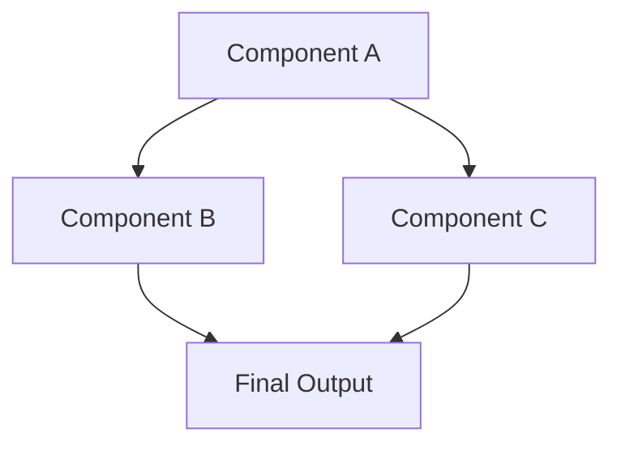

# Stage 1: Comprehensive Specification - [TICKET-ID]

## Metadata
- **Date:** [YYYY-MM-DD]
- **Stage:** 1 (Sprint Preparation)
- **Ticket ID:** [TICKET-XXX]
- **Story Points:** [1/2/3/5/8/13]
- **Author:** [Name/Agent]
- **Sprint:** [Sprint N]

## Ticket Summary
### Description
[Clear, concise description of what needs to be built]

### Business Context
[Why this is needed, linking back to epic]

## Technical Specification
### Architecture Overview
[High-level design and system integration]

### Dependency Graph

### Implementation Plan
#### Step 1: [Title]
- **What:** [Detailed description]
- **How:** [Specific approach]
- **Where:** [File locations]
- **Dependencies:** [What must exist first]

#### Step 2: [Title]
- **What:** [Detailed description]
- **How:** [Specific approach]
- **Where:** [File locations]
- **Dependencies:** [What must exist first]

#### Step 3: [Title]
- **What:** [Detailed description]
- **How:** [Specific approach]
- **Where:** [File locations]
- **Dependencies:** [What must exist first]

## Technology Decisions
| Decision | Choice | Rationale |
|----------|--------|-----------|
| [Category] | [Chosen option] | [Why this over alternatives] |
| [Category] | [Chosen option] | [Why this over alternatives] |

## Edge Cases & Error Handling
### Edge Case 1: [Description]
- **Scenario:** [When this occurs]
- **Handling:** [How to handle]
- **User Experience:** [What user sees]

### Edge Case 2: [Description]
- **Scenario:** [When this occurs]
- **Handling:** [How to handle]
- **User Experience:** [What user sees]

## Parallelization Opportunities
### Can Be Done in Parallel
- [Task A] and [Task B] - No dependencies
- [Task C] and [Task D] - Different modules

### Must Be Sequential
- [Task X] → [Task Y] - Y depends on X output
- [Task Y] → [Task Z] - Z needs Y complete

## Acceptance Criteria
- [ ] [Specific, measurable criterion 1]
- [ ] [Specific, measurable criterion 2]
- [ ] [Specific, measurable criterion 3]
- [ ] All tests passing
- [ ] Documentation updated
- [ ] Code reviewed and approved

## Test Scenarios
### Scenario 1: [Happy Path]
- **Given:** [Initial state]
- **When:** [Action taken]
- **Then:** [Expected result]

### Scenario 2: [Error Case]
- **Given:** [Initial state]
- **When:** [Error condition]
- **Then:** [Graceful handling]

## File Locations
- **Code:** `/src/[module]/[feature]/`
- **Tests:** `/src/[module]/__tests__/`
- **Docs:** `/docs/features/[feature].md`
- **Config:** `/config/[feature].config.ts`

## Resource Estimates
- **Development Time:** [X hours]
- **Review Time:** [Y hours]
- **Testing Time:** [Z hours]
- **Total:** [Sum hours]

## Stage Gate Checklist
- [ ] All design decisions documented
- [ ] No ambiguity in implementation steps
- [ ] Dependencies clearly mapped
- [ ] Edge cases identified and addressed
- [ ] Acceptance criteria measurable
- [ ] Test scenarios comprehensive
- [ ] File locations specified
- [ ] Resources estimated

## Agent Handoff for Stage 2
### Assigned Agents
- **Primary:** [Agent name]
- **Support:** [Agent name if needed]

### Execution Notes
- Start with [specific step]
- Watch for [specific concern]
- Prioritize [specific aspect]

### Stage 2 Deliverables
- Working implementation
- Complete test coverage
- Updated documentation
- Clean, reviewed code

---
*This specification is complete and requires NO design decisions during Stage 2 execution.*