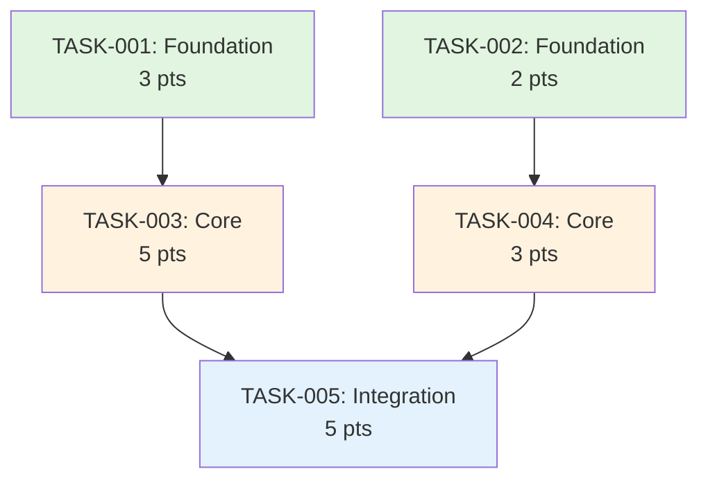

# Execution Plan Template (DAG Structure)

**Plan ID:** PLAN-[EPIC-XXX]  
**Title:** [Epic/Feature Name] Execution Plan  
**Total Story Points:** [Sum of all tasks]  
**Estimated Sprints:** [Number based on velocity]  
**Created:** [Run: date +"%Y-%m-%d"]  
**Author:** Architect Agent

---

## 📊 Plan Overview

**Total Tasks:** [Count]  
**Critical Path Length:** [Number of sequential tasks]  
**Parallelization Opportunities:** [Number of parallel tracks]  
**Dependencies:** [Total number of dependencies]

---

## 🎯 Execution Strategy

### Batch Organization
- **Batch 1 (Foundation):** [X story points] - No dependencies
- **Batch 2 (Core):** [X story points] - Depends on Batch 1
- **Batch 3 (Enhancement):** [X story points] - Depends on Batch 2
- **Batch 4 (Polish):** [X story points] - Can run parallel

### Resource Allocation
- **Agents Required:** [List of specialist agents needed]
- **Parallel Execution:** [Yes/No - if yes, how many tracks]
- **Bottlenecks:** [Identified resource constraints]

---

## 📋 Task Breakdown (DAG)

### Batch 1: Foundation Tasks (No Dependencies)

#### TASK-001: [Task Name]
- **Description:** [What needs to be done]
- **Story Points:** [1-5]
- **Assigned To:** [Agent type]
- **Depends On:** None
- **Blocks:** [TASK-XXX, TASK-YYY]
- **Acceptance Criteria:**
  - [ ] [Criterion 1]
  - [ ] [Criterion 2]

#### TASK-002: [Task Name]
- **Description:** [What needs to be done]
- **Story Points:** [1-5]
- **Assigned To:** [Agent type]
- **Depends On:** None
- **Blocks:** [TASK-XXX]
- **Acceptance Criteria:**
  - [ ] [Criterion 1]
  - [ ] [Criterion 2]

---

### Batch 2: Core Implementation

#### TASK-003: [Task Name]
- **Description:** [What needs to be done]
- **Story Points:** [1-5]
- **Assigned To:** [Agent type]
- **Depends On:** [TASK-001]
- **Blocks:** [TASK-XXX]
- **Acceptance Criteria:**
  - [ ] [Criterion 1]
  - [ ] [Criterion 2]

#### TASK-004: [Task Name]
- **Description:** [What needs to be done]
- **Story Points:** [1-5]
- **Assigned To:** [Agent type]
- **Depends On:** [TASK-001, TASK-002]
- **Blocks:** [TASK-XXX]
- **Acceptance Criteria:**
  - [ ] [Criterion 1]
  - [ ] [Criterion 2]

---

### Batch 3: Integration & Testing

#### TASK-005: [Task Name]
- **Description:** [What needs to be done]
- **Story Points:** [1-5]
- **Assigned To:** [Agent type]
- **Depends On:** [TASK-003, TASK-004]
- **Blocks:** [TASK-XXX]
- **Acceptance Criteria:**
  - [ ] [Criterion 1]
  - [ ] [Criterion 2]

---

## 🔄 Dependency Graph

---

## 🚦 Critical Path

**Critical Path:** TASK-001 → TASK-003 → TASK-005 → ...

**Total Critical Path Points:** [Sum of points on critical path]

**Buffer Tasks (Can be delayed):**
- [TASK-XXX] - Can delay by [X] days
- [TASK-YYY] - Can delay by [X] days

---

## ⚡ Parallel Execution Opportunities

### Track A (Independent)
- TASK-001 → TASK-003 → TASK-007

### Track B (Independent)
- TASK-002 → TASK-004 → TASK-008

### Merge Point
- TASK-009 (Requires both Track A and B)

---

## 🎯 Milestone Checkpoints

### Milestone 1: Foundation Complete
- **Tasks:** TASK-001, TASK-002
- **Total Points:** [X]
- **Success Criteria:**
  - [ ] All foundation tasks complete
  - [ ] Tests passing
  - [ ] Ready for core implementation

### Milestone 2: Core Features Complete
- **Tasks:** TASK-003, TASK-004
- **Total Points:** [X]
- **Success Criteria:**
  - [ ] Core functionality working
  - [ ] Integration tests passing
  - [ ] Documentation updated

### Milestone 3: Ready for Release
- **Tasks:** TASK-005, TASK-006
- **Total Points:** [X]
- **Success Criteria:**
  - [ ] All features complete
  - [ ] Performance validated
  - [ ] Security review passed

---

## ⚠️ Risk Mitigation

### Identified Risks
1. **Risk:** [Description]
   - **Mitigation:** [Strategy]
   - **Contingency Task:** [TASK-XXX if needed]

2. **Risk:** [Description]
   - **Mitigation:** [Strategy]
   - **Contingency Task:** [TASK-XXX if needed]

---

## 📈 Progress Tracking

### Velocity Assumptions
- **Team Velocity:** [X story points per sprint]
- **Buffer:** 20% for unknowns
- **Adjusted Velocity:** [X * 0.8 points per sprint]

### Sprint Allocation (Proposed)
- **Sprint 1:** TASK-001, TASK-002 ([X] points)
- **Sprint 2:** TASK-003, TASK-004 ([X] points)
- **Sprint 3:** TASK-005, TASK-006 ([X] points)

---

## 🔄 Execution Rules

1. **Dependency Respect:** Never start a task before dependencies complete
2. **Batch Completion:** Finish all tasks in batch before moving to next
3. **Parallel Execution:** Use when no dependencies exist
4. **Blocker Escalation:** Mark BLOCKED immediately when stuck
5. **Progress Updates:** Update board after each task completion

---

## 📋 Task Status Legend

- 🟩 **Ready:** All dependencies met, can start
- 🟨 **Waiting:** Dependencies not yet complete
- 🟥 **Blocked:** External blocker, needs resolution
- 🟦 **In Progress:** Currently being worked on
- ✅ **Complete:** Done and validated

---

## 🎯 Success Metrics

- [ ] All tasks completed within estimated sprints
- [ ] No critical path delays
- [ ] Parallel tracks utilized effectively
- [ ] Dependencies respected (no rework)
- [ ] Quality gates passed at each milestone

---

*This execution plan is ready for Stage 2: Sprint Execution*