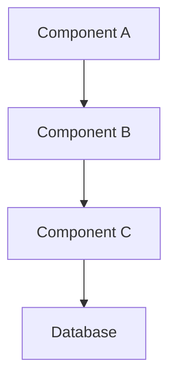

# Technical Specification Template

**Spec ID:** SPEC-[EPIC-XXX]  
**Title:** [Feature/Component Name]  
**Version:** 1.0  
**Author:** Architect Agent  
**Created:** [Run: date +"%Y-%m-%d"]  
**Status:** Draft/Approved  
**Epic:** [EPIC-XXX]

---

## 📋 Executive Summary

**Purpose:** [1-2 sentences on what this spec defines]

**Scope:** [What's included and explicitly not included]

**Estimated Complexity:** [Total story points for implementation]

---

## 🎯 Goals & Non-Goals

### Goals
- [Specific, measurable goal 1]
- [Specific, measurable goal 2]
- [Specific, measurable goal 3]

### Non-Goals
- [Explicitly out of scope 1]
- [Explicitly out of scope 2]
- [Will not address]

---

## 🏗️ System Architecture

### High-Level Design



### Component Breakdown

#### Component A: [Name]
- **Purpose:** [What it does]
- **Responsibilities:** [List]
- **Interfaces:** [APIs/Methods exposed]
- **Dependencies:** [What it needs]

#### Component B: [Name]
- **Purpose:** [What it does]
- **Responsibilities:** [List]
- **Interfaces:** [APIs/Methods exposed]
- **Dependencies:** [What it needs]

---

## 📊 Data Model

### Entities

#### Entity: [Name]
```typescript
interface EntityName {
  id: string;
  field1: type;
  field2: type;
  // ...
}
```

### Database Schema
```sql
CREATE TABLE entity_name (
  id UUID PRIMARY KEY,
  field1 VARCHAR(255),
  field2 INTEGER,
  created_at TIMESTAMP,
  updated_at TIMESTAMP
);
```

### Data Flow
1. [Step 1: Data enters system]
2. [Step 2: Processing]
3. [Step 3: Storage]
4. [Step 4: Retrieval]

---

## 🔌 API Design

### Endpoints

#### `POST /api/v1/resource`
**Purpose:** [What it does]

**Request:**
```json
{
  "field1": "value",
  "field2": 123
}
```

**Response (200):**
```json
{
  "id": "uuid",
  "field1": "value",
  "field2": 123,
  "created_at": "2025-01-01T00:00:00Z"
}
```

**Error Responses:**
- `400`: Invalid input
- `401`: Unauthorized
- `500`: Server error

---

## 🔄 User Workflows

### Workflow 1: [Name]
1. User action
2. System response
3. Next user action
4. Final outcome

### Edge Cases
- **Edge Case 1:** [Description] → [How to handle]
- **Edge Case 2:** [Description] → [How to handle]
- **Edge Case 3:** [Description] → [How to handle]

---

## 💻 Implementation Details

### Technology Stack
- **Frontend:** [Framework/Libraries]
- **Backend:** [Framework/Language]
- **Database:** [Type and specific DB]
- **Cache:** [If applicable]
- **Queue:** [If applicable]

### Code Organization
```
/src
  /components
    /FeatureName
      index.ts
      types.ts
      utils.ts
      tests/
  /services
    /FeatureName
      service.ts
      repository.ts
      tests/
  /api
    /routes
      feature.routes.ts
```

### Key Algorithms
```typescript
// Pseudocode for critical logic
function criticalAlgorithm(input: Type): Output {
  // Step 1: Validate
  // Step 2: Process
  // Step 3: Return
}
```

---

## 🔒 Security Considerations

### Authentication & Authorization
- [Authentication method]
- [Authorization model]
- [Token management]

### Data Protection
- [Encryption at rest]
- [Encryption in transit]
- [PII handling]

### Security Checklist
- [ ] Input validation
- [ ] SQL injection prevention
- [ ] XSS prevention
- [ ] CSRF protection
- [ ] Rate limiting
- [ ] Audit logging

---

## 🚀 Performance Requirements

### Metrics
- **Response Time:** <200ms p95
- **Throughput:** 1000 req/s
- **Availability:** 99.9%
- **Data Volume:** [Expected scale]

### Optimization Strategies
- [Caching strategy]
- [Database indexing]
- [Query optimization]
- [Load balancing]

---

## 🧪 Testing Strategy

### Unit Tests
- Coverage target: 80%
- Key functions to test: [List]

### Integration Tests
- API endpoints
- Database operations
- External service calls

### E2E Tests
- Critical user paths
- Edge cases
- Error scenarios

### Performance Tests
- Load testing scenarios
- Stress testing thresholds
- Benchmark targets

---

## 📝 Migration Plan

### Database Migrations
1. [Migration step 1]
2. [Migration step 2]
3. [Rollback procedure]

### Data Migration
- Source: [Current data location]
- Destination: [New data location]
- Transformation: [Required changes]
- Validation: [How to verify]

### Feature Flags
- Flag: `feature_name_enabled`
- Rollout strategy: [Percentage/Group based]
- Rollback plan: [How to disable]

---

## 🎯 Success Criteria

### Functional
- [ ] All user stories implemented
- [ ] All acceptance criteria met
- [ ] Edge cases handled

### Non-Functional
- [ ] Performance targets met
- [ ] Security review passed
- [ ] Documentation complete
- [ ] Tests passing with coverage target

### Business
- [ ] Stakeholder approval
- [ ] User feedback incorporated
- [ ] Analytics tracking enabled

---

## ⚠️ Risks & Mitigations

| Risk | Probability | Impact | Mitigation |
|------|------------|--------|------------|
| [Risk 1] | High/Medium/Low | High/Medium/Low | [Mitigation strategy] |
| [Risk 2] | High/Medium/Low | High/Medium/Low | [Mitigation strategy] |
| [Risk 3] | High/Medium/Low | High/Medium/Low | [Mitigation strategy] |

---

## 🔄 Rollback Plan

### Immediate Rollback
1. [Step to disable feature]
2. [Step to revert deployment]
3. [Step to restore data]

### Gradual Rollback
1. [Reduce traffic percentage]
2. [Monitor metrics]
3. [Complete rollback if needed]

---

## 📚 References

### Internal Documentation
- [Related specs]
- [Architecture docs]
- [Previous implementations]

### External Resources
- [API documentation]
- [Library documentation]
- [Best practices]

---

## 📊 Appendix

### A. Glossary
- **Term 1:** Definition
- **Term 2:** Definition

### B. Open Questions
- [ ] [Question requiring decision]
- [ ] [Question requiring research]

### C. Future Enhancements
- [Enhancement 1 for next iteration]
- [Enhancement 2 for future]

---

*This specification is ready for implementation by Coder Agent*