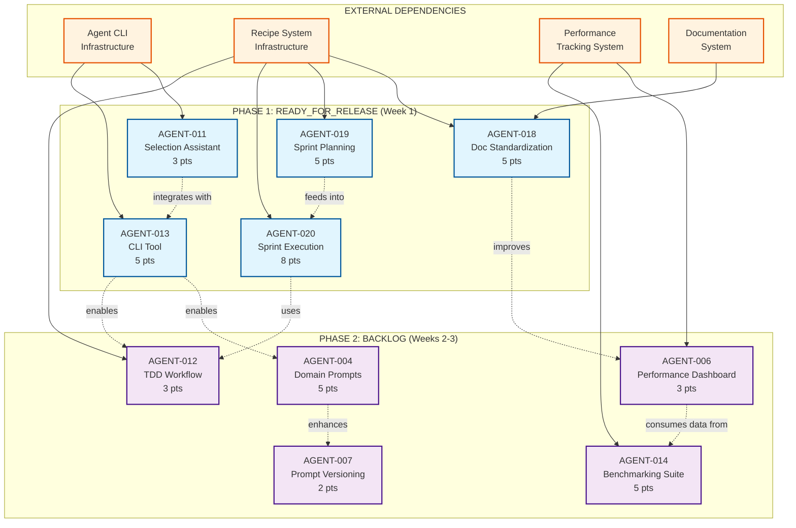
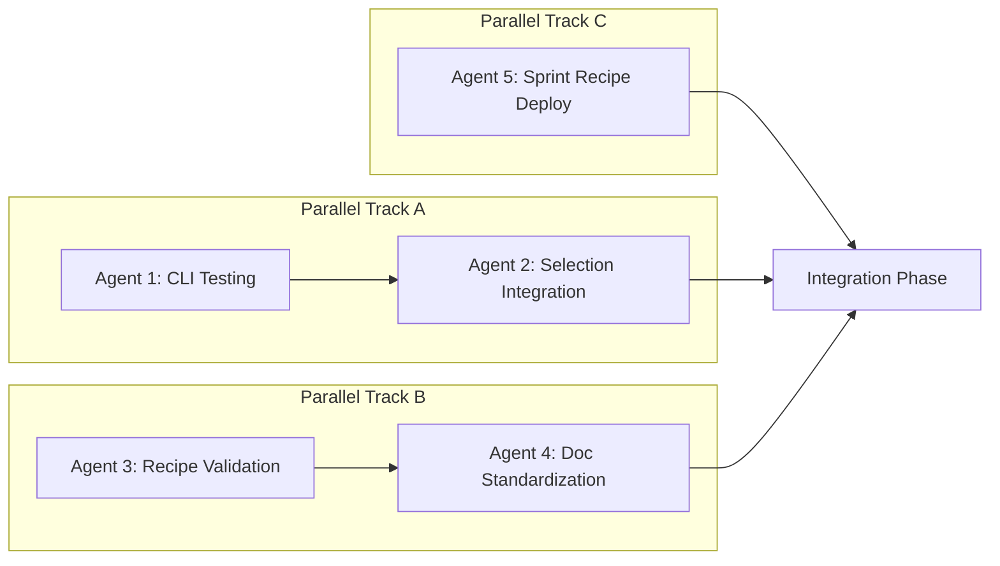
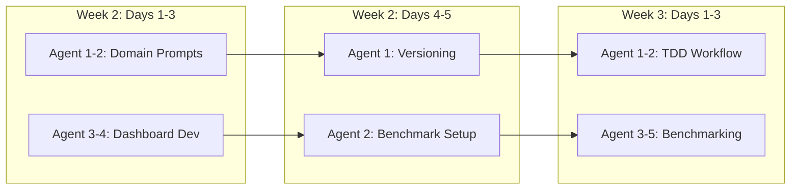

# Sprint 4 Dependency Graph & Execution Timeline

## 🔄 Complete Dependency Graph



## 📅 Optimal Execution Timeline

### Week 1: READY_FOR_RELEASE Deployment

```mermaid
gantt
    title Sprint 4 - Week 1 Execution Plan
    dateFormat X
    axisFormat %d
    
    section CLI & Selection
    CLI Testing & Docs       :done, cli1, 0, 2
    Selection Integration    :done, sel1, 2, 4
    Deployment & Guides      :done, deploy1, 4, 5
    
    section Recipe System
    Recipe Validation        :done, recipe1, 0, 1
    Doc Standardization      :done, doc1, 1, 3
    Sprint Planning/Exec     :done, sprint1, 3, 5
    
    section Quality Gates
    Integration Testing      :crit, test1, 4, 5
    Documentation Review     :crit, docrev1, 4, 5
```



### Weeks 2-3: BACKLOG Development

```mermaid
gantt
    title Sprint 4 - Weeks 2-3 Development Plan
    dateFormat X
    axisFormat %d
    
    section Week 2: Core Infrastructure
    Domain Prompts          :active, domain, 5, 8
    Prompt Versioning       :active, version, 8, 10
    Dashboard Development   :active, dash, 5, 8
    Benchmark Design        :active, bench1, 8, 10
    
    section Week 3: Advanced Features
    TDD Workflow           :tdd, 10, 13
    Benchmarking Suite     :bench2, 10, 14
    Integration Testing    :crit, test2, 13, 15
    Final Documentation    :crit, docs2, 14, 15
```



## 🎯 Parallelization Strategy

### Maximum Parallel Execution Opportunities

#### Week 1 (Phase 1 - 5 agents max)


#### Week 2-3 (Phase 2 - Staggered parallel)


## 🔍 Critical Path Analysis

### Primary Critical Path (affects sprint completion)
```
AGENT-013 (CLI) → AGENT-011 (Selection) → Integration Testing → Deployment
     ↓
AGENT-019 (Planning) → AGENT-020 (Execution) → Final Validation
```

**Critical Path Duration**: 8 days
**Risk**: High - Any delay impacts entire sprint

### Secondary Paths (parallel development)

#### Path A: Prompt System
```
AGENT-004 (Domain Prompts) → AGENT-007 (Versioning) → Integration
```
**Duration**: 7 days  
**Risk**: Medium - Self-contained system

#### Path B: Monitoring System  
```
AGENT-006 (Dashboard) → AGENT-014 (Benchmarking) → Performance Validation
```
**Duration**: 8 days
**Risk**: Medium - Infrastructure dependent

#### Path C: Development Workflow
```
AGENT-012 (TDD) → Testing Framework Integration → Validation
```
**Duration**: 5 days
**Risk**: Low - Independent implementation

## ⚠️ Bottleneck Analysis

### Identified Bottlenecks

#### 1. CLI Tool Integration (AGENT-013)
- **Impact**: Blocks AGENT-011, affects AGENT-004, AGENT-012
- **Mitigation**: Prioritize CLI stability testing
- **Agents**: 2 agents dedicated to CLI finalization

#### 2. Documentation System (AGENT-018)
- **Impact**: Affects all documentation updates
- **Mitigation**: Deploy documentation recipe first
- **Agents**: 1 agent focused on doc standardization

#### 3. Performance Infrastructure
- **Impact**: AGENT-006 needs metrics, AGENT-014 needs benchmarks
- **Mitigation**: Establish performance data pipeline early
- **Agents**: Dedicated performance agent for infrastructure

#### 4. Testing Framework Integration
- **Impact**: AGENT-012 needs multi-framework support
- **Mitigation**: Start with Jest/PyTest, expand iteratively
- **Agents**: Testing specialist agent for TDD workflow

## 🎲 Risk-Adjusted Execution Plan

### High Confidence (90%+ success probability)
- **AGENT-013**: Already implemented, needs deployment
- **AGENT-018**: Recipe completed, needs testing
- **AGENT-019**: Recipe completed, needs validation
- **AGENT-020**: Recipe completed, needs integration

### Medium Confidence (70-80% success probability)
- **AGENT-011**: Depends on CLI integration quality
- **AGENT-006**: Dashboard complexity manageable
- **AGENT-007**: Simple versioning implementation

### Lower Confidence (60-70% success probability)
- **AGENT-004**: Domain expertise requirements high
- **AGENT-012**: TDD complexity and multi-framework support
- **AGENT-014**: Performance benchmarking complexity

### Contingency Planning

#### If behind schedule after Week 1:
1. **Priority 1**: Complete Phase 1 deployments (26 pts)
2. **Priority 2**: AGENT-004, AGENT-006 (8 pts total)
3. **Priority 3**: Remaining tickets as time allows

#### If ahead of schedule:
1. **Acceleration**: Parallel Phase 2 development
2. **Quality Focus**: Enhanced testing and documentation
3. **Future Prep**: Begin Sprint 5 planning

## 📈 Success Probability Analysis

### Overall Sprint Success Probability: **85%**

**Breakdown by phase:**
- **Phase 1 (READY_FOR_RELEASE)**: 95% - Implementations complete
- **Phase 2 (Domain + Dashboard)**: 80% - Medium complexity  
- **Phase 2 (TDD + Benchmarking)**: 70% - Higher complexity

**Risk factors:**
- Resource availability: ±10%
- Technical complexity: ±15%
- Integration challenges: ±10%
- Documentation debt: ±5%

**Confidence intervals:**
- **Optimistic scenario**: 42+ story points (95%)
- **Realistic scenario**: 38-42 story points (85%)
- **Pessimistic scenario**: 32-38 story points (70%)

---

This dependency analysis provides clear execution guidance with risk-adjusted planning for Sprint 4's 44 story point completion across the 3-week timeline.