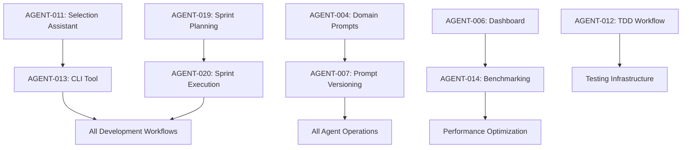

# Sprint 4 Documentation Roadmap & Dependency Analysis

**Sprint 4 Overview:**
- **Total Scope:** 10 tickets / 44 story points
- **Phase 1:** READY_FOR_RELEASE → DONE (5 tickets, 26 pts)
- **Phase 2:** BACKLOG → DONE (5 tickets, 18 pts)
- **Timeline:** 3-week extended sprint
- **Analysis Date:** 2025-08-10

## 📋 Complete Documentation Roadmap

### PHASE 1: READY_FOR_RELEASE Tickets (26 story points)

#### AGENT-011: Agent Selection Assistant (3 pts)
**Documents to READ:**
- `/Agents/*.md` - All agent definitions for capability analysis
- `/recipes/README.md` - Recipe system patterns
- `/tools/agent-cli/README.md` - CLI integration patterns
- `/feedback/performance_tracker.md` - Performance metrics data
- `/Project_Management/Specs/AGENT-013_spec.md` - CLI tool integration

**Documents to UPDATE:**
- `/tools/agent-cli/README.md` - Add selection assistant features
- `/docs/tools/README.md` - Update tool documentation
- `/recipes/README.md` - Add agent selection patterns
- `/Project_Management/Specs/AGENT-011_spec.md` - Implementation status

**Documents to CREATE:**
- `/docs/guides/agent-selection-guide.md` - User guide for selection assistant
- `/docs/api/agent-selection-api.md` - API documentation
- `/tools/agent-cli/docs/selection-assistant.md` - Technical documentation

#### AGENT-013: Agent Invocation CLI Tool (5 pts)
**Documents to READ:**
- `/tools/agent-cli/src/core/*.ts` - Existing implementation
- `/tools/agent-cli/README.md` - Current documentation
- `/Development_Standards/Guides/Development Standards Guide.md` - Code standards
- `/Agents/*.md` - Agent definitions for integration

**Documents to UPDATE:**
- `/tools/agent-cli/README.md` - Update with latest features
- `/docs/getting-started/*.md` - Update installation/setup guides
- `/quick-start/5_MINUTE_SUCCESS.md` - Update quick start with CLI
- `/Project_Management/Specs/AGENT-013_spec.md` - Mark as deployed

**Documents to CREATE:**
- `/docs/tools/cli-reference.md` - Complete CLI command reference
- `/docs/guides/cli-workflow-guide.md` - Workflow integration guide
- `/tools/agent-cli/DEPLOYMENT.md` - Deployment and installation guide

#### AGENT-018: Documentation Standardization Recipe (5 pts)
**Documents to READ:**
- `/recipes/documentation_standardization_recipe.md` - Implementation
- `/docs/` directory structure - Documentation organization
- `/Development_Standards/Guides/Documentation Guide.md` - Standards
- `/Agents/clutter-detector.md` - Duplicate detection patterns

**Documents to UPDATE:**
- `/prompts/slash_commands.md` - Add `/doc-audit` command
- `/recipes/README.md` - Update recipe index
- `/docs/workflows/README.md` - Add documentation workflow
- `/Project_Management/Specs/AGENT-018_spec.md` - Mark as deployed

**Documents to CREATE:**
- `/docs/guides/documentation-audit-guide.md` - User guide for doc audit
- `/docs/standards/frontmatter-schema.md` - Frontmatter standards
- `/docs/workflows/doc-standardization-workflow.md` - Process documentation

#### AGENT-019: Sprint Planning Automation Recipe (5 pts)
**Documents to READ:**
- `/recipes/sprint_planning_recipe.md` - Implementation
- `/Project_Management/PROJECT_PLAN.md` - Planning patterns
- `/Development_Standards/Templates/SPECS_Template.md` - Spec template
- `/Agents/architect.md` - Planning agent capabilities

**Documents to UPDATE:**
- `/prompts/slash_commands.md` - Add `/sprint-plan` command
- `/recipes/README.md` - Update with planning recipe
- `/docs/workflows/README.md` - Add sprint planning workflow
- `/Project_Management/Specs/AGENT-019_spec.md` - Mark as deployed

**Documents to CREATE:**
- `/docs/guides/sprint-planning-guide.md` - Complete planning guide
- `/docs/workflows/automated-planning-workflow.md` - Process documentation
- `/docs/guides/dependency-analysis-guide.md` - Dependency management guide

#### AGENT-020: Sprint Execution Strategy Recipe (8 pts)
**Documents to READ:**
- `/recipes/sprint_execution_recipe.md` - Implementation
- `/tools/agent-cli/src/core/ExecutionEngine.ts` - Execution patterns
- `/docs/architecture/README.md` - Parallel execution architecture
- `/recipes/*.md` - All recipes for integration patterns

**Documents to UPDATE:**
- `/prompts/slash_commands.md` - Add `/sprint-execute` command
- `/recipes/README.md` - Update with execution recipe
- `/docs/workflows/README.md` - Add execution workflow
- `/Project_Management/Specs/AGENT-020_spec.md` - Mark as deployed

**Documents to CREATE:**
- `/docs/guides/sprint-execution-guide.md` - Complete execution guide
- `/docs/workflows/automated-execution-workflow.md` - Process documentation
- `/docs/guides/parallel-agent-coordination.md` - Coordination patterns

### PHASE 2: BACKLOG Tickets (18 story points)

#### AGENT-004: Domain-specific Prompt Libraries (5 pts)
**Documents to READ:**
- `/Agents/*.md` - Base agent definitions
- `/prompts/` current structure - Existing prompt system
- `/tools/agent-cli/src/core/AgentManager.ts` - Prompt loading
- Domain-specific coding standards and best practices

**Documents to UPDATE:**
- `/prompts/README.md` - Update with domain library structure
- `/tools/agent-cli/README.md` - Add domain-specific features
- `/Agents/*.md` - Add domain enhancement references
- `/Project_Management/Specs/AGENT-004_spec.md` - Implementation status

**Documents to CREATE:**
- `/docs/guides/domain-prompt-guide.md` - Domain prompt usage guide
- `/docs/reference/domain-library-reference.md` - Complete domain reference
- `/prompts/domains/README.md` - Domain library documentation
- `/docs/guides/prompt-customization-guide.md` - Customization guide

#### AGENT-006: Agent Performance Dashboard (3 pts)
**Documents to READ:**
- `/feedback/performance_tracker.md` - Metrics data sources
- `/tools/agent-cli/src/core/AgentManager.ts` - Performance data
- Modern dashboard frameworks and UX patterns
- `/docs/architecture/README.md` - System architecture

**Documents to UPDATE:**
- `/tools/README.md` - Add dashboard to tools list
- `/docs/tools/README.md` - Dashboard documentation
- `/Project_Management/Specs/AGENT-006_spec.md` - Implementation status
- `/feedback/README.md` - Add dashboard integration

**Documents to CREATE:**
- `/docs/guides/dashboard-user-guide.md` - Dashboard usage guide
- `/docs/tools/dashboard-deployment.md` - Deployment guide
- `/tools/dashboard/README.md` - Technical documentation
- `/docs/api/dashboard-api-reference.md` - API documentation

#### AGENT-007: Prompt Versioning System (2 pts)
**Documents to READ:**
- `/prompts/` current structure - Existing prompt organization
- Git versioning patterns and semantic versioning
- `/tools/agent-cli/src/core/AgentManager.ts` - Prompt loading
- Version control best practices

**Documents to UPDATE:**
- `/prompts/README.md` - Add versioning system documentation
- `/docs/tools/README.md` - Add versioning tool
- `/Project_Management/Specs/AGENT-007_spec.md` - Implementation status
- `/prompts/slash_commands.md` - Add versioning commands

**Documents to CREATE:**
- `/docs/guides/prompt-versioning-guide.md` - Complete versioning guide
- `/docs/reference/versioning-commands.md` - Command reference
- `/tools/prompt-version-cli/README.md` - CLI tool documentation
- `/docs/workflows/prompt-management-workflow.md` - Process documentation

#### AGENT-012: TDD Workflow with Agents (3 pts)
**Documents to READ:**
- `/recipes/tdd_development_cycle_recipe.md` - Existing TDD patterns
- `/Agents/tester.md` - Testing agent capabilities
- TDD best practices and red-green-refactor methodology
- Testing framework documentation

**Documents to UPDATE:**
- `/recipes/README.md` - Update TDD recipe entry
- `/prompts/slash_commands.md` - Add TDD commands
- `/docs/workflows/README.md` - Add TDD workflow
- `/Project_Management/Specs/AGENT-012_spec.md` - Implementation status

**Documents to CREATE:**
- `/docs/guides/tdd-workflow-guide.md` - Complete TDD guide
- `/docs/workflows/automated-tdd-workflow.md` - Process documentation
- `/recipes/tdd/README.md` - TDD recipe system documentation
- `/docs/guides/testing-frameworks-integration.md` - Framework guides

#### AGENT-014: Performance Benchmarking Suite (5 pts)
**Documents to READ:**
- `/tools/agent-cli/PERFORMANCE_*.md` - Existing performance data
- `/feedback/performance_tracker.md` - Performance metrics
- Performance testing frameworks and methodologies
- `/docs/architecture/README.md` - System performance characteristics

**Documents to UPDATE:**
- `/tools/README.md` - Add benchmarking suite
- `/docs/tools/README.md` - Benchmarking documentation
- `/Project_Management/Specs/AGENT-014_spec.md` - Implementation status
- `/feedback/README.md` - Add benchmark integration

**Documents to CREATE:**
- `/docs/guides/performance-benchmarking-guide.md` - Complete benchmarking guide
- `/tools/benchmark/README.md` - Technical documentation
- `/docs/reference/benchmark-scenarios.md` - Scenario reference
- `/docs/guides/performance-optimization-guide.md` - Optimization guide

## 🔗 Comprehensive Dependency Analysis

### Direct Dependencies

### Technical Dependencies

#### External Dependencies
- **Node.js/TypeScript**: AGENT-013, AGENT-006, AGENT-014
- **Python**: AGENT-004 (context integration), AGENT-010 (existing)
- **Testing Frameworks**: AGENT-012 (Jest, PyTest, etc.)
- **Web Technologies**: AGENT-006 (React, Chart.js)
- **Git/Version Control**: AGENT-007, all documentation

#### Internal Dependencies
- **Agent CLI Foundation**: AGENT-013 → AGENT-011, AGENT-004, AGENT-012
- **Recipe System**: AGENT-018, AGENT-019, AGENT-020 → All workflow recipes
- **Performance Infrastructure**: AGENT-014 → AGENT-006 → optimization insights
- **Documentation System**: AGENT-018 → All documentation updates

### Resource Dependencies

#### Human Resources
- **Specialized Knowledge Required**:
  - AGENT-004: Domain expertise (React, Node.js, Python, etc.)
  - AGENT-006: Frontend/dashboard development
  - AGENT-012: TDD methodology and testing frameworks
  - AGENT-014: Performance engineering and statistics

#### Infrastructure Dependencies
- **Development Environment**: All tickets require Dev-Agency setup
- **Testing Environment**: AGENT-012, AGENT-014 need isolated test environments
- **Memory Tool Integration**: AGENT-018, AGENT-020 require MCP access
- **External APIs**: AGENT-006 may need observability platform integration

## 🚀 Sprint 4 Execution Strategy

### Phase 1: READY_FOR_RELEASE Deployment (Week 1)

**Week 1 Goals**: Deploy all completed implementations

**Parallel Track A**: CLI & Selection (AGENT-011, AGENT-013)
- Day 1-2: Final CLI documentation and testing
- Day 3: Agent selection integration testing
- Day 4-5: Deployment and user guide creation

**Parallel Track B**: Recipe System (AGENT-018, AGENT-019, AGENT-020)
- Day 1: Recipe testing and validation
- Day 2-3: Documentation standardization deployment
- Day 4-5: Sprint planning/execution recipe deployment

**Quality Gates**:
- [ ] All CLI functionality tested and documented
- [ ] All recipes validated with real scenarios
- [ ] Complete user documentation created
- [ ] Integration testing passed

### Phase 2: BACKLOG Development (Weeks 2-3)

**Week 2 Goals**: Core infrastructure (Domain Prompts, Dashboard, Versioning)

**Parallel Track A**: Prompt System (AGENT-004, AGENT-007)
- Days 1-3: Domain prompt library development
- Days 4-5: Versioning system implementation

**Parallel Track B**: Monitoring (AGENT-006, AGENT-014 prep)
- Days 1-3: Dashboard development
- Days 4-5: Benchmarking design and setup

**Week 3 Goals**: Advanced workflows (TDD, Benchmarking)

**Parallel Track A**: TDD Workflow (AGENT-012)
- Days 1-3: TDD recipe implementation
- Days 4-5: Testing framework integration

**Parallel Track B**: Performance Suite (AGENT-014)
- Days 1-4: Benchmarking implementation
- Day 5: Performance validation and optimization

**Quality Gates**:
- [ ] All domain prompts tested and validated
- [ ] Dashboard functional with real data
- [ ] TDD workflow validated with multiple frameworks
- [ ] Benchmarking suite produces actionable insights

### Parallelization Opportunities

#### Week 1 (Phase 1)
- **Simultaneous**: CLI finalization + Recipe deployment
- **Independent**: Documentation updates can happen in parallel
- **Capacity**: 5 agents for different components

#### Week 2-3 (Phase 2)
- **Day 1-5**: Prompt system + Dashboard development
- **Day 6-10**: TDD workflow + Benchmarking suite
- **Day 11-15**: Integration testing + final documentation

### Risk Matrix & Mitigations

| Risk | Probability | Impact | Mitigation |
|------|------------|---------|------------|
| CLI integration issues | Medium | High | Comprehensive testing environment |
| Domain prompt quality | Medium | Medium | Expert review and validation |
| Dashboard performance | Low | Medium | Progressive loading and caching |
| TDD complexity | High | Medium | Start with popular frameworks only |
| Benchmarking overhead | Medium | High | Resource limits and monitoring |
| Documentation debt | High | Low | Automated documentation generation |

### Success Metrics

#### Phase 1 Success Criteria
- [ ] 100% READY_FOR_RELEASE tickets → DONE
- [ ] Zero critical issues in deployment
- [ ] Complete documentation for all features
- [ ] User acceptance > 90%

#### Phase 2 Success Criteria
- [ ] 100% BACKLOG tickets → DONE
- [ ] All systems integrated and tested
- [ ] Performance benchmarks established
- [ ] Sprint velocity maintained > 85%

#### Overall Sprint 4 Success
- [ ] 44 story points completed
- [ ] All quality gates passed
- [ ] Documentation debt eliminated
- [ ] System performance maintained/improved
- [ ] Foundation set for future sprints

## 📊 Resource Allocation Recommendations

### Agent Utilization Strategy
- **Primary Agents**: architect, coder, documenter (high utilization)
- **Secondary Agents**: tester, security (validation phases)
- **Specialized**: memory-sync (integration), performance (optimization)

### Context Preparation Priority
1. **High Priority**: CLI tool, recipe system integration
2. **Medium Priority**: Domain prompts, dashboard development  
3. **Low Priority**: Benchmarking, versioning system

### Quality Assurance Checkpoints
- **Daily**: Progress tracking and blocker identification
- **Weekly**: Comprehensive testing and validation
- **Sprint End**: Complete system integration testing

---

This documentation roadmap provides comprehensive guidance for Sprint 4 execution with clear dependencies, parallel execution opportunities, and quality gates to ensure successful completion of all 44 story points across the 3-week timeline.