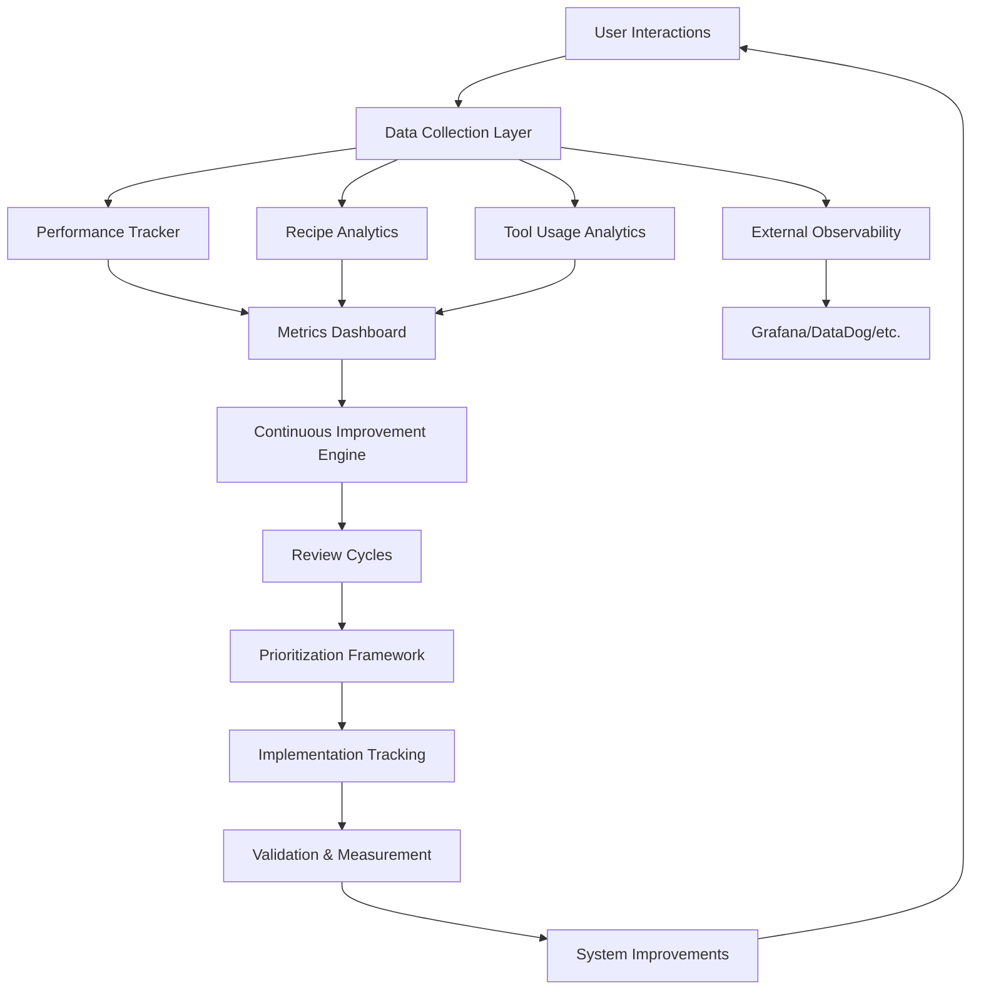

# Dev-Agency Feedback System

---
title: Dev-Agency Feedback System
description: Comprehensive feedback loops and continuous improvement system for Dev-Agency
type: documentation
category: feedback
tags: [feedback, improvement, analytics, user-guide]
created: 2025-08-10
updated: 2025-08-10
---

## Overview

The Dev-Agency Feedback System is a comprehensive framework for collecting, analyzing, and acting on performance data, user feedback, and system insights to drive continuous improvement of the entire Dev-Agency ecosystem.

## System Architecture



## Core Components

### 1. Performance Tracking System
- **Purpose**: Comprehensive performance metrics collection and analysis
- **Location**: [`performance_tracker.md`](./performance_tracker.md)
- **Key Features**:
  - Agent performance metrics (success rate, duration, token usage)
  - Quality assessment framework
  - Bottleneck identification
  - Performance optimization recommendations

### 2. Recipe Analytics System
- **Purpose**: Recipe effectiveness tracking and optimization
- **Location**: [`recipe_analytics.md`](./recipe_analytics.md)
- **Key Features**:
  - Recipe execution success rates
  - Time savings validation
  - Success factor analysis
  - Recipe recommendation engine

### 3. Tool Usage Analytics
- **Purpose**: Tool adoption and usage pattern analysis
- **Location**: [`tool_usage_analytics.md`](./tool_usage_analytics.md)
- **Key Features**:
  - Command usage patterns
  - Feature adoption analytics
  - User workflow efficiency
  - Usage optimization recommendations

### 4. Continuous Improvement System
- **Purpose**: Automated improvement workflow and process
- **Location**: [`continuous_improvement.md`](./continuous_improvement.md)
- **Key Features**:
  - Improvement lifecycle management
  - Automated issue detection
  - Implementation tracking
  - Validation and measurement

### 5. Metrics Dashboard Integration
- **Purpose**: External observability and monitoring integration
- **Location**: [`metrics_dashboard.md`](./metrics_dashboard.md)
- **Key Features**:
  - Prometheus/Grafana integration
  - DataDog/New Relic support
  - Custom dashboard templates
  - Automated alerting

### 6. Review Cycles Framework
- **Purpose**: Systematic review processes and prioritization
- **Location**: [`review_cycles.md`](./review_cycles.md)
- **Key Features**:
  - Multi-tier review processes
  - Data-driven prioritization
  - Decision-making frameworks
  - Governance and accountability

### 7. Command Integration
- **Purpose**: Seamless feedback collection in existing workflows
- **Location**: [`command_integration.md`](./command_integration.md)
- **Key Features**:
  - Enhanced /done and /reflect commands
  - Smart feedback triggers
  - Progressive feedback collection
  - User experience optimization

## Quick Start Guide

### For Users

#### 1. Basic Feedback Participation
```bash
# Normal workflow - feedback is automatically integrated
/agent:coder "implement user authentication"
/done  # Provides quick feedback prompt after completion
/reflect  # Enhanced with learning capture and process insights
```

#### 2. Providing Detailed Feedback
```bash
# Force detailed feedback collection
/done --detailed-feedback

# Skip feedback for urgent situations  
/done --skip-feedback
```

#### 3. Using Feedback Forms
```bash
# Fill out comprehensive feedback form periodically
# Located at: /feedback/agent_feedback_form.md
```

### For Administrators

#### 1. Monitoring System Health
```bash
# Check feedback system status
/agent-cli status --metrics

# View performance dashboard
# Access Grafana: http://localhost:3000/d/dev-agency
```

#### 2. Review Cycle Management
```bash
# Daily operational review (automated)
# Weekly tactical review (team meeting)  
# Monthly strategic review (leadership)
# Quarterly planning (stakeholder workshop)
```

#### 3. Continuous Improvement
```bash
# View improvement opportunities
/agent-cli insights --opportunities

# Track improvement implementation
/agent-cli improvements --status
```

## Feedback Collection Methods

### Automatic Collection
- **Session metrics**: Duration, commands used, files modified
- **Performance data**: Response times, success rates, error patterns
- **Usage patterns**: Feature adoption, workflow efficiency
- **Quality indicators**: Code quality, test coverage, documentation

### User-Initiated Feedback
- **Task completion feedback**: Satisfaction ratings, experience insights
- **Agent effectiveness**: Per-agent performance assessments
- **Feature requests**: Missing capabilities and improvement suggestions
- **Process feedback**: Workflow optimization opportunities

### Contextual Prompts
- **Smart triggers**: Based on session characteristics and performance
- **Progressive disclosure**: Basic to detailed feedback collection
- **Personalized prompts**: Adapted to user role and experience level
- **Timing optimization**: Minimal disruption to development flow

## Key Metrics & KPIs

### System Performance
- **Agent Success Rate**: Target >95%, tracks agent execution reliability
- **Average Response Time**: Target <3s, measures system responsiveness  
- **Token Efficiency**: Target >0.8, measures context optimization effectiveness
- **User Satisfaction**: Target >4.5/5, tracks overall user experience

### Recipe Effectiveness
- **Recipe Success Rate**: Target >90%, measures recipe reliability
- **Time Savings**: Target >50%, measures efficiency improvements
- **Adoption Rate**: Target >80%, tracks recipe utilization
- **User Retention**: Target >85%, measures continued usage

### Tool Usage
- **Feature Adoption**: Tracks new feature uptake rates
- **Workflow Efficiency**: Measures task completion optimization
- **Error Rate**: Target <5%, tracks tool reliability
- **User Engagement**: Measures active usage patterns

### Improvement Velocity
- **Improvements/Quarter**: Target 10+, measures improvement cadence
- **Implementation Success**: Target >80%, measures improvement effectiveness
- **User Impact**: Measures improvement adoption and satisfaction
- **Technical Quality**: Measures code quality and maintainability improvements

## Data Flow & Privacy

### Data Collection
- **Automatic**: Performance metrics, usage patterns, system events
- **Opt-in**: Detailed feedback, personal insights, suggestions
- **Anonymous**: User identification removed from sensitive data
- **Encrypted**: All data encrypted in transit and at rest

### Data Usage
- **System Improvement**: Primary purpose for all collected data
- **Performance Optimization**: Identifying bottlenecks and inefficiencies
- **User Experience**: Enhancing usability and satisfaction
- **Product Development**: Informing feature prioritization and development

### Data Retention
- **Performance Metrics**: 2 years for trend analysis
- **User Feedback**: 1 year for improvement tracking
- **Session Data**: 6 months for pattern analysis
- **Aggregated Insights**: Permanent for historical reference

## Best Practices

### For Providing Quality Feedback

#### 1. Be Specific and Actionable
```markdown
❌ "The agent was slow"
✅ "The coder agent took 45 seconds to generate a simple function, expected ~10 seconds"

❌ "Recipe didn't work"  
✅ "Step 3 of API recipe failed because it couldn't find the database config file"
```

#### 2. Include Context
```markdown
✅ "Working on React component with TypeScript, medium complexity task"
✅ "First time using this agent, junior developer experience level"
✅ "Time-sensitive bug fix, needed quick solution"
```

#### 3. Suggest Improvements
```markdown
✅ "Could the agent prompt include an example of the expected output format?"
✅ "Would be helpful if the recipe checked for prerequisites before starting"
✅ "Error message could be more specific about what went wrong"
```

### For System Administrators

#### 1. Regular Review Participation
- Attend scheduled review meetings consistently
- Come prepared with data and insights
- Focus on actionable outcomes
- Follow up on previous decisions

#### 2. Data-Driven Decision Making
- Use metrics dashboards for objective assessment
- Combine quantitative data with qualitative feedback
- Look for trends rather than isolated incidents
- Validate assumptions with data

#### 3. Continuous Improvement Culture
- Encourage feedback from all team members
- Celebrate improvements and learning
- Share success stories and lessons learned
- Maintain transparency in improvement process

## Troubleshooting

### Common Issues

#### 1. Feedback Collection Not Working
```bash
# Check system status
/agent-cli status --feedback

# Verify data collection permissions
/agent-cli config --check-permissions

# Reset feedback system
/agent-cli feedback --reset
```

#### 2. Metrics Not Updating
```bash
# Check metrics pipeline
/agent-cli metrics --pipeline-status

# Verify external integrations
/agent-cli integrations --test

# Manual metrics refresh
/agent-cli metrics --refresh
```

#### 3. Dashboard Not Loading
```bash
# Check dashboard service
/agent-cli dashboard --status

# Restart dashboard service
/agent-cli dashboard --restart

# Check logs for errors
/agent-cli logs --dashboard --recent
```

### Getting Help

#### 1. Documentation
- **System Documentation**: Located in `/feedback/` directory
- **API Documentation**: Available via `/agent-cli docs`
- **Troubleshooting Guide**: Common issues and solutions

#### 2. Support Channels
- **GitHub Issues**: For bugs and feature requests
- **Team Chat**: For quick questions and discussions
- **Review Meetings**: For strategic feedback and planning

#### 3. Community Resources
- **Best Practices**: Shared experiences and recommendations
- **Use Cases**: Examples of successful feedback utilization
- **Templates**: Standardized feedback forms and processes

## Advanced Usage

### Custom Analytics
```bash
# Create custom metrics
/agent-cli metrics --create-custom

# Export data for analysis
/agent-cli export --data-type=feedback --format=csv

# Custom dashboard creation
/agent-cli dashboard --create-custom
```

### Integration Development
```bash
# Add new observability platform
/agent-cli integrations --add-platform

# Create custom feedback triggers
/agent-cli feedback --add-trigger

# Develop custom improvement workflows
/agent-cli workflows --create-custom
```

### Automation Configuration
```bash
# Configure automated reviews
/agent-cli reviews --configure-automation

# Set up improvement pipelines
/agent-cli improvements --configure-pipeline

# Automated alerting setup
/agent-cli alerts --configure-rules
```

## Roadmap & Future Enhancements

### Short Term (Next 3 months)
- Enhanced machine learning for feedback analysis
- Real-time improvement recommendation engine
- Advanced user segmentation and personalization
- Expanded external platform integrations

### Medium Term (3-6 months)
- Predictive performance modeling
- Automated A/B testing for improvements
- Advanced workflow optimization
- Community feedback aggregation

### Long Term (6+ months)
- AI-powered continuous improvement
- Self-optimizing system architecture
- Advanced predictive analytics
- Industry benchmarking and comparison

## Contributing

### Feedback System Improvements
1. **Issue Identification**: Use GitHub issues for bugs and enhancements
2. **Feature Proposals**: Submit RFC for major feature additions
3. **Code Contributions**: Follow standard Dev-Agency contribution guidelines
4. **Documentation**: Help improve and maintain documentation

### Community Participation
1. **Share Experiences**: Contribute success stories and lessons learned
2. **Best Practices**: Help develop and refine best practices
3. **Testing**: Participate in beta testing of new features
4. **Feedback**: Provide feedback on the feedback system itself

---

## Implementation Status

Current implementation status of AGENT-005 components:

- ✅ **Performance Tracker System**: Framework designed and documented
- ✅ **Recipe Analytics System**: Comprehensive analytics framework created
- ✅ **Tool Usage Analytics**: Usage pattern analysis system designed
- ✅ **Continuous Improvement System**: Improvement workflow framework established
- ✅ **Metrics Dashboard Integration**: External observability integration designed
- ✅ **Review Cycles Framework**: Systematic review processes documented
- ✅ **Command Integration**: Feedback collection integration specification created
- ✅ **Documentation & User Guides**: Comprehensive documentation completed

### Next Implementation Steps

1. **Core Infrastructure**: Build data collection and storage infrastructure
2. **Command Enhancement**: Implement enhanced /done and /reflect commands
3. **Analytics Engine**: Build performance and usage analytics processing
4. **Dashboard Creation**: Implement metrics dashboards and visualizations
5. **Review Automation**: Automate review processes and workflows
6. **Integration Testing**: Test all system integrations and data flows
7. **User Training**: Create training materials and onboard team members
8. **Production Deployment**: Deploy to production with monitoring and alerting

---

*Dev-Agency Feedback System - Comprehensive continuous improvement framework for enterprise-grade agentic development.*