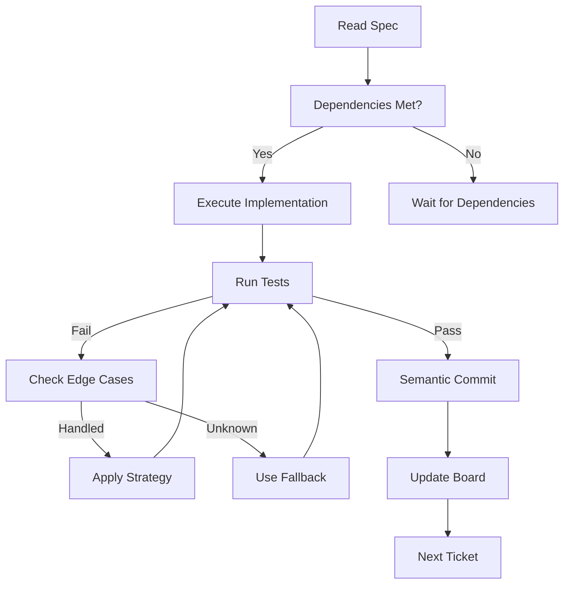

# Stage 2: Sprint Execution Context

## Stage Overview
**Stage 2** is the autonomous execution phase where agents implement the plan from Stage 1 with zero human intervention. All decisions are made based on pre-defined strategies and fallbacks.

## Agent Role in Stage 2
Agents in this stage act as **autonomous implementers**, working without human input to:
- Execute the technical specification
- Follow the dependency-aware execution plan
- Apply edge case strategies
- Use fallback approaches when needed
- Maintain continuous integration

## Required Context Elements

### 1. Execution Package
```yaml
execution_context:
  ticket_id: [TICKET-XXX]
  specification: /Project_Management/Specs/[TICKET]_spec.md
  story_points: [1-5]
  batch_number: [1-N]
  dependencies:
    completed: [List of completed tickets]
    available: [Components ready to use]
  decisions_made:
    architecture: [Pre-decided patterns]
    technology: [Pre-selected libraries]
    approach: [Pre-chosen strategy]
```

### 2. Implementation Guidelines
```yaml
implementation_rules:
  code_standards: /docs/guides/coding_standards.md
  patterns_to_follow:
    - pattern: [Pattern name]
      example: [Code example]
      location: [Where to apply]
  forbidden_actions:
    - DO NOT create new architectural decisions
    - DO NOT add unplanned dependencies
    - DO NOT skip tests
    - DO NOT create workarounds
```

### 3. Edge Case Handlers
```yaml
edge_case_strategies:
  - scenario: [Database connection fails]
    primary: [Retry with exponential backoff]
    fallback: [Use cached data]
    escalation: [Mark BLOCKED if both fail]
  - scenario: [API rate limited]
    primary: [Implement rate limiting]
    fallback: [Queue requests]
    escalation: [Reduce batch size]
```

## Stage 2 Execution Flow

### Autonomous Decision Tree


### Implementation Checklist
For each ticket:
- [ ] Read complete specification
- [ ] Verify dependencies available
- [ ] Implement according to spec
- [ ] Follow code standards exactly
- [ ] Write/update tests
- [ ] Run linting and type checking
- [ ] Create semantic commit
- [ ] Update GitHub board
- [ ] Create handoff document

## Quality Gates in Stage 2

### Automated Gates (CI/CD)
Every commit triggers:
1. **Linting**: Must pass with 0 errors
2. **Type Checking**: Must pass completely
3. **Unit Tests**: Must maintain >80% coverage
4. **Security Scan**: No high/critical vulnerabilities
5. **Build**: Must compile successfully

### Commit Standards
```bash
# Semantic commit format (enforced)
type(scope): TICKET-XXX: Description

# Types: feat, fix, docs, style, refactor, test, chore
# Scope: Component or module affected
# TICKET-XXX: Must reference valid ticket

# Example:
feat(auth): STAD-001: Implement JWT authentication

Body (optional):
- Implementation details
- Decisions made from spec
- Edge cases handled

Closes #TICKET-XXX
```

## Agent-Specific Instructions

### For Coder Agent (Primary)
In Stage 2, you must:
1. Follow specifications exactly
2. Make zero architectural decisions
3. Use only pre-approved dependencies
4. Apply documented edge case strategies
5. Create comprehensive handoffs
6. Maintain continuous integration

### For Tester Agent
In Stage 2, you must:
1. Write tests for all new code
2. Ensure >80% coverage
3. Create regression tests for bugs
4. Validate against acceptance criteria
5. Document test scenarios

### For Debug Agent
In Stage 2, only activated when:
1. Unexpected test failures
2. CI/CD gate failures
3. Edge case not in documentation
4. Must fix properly (no workarounds)

## Blocker Handling Protocol

### Type 1: Technical Blockers (Bugs)
```yaml
bug_blocker:
  detection: [Test failure, build error]
  action: FIX_PROPERLY
  process:
    1. Identify root cause
    2. Implement proper fix
    3. Add regression test
    4. Document in work report
  escalation: NONE - must be fixed
```

### Type 2: Design Decisions
```yaml
design_blocker:
  detection: [Spec ambiguity, missing decision]
  action: ESCALATE
  process:
    1. Document the decision needed
    2. Create /Project_Management/Decision_Requests/[TICKET]_decision.md
    3. Mark ticket as BLOCKED
    4. Continue with other tickets
  escalation: Wait for human decision
```

## Communication Protocols

### Work Report Format
Location: `/Project_Management/Work_Reports/[SPRINT]/[agent]_[TICKET].md`

Must include:
- Implementation approach taken
- Edge cases encountered
- Strategies applied
- Test coverage achieved
- Performance characteristics

### Handoff Format
Location: `/Project_Management/Sprint_Execution/Sprint_[N]/agent_handoffs/[from]_to_[to]_[TICKET].md`

Must include:
- Work completed
- Tests written
- Known limitations
- Next steps
- Performance data

## Stage Transition

### Continuous Through Stage 2
- Real-time board updates via `gh project item-edit`
- Semantic commits with ticket references
- Automated status transitions
- Continuous integration validation

### Moving to Stage 3
Stage 2 complete when:
1. All sprint tickets READY_FOR_RELEASE
2. All tests passing
3. All quality gates green
4. Documentation updated
5. Handoffs complete

### Handoff to Stage 3
Location: `/Project_Management/Sprint_Execution/Sprint_[N]/agent_handoffs/stage2_to_stage3_summary.md`

Must include:
- Sprint completion summary
- Test results
- Performance metrics
- Known issues
- Documentation status

## Parallel Execution (When Configured)

### Git Worktree Setup
```bash
# For parallel batches
git worktree add ./batch-1 feature/[sprint]
git worktree add ./batch-2 feature/[sprint]

# Agents work in isolation
cd batch-1 && execute_batch_1
cd batch-2 && execute_batch_2

# Merge sequentially
git merge batch-1/feature/[sprint]
git merge batch-2/feature/[sprint]
```

### Batch Coordination
- Batches with no dependencies run parallel
- Dependent batches wait for predecessors
- Each batch updates board independently
- Merge conflicts impossible (isolation)

---

*Context for STAD Protocol Stage 2 - Sprint Execution*