# Stage 3: Sprint Validation Context

## Stage Overview
**Stage 3** is the validation phase where the completed sprint undergoes comprehensive quality assurance and human review. This is the critical quality gate before release.

## Agent Role in Stage 3
Agents in this stage act as **quality validators** and **issue resolvers**, ensuring:
- All acceptance criteria are met
- Quality gates pass
- Performance benchmarks achieved
- Functional validation complete
- Issues properly resolved

## Required Context Elements

### 1. Validation Package
```yaml
validation_context:
  sprint_id: [Sprint N]
  feature: [Feature name]
  tickets_completed: [List of TICKET-XXX]
  stage_2_summary:
    duration: [Time taken]
    commits: [Number of commits]
    tests_added: [Test count]
    coverage: [Coverage percentage]
  acceptance_criteria:
    - criterion: [...]
      status: [MET|NOT_MET|PARTIAL]
      evidence: [How verified]
```

### 2. Quality Requirements
```yaml
quality_gates:
  mandatory:
    code_coverage: ">80%"
    test_pass_rate: "100%"
    linting_errors: 0
    security_vulnerabilities: "0 critical, 0 high"
    performance: "<200ms response time"
  optional:
    documentation_coverage: ">90%"
    accessibility_score: ">85"
    browser_compatibility: ["Chrome", "Firefox", "Safari", "Edge"]
```

### 3. Review Dashboard
```yaml
review_dashboard:
  staging_url: [URL if available]
  metrics:
    tickets_completed: [X/Y]
    story_points: [Completed/Planned]
    token_usage: [Actual vs estimate]
    execution_time: [Hours]
  automated_checks:
    linting: [PASS|FAIL]
    unit_tests: [X/Y passing]
    integration_tests: [X/Y passing]
    security_scan: [Results]
    performance: [Benchmark results]
  manual_checklist:
    - [ ] [User-facing feature 1]
    - [ ] [User-facing feature 2]
    - [ ] [Edge case handling]
```

## Stage 3 Validation Flow

### Validation Process

```mermaid
graph TD
    Start[Stage 2 Complete] --> Auto[Automated Validation]
    Auto --> BackendQA[Backend QA Agent]
    BackendQA -->|Pass| Review[Create Review Issue]
    BackendQA -->|Fail| Debug[Debug Agent]
    Debug --> Fix[Apply Fix]
    Fix --> Auto
    Review --> Human[Human Review]
    Human -->|Approve| Stage4[To Stage 4]
    Human -->|Bug| DebugLoop[Bug Report → Debug Agent]
    Human -->|Revise| Architect[Back to Architect]
    DebugLoop --> Fix
```


### Backend QA Checklist
- [ ] All acceptance criteria validated
- [ ] Regression tests passing
- [ ] Integration tests complete
- [ ] Performance within thresholds
- [ ] Security scan clean
- [ ] API contracts verified
- [ ] Database integrity maintained
- [ ] Cross-ticket dependencies working

### Human Review Checklist
- [ ] UI/UX meets requirements
- [ ] User workflows functional
- [ ] Edge cases handled gracefully
- [ ] Performance acceptable
- [ ] No visual regressions
- [ ] Accessibility standards met
- [ ] Mobile responsive (if applicable)

## Quality Gate Enforcement

### Automated Gates
```yaml
automated_validation:
  code_quality:
    linting:
      command: "npm run lint"
      success_criteria: "0 errors, 0 warnings"
    type_checking:
      command: "npm run typecheck"
      success_criteria: "No type errors"
    
  testing:
    unit_tests:
      command: "npm test"
      success_criteria: "All tests passing"
    coverage:
      command: "npm run test:coverage"
      success_criteria: ">80% coverage"
    
  security:
    vulnerability_scan:
      command: "npm audit"
      success_criteria: "0 high, 0 critical"
    
  performance:
    benchmarks:
      command: "npm run benchmark"
      success_criteria: "All benchmarks within limits"
```

### Manual Validation Points
```yaml
manual_validation:
  functional:
    - Feature works as specified
    - User can complete primary workflows
    - Error states handled appropriately
    - Data persists correctly
  
  visual:
    - UI matches design/requirements
    - Responsive on different screens
    - Animations/transitions smooth
    - No visual glitches
  
  usability:
    - Intuitive user experience
    - Clear error messages
    - Helpful loading states
    - Keyboard navigation works
```

## Issue Resolution Protocols

### Bug Detection & Resolution
```yaml
bug_handling:
  detection:
    source: [Automated test|Manual review|Performance monitoring]
    severity: [Critical|High|Medium|Low]
  
  resolution:
    critical:
      action: Immediate Debug Agent activation
      sla: Fix within 2 hours
      process:
        1. Run git bisect to find cause
        2. Debug Agent creates fix
        3. Regression test added
        4. Re-run validation
    
    high:
      action: Debug Agent in current session
      sla: Fix within 4 hours
    
    medium:
      action: Document for next sprint
      sla: Can defer if documented
```

### Revision Requests
```yaml
revision_handling:
  trigger: Human requests design/approach change
  action: Return to Architect Agent
  process:
    1. Document revision requirements
    2. Architect updates specification
    3. Update execution plan
    4. Return to Stage 2 for implementation
  tracking: New ticket created for revision
```

## Agent-Specific Instructions

### For Backend QA Agent (Primary)
In Stage 3, you must:
1. Run comprehensive validation suite
2. Verify all acceptance criteria
3. Execute regression tests
4. Check cross-ticket integration
5. Generate validation report
6. Make GO/NO-GO recommendation

### For Debug Agent
In Stage 3, activated when:
1. Validation failures detected
2. Human reports bugs
3. Performance issues found
Must:
1. Use git bisect for root cause
2. Fix properly (no workarounds)
3. Add regression tests
4. Document resolution

### For Scrum Master Agent
In Stage 3, monitor:
1. Validation progress
2. Issue resolution time
3. Quality gate status
4. Human review feedback
5. Stage transition readiness

## Communication Protocols

### Validation Report Format
Location: `/Project_Management/Validation_Reports/[SPRINT]_validation.md`

Must include:
- Test results summary
- Quality gate status
- Issues found and resolved
- Performance metrics
- Security scan results
- Recommendation (READY/NOT READY)

### Review Issue Template
```markdown
# Review Required: [Feature Name]

## 📊 Sprint Metrics
- Tickets: [X/Y] complete
- Story Points: [N]
- Execution Time: [X hours]
- Token Usage: [Y]

## ✅ Automated Validation
- Linting: PASS ✓
- Tests: [X/X] PASS ✓
- Coverage: [N%] ✓
- Security: Clean ✓
- Performance: Within limits ✓

## 🔍 Manual Review Needed
Please test the following on [staging URL]:
- [ ] [Feature 1]
- [ ] [Feature 2]
- [ ] [Workflow 1]
- [ ] [Edge case 1]

## 📝 How to Respond
- `/approve` - Feature ready for release
- `/bug [description]` - Report an issue
- `/revise [feedback]` - Request changes

## 🔗 Links
- [Staging Environment]
- [Test Results]
- [Documentation]
```

## Stage Transition

### Quality Gate Passage
Stage 3 complete when:
1. All automated gates PASS
2. Backend QA approval received
3. Human review completed
4. All bugs resolved
5. Documentation current

### Moving to Stage 4
Triggered by `/approve` command:
1. Validation report finalized
2. All tickets marked READY_FOR_RELEASE
3. Merge to main approved
4. Release notes prepared

### Handoff to Stage 4
Location: `/Project_Management/Sprint_Execution/Sprint_[N]/agent_handoffs/stage3_to_stage4_sprint_[N].md`

Must include:
- Validation summary
- Issues resolved
- Performance characteristics
- Security status
- Release readiness

## Rollback Procedures

### When Validation Fails
```bash
# If critical issues found
git tag failed-validation-[sprint]-[date]
git checkout main
git branch -D feature/[sprint]
git worktree prune

# Document failure
echo "Validation failed due to: [reasons]" > \
  /Project_Management/Failed_Validations/[SPRINT].md

# Return to Stage 1 for replanning
```

---

*Context for STAD Protocol Stage 3 - Sprint Validation*