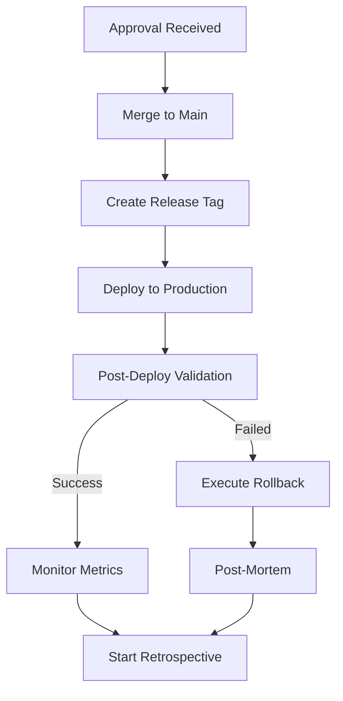

# Stage 4: Release & Retrospective Context

## Stage Overview
**Stage 4** is the final phase where validated features are released to production and the team captures learnings for continuous improvement. This stage combines deployment with systematic reflection.

## Agent Role in Stage 4
Agents in this stage act as **deployment coordinators** and **learning facilitators**, managing:
- Safe production deployment
- Performance monitoring
- Knowledge capture
- Process improvement
- Sprint closure

## Required Context Elements

### 1. Release Package
```yaml
release_context:
  sprint_id: [Sprint N]
  feature: [Feature name]
  validation_status: APPROVED
  approval:
    approved_by: [User/Role]
    approved_at: [Timestamp]
    conditions: [Any conditions]
  deployment:
    target: [production|staging]
    strategy: [blue-green|canary|direct]
    rollback_plan: [Defined strategy]
```

### 2. Sprint Summary
```yaml
sprint_metrics:
  planning:
    planned_points: [Original estimate]
    actual_points: [Completed]
    velocity: [Points/time]
  execution:
    start_date: [Date]
    end_date: [Date]
    duration: [Days]
    interruptions: [Count and reasons]
  quality:
    bugs_found: [Count by severity]
    bugs_fixed: [Count]
    test_coverage: [Percentage]
    code_quality: [Metrics]
  efficiency:
    token_usage: [Actual vs estimate]
    agent_invocations: [Count by type]
    automation_rate: [Percentage]
```

### 3. Learning Objectives
```yaml
retrospective_focus:
  analyze:
    - velocity_accuracy
    - estimation_quality
    - blocker_patterns
    - automation_effectiveness
  capture:
    - successful_patterns
    - failure_modes
    - improvement_opportunities
    - reusable_solutions
  improve:
    - process_refinements
    - template_updates
    - automation_additions
    - documentation_gaps
```

## Stage 4 Execution Flow

### Release Process


### Deployment Checklist
- [ ] Feature branch merged to main
- [ ] Release tag created (v[X.Y.Z])
- [ ] Deployment scripts executed
- [ ] Health checks passing
- [ ] Performance benchmarks met
- [ ] Monitoring alerts configured
- [ ] Rollback tested and ready
- [ ] Stakeholders notified

### Retrospective Components
- [ ] Metrics analysis complete
- [ ] Velocity calculated
- [ ] Success patterns identified
- [ ] Improvement areas documented
- [ ] Action items created
- [ ] Knowledge graph updated
- [ ] Templates refined
- [ ] Lessons captured

## Deployment Protocols

### Safe Deployment Process
```bash
#!/bin/bash
# Stage 4 Deployment Script

# Pre-deployment checks
echo "🔍 Running pre-deployment validation..."
npm run test:production
npm run security:scan

# Create release tag
VERSION=$(npm version patch)
git tag -a "$VERSION" -m "Release: [Feature Name]"
git push origin "$VERSION"

# Deploy with validation
echo "🚀 Deploying to production..."
npm run deploy:production

# Post-deployment validation
echo "✅ Validating deployment..."
curl -f https://api.prod.com/health || {
  echo "❌ Health check failed - initiating rollback"
  npm run rollback:production
  exit 1
}

# Performance validation
RESPONSE_TIME=$(curl -w "%{time_total}" -o /dev/null -s https://api.prod.com)
if (( $(echo "$RESPONSE_TIME > 0.2" | bc -l) )); then
  echo "⚠️ Performance degradation detected"
  # Alert but don't rollback
fi

echo "✅ Deployment successful"
```

### Rollback Procedures
```yaml
rollback_strategy:
  detection:
    - Health check failures
    - Performance degradation >50%
    - Error rate >5%
    - Customer reports
  
  automatic_triggers:
    - 5xx errors >10/minute
    - Response time >1 second
    - Memory usage >90%
  
  process:
    1. Revert to previous version
    2. Verify rollback successful
    3. Create incident report
    4. Notify stakeholders
    5. Schedule post-mortem
```

## Retrospective Analysis

### Metrics Collection
```yaml
metrics_to_analyze:
  velocity:
    planned_vs_actual: [Compare story points]
    trend: [Calculate over last 3 sprints]
    accuracy: [Estimation precision]
  
  quality:
    defect_rate: [Bugs per story point]
    test_coverage_trend: [Coverage over time]
    code_review_findings: [Issues found in review]
  
  efficiency:
    cycle_time: [Ticket start to done]
    blocking_time: [Time spent blocked]
    rework_rate: [Tickets requiring fixes]
  
  automation:
    manual_interventions: [Count and reasons]
    automation_failures: [What broke and why]
    token_efficiency: [Usage optimization]
```

### Pattern Recognition
```yaml
patterns_to_identify:
  successful:
    - What enabled smooth execution?
    - Which strategies worked well?
    - What should we repeat?
  
  problematic:
    - What caused delays?
    - Where did estimates fail?
    - What created rework?
  
  improvement:
    - What could be automated?
    - What needs better documentation?
    - What requires process change?
```

### Knowledge Capture
```markdown
## Reusable Solutions Discovered

### Pattern: [Pattern Name]
**Context:** When to use this pattern
**Solution:** How to implement
**Example:** Code or process example
**Benefits:** Why this works well

### Anti-Pattern: [Anti-Pattern Name]
**Context:** Situation to avoid
**Problem:** Why this is problematic
**Alternative:** Better approach
**Prevention:** How to avoid
```

## Agent-Specific Instructions

### For Retrospective Agent (Primary)
In Stage 4, you must:
1. Analyze all sprint metrics
2. Calculate velocity accurately
3. Identify patterns (good and bad)
4. Generate improvement recommendations
5. Create actionable insights
6. Update knowledge base

### For Documenter Agent
In Stage 4, finalize:
1. Release notes
2. API documentation
3. User guides
4. Migration guides
5. Troubleshooting docs

### For Scrum Master Agent
In Stage 4, ensure:
1. All tickets closed properly
2. Sprint board archived
3. Metrics recorded
4. Retrospective scheduled
5. Next sprint prepared

## Communication Protocols

### Release Notes Format
```markdown
# Release v[X.Y.Z]: [Feature Name]

## 🎯 What's New
- [Major feature 1]
- [Major feature 2]
- [Enhancement 1]

## 🐛 Bug Fixes
- Fixed [issue description] (#TICKET)
- Resolved [issue description] (#TICKET)

## 🔧 Technical Improvements
- [Performance optimization]
- [Code refactoring]
- [Dependency updates]

## 📊 Metrics
- Story Points: [N]
- Sprint Duration: [X days]
- Test Coverage: [Y%]
- Performance: [Benchmarks]

## 📝 Documentation
- [Link to user guide]
- [Link to API docs]
- [Link to migration guide]

## 🙏 Credits
Sprint Team: [Agents involved]
```

### Retrospective Report Format
Location: `/Project_Management/Sprint Retrospectives/Sprint_[N]_Retrospective.md`

Must include:
1. Sprint metrics summary
2. Velocity analysis
3. What went well
4. What needs improvement
5. Action items for next sprint
6. Patterns discovered
7. Knowledge captured
8. Process improvements

## Stage Completion

### Sprint Closure Checklist
- [ ] Feature deployed successfully
- [ ] All tickets status = DONE
- [ ] Release notes published
- [ ] Documentation updated
- [ ] Retrospective completed
- [ ] Knowledge graph synced
- [ ] Metrics recorded
- [ ] Board archived

### Knowledge Graph Updates
```yaml
knowledge_updates:
  entities:
    - type: Feature
      name: [Feature name]
      attributes:
        sprint: [N]
        points: [X]
        duration: [Days]
  
  patterns:
    - type: Solution
      name: [Pattern name]
      context: [When to use]
      implementation: [How to]
  
  learnings:
    - type: Improvement
      description: [What we learned]
      action: [How to apply]
```

### Process Improvements
```yaml
improvement_actions:
  immediate: # Apply in next sprint
    - action: [Specific improvement]
      owner: [Agent/Role]
      impact: [Expected benefit]
  
  short_term: # Next 2-3 sprints
    - action: [Process change]
      owner: [Agent/Role]
      tracking: [How to measure]
  
  long_term: # Strategic improvements
    - action: [System enhancement]
      owner: [Team]
      timeline: [Estimate]
```

## Transition to Next Sprint

### Handoff to Stage 0
Location: `/Project_Management/Sprint_Retrospectives/Sprint_[N]_retrospective.md`

Must include:
- Velocity recommendation
- Capacity adjustments
- Process improvements
- Risk factors identified
- Success patterns to repeat

### Continuous Improvement
- Update templates with learnings
- Refine estimation models
- Enhance automation scripts
- Improve agent prompts
- Strengthen quality gates

---

*Context for STAD Protocol Stage 4 - Release & Retrospective*