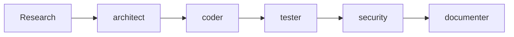

# Recipe: REST API Feature Development

## Overview
Complete workflow for developing a REST API feature using the agent system.

## Use Case
- Creating new API endpoints
- Implementing CRUD operations
- Adding authentication/authorization
- Building RESTful services

## Agent Sequence



## Step-by-Step Process

### Step 1: Research Phase
**Agent:** Main Claude  
**Actions:**
```bash
# Search for existing API patterns
Grep "router\.|app\." --type js
Grep "@Get|@Post|@Put|@Delete" --type ts

# Find middleware usage
Grep "middleware|auth|validate" --type js

# Check database models
Read /models/ or /schemas/
```

### Step 2: Architecture Design
**Agent:** `/agent:architect`  
**Context Required:**
```markdown
- API requirements and endpoints needed
- Existing API patterns from research
- Database schema
- Authentication method in use
- Expected request/response formats
- Performance requirements
```

**Expected Output:**
- Endpoint design with routes
- Request/response schemas
- Data flow diagram
- Error handling strategy

### Step 3: Implementation
**Agent:** `/agent:coder`  
**Context Required:**
```markdown
- Architecture design from architect
- Existing route examples
- Middleware patterns
- Database connection code
- Validation patterns
- Error handling patterns
```

**Expected Output:**
- Route handlers
- Middleware implementation
- Input validation
- Database queries
- Error responses

### Step 4: Testing
**Agent:** `/agent:tester`  
**Context Required:**
```markdown
- Implemented code
- API specifications
- Existing test examples
- Test framework (Jest, Mocha, etc.)
- Mock patterns used in project
```

**Expected Output:**
- Unit tests for handlers
- Integration tests for endpoints
- Mock implementations
- Edge case tests
- Error scenario tests

### Step 5: Security Review
**Agent:** `/agent:security`  
**Context Required:**
```markdown
- Complete implementation
- Authentication implementation
- Input validation code
- Database queries
- Error handling
```

**Expected Output:**
- Security vulnerability report
- Injection prevention check
- Authentication/authorization review
- Input sanitization verification
- Security fixes if needed

### Step 6: Documentation
**Agent:** `/agent:documenter`  
**Context Required:**
```markdown
- Final implementation
- API endpoint signatures
- Request/response examples
- Authentication requirements
- Error codes
```

**Expected Output:**
- API reference documentation
- Usage examples
- Authentication guide
- Error code reference
- Integration guide

## Parallel Execution Opportunities

After implementation (Step 3), run in parallel:
- `/agent:tester` - Write tests
- `/agent:security` - Security review
- `/agent:performance` - Performance analysis

## Common Context Template

```markdown
## Project Context
- Framework: [Express/Fastify/Next.js]
- Language: [JavaScript/TypeScript]
- Database: [PostgreSQL/MongoDB]
- Auth: [JWT/Session/OAuth]

## Feature Requirements
[Specific API requirements]

## Existing Patterns
[Code examples from codebase]

## Standards
[Relevant coding standards]
```

## Success Criteria
- [ ] All endpoints implemented
- [ ] Tests passing with >80% coverage
- [ ] Security review passed
- [ ] API documented
- [ ] Performance acceptable
- [ ] Follows existing patterns

## Time Estimates
- Research: 15-30 minutes
- Architecture: 20-30 minutes
- Implementation: 45-90 minutes
- Testing: 30-45 minutes
- Security Review: 15-20 minutes
- Documentation: 20-30 minutes

**Total: 2.5-4 hours**

## Tips for Success

1. **Context Quality**: Include 2-3 examples of existing APIs
2. **Parallel Work**: Run security and tests simultaneously
3. **Validation First**: Have tester write tests before implementation for TDD
4. **Reuse Patterns**: Reference existing middleware and error handlers

## Common Issues and Solutions

| Issue | Solution |
|-------|----------|
| Token limit exceeded | Focus on single endpoint at a time |
| Missing auth context | Include complete auth middleware code |
| Database query errors | Provide schema and connection examples |
| Test failures | Include mock patterns from project |

## Example Invocation

```bash
# After research phase
/agent:architect

"Design a REST API for user management with the following requirements:
- CRUD operations for users
- JWT authentication required
- Role-based access (admin, user)
- Pagination for list endpoint
- Following this pattern: [include example]"

# Then implementation
/agent:coder

"Implement the user management API based on this design: [architect output]
Using Express with TypeScript, following these patterns: [examples]"
```

## Recipe Variations

### GraphQL API
- Replace REST patterns with GraphQL schemas
- Use `/agent:architect` for resolver design
- Include GraphQL-specific testing

### Microservice API
- Add `/agent:integration` for service communication
- Include message queue patterns
- Add distributed tracing context

### WebSocket API
- Focus on event handlers
- Include connection management
- Add real-time testing patterns

---

*Recipe Version: 1.0 | Last Updated: 08-09-2025*