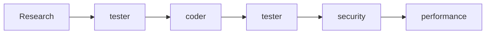

# Recipe: Bug Fix Workflow

## Overview
Systematic approach to debugging and fixing issues using the agent system.

## Use Case
- Fixing reported bugs
- Debugging test failures
- Resolving production issues
- Performance problem resolution

## Agent Sequence



## Step-by-Step Process

### Step 1: Research Phase
**Agent:** Main Claude  
**Actions:**
```bash
# Locate the problematic code
Grep "error message or function name"
Read the file with the issue

# Check related code
Grep "calls to problematic function"
Read test files for the component

# Review recent changes
git log -p path/to/file
git diff HEAD~5 path/to/file
```

### Step 2: Root Cause Analysis
**Agent:** `/agent:tester`  
**Context Required:**
```markdown
- Bug report with symptoms
- Error messages/stack traces
- Code suspected to have issue
- Current test results
- Steps to reproduce
- Expected vs actual behavior
```

**Expected Output:**
- Root cause identification
- Failing test that reproduces bug
- Analysis of why it's failing
- Impact assessment
- Fix recommendations

### Step 3: Implementation Fix
**Agent:** `/agent:coder`  
**Context Required:**
```markdown
- Root cause analysis from tester
- Current buggy implementation
- Related code that might be affected
- Existing patterns for similar fixes
- Test that should pass after fix
```

**Expected Output:**
- Bug fix implementation
- No breaking changes
- Maintains existing functionality
- Follows project patterns
- Clean, maintainable solution

### Step 4: Validation
**Agent:** `/agent:tester`  
**Context Required:**
```markdown
- Fixed implementation
- Original bug report
- All related tests
- Edge cases to verify
- Regression test requirements
```

**Expected Output:**
- Confirmation bug is fixed
- All tests passing
- New tests for the bug
- Regression test coverage
- Edge case validation

### Step 5: Security Check
**Agent:** `/agent:security`  
**Context Required:**
```markdown
- The fix implementation
- Original vulnerable code
- Security implications of bug
- Authentication/authorization code
```

**Expected Output:**
- Security impact assessment
- Verification fix doesn't introduce vulnerabilities
- Security test recommendations

### Step 6: Performance Verification
**Agent:** `/agent:performance`  
**Context Required:**
```markdown
- Fixed code
- Original performance metrics
- Critical path analysis
- Resource usage concerns
```

**Expected Output:**
- Performance impact analysis
- Verification fix doesn't degrade performance
- Optimization suggestions if applicable

## Parallel Execution Opportunities

After fix implementation (Step 3), run in parallel:
- `/agent:tester` - Validation
- `/agent:security` - Security check
- `/agent:performance` - Performance check

## Common Context Template

```markdown
## Bug Report
- Issue: [Description]
- Severity: [Critical/High/Medium/Low]
- Affected Component: [Component/Module]
- Version: [Version where bug exists]

## Symptoms
- Error Message: [Full error]
- Stack Trace: [If available]
- When It Occurs: [Conditions]

## Reproduction Steps
1. [Step 1]
2. [Step 2]
...

## Current Code
[Relevant code sections]

## Test Results
[Failing tests output]
```

## Quick Fix Patterns

### Null/Undefined Errors
```javascript
// Before (buggy)
const value = obj.property.nested;

// After (fixed)
const value = obj?.property?.nested;
// OR
const value = obj && obj.property && obj.property.nested;
```

### Off-by-One Errors
```javascript
// Before (buggy)
for (let i = 0; i <= array.length; i++)

// After (fixed)
for (let i = 0; i < array.length; i++)
```

### Race Conditions
```javascript
// Before (buggy)
let result;
asyncOperation().then(r => result = r);
return result; // undefined

// After (fixed)
const result = await asyncOperation();
return result;
```

## Success Criteria
- [ ] Bug reproduced with test
- [ ] Root cause identified
- [ ] Fix implemented
- [ ] Original issue resolved
- [ ] No regressions introduced
- [ ] Tests passing
- [ ] Security verified
- [ ] Performance acceptable

## Time Estimates
- Research: 15-30 minutes
- Root Cause Analysis: 20-40 minutes
- Fix Implementation: 20-60 minutes
- Validation: 15-25 minutes
- Security Check: 10-15 minutes
- Performance Check: 10-15 minutes

**Total: 1.5-3 hours**

## Debugging Strategies

### 1. Binary Search
- Comment out half the code
- Identify which half has the bug
- Repeat until isolated

### 2. State Inspection
- Log state before and after
- Identify where state becomes incorrect
- Track data flow

### 3. Test Isolation
- Write minimal test case
- Remove dependencies
- Focus on core issue

## Common Issues and Solutions

| Issue | Solution |
|-------|----------|
| Can't reproduce bug | Get more detailed steps from reporter |
| Fix breaks other tests | Understand dependencies before fixing |
| Root cause unclear | Add more logging, use debugger |
| Performance regression | Profile before and after fix |

## Bug Categories and Approaches

### Logic Errors
- Focus on algorithm correctness
- Verify edge cases
- Check boundary conditions

### Integration Issues
- Check API contracts
- Verify data formats
- Test error handling

### Concurrency Bugs
- Look for race conditions
- Check lock/unlock patterns
- Verify async operations

### Memory Issues
- Check for leaks
- Verify cleanup code
- Monitor resource usage

## Post-Fix Checklist
- [ ] Bug fix committed with clear message
- [ ] Test added to prevent regression
- [ ] Documentation updated if needed
- [ ] Related bugs checked
- [ ] Performance impact assessed
- [ ] Security implications reviewed
- [ ] Code review completed

---

*Recipe Version: 1.0 | Last Updated: 08-09-2025*