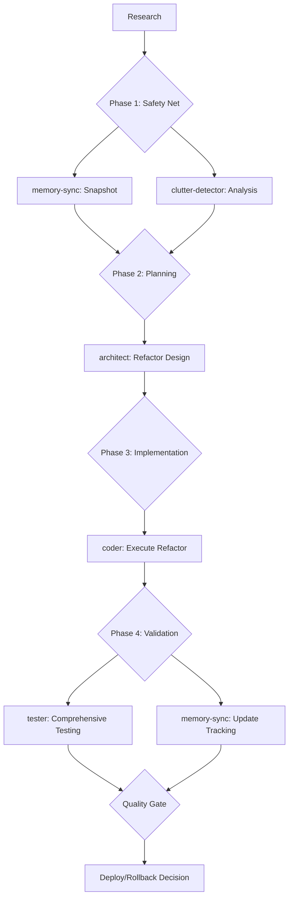

# Recipe: Complex Refactoring Workflow

## Overview
Large-scale code reorganization workflow that prioritizes safety, maintainability, and backward compatibility while implementing anti-clutter principles and comprehensive rollback strategies.

## Use Case
- Breaking monolithic services into modules
- Large-scale code reorganization
- Architecture modernization
- Technical debt elimination
- Code quality improvements
- Legacy system modernization

## Agent Sequence with Parallel Execution



## Step-by-Step Process

### Step 0: Pre-Refactoring Research
**Agent:** Main Claude  
**Purpose:** Understand current architecture and identify refactoring scope  
**Actions:**
```bash
# Map current architecture
Glob "**/*.py" "**/*.ts" "**/*.js" "**/*.go"
Grep "import|require|from" --type py,ts,js
Grep "class|function|def|interface" --type py,ts,js

# Identify coupling points
Grep "global|singleton|static" --type py,ts,js
Grep "config|settings|constants" --type py,ts,js

# Find test coverage
Grep "test_|_test|spec\." --type py,ts,js
Glob "**/test/**" "**/tests/**" "**/__tests__/**"

# Document dependencies
Read package.json requirements.txt go.mod
```

**Success Criteria:**
- [ ] Architecture map complete
- [ ] Dependency graph understood
- [ ] Test coverage identified
- [ ] Risk areas flagged

---

### Phase 1: Safety Net Creation (Parallel)

#### Step 1A: Memory Snapshot
**Agent:** `/agent:memory-sync`  
**Purpose:** Create comprehensive snapshot before refactoring  
**Context Required:**
```markdown
## Refactoring Scope
- Target modules: [list specific modules/files]
- Affected dependencies: [external and internal]
- Test files to track: [test file patterns]

## Snapshot Requirements
- Full codebase state capture
- Dependency relationship mapping
- Test coverage baseline
- Performance baseline metrics

## Project Structure
[Current project tree]

## Critical Files
[List of files that must be tracked]
```

**Expected Output:**
- Complete codebase snapshot in knowledge graph
- Dependency relationship map
- Test coverage baseline
- Performance metrics baseline
- Rollback preparation checklist

#### Step 1B: Clutter Detection
**Agent:** `/agent:clutter-detector`  
**Purpose:** Identify redundancy and technical debt  
**Context Required:**
```markdown
## Analysis Scope
- Target codebase: [specific directories]
- Code patterns to detect: [duplicates, dead code, etc.]
- Architecture smells: [tight coupling, large classes, etc.]

## Current Standards
[Coding standards and patterns]

## Refactoring Goals
- Eliminate redundancy
- Improve modularity  
- Reduce coupling
- Enhance testability
```

**Expected Output:**
- Duplicate code analysis
- Dead code identification
- Architecture smell report
- Refactoring opportunity prioritization
- Technical debt assessment

---

### Phase 2: Architecture Planning

#### Step 2: Refactoring Design
**Agent:** `/agent:architect`  
**Purpose:** Design safe refactoring approach with rollback strategy  
**Context Required:**
```markdown
## Current Architecture Analysis
[Results from memory-sync snapshot]

## Clutter Detection Results
[Results from clutter-detector]

## Refactoring Requirements
- Target architecture: [modular design goals]
- Backward compatibility needs: [API compatibility requirements]
- Performance constraints: [acceptable degradation limits]
- Migration timeline: [phased approach requirements]

## Safety Requirements
- Zero downtime deployment capability
- Feature flag integration points
- Rollback trigger conditions
- Monitoring checkpoints

## Example: Monolith to Modules
Current State: Single service handling [user management, billing, notifications]
Target State: Separate modules with clean interfaces

## Existing Patterns
[Code examples of current implementation]
```

**Expected Output:**
- Detailed refactoring plan with phases
- Module boundary definitions
- Interface design specifications
- Migration strategy with rollback points
- Risk assessment and mitigation plan
- Backward compatibility strategy
- Testing approach for each phase

---

### Phase 3: Safe Implementation

#### Step 3: Execute Refactoring
**Agent:** `/agent:coder`  
**Purpose:** Implement refactoring with safety measures  
**Context Required:**
```markdown
## Refactoring Plan
[Complete architect output]

## Safety Measures Required
- Feature flags for new modules
- Adapter patterns for compatibility
- Gradual cutover mechanisms
- Monitoring integration points

## Implementation Standards
[Coding standards from Dev-Agency]

## Existing Patterns
[Code examples for new architecture style]

## Testing Requirements
- Maintain all existing tests
- Add integration tests for new boundaries
- Performance regression tests
- Backward compatibility tests
```

**Expected Output:**
- New modular architecture implementation
- Feature flag integration
- Backward compatibility adapters
- Migration utilities
- Comprehensive logging and monitoring
- Updated documentation

---

### Phase 4: Validation and Tracking (Parallel)

#### Step 4A: Comprehensive Testing
**Agent:** `/agent:tester`  
**Purpose:** Ensure refactoring maintains functionality and improves quality  
**Context Required:**
```markdown
## Implementation Details
[Complete coder output]

## Testing Requirements
- All existing functionality preserved
- New module boundaries validated
- Performance impact assessed
- Backward compatibility verified
- Error handling improved

## Test Infrastructure
[Existing test framework and patterns]

## Success Metrics
- Test coverage maintained/improved
- Performance within acceptable bounds
- No regression in functionality
- Improved code quality metrics
```

**Expected Output:**
- Comprehensive test suite for new architecture
- Performance regression tests
- Backward compatibility test suite
- Integration tests for module boundaries
- Automated refactoring verification tests
- Quality metrics comparison report

#### Step 4B: Memory Sync Update
**Agent:** `/agent:memory-sync`  
**Purpose:** Update knowledge graph with refactored codebase state  
**Context Required:**
```markdown
## Refactoring Changes
[Summary of all changes made]

## New Architecture
[Module structure and relationships]

## Files Modified/Created
[Complete list of changes]

## Testing Results
[Test results from tester agent]

## Quality Improvements
[Metrics comparison before/after]
```

**Expected Output:**
- Updated codebase snapshot in knowledge graph
- Change impact analysis
- Quality improvement metrics
- Rollback decision support data
- Migration completion verification

---

## Rollback Strategy

### Rollback Triggers
- Performance degradation > 20%
- Test failure rate > 5%
- Production errors increase
- User experience degradation
- Unexpected behavior in critical paths

### Rollback Process
1. **Immediate:** Feature flag disable
2. **Short-term:** Revert to adapter pattern
3. **Complete:** Git revert with knowledge graph restore

### Rollback Validation
- Functionality verification tests
- Performance baseline restoration
- User experience validation
- Monitor error rates

## Example Implementation: Monolithic Service Refactoring

### Current State Analysis
```python
# monolithic_service.py - Before refactoring
class UserService:
    def create_user(self, data): pass
    def send_notification(self, user_id): pass  
    def process_billing(self, user_id): pass
    def generate_reports(self): pass
    # 2000+ lines of mixed concerns
```

### Target Architecture
```python
# user_module.py
class UserService:
    def create_user(self, data): 
        user = self._create_user_record(data)
        NotificationModule.notify_user_created(user.id)
        BillingModule.setup_billing(user.id)
        return user

# notification_module.py  
class NotificationModule:
    @staticmethod
    def notify_user_created(user_id): pass

# billing_module.py
class BillingModule:
    @staticmethod  
    def setup_billing(user_id): pass

# reports_module.py
class ReportsModule:
    def generate_user_reports(self): pass
```

### Migration Strategy
1. **Phase 1:** Extract notification logic with backward compatibility
2. **Phase 2:** Extract billing logic with adapters  
3. **Phase 3:** Extract reporting with feature flags
4. **Phase 4:** Remove adapters and legacy interfaces

## Parallel Execution Strategy

### Phase 1 Parallel (Safety Net)
```bash
# Run simultaneously 
/agent:memory-sync "Create comprehensive snapshot..."
/agent:clutter-detector "Analyze architecture for refactoring opportunities..."
```

### Phase 4 Parallel (Validation)
```bash
# Run simultaneously
/agent:tester "Validate refactored architecture..."
/agent:memory-sync "Update knowledge graph with changes..."
```

## Success Criteria

### Technical Quality
- [ ] Code complexity reduced by 30%+
- [ ] Module coupling reduced
- [ ] Test coverage maintained/improved
- [ ] Performance impact < 10%
- [ ] Zero functional regressions

### Architecture Quality  
- [ ] Clear module boundaries
- [ ] Single responsibility principle
- [ ] Dependency injection implemented
- [ ] Interface segregation applied
- [ ] Open/closed principle followed

### Safety Measures
- [ ] Rollback strategy tested
- [ ] Feature flags operational
- [ ] Monitoring in place
- [ ] Error handling improved
- [ ] Backward compatibility verified

### Anti-Clutter Compliance
- [ ] Dead code removed
- [ ] Duplicate code eliminated
- [ ] Single source of truth maintained
- [ ] Technical debt reduced
- [ ] Documentation consolidated

## Time Estimates

- **Research:** 30-45 minutes
- **Phase 1 (Parallel):** 45-60 minutes
- **Phase 2 (Architecture):** 60-90 minutes  
- **Phase 3 (Implementation):** 2-4 hours
- **Phase 4 (Parallel Validation):** 45-75 minutes

**Total: 4.5-7 hours** (varies by complexity)

## Risk Mitigation

### High-Risk Areas
- Database schema changes
- External API integrations
- Authentication/authorization
- Performance-critical paths
- Third-party dependencies

### Mitigation Strategies
- Feature flags for all changes
- Gradual rollout percentages
- Comprehensive monitoring
- Automated rollback triggers
- Staged deployment approach

## Common Issues and Solutions

| Issue | Solution | Prevention |
|-------|----------|------------|
| Breaking changes | Adapter pattern + versioning | Comprehensive interface analysis |
| Performance degradation | Incremental optimization + profiling | Performance test automation |
| Test failures | Comprehensive test migration | Test coverage analysis first |
| Integration issues | Service interface validation | Integration test suite |
| Rollback complexity | Automated rollback scripts | Rollback testing |

## Recipe Variations

### Database Schema Refactoring
- Add `/agent:data-architect` for schema design
- Include migration scripts and rollback procedures
- Add data consistency validation

### Frontend Component Refactoring  
- Add `/agent:frontend-architect` for component design
- Include UI/UX consistency validation
- Add cross-browser compatibility testing

### API Refactoring
- Include API versioning strategy
- Add contract testing validation
- Include client migration guides

### Microservice Extraction
- Add `/agent:integration` for service boundaries
- Include service discovery patterns
- Add distributed system testing

## Advanced Safety Features

### Canary Deployment Integration
```bash
# Feature flag based rollout
/agent:coder "Implement feature flag integration for gradual rollout..."
```

### Automated Quality Gates
```bash  
# Quality threshold enforcement
/agent:tester "Create automated quality gates with rollback triggers..."
```

### Knowledge Graph Utilization
```bash
# Comprehensive change tracking
/agent:memory-sync "Track all refactoring changes for impact analysis..."
```

## Tips for Success

1. **Start Small:** Begin with least coupled modules
2. **Maintain Backward Compatibility:** Use adapter patterns initially  
3. **Test Continuously:** Run tests after each module extraction
4. **Monitor Everything:** Track performance and error rates
5. **Document Decisions:** Maintain architectural decision records
6. **Plan Rollbacks:** Test rollback procedures before deployment
7. **Use Feature Flags:** Enable gradual rollout and instant rollback
8. **Validate Assumptions:** Test integration points thoroughly

---

*Recipe Version: 1.0 | Last Updated: 08-09-2025*