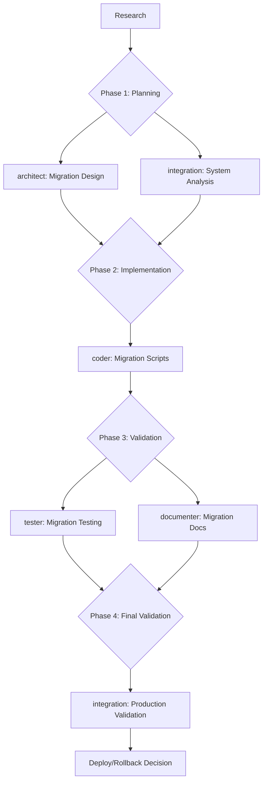

# Recipe: Database Migration Workflow

## Overview
Comprehensive database migration workflow that ensures zero-downtime deployments, data integrity preservation, and robust rollback capabilities while supporting complex scenarios like single-tenant to multi-tenant migrations.

## Use Case
- Complex schema changes requiring zero downtime
- Single-tenant to multi-tenant architecture migration
- Large-scale data transformations
- Cross-database platform migrations
- Schema version management and rollbacks
- Data integrity preservation during migration
- Performance optimization during migration

## Agent Sequence with Parallel Execution



## Step-by-Step Process

### Step 0: Pre-Migration Research
**Agent:** Main Claude  
**Purpose:** Understand current database architecture and migration requirements  
**Actions:**
```bash
# Analyze current database schema
Grep "CREATE TABLE|ALTER TABLE|INDEX" --type sql
Grep "migration|schema|version" --type py,js,ts,sql
Glob "**/migrations/**" "**/schema/**" "**/db/**"

# Identify data dependencies
Grep "foreign key|references|constraint" --type sql
Grep "join|relationship|association" --type py,js,ts

# Find existing migration patterns
Grep "migrate|migration" --type py,js,ts
Read package.json requirements.txt go.mod

# Check data volume and constraints
Grep "performance|index|query" --type sql,py,js,ts
```

**Success Criteria:**
- [ ] Current schema fully documented
- [ ] Data dependencies mapped
- [ ] Performance constraints identified
- [ ] Migration pattern established
- [ ] Data volume estimated

---

### Phase 1: Architecture Planning (Parallel)

#### Step 1A: Migration Architecture Design
**Agent:** `/agent:architect`  
**Purpose:** Design comprehensive migration strategy with zero-downtime approach  
**Context Required:**
```markdown
## Current Database Architecture
- Database type: [PostgreSQL, MySQL, MongoDB, etc.]
- Current schema version: [version number]
- Table count: [number of tables]
- Data volume: [estimated records per table]
- Peak transaction rate: [transactions per second]
- Current indexes and constraints: [list]

## Migration Requirements
- Target schema: [describe new schema design]
- Downtime tolerance: Zero downtime required
- Data integrity requirements: [ACID compliance, consistency needs]
- Performance constraints: [acceptable degradation limits]
- Rollback requirements: [instant rollback capability]

## Multi-Tenant Migration Example
Current: Single database with user_id foreign keys
Target: Tenant-isolated schema with tenant_id partitioning

## Compatibility Requirements
- Application version compatibility: [versions to support]
- Database version requirements: [minimum/maximum versions]
- Cross-platform compatibility: [if applicable]

## Risk Assessment
- Critical data paths: [user data, billing, etc.]
- High-traffic tables: [identify heavy-use tables]
- External integrations: [APIs, services affected]
```

**Expected Output:**
- Comprehensive migration strategy document
- Zero-downtime deployment plan with phases
- Schema versioning strategy
- Backward compatibility approach
- Data consistency validation plan
- Performance impact assessment
- Rollback procedures for each phase
- Risk mitigation strategies

#### Step 1B: System Integration Analysis
**Agent:** `/agent:integration`  
**Purpose:** Analyze system dependencies and integration points  
**Context Required:**
```markdown
## Current System Architecture
[Results from research phase]

## Integration Points
- Application services using database: [list services]
- External APIs accessing data: [API endpoints]
- Reporting systems: [BI tools, analytics]
- Backup and monitoring systems: [backup schedules, monitoring]

## Data Flow Analysis
- Read-heavy vs write-heavy operations: [analysis]
- Transaction patterns: [typical transaction flows]
- Concurrent access patterns: [user concurrency levels]

## Dependency Requirements
- Service availability requirements: [uptime requirements]
- Data consistency across services: [eventual vs strong consistency]
- Cross-service transaction needs: [distributed transactions]

## Migration Constraints
- Maintenance windows available: [if any]
- Traffic patterns: [peak usage times]
- Compliance requirements: [data retention, audit trails]
```

**Expected Output:**
- System dependency map
- Integration point impact analysis
- Data flow diagrams for migration phases
- Service coordination requirements
- Cross-system consistency strategy
- Performance monitoring plan
- Integration testing requirements

---

### Phase 2: Migration Script Development

#### Step 2: Migration Implementation
**Agent:** `/agent:coder`  
**Purpose:** Implement migration scripts with safety measures and rollback capabilities  
**Context Required:**
```markdown
## Migration Architecture
[Complete architect output]

## System Integration Requirements
[Complete integration output]

## Implementation Requirements
- Migration script language: [SQL, Python, etc.]
- Schema versioning approach: [semantic versioning, timestamps]
- Data transformation logic: [specific transformations needed]
- Validation procedures: [data integrity checks]

## Safety Measures Required
- Atomic migration steps with checkpoints
- Comprehensive logging and monitoring
- Data backup integration
- Real-time validation during migration
- Circuit breaker patterns for rollback

## Performance Requirements
- Batch processing for large datasets
- Index management during migration
- Connection pool optimization
- Memory usage constraints
- Progress tracking and reporting

## Example: Single-Tenant to Multi-Tenant Migration
Current Schema:
```sql
CREATE TABLE users (id, email, name, created_at);
CREATE TABLE orders (id, user_id, amount, status);
```

Target Schema:
```sql  
CREATE TABLE tenants (id, name, subdomain, created_at);
CREATE TABLE users (id, tenant_id, email, name, created_at);
CREATE TABLE orders (id, tenant_id, user_id, amount, status);
```

## Existing Code Patterns
[Current database access patterns and ORM usage]
```

**Expected Output:**
- Complete migration script suite with versioning
- Zero-downtime migration procedures
- Data transformation and validation scripts
- Comprehensive logging and monitoring integration
- Rollback scripts for each migration phase
- Performance optimization scripts
- Schema version management system
- Data integrity validation procedures

---

### Phase 3: Validation and Documentation (Parallel)

#### Step 3A: Migration Testing Suite
**Agent:** `/agent:tester`  
**Purpose:** Create comprehensive testing for migration safety and correctness  
**Context Required:**
```markdown
## Migration Implementation
[Complete coder output]

## Testing Requirements
- Migration script validation on test data
- Zero-downtime deployment verification
- Data integrity and consistency validation
- Performance impact testing
- Rollback procedure validation
- Cross-database compatibility testing

## Test Data Requirements
- Representative data volumes: [similar to production]
- Edge cases: [null values, constraints, etc.]
- Performance test scenarios: [concurrent access patterns]
- Failure scenarios: [network failures, partial migrations]

## Validation Criteria
- All data correctly migrated: [no data loss]
- Schema constraints preserved: [referential integrity]
- Performance within acceptable bounds: [specific metrics]
- Application compatibility: [existing code works]
- Rollback functionality: [complete and fast rollback]

## Multi-Tenant Migration Testing
- Single tenant data isolation: [no cross-tenant access]
- Tenant creation and migration: [new tenant setup]
- Performance impact per tenant: [scalability testing]
- Data migration verification: [tenant-specific validation]

## Test Infrastructure
[Existing test framework and database setup]
```

**Expected Output:**
- Comprehensive migration test suite
- Zero-downtime deployment tests
- Data integrity validation tests
- Performance regression tests
- Rollback functionality tests
- Cross-database compatibility tests
- Load testing for migration process
- Failure scenario recovery tests
- Multi-tenant isolation verification tests

#### Step 3B: Migration Documentation
**Agent:** `/agent:documenter`  
**Purpose:** Create comprehensive migration documentation and procedures  
**Context Required:**
```markdown
## Migration Implementation Details
[Complete coder output]

## Testing Results
[Complete tester output]

## Documentation Requirements
- Migration procedure documentation: [step-by-step guides]
- Rollback procedure documentation: [emergency procedures]
- Schema version management: [versioning guidelines]
- Troubleshooting guides: [common issues and solutions]
- Performance monitoring guides: [what to monitor]

## Audience Requirements
- Database administrators: [technical procedures]
- Application developers: [code changes needed]
- Operations teams: [monitoring and alerts]
- Business stakeholders: [impact and timeline]

## Migration Example Documentation
- Single-tenant to multi-tenant transformation
- Data isolation and security considerations
- Performance implications and optimization
- Application code migration examples

## Compliance Documentation
- Data retention and audit trail requirements
- Security and privacy considerations
- Change management and approval processes
```

**Expected Output:**
- Comprehensive migration runbook
- Emergency rollback procedures
- Schema version management documentation
- Troubleshooting and monitoring guides
- Performance optimization documentation
- Security and compliance guidelines
- Multi-tenant migration best practices
- Application code migration examples
- Operations monitoring and alerting setup

---

### Phase 4: Production Validation

#### Step 4: Production Readiness Validation
**Agent:** `/agent:integration`  
**Purpose:** Final validation of migration readiness and production deployment  
**Context Required:**
```markdown
## Migration Implementation
[Complete coder output]

## Testing Results
[Complete tester output]  

## Documentation Package
[Complete documenter output]

## Production Environment
- Database configuration: [production setup details]
- Application deployment architecture: [current deployment]
- Monitoring and alerting systems: [existing monitoring]
- Backup and recovery procedures: [current backup strategy]

## Validation Requirements
- Production environment readiness: [all prerequisites met]
- Monitoring and alerting configuration: [migration-specific monitoring]
- Rollback procedure validation: [rollback tested in staging]
- Team readiness: [all teams trained and ready]
- Go/no-go criteria verification: [final checklist]

## Success Metrics
- Migration completion time: [target duration]
- Application availability: [99.9% uptime maintained]
- Data integrity: [zero data loss tolerance]
- Performance impact: [acceptable degradation limits]
- Rollback time: [maximum rollback duration]
```

**Expected Output:**
- Production deployment plan with timelines
- Go/no-go decision criteria checklist
- Monitoring and alerting configuration
- Communication plan for stakeholders  
- Post-migration validation procedures
- Performance baseline establishment
- Rollback trigger conditions and procedures
- Success criteria verification plan

---

## Zero-Downtime Migration Strategy

### Blue-Green Database Migration
1. **Phase 1:** Create shadow database with new schema
2. **Phase 2:** Implement dual-write to both databases  
3. **Phase 3:** Migrate existing data to new schema
4. **Phase 4:** Switch reads to new database
5. **Phase 5:** Remove dual-write and old database

### Rolling Migration with Read Replicas
1. **Phase 1:** Update read replicas with new schema
2. **Phase 2:** Implement application compatibility layer
3. **Phase 3:** Migrate data in batches during low traffic
4. **Phase 4:** Promote replica to master
5. **Phase 5:** Remove compatibility layer

### Schema Evolution Approach
1. **Phase 1:** Add new columns/tables (backward compatible)
2. **Phase 2:** Implement dual-write to old and new columns
3. **Phase 3:** Migrate existing data in background  
4. **Phase 4:** Switch application to use new columns
5. **Phase 5:** Remove old columns and cleanup

## Data Integrity Preservation

### Validation Strategies
- **Row Count Validation:** Ensure all records migrated
- **Checksum Validation:** Verify data integrity during transfer
- **Referential Integrity:** Validate foreign key relationships
- **Business Rule Validation:** Ensure business constraints maintained
- **Performance Baseline:** Compare pre/post migration performance

### Consistency Maintenance
```sql
-- Example validation queries
SELECT COUNT(*) FROM old_table;
SELECT COUNT(*) FROM new_table;

-- Checksum validation
SELECT MD5(CONCAT_WS('|', column1, column2, ...)) FROM table_name;

-- Referential integrity check
SELECT COUNT(*) FROM orders o 
LEFT JOIN users u ON o.user_id = u.id 
WHERE u.id IS NULL;
```

## Rollback Procedures

### Rollback Triggers
- Data integrity validation failures
- Performance degradation > 25%
- Application error rate increase > 10%
- Migration process failures
- Critical system alerts

### Rollback Procedures by Phase
```bash
# Phase 1: Schema changes only
# Rollback: Drop new tables/columns
DROP TABLE new_tenant_table;
ALTER TABLE users DROP COLUMN tenant_id;

# Phase 2: Dual-write active  
# Rollback: Stop writes to new schema, continue old schema
UPDATE application_config SET use_new_schema = false;

# Phase 3: Data migration in progress
# Rollback: Stop migration, revert to old schema
STOP MIGRATION_PROCESS;
UPDATE application_config SET use_old_schema = true;

# Phase 4: Read cutover complete
# Rollback: Switch reads back to old database
UPDATE load_balancer_config SET database_endpoint = old_db_endpoint;

# Phase 5: Migration complete
# Rollback: Restore from backup and replay transactions
RESTORE DATABASE FROM backup_point;
REPLAY TRANSACTION_LOG FROM backup_point TO current_time;
```

## Schema Versioning Strategy

### Version Management
```sql
-- Schema version table
CREATE TABLE schema_versions (
    version VARCHAR(20) PRIMARY KEY,
    applied_at TIMESTAMP DEFAULT CURRENT_TIMESTAMP,
    description TEXT,
    rollback_sql TEXT
);

-- Version tracking
INSERT INTO schema_versions (version, description, rollback_sql) 
VALUES ('2.0.0', 'Multi-tenant migration', 'DROP TABLE tenants; ALTER TABLE users DROP COLUMN tenant_id;');
```

### Migration Naming Convention
```
YYYYMMDD_HHMMSS_migration_description.sql
20250809_143000_add_multi_tenant_support.sql
20250809_143000_add_multi_tenant_support_rollback.sql
```

## Cross-Database Compatibility

### Database-Specific Considerations

#### PostgreSQL
```sql
-- Use transactions for atomic migrations
BEGIN;
  ALTER TABLE users ADD COLUMN tenant_id UUID REFERENCES tenants(id);
  UPDATE users SET tenant_id = '00000000-0000-0000-0000-000000000001';
  ALTER TABLE users ALTER COLUMN tenant_id SET NOT NULL;
COMMIT;
```

#### MySQL
```sql
-- Use explicit transactions and proper indexing
START TRANSACTION;
  ALTER TABLE users ADD COLUMN tenant_id CHAR(36);
  ALTER TABLE users ADD INDEX idx_tenant_id (tenant_id);
  UPDATE users SET tenant_id = '00000000-0000-0000-0000-000000000001';
  ALTER TABLE users MODIFY tenant_id CHAR(36) NOT NULL;
COMMIT;
```

#### MongoDB
```javascript
// Use transactions for multi-document updates
session.startTransaction();
try {
  db.users.updateMany({}, {$set: {tenant_id: ObjectId("507f1f77bcf86cd799439011")}});
  db.orders.updateMany({}, {$set: {tenant_id: ObjectId("507f1f77bcf86cd799439011")}});
  session.commitTransaction();
} catch (error) {
  session.abortTransaction();
  throw error;
}
```

## Example: Single-Tenant to Multi-Tenant Migration

### Current Architecture Analysis
```sql
-- Current single-tenant schema
CREATE TABLE users (
    id UUID PRIMARY KEY DEFAULT gen_random_uuid(),
    email VARCHAR(255) UNIQUE NOT NULL,
    name VARCHAR(255) NOT NULL,
    created_at TIMESTAMP DEFAULT CURRENT_TIMESTAMP
);

CREATE TABLE orders (
    id UUID PRIMARY KEY DEFAULT gen_random_uuid(),
    user_id UUID REFERENCES users(id),
    amount DECIMAL(10,2) NOT NULL,
    status VARCHAR(50) NOT NULL,
    created_at TIMESTAMP DEFAULT CURRENT_TIMESTAMP
);
```

### Target Multi-Tenant Architecture
```sql
-- New multi-tenant schema
CREATE TABLE tenants (
    id UUID PRIMARY KEY DEFAULT gen_random_uuid(),
    name VARCHAR(255) NOT NULL,
    subdomain VARCHAR(100) UNIQUE NOT NULL,
    created_at TIMESTAMP DEFAULT CURRENT_TIMESTAMP
);

CREATE TABLE users (
    id UUID PRIMARY KEY DEFAULT gen_random_uuid(),
    tenant_id UUID NOT NULL REFERENCES tenants(id),
    email VARCHAR(255) NOT NULL,
    name VARCHAR(255) NOT NULL,
    created_at TIMESTAMP DEFAULT CURRENT_TIMESTAMP,
    UNIQUE(tenant_id, email)  -- Email unique per tenant
);

CREATE TABLE orders (
    id UUID PRIMARY KEY DEFAULT gen_random_uuid(),
    tenant_id UUID NOT NULL REFERENCES tenants(id),
    user_id UUID NOT NULL REFERENCES users(id),
    amount DECIMAL(10,2) NOT NULL,
    status VARCHAR(50) NOT NULL,
    created_at TIMESTAMP DEFAULT CURRENT_TIMESTAMP,
    CONSTRAINT fk_orders_user_tenant 
        FOREIGN KEY (tenant_id, user_id) 
        REFERENCES users(tenant_id, id)
);
```

### Migration Implementation Strategy

#### Phase 1: Add Multi-Tenant Support (Backward Compatible)
```sql
-- Step 1: Add tenant infrastructure
CREATE TABLE tenants (
    id UUID PRIMARY KEY DEFAULT gen_random_uuid(),
    name VARCHAR(255) NOT NULL,
    subdomain VARCHAR(100) UNIQUE NOT NULL,
    created_at TIMESTAMP DEFAULT CURRENT_TIMESTAMP
);

-- Step 2: Add tenant_id columns (nullable initially)
ALTER TABLE users ADD COLUMN tenant_id UUID REFERENCES tenants(id);
ALTER TABLE orders ADD COLUMN tenant_id UUID REFERENCES tenants(id);

-- Step 3: Create default tenant for existing data
INSERT INTO tenants (id, name, subdomain) 
VALUES ('00000000-0000-0000-0000-000000000001', 'Default Tenant', 'default');

-- Step 4: Populate tenant_id for existing records
UPDATE users SET tenant_id = '00000000-0000-0000-0000-000000000001' WHERE tenant_id IS NULL;
UPDATE orders SET tenant_id = '00000000-0000-0000-0000-000000000001' WHERE tenant_id IS NULL;
```

#### Phase 2: Application Layer Updates
```python
# Application compatibility layer
class TenantAwareModel:
    def __init__(self, tenant_id=None):
        self.tenant_id = tenant_id or get_default_tenant_id()
    
    def get_users(self):
        # Dual compatibility - works with or without tenant_id
        if hasattr(User, 'tenant_id'):
            return User.objects.filter(tenant_id=self.tenant_id)
        else:
            return User.objects.all()

# Migration utility functions
def migrate_user_data(batch_size=1000):
    """Migrate users in batches to avoid lock contention"""
    offset = 0
    while True:
        users = User.objects.filter(tenant_id__isnull=True)[offset:offset+batch_size]
        if not users:
            break
        
        with transaction.atomic():
            for user in users:
                user.tenant_id = get_default_tenant_id()
                user.save()
        
        offset += batch_size
        logger.info(f"Migrated {offset} users")
```

#### Phase 3: Enforce Multi-Tenant Constraints
```sql
-- Step 1: Make tenant_id required after all data migrated
ALTER TABLE users ALTER COLUMN tenant_id SET NOT NULL;
ALTER TABLE orders ALTER COLUMN tenant_id SET NOT NULL;

-- Step 2: Add tenant-aware unique constraints
DROP INDEX IF EXISTS users_email_key;
CREATE UNIQUE INDEX users_tenant_email_key ON users(tenant_id, email);

-- Step 3: Add tenant-aware foreign keys
ALTER TABLE orders DROP CONSTRAINT IF EXISTS orders_user_id_fkey;
ALTER TABLE orders ADD CONSTRAINT fk_orders_user_tenant 
    FOREIGN KEY (tenant_id, user_id) REFERENCES users(tenant_id, id);

-- Step 4: Add partition-friendly indexes
CREATE INDEX idx_users_tenant_id ON users(tenant_id);
CREATE INDEX idx_orders_tenant_id ON orders(tenant_id);
CREATE INDEX idx_orders_tenant_user ON orders(tenant_id, user_id);
```

#### Phase 4: Performance Optimization
```sql
-- Enable table partitioning by tenant_id (PostgreSQL 10+)
ALTER TABLE users_new PARTITION BY HASH(tenant_id);
ALTER TABLE orders_new PARTITION BY HASH(tenant_id);

-- Create tenant-specific partitions for large tenants
CREATE TABLE users_tenant_large PARTITION OF users_new
    FOR VALUES WITH (MODULUS 4, REMAINDER 0);

-- Row Level Security for tenant isolation
ALTER TABLE users ENABLE ROW LEVEL SECURITY;
CREATE POLICY tenant_isolation ON users 
    FOR ALL TO application_role
    USING (tenant_id = current_setting('app.current_tenant_id')::UUID);
```

### Migration Testing Patterns

#### Data Integrity Tests
```python
def test_migration_data_integrity():
    """Verify all data migrated correctly"""
    # Count validation
    original_user_count = get_pre_migration_count('users')
    migrated_user_count = User.objects.count()
    assert original_user_count == migrated_user_count
    
    # Referential integrity
    orphaned_orders = Order.objects.filter(user__isnull=True)
    assert orphaned_orders.count() == 0
    
    # Tenant assignment
    users_without_tenant = User.objects.filter(tenant_id__isnull=True)
    assert users_without_tenant.count() == 0

def test_tenant_data_isolation():
    """Verify tenant data isolation"""
    tenant1 = create_test_tenant('tenant1')
    tenant2 = create_test_tenant('tenant2')
    
    user1 = create_user(tenant=tenant1, email='test@example.com')
    user2 = create_user(tenant=tenant2, email='test@example.com')
    
    # Same email should be allowed in different tenants
    assert user1.email == user2.email
    assert user1.tenant_id != user2.tenant_id
    
    # Users should only see their tenant's data
    tenant1_users = User.objects.filter(tenant_id=tenant1.id)
    assert user2 not in tenant1_users

def test_migration_performance():
    """Verify migration performance within bounds"""
    start_time = time.time()
    migrate_user_batch(batch_size=1000)
    migration_time = time.time() - start_time
    
    # Should migrate 1000 users in under 30 seconds
    assert migration_time < 30.0
    
    # Verify no lock contention during migration
    assert get_database_lock_count() < 10
```

#### Rollback Testing
```python
def test_rollback_procedures():
    """Verify rollback restores original state"""
    # Create checkpoint
    original_schema = get_database_schema()
    original_data_checksum = get_data_checksum()
    
    # Perform migration
    migrate_to_multi_tenant()
    
    # Perform rollback
    rollback_to_single_tenant()
    
    # Verify state restored
    current_schema = get_database_schema()
    current_data_checksum = get_data_checksum()
    
    assert original_schema == current_schema
    assert original_data_checksum == current_data_checksum

def test_partial_rollback():
    """Test rollback from each migration phase"""
    phases = ['schema_added', 'data_migrated', 'constraints_enforced']
    
    for phase in phases:
        # Setup state
        migrate_to_phase(phase)
        checkpoint = create_checkpoint()
        
        # Test rollback
        rollback_from_phase(phase)
        
        # Verify system functional
        assert system_health_check()
        assert data_integrity_check()
        
        # Restore for next test
        restore_checkpoint(checkpoint)
```

## Parallel Execution Strategy

### Phase 1 Parallel (Planning)
```bash
# Run simultaneously for comprehensive analysis
/agent:architect "Design zero-downtime migration strategy for [schema_details]..."
/agent:integration "Analyze system integration points for database migration..."
```

### Phase 3 Parallel (Validation)
```bash
# Run simultaneously for complete validation
/agent:tester "Create comprehensive migration test suite with rollback validation..."
/agent:documenter "Create migration runbook and emergency procedures..."
```

## Success Criteria

### Technical Quality
- [ ] Zero data loss during migration
- [ ] Zero downtime deployment achieved
- [ ] All foreign key relationships preserved
- [ ] Performance impact < 15% during migration
- [ ] Performance baseline restored post-migration
- [ ] Complete rollback capability implemented

### Data Integrity
- [ ] Row count validation passes (100% match)
- [ ] Checksum validation passes (data identical)
- [ ] Referential integrity maintained
- [ ] Business constraint validation passes
- [ ] Multi-tenant data isolation verified
- [ ] Cross-tenant access prevention confirmed

### Operational Excellence
- [ ] Comprehensive monitoring in place
- [ ] Automated rollback triggers functional
- [ ] Emergency procedures documented and tested
- [ ] Team training completed
- [ ] Go/no-go criteria established
- [ ] Communication plan executed

### Multi-Tenant Specific
- [ ] Tenant data completely isolated
- [ ] Same email addresses allowed across tenants
- [ ] Tenant-aware queries functioning
- [ ] Row-level security policies active
- [ ] Performance scaling per tenant validated

## Complexity Assessment

- **Research: Medium complexity
- **Phase 1 (Parallel Planning):** Medium complexity
- **Phase 2 (Implementation):** High complexity
- **Phase 3 (Parallel Validation):** Medium complexity
- **Phase 4 (Production Validation):** Medium complexity

**Story Points: 5-8 points** (varies by complexity and data volume)

## Risk Mitigation

### High-Risk Areas
- Large table migrations (>1M records)
- Foreign key constraint changes
- Unique constraint modifications
- Index rebuilding on large tables
- Cross-database transaction consistency
- Data type conversions
- Primary key changes

### Mitigation Strategies
```sql
-- Batch processing for large tables
UPDATE large_table SET tenant_id = '...' 
WHERE id IN (SELECT id FROM large_table WHERE tenant_id IS NULL LIMIT 1000);

-- Online index creation (PostgreSQL)
CREATE INDEX CONCURRENTLY idx_large_table_tenant_id ON large_table(tenant_id);

-- Partition switching for instant cutover
ALTER TABLE orders ATTACH PARTITION orders_new 
    FOR VALUES FROM ('2025-08-09') TO ('2025-08-10');
```

## Common Issues and Solutions

| Issue | Solution | Prevention |
|-------|----------|------------|
| Lock contention during migration | Batch processing + smaller transactions | Use LOCK_TIMEOUT and batch sizing |
| Foreign key validation failures | Validate data before constraint creation | Comprehensive data validation scripts |
| Index rebuild performance impact | Online index creation + maintenance windows | CREATE INDEX CONCURRENTLY |
| Rollback data corruption | Point-in-time recovery + transaction logs | Continuous backup during migration |
| Multi-tenant data leakage | Row-level security + application filters | Comprehensive access control testing |
| Performance degradation post-migration | Index optimization + query plan analysis | Performance baseline establishment |

## Recipe Variations

### NoSQL to SQL Migration
- Add `/agent:data-architect` for schema design transformation
- Include data format transformation scripts
- Add consistency validation for schema-less to schema migration

### Cross-Cloud Database Migration
- Add `/agent:cloud-integration` for provider-specific optimizations
- Include network latency considerations
- Add cloud-specific backup and monitoring integration

### Microservices Database Split
- Add `/agent:service-architect` for service boundary design
- Include distributed transaction coordination
- Add eventual consistency pattern implementation

### Real-time Analytics Migration
- Add `/agent:performance` for streaming optimization
- Include CDC (Change Data Capture) implementation
- Add real-time validation and monitoring

## Advanced Safety Features

### Automated Circuit Breakers
```python
class MigrationCircuitBreaker:
    def __init__(self, error_threshold=0.1, performance_threshold=1.25):
        self.error_threshold = error_threshold
        self.performance_threshold = performance_threshold
        
    def check_migration_health(self):
        error_rate = get_current_error_rate()
        performance_ratio = get_current_performance_ratio()
        
        if error_rate > self.error_threshold:
            trigger_rollback("Error rate exceeded threshold")
            
        if performance_ratio > self.performance_threshold:
            trigger_rollback("Performance degraded beyond threshold")
```

### Real-time Validation During Migration
```sql
-- Continuous validation queries during migration
WITH validation_check AS (
  SELECT 
    COUNT(*) as total_records,
    COUNT(CASE WHEN tenant_id IS NOT NULL THEN 1 END) as migrated_records,
    COUNT(CASE WHEN tenant_id IS NULL THEN 1 END) as remaining_records
  FROM users
)
SELECT 
  total_records,
  migrated_records,
  remaining_records,
  (migrated_records::FLOAT / total_records::FLOAT) * 100 as migration_percent
FROM validation_check;
```

### Progressive Migration with Rollback Points
```bash
# Checkpoint-based migration with rollback capability
/agent:coder "Implement checkpoint-based migration with automatic rollback..."
```

## Tips for Success

1. **Start with Read-Only Migration Testing:** Test on read replicas first
2. **Use Feature Flags:** Control migration phases with feature toggles
3. **Monitor Everything:** Database metrics, application metrics, business metrics
4. **Batch Processing:** Never migrate large datasets in single transactions
5. **Validate Continuously:** Run validation checks throughout migration
6. **Plan for Partial Failures:** Design recovery procedures for each phase
7. **Test Rollback Procedures:** Practice rollback in non-production environments
8. **Document Everything:** Detailed runbooks prevent errors during execution
9. **Use Database-Specific Features:** Leverage native migration capabilities
10. **Coordinate Teams:** Ensure database, application, and operations teams aligned

---

*Recipe Version: 1.0 | Last Updated: 08-09-2025*