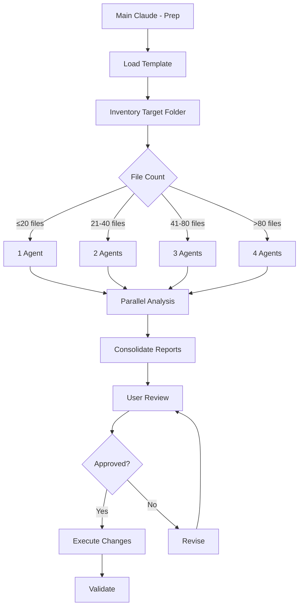

# Recipe: Folder Cleanup and Organization

## Overview
Systematic approach to analyzing and cleaning project folders **using 3 or 4 parallel documentation agents**. Ensures STAD Protocol compliance while maintaining full user control over all decisions.

## Philosophy
"Measure twice, cut once" - Thorough analysis with user approval before any changes. No destructive actions without explicit consent.

## Use Case
- Regular project maintenance and cleanup
- Pre-sprint folder organization
- Post-sprint artifact archival
- Compliance audits
- Technical debt reduction

## Prerequisites
- Target folder path identified
- Backup strategy in place
- User available for review (30-60 min)
- Archive folder structure ready

## Agent Sequence



## Step-by-Step Process

### Phase 1: Preparation (5 minutes)
**Agent:** Main Claude  
**Complexity:** Low

**Actions:**
```bash
# Get current date for archival
date +"%m-%d-%Y"

# Load folder cleanup template
Read /docs/reference/templates/folder_cleanup_template.md

# Inventory target folder
find [target_folder] -type f | wc -l  # Count files
du -sh [target_folder]                # Check size
ls -la [target_folder]                # List contents

# Create backup
cp -r [target_folder] [target_folder]_backup_[date]

# Prepare archive structure
mkdir -p /Archive/[date]/[target_folder_name]
```

### Phase 2: Agent Distribution (2 minutes)
**Agent:** Main Claude  
**Complexity:** Low

**Calculate agent distribution:**
```python
def calculate_agents(file_count):
    if file_count <= 20:
        return 1
    elif file_count <= 40:
        return 2
    elif file_count <= 80:
        return 3
    else:
        return 4

def distribute_files(files, agent_count):
    chunk_size = len(files) // agent_count
    return [files[i:i+chunk_size] for i in range(0, len(files), chunk_size)]
```

### Phase 3: Parallel Analysis (30-45 minutes)
**Agents:** 1-4 documentation agents  
**Complexity:** High

**Agent 1 Context: Structure & References**
```markdown
## Your Analysis Task
Target: [First 25% of files]

For each file:
1. Run: Grep "[filename]" to find all references
2. Check if file references others
3. Identify if it's a "single source of truth"
4. Note last modified date
5. Verify naming convention compliance

**VALUE ASSESSMENT REQUIRED:**
- Number of external references: [Count files outside current folder]
- Days since last update: [Calculate from today]
- Implementation status: [Implemented/Proposed/Unknown]
- Actual usage evidence: [Specific examples or "None found"]
- Default to ARCHIVE if no clear value demonstrated

Output structured analysis per template.
```

**Agent 2 Context: Content & Duplication**
```markdown
## Your Analysis Task
Target: [Second 25% of files]

For each file:
1. Summarize file purpose and content
2. Search for similar files: Glob "*similar*pattern*"
3. Calculate content overlap percentage
4. Identify merge/split opportunities
5. Check if content is current

Output structured analysis per template.
```

**Agent 3 Context: Location & Organization**
```markdown
## Your Analysis Task
Target: [Third 25% of files]

For each file:
1. Verify correct folder per STAD Protocol
2. Suggest better location if needed
3. Find related files that should be together
4. Check folder structure compliance
5. Note missing expected files

Output structured analysis per template.
```

**Agent 4 Context: Status & Lifecycle**
```markdown
## Your Analysis Task
Target: [Final 25% of files]

For each file:
1. Determine lifecycle stage
2. Find associated sprint/epic/ticket
3. Check completion status
4. Assess archive candidacy
5. Identify breaking dependencies

Output structured analysis per template.
```

### Phase 3.5: Value Assessment Framework (5 minutes)
**Agent:** Main Claude  
**Complexity:** Critical

**Assess ACTUAL value, not PERCEIVED value:**

#### 🚩 Red Flags (Signs of No/Low Value):
- ❌ **Zero external references** - If only referenced within own folder, likely obsolete
- ❌ **Old creation date + no updates** - Stale documentation (>30 days untouched)
- ❌ **Related ticket marked DONE** - Design docs for completed features
- ❌ **No implementation found** - Specs without corresponding code
- ❌ **Duplicate concepts** - Multiple docs covering same topic
- ❌ **"Planning" or "Design" docs** - Often superseded by actual implementation

#### ✅ Green Flags (Signs of Real Value):
- ✅ **External references exist** - Other parts of system depend on it
- ✅ **Recent updates** - Active maintenance indicates use
- ✅ **Linked from README/CLAUDE.md** - Part of official documentation
- ✅ **Contains unique information** - Not found elsewhere
- ✅ **Operational use** - Templates, configs, or guides in active use
- ✅ **Compliance/audit required** - Legal or regulatory need

#### Value Decision Matrix:
```markdown
| External Refs | Recent Updates | Unique Content | Recommendation |
|--------------|----------------|----------------|----------------|
| No | No | No | ARCHIVE |
| No | No | Yes | ARCHIVE (document why unique) |
| No | Yes | - | INVESTIGATE (why updated?) |
| Yes | - | - | KEEP or RELOCATE |
```

#### Critical Questions to Answer:
1. **Is anyone actually using this?** (Check references)
2. **When was it last needed?** (Check modification date vs creation)
3. **Is the information available elsewhere?** (Check for duplicates)
4. **Would anything break if removed?** (Check dependencies)
5. **Is this a proposal or implementation?** (Check for corresponding code)

#### Common Traps to Avoid:
- **Size ≠ Value** - Large files aren't automatically important
- **Quality ≠ Need** - Well-written but unused is still unused  
- **"Might need later"** - If not used in 30+ days, archive it
- **Fear of deletion** - That's why we archive, not delete
- **Impressive titles** - "Core System Design" means nothing if unused

### Phase 4: Report Consolidation (10 minutes)
**Agent:** Main Claude  
**Complexity:** Medium

**Generate unified report and save to TEMP:**
```bash
# Create report filename with timestamp
REPORT_NAME="folder_cleanup_$(basename [target_folder])_$(date +%Y-%m-%d).md"
REPORT_PATH="/Project_Management/TEMP/$REPORT_NAME"

# Archive any previous reports for the same folder
PREVIOUS_REPORTS=$(find /Project_Management/TEMP -name "folder_cleanup_$(basename [target_folder])_*.md" 2>/dev/null)
if [ ! -z "$PREVIOUS_REPORTS" ]; then
    mkdir -p /Archive/folder_cleanup_reports
    for old_report in $PREVIOUS_REPORTS; do
        mv "$old_report" /Archive/folder_cleanup_reports/
        echo "📦 Archived previous report: $(basename $old_report)"
    done
    # Create archive reason file
    echo "Previous cleanup reports archived on $(date +%Y-%m-%d) - Superseded by new analysis" > \
        "/Archive/folder_cleanup_reports/archive_reason_$(date +%Y-%m-%d).md"
fi

# Generate report with reference tracking
cat > "$REPORT_PATH" << 'EOF'
# Folder Cleanup Analysis Report
Date: [date]
Target: [folder_path]

## Summary Statistics
[Aggregate all agent findings]

## Reference Impact Summary
- Files with incoming references: [N]
- Files with outgoing references: [N]  
- Total updates required if all moves approved: [N]

## Recommendations by Priority

### 🔴 CRITICAL (Immediate Action)
[Files with many references requiring urgent decisions]

### 🟡 IMPORTANT (This Session)
[Files needing cleanup with moderate impact]

### 🟢 STANDARD (Can Wait)
[Nice-to-have cleanups with minimal impact]

## Detailed Analysis with References
[For each file, include full reference tracking]

## User Decision Form
[Interactive checklist for approvals]
EOF

echo "✅ Report saved to: $REPORT_PATH"
echo "📋 Please review and mark your decisions in the report"
```

### Phase 5: User Review Checkpoint (15-30 minutes)
**Agent:** Main Claude with User  
**Complexity:** Low

**Present findings for review:**
1. Show summary statistics
2. Present critical items first
3. Walk through each recommendation
4. Collect user decisions
5. Document any modifications

**Decision tracking:**
```markdown
| File | Recommendation | User Decision | Notes |
|------|---------------|---------------|-------|
| file1.md | ARCHIVE | ✅ APPROVED | Old sprint artifact |
| file2.md | KEEP | ✅ APPROVED | Active reference |
| file3.md | CONSOLIDATE | ❌ SKIP | Keep separate for now |
```

### Phase 6: Execution (10-20 minutes)
**Agent:** Main Claude  
**Complexity:** Medium

**Execute approved changes only:**
```bash
# 1. Archive files first (safest)
for file in approved_archives; do
    mv "$file" "/Archive/[date]/[original_path]/"
    echo "Archived: $file - Reason: [reason]" >> archive_log.md
done

# 2. Relocate files (medium risk)
for file in approved_relocations; do
    mv "$file" "[new_location]"
    # Update references if needed
    Grep -l "$file" | xargs sed -i "s|$file|[new_location]|g"
done

# 3. Consolidate content (highest risk)
for consolidation in approved_consolidations; do
    # Merge content with attribution
    cat "$source_file" >> "$target_file"
    echo "\n---\nConsolidated from $source_file on [date]" >> "$target_file"
    mv "$source_file" "/Archive/[date]/consolidated/"
done

# 4. Remove empty folders (lowest risk)
find [target_folder] -type d -empty -delete
```

### Phase 7: Validation (5 minutes)
**Agent:** Main Claude  
**Complexity:** Low

**Verify all changes:**
```bash
# Check for broken references
Grep -r "[target_folder]" --include="*.md" | grep -E "404|not found|missing"

# Verify folder structure
tree [target_folder]

# Confirm archive integrity
ls -la /Archive/[date]/

# Generate change summary
diff -r [target_folder]_backup [target_folder] > changes_summary.txt
```

## Success Criteria
- ✅ All files analyzed and categorized
- ✅ User reviewed all recommendations
- ✅ Only approved changes executed
- ✅ No broken references after cleanup
- ✅ Archive with complete audit trail
- ✅ Folder structure STAD-compliant

## Common Issues and Solutions

| Issue | Solution |
|-------|----------|
| Too many files for manual review | Focus on CRITICAL items only |
| Uncertain about file importance | Default to KEEP, review later |
| Broken references after move | Use backup to restore |
| Agent analysis incomplete | Run additional targeted analysis |
| User wants to defer decision | Mark as SKIP, document for next cleanup |

## Rollback Procedure

If issues arise:
```bash
# Complete rollback
rm -rf [target_folder]
mv [target_folder]_backup [target_folder]

# Partial rollback for specific files
cp [target_folder]_backup/[file] [target_folder]/[file]
```

## Integration with Workflow

### Regular Maintenance Schedule
- **Weekly:** TEMP folders
- **Sprint-end:** Sprint artifacts
- **Monthly:** Full project scan
- **Quarterly:** Deep archive cleanup

### Triggers for Cleanup
- Before major releases
- After sprint completion
- When folder size > threshold
- Before project handoff
- Regular maintenance window

## Metrics

Track cleanup effectiveness:
- Files analyzed: [N]
- Files archived: [N] ([X]% reduction)
- Space recovered: [X MB]
- Duplicates consolidated: [N]
- Time spent: [X minutes]
- User satisfaction: [1-5 rating]

## Notes

- Always backup before cleanup
- User approval is mandatory
- Maintain audit trail
- Test references after changes
- Document lessons learned

---

*Recipe tested with: Dev-Agency project folders, 50+ files, 4 agents parallel execution*