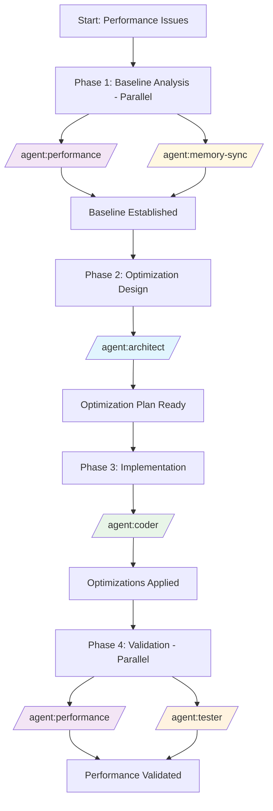

# Recipe: Performance Optimization Pipeline

## Overview
A data-driven approach to systematically identify, analyze, and resolve performance bottlenecks across all layers of an application using parallel agent execution for comprehensive analysis.

## Philosophy
**"Measure First, Optimize Second, Validate Always"** - Make performance improvements based on empirical data, not assumptions, with continuous measurement and validation throughout the process.

## Use Case
- Slow API response times
- High database query latency
- Frontend performance issues (Core Web Vitals)
- Memory leaks and high consumption
- CPU-intensive operations optimization
- Scalability bottlenecks
- Load handling improvements

## Agent Sequence



## Step-by-Step Process

### Phase 1: Baseline Analysis (Parallel Agents)
**Status**: `BACKLOG` → `TODO` → `IN_PROGRESS`
**Duration**: 45-60 minutes (parallel)

#### `/agent:performance` (Performance Profiling)
- **Load Testing**: Establish current capacity limits
- **Response Time Analysis**: Measure P50, P95, P99 latencies
- **Database Profiling**: EXPLAIN ANALYZE on slow queries
- **Memory Profiling**: Heap dumps and allocation patterns
- **CPU Profiling**: Identify hot paths and bottlenecks
- **Network Analysis**: Payload sizes and round trips
- **Frontend Metrics**: Core Web Vitals (LCP, FID, CLS)

#### `/agent:memory-sync` (System Snapshot)
- Capture current architecture in knowledge graph
- Document performance-critical paths
- Index current optimization patterns
- Create baseline for comparison

**Output**: Comprehensive performance baseline with bottleneck identification

### Phase 2: Optimization Design (Solo Agent)
**Agent**: `/agent:architect`
**Duration**: 60-90 minutes

1. **Bottleneck Prioritization**
   - Rank issues by impact and effort
   - Define target performance metrics
   - Create optimization roadmap
   - Set measurable success criteria

2. **Optimization Strategies**
   - **Database**: Query optimization, indexing, denormalization
   - **Caching**: Redis/Memcached implementation plans
   - **API**: Response compression, pagination, GraphQL
   - **Frontend**: Bundle splitting, lazy loading, CDN
   - **Infrastructure**: Horizontal scaling, load balancing

3. **Risk Assessment**
   - Identify potential side effects
   - Plan rollback procedures
   - Define monitoring requirements
   - Create testing strategy

**Output**: Detailed optimization plan with priorities and targets

### Phase 3: Implementation (Solo Agent)
**Agent**: `/agent:coder`
**Duration**: 2-4 hours

1. **Database Optimizations**
   ```sql
   -- Add composite indexes
   CREATE INDEX idx_user_activity ON user_activities(user_id, created_at);
   
   -- Optimize N+1 queries with eager loading
   -- Implement query result caching
   -- Add database connection pooling
   ```

2. **Backend Optimizations**
   ```javascript
   // Implement response caching
   // Add compression middleware
   // Optimize serialization
   // Implement pagination
   // Add request debouncing
   ```

3. **Frontend Optimizations**
   ```javascript
   // Code splitting and lazy loading
   // Image optimization and lazy loading
   // Service worker caching
   // Bundle size reduction
   // Virtual scrolling for long lists
   ```

**Output**: Optimized code with performance improvements applied

### Phase 4: Validation (Parallel Agents)
**Duration**: 60-90 minutes (parallel)

#### `/agent:performance` (Performance Validation)
- Re-run baseline tests
- Compare before/after metrics
- Validate target achievement
- Load test optimized system
- Generate performance report

#### `/agent:tester` (Regression Testing)
- Ensure functionality unchanged
- Validate edge cases
- Test under various load conditions
- Verify no new bugs introduced
- Check backward compatibility

**Output**: Performance validation report with regression test results

## Parallel Execution Opportunities

### Optimization Benefits
- **Phase 1**: Parallel analysis saves 30-45 minutes
- **Phase 4**: Parallel validation saves 45-60 minutes
- **Total Time Savings**: ~35% reduction

### Parallel Execution Groups
1. **Analysis**: `performance` + `memory-sync`
2. **Validation**: `performance` + `tester`
3. **Optional**: Add `security` for security impact analysis

## Common Context Template

```markdown
## Performance Context
- **Issue Description**: [Specific performance problems]
- **Affected Components**: [Services/endpoints/pages]
- **Current Metrics**: [Baseline measurements]
- **Target Metrics**: [Performance goals]

## Technical Environment
- **Stack**: [Languages, frameworks, databases]
- **Infrastructure**: [Cloud provider, resources]
- **Traffic Pattern**: [Users, requests/sec, peak times]
- **Data Volume**: [Database size, growth rate]

## Constraints
- **Budget**: [Resource limitations]
- **Timeline**: [Deadline for improvements]
- **Compatibility**: [Version requirements]
- **Downtime**: [Maintenance window availability]
```

## Performance Metrics & Targets

### Backend Metrics
| Metric | Current | Target | Measurement |
|--------|---------|--------|-------------|
| API Response (P50) | 500ms | 200ms | APM tools |
| API Response (P99) | 2000ms | 800ms | APM tools |
| Database Query Time | 300ms | 50ms | Query logs |
| Throughput | 100 rps | 500 rps | Load testing |
| Error Rate | 2% | <0.5% | Monitoring |

### Frontend Metrics
| Metric | Current | Target | Tool |
|--------|---------|--------|------|
| LCP (Largest Contentful Paint) | 4.0s | <2.5s | Lighthouse |
| FID (First Input Delay) | 300ms | <100ms | Lighthouse |
| CLS (Cumulative Layout Shift) | 0.25 | <0.1 | Lighthouse |
| Bundle Size | 2MB | <500KB | Webpack |
| Time to Interactive | 8s | <3.8s | Lighthouse |

## Success Criteria

### Required Improvements
- [ ] Response time improved by >50%
- [ ] Database queries optimized (no N+1)
- [ ] Memory usage reduced by >30%
- [ ] CPU utilization <70% under load
- [ ] All Core Web Vitals in "Good" range
- [ ] Zero performance regressions
- [ ] Load capacity increased by >100%

### Quality Gates
- [ ] All existing tests pass
- [ ] Performance tests automated
- [ ] Monitoring dashboards updated
- [ ] Alerts configured for regressions
- [ ] Documentation updated
- [ ] Rollback plan tested

## Time Estimates

### API Optimization
- Phase 1: 45-60 minutes
- Phase 2: 60 minutes
- Phase 3: 2-3 hours
- Phase 4: 60-90 minutes
- **Total**: 5-6 hours

### Full Stack Optimization
- Phase 1: 60-90 minutes
- Phase 2: 90-120 minutes
- Phase 3: 4-6 hours
- Phase 4: 90-120 minutes
- **Total**: 8-10 hours

### Database-Heavy Optimization
- Phase 1: 60 minutes
- Phase 2: 90 minutes
- Phase 3: 3-4 hours
- Phase 4: 90 minutes
- **Total**: 6-7 hours

## Common Issues and Solutions

| Issue | Symptoms | Solution | Prevention |
|-------|----------|----------|------------|
| N+1 Queries | Slow API, many DB calls | Eager loading, caching | ORM query analysis |
| Large Payloads | Slow network transfer | Compression, pagination | API design review |
| Memory Leaks | Growing memory usage | Profiling, cleanup | Regular heap analysis |
| Blocking Operations | UI freezes, timeouts | Async processing, workers | Code review practices |
| Cache Misses | Repeated calculations | Strategic caching | Cache strategy design |
| Bundle Size | Slow initial load | Code splitting, tree shaking | Bundle analysis |

## Example Invocation

### Optimizing Slow User Dashboard API

```bash
# Phase 1: Parallel Baseline Analysis
/agent:performance
Analyze /api/dashboard endpoint:
- Current response time: 1.2s average
- Load test with 100 concurrent users
- Profile database queries
- Memory usage patterns
- CPU utilization

/agent:memory-sync
Capture current dashboard implementation architecture

# Phase 2: Optimization Design
/agent:architect
Design optimizations for dashboard API:
Baseline: 1.2s response, 15 DB queries, 50MB memory
Target: <300ms response, <5 queries, <20MB memory
Constraints: No breaking changes, maintain real-time data

# Phase 3: Implementation
/agent:coder
Implement dashboard optimizations:
1. Add Redis caching for user preferences
2. Implement query batching for widgets
3. Add database indexes on frequently queried columns
4. Implement response compression
5. Optimize JSON serialization

[Include specific code examples]

# Phase 4: Parallel Validation
/agent:performance
Validate optimizations:
- New response time measurement
- Load test with 200 concurrent users
- Compare before/after metrics

/agent:tester
Regression testing:
- All dashboard features working
- Data accuracy maintained
- Edge cases handled
```

## Optimization Strategies Reference

### Database Layer
1. **Query Optimization**: EXPLAIN ANALYZE, query rewriting
2. **Indexing**: Composite indexes, covering indexes
3. **Connection Pooling**: PgBouncer, connection limits
4. **Caching**: Query result caching, materialized views
5. **Partitioning**: Table partitioning for large datasets

### Application Layer
1. **Caching**: Redis, Memcached, in-memory caching
2. **Async Processing**: Message queues, background jobs
3. **Batch Operations**: Bulk inserts, batch API calls
4. **Compression**: Gzip, Brotli compression
5. **CDN**: Static asset delivery, edge caching

### Frontend Layer
1. **Bundle Optimization**: Code splitting, tree shaking
2. **Lazy Loading**: Images, components, routes
3. **Caching**: Service workers, browser caching
4. **Rendering**: Virtual DOM, virtual scrolling
5. **Assets**: Image optimization, WebP format

## Recipe Variations

### API-Only Optimization
- Focus on backend metrics
- Skip frontend profiling
- Emphasize database and caching

### Frontend-Only Optimization
- Focus on Core Web Vitals
- Bundle size optimization
- Client-side caching strategies

### Database-Intensive Optimization
- Deep query analysis
- Index optimization
- Query rewriting and denormalization

### Microservices Optimization
- Service mesh optimization
- Inter-service communication
- Distributed caching strategies

---

*This recipe provides a systematic, data-driven approach to performance optimization with measurable improvements and continuous validation throughout the process.*