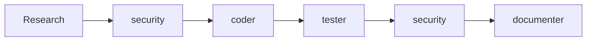

# Recipe: Security Audit Workflow

## Overview
Comprehensive security review process using specialized agents for vulnerability assessment and remediation.

## Use Case
- Pre-release security audits
- Compliance verification
- Vulnerability assessment
- Security-focused code review
- Penetration testing preparation

## Agent Sequence



## Step-by-Step Process

### Step 1: Research Phase
**Agent:** Main Claude  
**Actions:**
```bash
# Identify security-critical components
Grep "auth|password|token|secret|key" --type js
Grep "query|execute|eval" --type js  # SQL injection risks
Grep "innerHTML|dangerouslySetInnerHTML" --type jsx  # XSS risks

# Find sensitive data handling
Grep "encrypt|decrypt|hash" --type js
Read authentication and authorization files

# Check dependencies
Read package.json  # Known vulnerable packages
Read package-lock.json  # Exact versions
```

### Step 2: Security Assessment
**Agent:** `/agent:security`  
**Context Required:**
```markdown
- Authentication implementation
- Authorization logic
- Database queries (all of them)
- API endpoints and middleware
- Input validation code
- File upload handlers
- Session management
- Cryptography usage
- Error handling
- Third-party integrations
```

**Expected Output:**
- Vulnerability report by severity
- OWASP Top 10 assessment
- Specific code locations with issues
- Risk assessment for each finding
- Remediation recommendations

### Step 3: Security Fixes
**Agent:** `/agent:coder`  
**Context Required:**
```markdown
- Security report from security agent
- Current vulnerable code
- Security best practices for the framework
- Existing security utilities in codebase
- Authentication/authorization patterns
```

**Expected Output:**
- Security patches for all critical/high issues
- Input sanitization implementation
- Secure query implementations
- Proper authentication checks
- Safe cryptography usage
- Secure session handling

### Step 4: Security Testing
**Agent:** `/agent:tester`  
**Context Required:**
```markdown
- Security fixes implemented
- Original vulnerabilities
- Security test patterns
- Penetration test scenarios
- Input fuzzing requirements
```

**Expected Output:**
- Security-focused test suite
- Injection attack tests
- Authentication bypass tests
- Authorization verification tests
- Input validation tests
- Session security tests

### Step 5: Final Security Verification
**Agent:** `/agent:security`  
**Context Required:**
```markdown
- All security fixes applied
- Security test results
- Original vulnerability report
- Compliance requirements (if any)
```

**Expected Output:**
- Confirmation vulnerabilities fixed
- Compliance check results
- Remaining acceptable risks
- Security improvement recommendations
- Sign-off ready status

### Step 6: Security Documentation
**Agent:** `/agent:documenter`  
**Context Required:**
```markdown
- Security measures implemented
- Authentication/authorization flow
- Security best practices used
- Incident response procedures
- Security configuration
```

**Expected Output:**
- Security documentation
- API security guide
- Authentication guide
- Security configuration docs
- Incident response plan

## Security Checklist by Category

### Authentication & Authorization
- [ ] No hardcoded credentials
- [ ] Passwords hashed with bcrypt/argon2
- [ ] JWT properly validated
- [ ] Session management secure
- [ ] Rate limiting on auth endpoints
- [ ] Account lockout mechanism
- [ ] MFA implementation (if required)

### Input Validation
- [ ] All inputs validated
- [ ] Whitelist validation preferred
- [ ] File upload restrictions
- [ ] Size limits enforced
- [ ] Type checking implemented
- [ ] SQL injection prevention
- [ ] XSS prevention
- [ ] Command injection prevention

### Data Protection
- [ ] Sensitive data encrypted at rest
- [ ] TLS for data in transit
- [ ] PII properly masked in logs
- [ ] Secure random generation
- [ ] Proper key management
- [ ] Secure data deletion

### API Security
- [ ] Authentication required
- [ ] Authorization per endpoint
- [ ] Input validation
- [ ] Output encoding
- [ ] Rate limiting
- [ ] CORS properly configured
- [ ] API versioning

## Common Vulnerabilities and Fixes

### SQL Injection
```javascript
// VULNERABLE
const query = `SELECT * FROM users WHERE id = ${userId}`;

// SECURE
const query = 'SELECT * FROM users WHERE id = ?';
db.query(query, [userId]);
```

### XSS Prevention
```javascript
// VULNERABLE
element.innerHTML = userInput;

// SECURE
element.textContent = userInput;
// OR with sanitization
element.innerHTML = DOMPurify.sanitize(userInput);
```

### Path Traversal
```javascript
// VULNERABLE
const file = fs.readFileSync(`./uploads/${req.params.filename}`);

// SECURE
const filename = path.basename(req.params.filename);
const file = fs.readFileSync(path.join('./uploads', filename));
```

### Insecure Direct Object Reference
```javascript
// VULNERABLE
app.get('/api/user/:id', (req, res) => {
  const user = getUserById(req.params.id);
  res.json(user);
});

// SECURE
app.get('/api/user/:id', authenticate, (req, res) => {
  if (req.user.id !== req.params.id && !req.user.isAdmin) {
    return res.status(403).json({ error: 'Forbidden' });
  }
  const user = getUserById(req.params.id);
  res.json(user);
});
```

## Parallel Execution Opportunities

During initial assessment:
- `/agent:security` - Main security audit
- `/agent:performance` - DoS vulnerability check

After fixes:
- `/agent:tester` - Security tests
- `/agent:security` - Verification
- `/agent:performance` - Performance impact

## Success Criteria
- [ ] All critical vulnerabilities fixed
- [ ] All high vulnerabilities fixed
- [ ] Medium vulnerabilities assessed
- [ ] Security tests passing
- [ ] No regressions introduced
- [ ] Compliance requirements met
- [ ] Documentation updated

## Time Estimates
- Research: 30-45 minutes
- Security Assessment: 45-60 minutes
- Fix Implementation: 60-120 minutes
- Security Testing: 30-45 minutes
- Verification: 20-30 minutes
- Documentation: 20-30 minutes

**Total: 3.5-5.5 hours**

## Compliance Considerations

### GDPR
- [ ] Data minimization
- [ ] Right to deletion implemented
- [ ] Consent management
- [ ] Data portability
- [ ] Privacy by design

### HIPAA
- [ ] Encryption requirements met
- [ ] Access controls implemented
- [ ] Audit logging in place
- [ ] Data integrity verified

### PCI DSS
- [ ] Credit card data handling secure
- [ ] Network segmentation
- [ ] Regular security testing
- [ ] Secure development practices

## Security Tools Integration

### Static Analysis
```bash
# JavaScript/TypeScript
npm audit
eslint --plugin security
snyk test

# Python
bandit -r .
safety check
```

### Dependency Scanning
```bash
# Check for known vulnerabilities
npm audit fix
snyk monitor
dependabot alerts
```

## Severity Classification

| Level | Response Time | Action |
|-------|--------------|--------|
| Critical | Immediate | Stop release, fix now |
| High | 24 hours | Fix before release |
| Medium | 1 week | Fix in next sprint |
| Low | 1 month | Add to backlog |

## Post-Audit Actions
- [ ] Create tickets for remaining issues
- [ ] Update security documentation
- [ ] Schedule next audit
- [ ] Train team on findings
- [ ] Update security guidelines
- [ ] Implement monitoring

---

*Recipe Version: 1.0 | Last Updated: 08-09-2025*