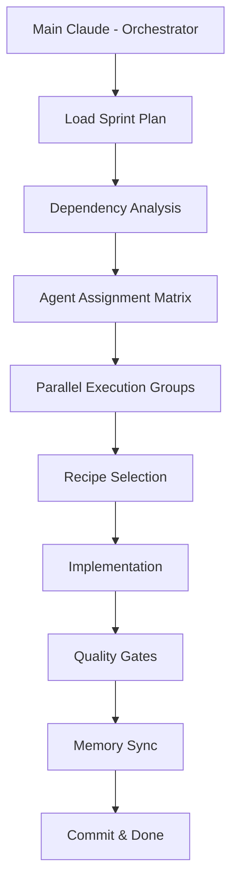

# Recipe: Sprint Execution (Implement-Test-Document-Commit)

## Overview
Comprehensive sprint execution workflow focusing on Implement-Test-Document-Commit phases. Takes prepared tickets with specs and executes them in optimal order with complete development, testing, and documentation plans.

## Philosophy
"Plan the work, then work the plan" - Execute prepared tickets systematically with best practices, comprehensive testing, and complete documentation.

## Focus Areas
1. **Implementation Order** - Determine optimal ticket execution sequence
2. **Tool Selection** - Identify best tools for efficient implementation
3. **Sprint Plan Spec** - Write complete execution plan with architect notes
4. **Testing Strategy** - Define edge cases and validation criteria
5. **Documentation Plan** - Specify all documentation updates needed
6. **Sprint Closure** - Checklist for DONE status and final reporting

## Use Case
- Executing prepared sprint tickets
- Determining implementation order
- Writing comprehensive Sprint Plan Spec
- Ensuring testing with edge cases
- Completing documentation requirements
- Sprint closure and commit preparation

## Prerequisites
- Completed sprint preparation with tickets, specs, and agent assignments
- All dependencies validated and blockers resolved
- Dependencies mapped and understood
- Team ready to begin implementation

## Agent Sequence



## Step-by-Step Process

### Phase 1: Sprint Loading & Analysis
**Agent:** Main Claude  
**Time:** Medium complexity

**Actions:**
```bash
# Load the planned sprint
Read /Project_Management/PROJECT_PLAN.md
Read /Project_Management/current_sprint.md  # If exists

# Identify all tickets in sprint
Grep "TODO\|IN_PROGRESS" PROJECT_PLAN.md

# Load all ticket specs
for ticket in sprint_tickets; do
    Read /Project_Management/Specs/${ticket}_spec.md
done

# Check for any blockers
Grep "BLOCKED\|blocker\|dependency" Specs/
```

**Analysis Output:**
```markdown
## Sprint Execution Plan

### Tickets to Implement
1. SECURITY-001 (5 pts) - Critical security fix [No dependencies]
2. BUILD-001 (2 pts) - TypeScript errors [Blocks all]
3. AGENT-010 (3 pts) - Context optimizer [Depends on BUILD-001]
...

### Dependency Order
BUILD-001 → SECURITY-001 → AGENT-010 → AGENT-005 → Others

### Parallelization Opportunities
- Group 1: BUILD-001 (must complete first)
- Group 2: SECURITY-001, AGENT-004 (can run parallel)
- Group 3: AGENT-010, AGENT-007 (can run parallel)
```

### Phase 2: Agent Assignment Strategy
**Agent:** Main Claude  
**Time:** Medium complexity

**Create Agent Assignment Matrix:**
```markdown
## Agent Assignments by Ticket

| Ticket | Research | Design | Implementation | Testing | Security | Docs | Recipe |
|--------|----------|--------|----------------|---------|----------|------|--------|
| SECURITY-001 | Main | architect | security | tester | security | documenter | security_audit |
| BUILD-001 | Main | - | coder | tester | - | - | bug_fix |
| AGENT-010 | Main | architect | coder | tester | - | documenter | performance_optimization |
| AGENT-005 | Main | architect | coder | tester | - | documenter | full_stack_feature |

## Parallel Execution Groups (Max 5 Agents)

### Day 1-2: Foundation
**Morning (3 agents parallel):**
- BUILD-001: coder (fixing TypeScript)
- SECURITY-001: architect (design fix)
- Research: Main Claude (gather context)

**Afternoon (5 agents parallel):**
- BUILD-001: tester (verify fixes)
- SECURITY-001: security (implement fix)
- AGENT-010: architect (design optimization)
- AGENT-004: architect (design prompt system)
- Documentation: documenter (update affected docs)
```

### Phase 3: Recipe Application & Implementation with Boundary Enforcement
**Agent:** Multiple (based on assignments)  
**Time:** Variable by ticket

**Pre-Implementation Setup (for each ticket):**
```bash
# 1. Set feature boundaries (file permissions)
./tools/boundary-enforcement/set-feature-boundaries.sh $TICKET_ID

# 2. Validate current state
./tools/boundary-enforcement/validate-boundaries.sh $TICKET_ID

# 3. Install pre-commit hooks
cp tools/boundary-enforcement/pre-commit-boundary-check .git/hooks/pre-commit

# 4. Create feature branch with proper naming
git checkout -b feature/$TICKET_ID
```

**For each ticket, apply appropriate recipe:**

#### Example: SECURITY-001 Implementation
```markdown
## Ticket: SECURITY-001
## Recipe: security_audit_recipe

### Step 1: Security Analysis (30 min)
/agent:security - Analyze vulnerability
Context: [Current implementation, CVE details, attack vectors]

### Step 2: Fix Design (45 min)
/agent:architect - Design secure solution
Context: [Security analysis, existing architecture, constraints]

### Step 3: Implementation (High complexity)
/agent:coder - Implement security fix
Context: [Design, security requirements, test cases]

### Step 4: Security Testing (1 hour)
Parallel execution:
- /agent:tester - Functional testing
- /agent:security - Penetration testing
- /agent:performance - Performance impact

### Step 5: Documentation (30 min)
/agent:documenter - Update security docs
Context: [Fix details, configuration changes, ADR]
```

### Phase 4: Parallel Execution Management
**Agent:** Main Claude (Orchestrator)  
**Time:** Continuous monitoring

**Dynamic Scheduling Algorithm:**
```javascript
class SprintExecutor {
    constructor(maxAgents = 5) {
        this.maxAgents = maxAgents;
        this.runningAgents = [];
        this.ticketQueue = [];
        this.completedTickets = [];
    }
    
    async executeSpring(tickets) {
        // Sort by priority and dependencies
        this.ticketQueue = this.sortByDependencies(tickets);
        
        while (this.ticketQueue.length > 0 || this.runningAgents.length > 0) {
            // Start new agents if capacity available
            while (this.runningAgents.length < this.maxAgents && this.ticketQueue.length > 0) {
                const ticket = this.getNextExecutableTicket();
                if (ticket) {
                    this.startTicketExecution(ticket);
                } else {
                    break; // Wait for dependencies
                }
            }
            
            // Monitor and complete running agents
            await this.monitorProgress();
        }
    }
    
    getNextExecutableTicket() {
        // Return next ticket with all dependencies met
        return this.ticketQueue.find(ticket => 
            this.areDependenciesMet(ticket)
        );
    }
}
```

### Phase 5: Quality Gates & Testing with Isolation Verification
**Agent:** `/agent:tester` + specialists  
**Time:** 20-30% of implementation time

**Quality Gate Checklist per Ticket:**
```markdown
## Quality Gates for [TICKET-ID]

### Code Quality
- [ ] Linting passes
- [ ] Type checking passes
- [ ] Code review complete
- [ ] No code smells detected

### Testing
- [ ] Unit tests written and passing
- [ ] Integration tests passing
- [ ] Edge cases covered
- [ ] Performance benchmarks met

### Security
- [ ] Security scan passed
- [ ] No vulnerabilities introduced
- [ ] Authentication/authorization correct
- [ ] Input validation implemented

### Documentation
- [ ] Code comments added
- [ ] README updated if needed
- [ ] API docs current
- [ ] User guide updated

### Feature Isolation
- [ ] Only modified owned files
- [ ] No cross-feature contamination
- [ ] Design tokens used (no hardcoded values)
- [ ] CSS modules for feature styles
- [ ] Regression tests pass for dependent features
- [ ] Boundary validation passes
```

### Phase 6: Memory Sync & Knowledge Update
**Agent:** `/agent:memory-sync`  
**Time:** Medium complexity per ticket

**After each ticket completion:**
```bash
# Sync code changes to memory
/sync-memory --path src/ --ticket TICKET-ID

# Update knowledge graph with new patterns
/agent:memory-sync
Context: [Implemented solution, patterns used, lessons learned]

# Create entities for new components
mcp__memory__create_entities([
    {
        name: "TicketID_Component",
        entityType: "Implementation",
        observations: ["Solution details", "Design decisions"]
    }
])
```

### Phase 7: Commit Workflow
**Agent:** Main Claude  
**Time:** Medium complexity per ticket

**Commit Process:**
```bash
# Stage changes
git add -A

# Generate commit message
/agent:documenter - Generate commit message
Context: [Ticket ID, changes made, acceptance criteria met]

# Commit with conventional format
git commit -m "feat(TICKET-ID): Brief description

- Detailed change 1
- Detailed change 2
- Fixes security vulnerability
- Updates documentation

Closes #TICKET-ID"

# Update ticket status
Update PROJECT_PLAN.md status: DONE
```

### Phase 8: Definition of DONE Verification
**Agent:** Main Claude  
**Time:** Low complexity per ticket

**DONE Checklist:**
```markdown
## Definition of DONE - [TICKET-ID]

### Development
- [x] Code complete and functional
- [x] Follows coding standards
- [x] No TODOs or debug code

### Testing
- [x] All tests passing
- [x] Coverage > 80%
- [x] Manual testing complete

### Documentation
- [x] Code documented
- [x] User docs updated
- [x] Changelog updated

### Integration
- [x] Memory synced
- [x] No conflicts with main
- [x] Build passing

### Review
- [x] Code reviewed
- [x] Security reviewed
- [x] Acceptance criteria met

Status: ✅ DONE
```

## Execution Timeline Example

### Week 1 Schedule
```markdown
## Day 1-2: Foundation & Critical Fixes
**Agents Running: 3-5 parallel**
- Morning: BUILD-001 (2 agents), Research (1 agent)
- Afternoon: SECURITY-001 (3 agents), AGENT-010 start (2 agents)

## Day 3-4: Core Features
**Agents Running: 5 parallel**
- AGENT-010 completion (2 agents)
- AGENT-005 implementation (3 agents)
- Documentation updates (continuous)

## Day 5: Testing & Integration
**Agents Running: 4-5 parallel**
- Comprehensive testing (2 agents)
- Performance validation (1 agent)
- Security audit (1 agent)
- Memory sync (1 agent)
```

### Week 2 Schedule
```markdown
## Day 6-7: Feature Development
**Agents Running: 5 parallel**
- AGENT-004 implementation (3 agents)
- AGENT-007 implementation (2 agents)

## Day 8-9: Quality & Polish
**Agents Running: 3-4 parallel**
- Bug fixes from testing
- Documentation completion
- Performance optimization

## Day 10: Sprint Closure
**Agents Running: 2-3 parallel**
- Final testing
- Memory sync all changes
- Commit and release prep
```

## Success Criteria
- ✅ All sprint tickets reach DONE status
- ✅ Dependencies respected throughout
- ✅ Maximum 5 agents utilized efficiently
- ✅ All quality gates passed
- ✅ Memory graph updated with changes
- ✅ Clean commit history
- ✅ Sprint velocity tracked

## Common Issues and Solutions

| Issue | Solution |
|-------|----------|
| Agent conflicts | Use mutex locks on shared resources |
| Dependency delays | Reorder execution queue dynamically |
| Test failures | Allocate dedicated fix time in schedule |
| Memory sync errors | Retry with smaller batches |
| Resource exhaustion | Reduce max agents temporarily |

## Slash Command Integration

### Basic Usage
```bash
/sprint-execute
```

### Options
```bash
/sprint-execute --max-agents 3      # Limit parallel agents
/sprint-execute --tickets AGENT-010 # Execute specific tickets
/sprint-execute --dry-run          # Preview execution plan
/sprint-execute --recipe-override  # Use custom recipes
/sprint-execute --continue          # Resume interrupted execution
```

## Recipe Combinations Used

### By Ticket Type
- **Bug Fixes:** bug_fix_recipe + testing focus
- **Security:** security_audit_recipe + penetration testing
- **Features:** full_stack_feature_recipe + documentation
- **Performance:** performance_optimization_recipe + benchmarking
- **Infrastructure:** database_migration_recipe + rollback planning

## Integration with Workflow

```bash
# Complete sprint workflow
/sprint-plan → Review → /sprint-execute → Monitor → Complete

# With checkpoints
/sprint-execute --dry-run → Approve → /sprint-execute → Daily standups
```

## Monitoring & Reporting

### Daily Status Report
```markdown
## Sprint Execution Status - Day X

### Completed Today
- TICKET-001: ✅ DONE
- TICKET-002: ✅ DONE

### In Progress
- TICKET-003: 70% complete (testing phase)
- TICKET-004: 40% complete (implementation)

### Blocked
- None

### Agent Utilization
- Average: 4.2/5 agents
- Peak: 5/5 agents (14:00-16:00)

### Tomorrow's Plan
- Complete TICKET-003 testing
- Start TICKET-005 implementation
```

## Notes
- Always maintain at least 1 agent free for urgent fixes
- Schedule complex work for peak productivity hours
- Buffer 20% time for unexpected issues
- Review and adjust execution plan daily
- Keep stakeholders informed of progress

---

*Recipe tested with: 2-week sprints, 5-agent parallelization, 30-35 story points*