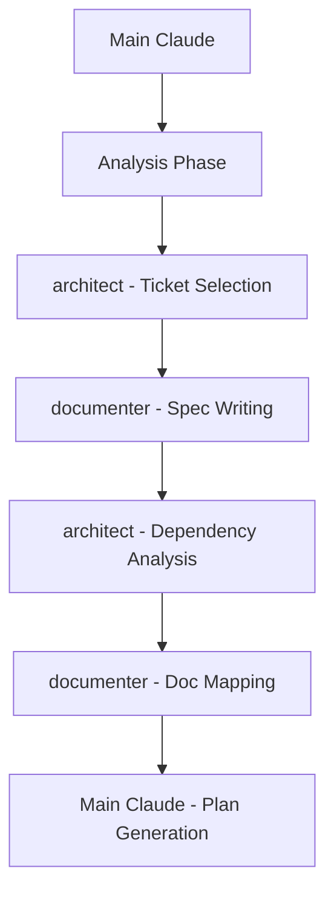
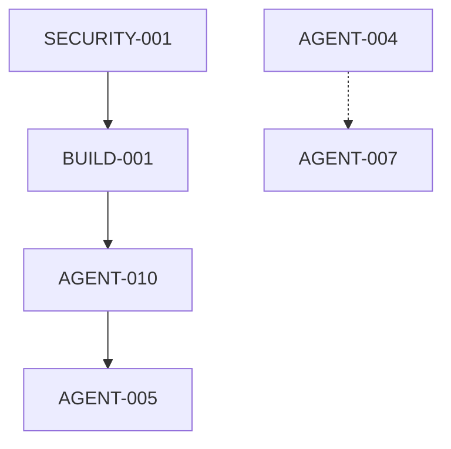

# Recipe: Sprint Planning Automation

## Overview
Automated sprint planning workflow that selects tickets, writes specs, maps documentation needs, identifies dependencies, and eliminates implementation guesswork. Targets 30-35 story points per sprint with comprehensive preparation.

## Philosophy
"The better you plan, the better the outcome" - Thorough sprint planning with complete context preparation ensures smooth execution and predictable delivery.

## Use Case
- Sprint planning sessions (beginning of each sprint)
- Mid-sprint replanning when priorities shift
- Capacity planning for upcoming work
- Dependency analysis for complex features
- Documentation roadmap creation

## Agent Sequence



## Step-by-Step Process

### Phase 1: Sprint Preparation & Analysis
**Agent:** Main Claude  
**Time:** 5-10 minutes

**Actions:**
```bash
# Get current date for sprint planning
date +"%m-%d-%Y"

# Review PROJECT_PLAN.md for current state
Read PROJECT_PLAN.md

# Check previous sprint velocity
Grep "Sprint.*completed" PROJECT_PLAN.md

# Identify carry-over work
Grep "IN_PROGRESS\|CODE_REVIEW\|QA_TESTING" PROJECT_PLAN.md

# Check for READY_FOR_RELEASE items
Grep "READY_FOR_RELEASE" PROJECT_PLAN.md
```

**Analysis Points:**
- Previous sprint completion rate
- Current work in progress
- Blocked tickets
- Team velocity trends
- Release-ready items needing deployment

### Phase 2: Ticket Selection & Prioritization
**Agent:** `/agent:architect`  
**Time:** 15-20 minutes

**Context for Agent:**
```markdown
## Sprint Planning Context

### Target
- Sprint Points: 30-35 story points
- Sprint Duration: 2 weeks
- Team Capacity: [calculated from velocity]

### Priorities (in order)
1. Critical security issues (SECURITY-*)
2. Build/deployment blockers (BUILD-*)
3. Incomplete work from previous sprint
4. High-value features aligned with quarterly goals
5. Technical debt with immediate impact
6. New feature development

### Current Backlog
[INSERT BACKLOG TABLE FROM PROJECT_PLAN.md]

### Constraints
- Maximum 8 tickets per sprint (focus over quantity)
- Mix of sizes: 2-3 small (1-2 pts), 3-4 medium (3-5 pts), 1-2 large (8-13 pts)
- Consider dependencies between tickets
- Balance risk (include some safe tickets)

### Selection Criteria
For each ticket, evaluate:
1. Business value (1-5)
2. Technical risk (1-5)
3. Dependencies cleared? (Y/N)
4. Documentation exists? (Y/N)
5. Blocker for other work? (Y/N)

Please select tickets totaling 30-35 points and provide rationale for each selection.
```

**Expected Output:**
```markdown
## Selected Tickets for Sprint

| Priority | Ticket ID | Title | Points | Rationale |
|----------|-----------|-------|--------|-----------|
| 1 | SECURITY-001 | Fix CLI vulnerabilities | 5 | Critical security issue |
| 2 | BUILD-001 | Fix TypeScript errors | 2 | Blocks all development |
| 3 | AGENT-010 | Complete context optimizer | 3 | 60% done, finish it |
...

Total Points: 33
Risk Assessment: Medium (2 high-risk tickets balanced by 4 low-risk)
```

### Phase 3: Automated Spec Writing with Feature Boundaries
**Agent:** `/agent:documenter` (parallel execution for each ticket without spec)  
**Time:** 20-30 minutes
**Max Parallel Agents:** Configurable (default: 5)

**For EACH ticket without a spec, prepare context:**
```markdown
## Spec Writing Assignment: [TICKET-ID]

### Ticket Information
- ID: [TICKET-ID]
- Title: [Title from PROJECT_PLAN]
- Epic: [Epic name]
- Story Points: [Points]
- Current Status: BACKLOG

### Context Files to Review
[List relevant files based on ticket area]
- For API tickets: Check /routes, /controllers, /models
- For UI tickets: Check /components, /pages, /styles
- For infrastructure: Check /terraform, /k8s, /docker

### Spec Template to Follow
[INSERT SPECS_Template.md content]

### Requirements to Address
1. Problem & Goal - Why is this needed?
2. Acceptance Criteria - Minimum 3 testable conditions
3. Technical Plan - Implementation approach
4. **Feature Boundaries & Impact:**
   - **Owned Resources:** Files this ticket can modify freely
   - **Shared Dependencies:** Files that are READ-ONLY or EXTEND-ONLY
   - **Impact Radius:** Features that could be affected
   - **Safe Modification Strategy:** How to avoid breaking other features
5. Documentation Needs:
   - What docs need reading for context?
   - What docs need updating?
   - What new docs are required?
6. Agent Context - What files/info will agents need?
7. Dependencies - What must be completed first?
8. Risks & Mitigations
9. **Technical Enforcement:**
   - Pre-commit hooks to run
   - CI/CD checks required
   - Design token compliance

### Anti-Patterns to Avoid
- Vague acceptance criteria
- Missing technical approach
- No documentation plan
- Unclear dependencies
```

**Parallel Execution Pattern:**
```javascript
// Run spec writing with configurable agent limit
function executeSpecWritingInBatches(tickets, maxAgents = 5) {
    const batches = [];
    
    // Create batches based on max agents limit
    for (let i = 0; i < tickets.length; i += maxAgents) {
        batches.push(tickets.slice(i, i + maxAgents));
    }
    
    // Execute each batch sequentially
    for (const batch of batches) {
        const tasks = batch.map(ticket => 
            invokeAgent('documenter', specContext(ticket))
        );
        await Promise.all(tasks);
    }
}

// Example: 10 tickets with max 3 agents
// Batch 1: Tickets 1-3 (parallel)
// Batch 2: Tickets 4-6 (parallel)
// Batch 3: Tickets 7-9 (parallel)
// Batch 4: Ticket 10 (single)
```

### Phase 4: Documentation Mapping
**Agent:** `/agent:documenter`  
**Time:** 10-15 minutes

**Context:**
```markdown
## Documentation Audit for Sprint

### Selected Tickets
[List of all selected tickets with their specs]

### For Each Ticket, Identify:

#### Documents to READ (Context Gathering)
- Existing feature documentation
- Related API documentation
- Architecture decision records
- Previous similar implementations

#### Documents to UPDATE
- README files affected by changes
- API documentation for modified endpoints
- Configuration guides for new settings
- Deployment documentation if needed

#### Documents to CREATE
- New feature documentation
- Migration guides for breaking changes
- ADRs for architectural decisions
- User guides for new functionality

### Documentation Standards
- All docs must have frontmatter
- Feature docs in /docs/features/
- API docs in /docs/api/
- ADRs in /docs/adrs/

### Output Format
Create a documentation roadmap table:
| Ticket | Docs to Read | Docs to Update | Docs to Create |
|--------|--------------|----------------|----------------|
| TICKET-001 | [list] | [list] | [list] |
```

### Phase 5: Dependency Analysis & Risk Assessment
**Agent:** `/agent:architect`  
**Time:** 10-15 minutes

**Context:**
```markdown
## Dependency Analysis Request

### Selected Sprint Tickets
[List with technical details from specs]

### Analyze:

#### Direct Dependencies
- Which tickets block others?
- What order should work proceed?
- Can any be parallelized?

#### Technical Dependencies
- External services required
- Library updates needed
- Database migrations required
- Infrastructure changes

#### Resource Dependencies
- Specialized knowledge required
- External team coordination
- Third-party API access

### Create:
1. Dependency Graph (Mermaid diagram)
2. Optimal work sequence
3. Parallelization opportunities
4. Risk matrix with mitigations

### Risk Categories to Consider
- Technical complexity
- External dependencies
- Knowledge gaps
- Timeline pressure
- Integration challenges
```

**Expected Output:**


### Phase 6: Context Preparation for Agents
**Agent:** Main Claude  
**Time:** 10-15 minutes

**For each ticket, prepare agent context package:**
```markdown
## Agent Context Package: [TICKET-ID]

### Required Reading
- Spec: /specs/[TICKET-ID]_spec.md
- Related Code: [list of files]
- Documentation: [list of docs]
- Examples: [similar implementations]

### Agent Assignments
- Research: Main Claude
- Design: /agent:architect
- Implementation: /agent:coder or /agent:[specialist]
- Testing: /agent:tester
- Documentation: /agent:documenter

### Pre-gathered Context
```
[Include relevant code snippets]
[Include configuration examples]
[Include API schemas]
```

### Success Criteria from Spec
[Copy acceptance criteria]

### Known Constraints
[List any limitations or requirements]
```

### Phase 7: Sprint Plan Generation
**Agent:** Main Claude  
**Time:** 5-10 minutes

**Generate comprehensive sprint plan:**
```markdown
# Sprint [N] Plan

## Sprint Overview
- **Dates:** [Start] - [End]
- **Total Points:** [Total]
- **Ticket Count:** [Count]
- **Sprint Goal:** [One sentence goal]

## Selected Tickets

| Priority | ID | Title | Points | Status | Spec | Dependencies |
|----------|-----|-------|--------|--------|------|--------------|
| 1 | ... | ... | ... | TODO | ✅ | None |
| 2 | ... | ... | ... | TODO | ✅ | TICKET-001 |

## Documentation Roadmap

| Ticket | Read | Update | Create |
|--------|------|--------|--------|
| ... | ... | ... | ... |

## Work Sequence

### Week 1
1. **Day 1-2:** SECURITY-001 (Critical fix)
2. **Day 3-4:** BUILD-001 (Unblock development)
3. **Day 5:** AGENT-010 (Complete partial work)

### Week 2
4. **Day 6-7:** [Continue sequence]

## Parallel Work Opportunities
- AGENT-004 and AGENT-007 can proceed in parallel
- Documentation updates can happen alongside testing

## Risk Management

| Risk | Probability | Impact | Mitigation |
|------|-------------|--------|------------|
| Security fix complexity | Medium | High | Allocate buffer time |
| External API changes | Low | High | Have fallback plan |

## Success Metrics
- [ ] All critical issues resolved
- [ ] 85%+ sprint completion
- [ ] Zero production incidents
- [ ] Documentation 100% current

## Agent Context Packages
All context packages prepared in: `/sprint-[N]-context/`

## Notes
- [Any special considerations]
- [Team availability notes]
- [External dependencies]
```

## Success Criteria
- ✅ 30-35 story points selected
- ✅ All tickets have complete specs
- ✅ Documentation roadmap created
- ✅ Dependencies mapped and sequenced
- ✅ Agent context packages prepared
- ✅ Risk assessment completed
- ✅ Work sequence optimized

## Time Estimates
- Phase 1: Sprint Analysis - 5-10 minutes
- Phase 2: Ticket Selection - 15-20 minutes
- Phase 3: Spec Writing - 20-30 minutes
- Phase 4: Documentation Mapping - 10-15 minutes
- Phase 5: Dependency Analysis - 10-15 minutes
- Phase 6: Context Preparation - 10-15 minutes
- Phase 7: Plan Generation - 5-10 minutes
- **Total: 75-115 minutes** (vs 4-6 hours manual)

## Common Issues and Solutions

| Issue | Solution |
|-------|----------|
| Not enough tickets ready | Quick triage of BACKLOG items, write minimal specs |
| Too many dependencies | Consider smaller sprint or different ticket mix |
| Missing documentation | Flag for creation, add to sprint as tasks |
| Unclear requirements | Schedule clarification before sprint start |
| Capacity concerns | Reduce to 25-30 points, focus on must-haves |

## Slash Command Integration

### Basic Usage
```bash
/sprint-plan
```

### Options
```bash
/sprint-plan --points 40        # Custom point target
/sprint-plan --priority security # Focus on specific epic
/sprint-plan --continue         # Include in-progress work
/sprint-plan --team-size 3      # Adjust for team capacity
/sprint-plan --duration 1-week  # Shorter sprint
/sprint-plan --max-agents 3     # Limit parallel planning agents (default: 5)
```

## Recipe Variations

### Quick Sprint Planning (Emergency)
- Skip detailed specs, write bullet points
- Focus on critical issues only
- 15-20 point target
- Minimal documentation planning

### Feature Sprint Planning
- Focus on single epic/feature
- Deep documentation planning
- Extensive context preparation
- Higher risk tolerance

### Stabilization Sprint
- Priority on bugs and tech debt
- No new features
- Focus on documentation updates
- Lower point target (20-25)

## Integration with Workflow

```bash
# Full sprint planning workflow
/sprint-plan → Review → Adjust → Commit → Start Sprint

# With team review
/sprint-plan → Export → Team Review → Adjust → /sprint-plan --continue → Commit
```

## Parallel Agent Configuration

### Default Behavior
- Maximum 5 agents run simultaneously for planning tasks
- Automatic batching when tickets exceed agent limit
- Sequential batch execution prevents system overload

### Custom Agent Limits
```bash
# Resource-constrained systems
/sprint-plan --max-agents 2  # Only 2 agents at once

# High-performance systems  
/sprint-plan --max-agents 8  # Up to 8 agents parallel

# Single-threaded (sequential)
/sprint-plan --max-agents 1  # One agent at a time
```

### Performance Impact
| Max Agents | Time Estimate | System Load | Recommended For |
|------------|---------------|-------------|------------------|
| 1 | 2-3 hours | Low | Minimal resources |
| 3 | 1.5-2 hours | Medium | Standard laptops |
| 5 (default) | 1-1.5 hours | High | Modern workstations |
| 8+ | 45-60 min | Very High | High-end servers |

## Automation Benefits
- **Time Savings:** 4-6 hours → 1.5-2 hours (75% reduction)
- **Completeness:** 100% specs written before start
- **Context Ready:** All agent packages prepared
- **Risk Managed:** Dependencies and blockers identified
- **Documentation:** Roadmap prevents doc debt
- **Resource Flexible:** Adjustable parallelization

## Notes
- Run at least 2 days before sprint start
- Review with team before finalizing
- Keep previous sprint plans for velocity tracking
- Update estimates based on actual completion

---

*Recipe tested with: Dev-Agency project, 2-week sprints, 30-35 point capacity*