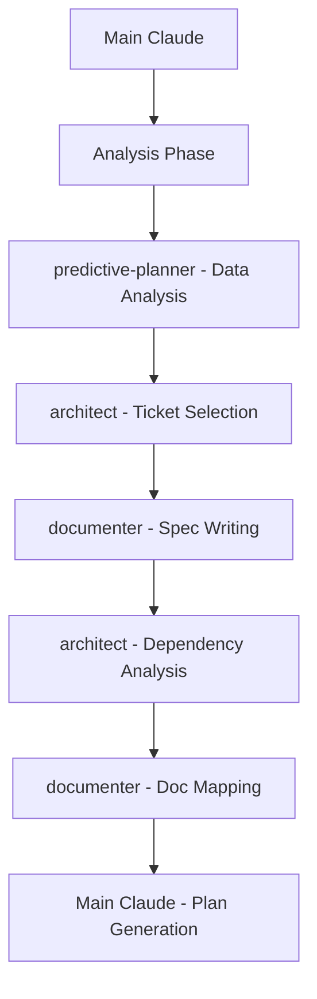
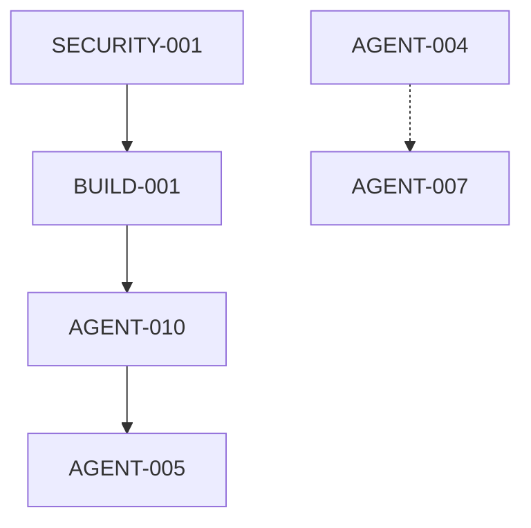

# Recipe: Sprint Preparation (STAD Stage 1)

## Overview
STAD Stage 1 comprehensive sprint preparation workflow. Creates complete specifications with all design decisions documented, enabling Stage 2 zero-intervention execution.

## Philosophy
"Make all decisions upfront" - Comprehensive planning with complete specs, edge case strategies, and pre-made decisions ensures autonomous Stage 2 execution.

## Focus Areas
1. **Ticket Selection & Validation** - Ensure no blockers, all dependencies fulfilled
2. **Story Point Validation** - Break down any ticket over 5 points (STAD requirement)
3. **Comprehensive Spec Writing** - Complete specs with ALL design decisions
4. **Edge Case Planning** - Document strategies for all potential issues
5. **Agent Assignment** - Map specialized agents to appropriate tickets
6. **Decision Documentation** - Pre-make all architectural and design choices
7. **Handoff Preparation** - Create templates for agent handoffs

## Use Case
- Sprint preparation sessions (before sprint execution)
- Ticket validation and dependency checking
- Breaking down complex tickets (>5 points)
- Agent assignment planning
- Documentation linking and research

## Agent Sequence



## Step-by-Step Process

### Phase 1: Sprint Preparation & Analysis
**Agent:** Main Claude  
**Complexity**: Medium

**Actions:**
```bash
# Get current date for sprint planning
date +"%m-%d-%Y"

# Load project context for informed decision-making
Read /Project_Management/PROJECT_CONTEXT.md

# Review PROJECT_PLAN.md for current state
Read PROJECT_PLAN.md

# Check previous sprint velocity
Grep "Sprint.*completed" PROJECT_PLAN.md

# Identify carry-over work
Grep "IN_PROGRESS\|CODE_REVIEW\|QA_TESTING" PROJECT_PLAN.md

# Check for READY_FOR_RELEASE items
Grep "READY_FOR_RELEASE" PROJECT_PLAN.md
```

**Analysis Points:**
- Project context and technical capabilities
- Business objectives and success metrics  
- Previous sprint completion rate
- Current work in progress
- Blocked tickets
- Team velocity trends
- Release-ready items needing deployment

### Phase 2: Predictive Analysis & Insights
**Agent:** `/agent:predictive-planner`  
**Complexity**: Medium

**Context for Agent:**
```markdown
## Predictive Sprint Planning Analysis

### Historical Data Source
- **PROJECT_PLAN.md Path**: /Project_Management/PROJECT_PLAN.md
- **Analysis Scope**: All available sprint data

### Current Planning Parameters
- **Target Sprint Points**: 30-35 points
- **Sprint Duration**: 2 weeks
- **Team Capacity**: 1 developer full-time
- **Risk Tolerance**: MEDIUM

### Priority Epics (in order)
1. System Foundation
2. Integration Framework  
3. Performance Tracking
4. Recipe Library
5. Advanced Automation

### Planning Constraints
- Include in-progress work: [Based on current sprint state]
- Exclude ticket types: [None, unless specified]
- Special considerations: [Any unique sprint requirements]

### Required Analysis
- [x] Velocity trend analysis with confidence intervals
- [x] Optimal sprint composition recommendations
- [x] Pattern recognition from successful sprints
- [x] Blocker predictions with mitigation strategies
- [x] Risk assessment based on historical data
- [x] Actionable recommendations for ticket selection

### Integration Context
- Will feed into architect agent for informed ticket selection
- Output will guide capacity and risk planning decisions
- Results will inform sprint composition optimization
```

**Expected Output:**
```markdown
## 🎯 Predictive Sprint Planning Insights

### Velocity Analysis
- Current velocity: [X] points
- Average velocity: [Y] points
- Velocity trend: [INCREASING/DECREASING/STABLE]
- Confidence range: [Min-Max] points
- Recommended target: [Z] points

### Optimal Sprint Composition
- Total points: [Recommended total]
- Ticket mix: [X] small + [Y] medium + [Z] large tickets
- Epic focus: [Priority epics with ticket allocation]
- Risk balance: [Distribution of low/medium/high risk work]

### Historical Patterns
- Pattern 1: [Successful composition pattern]
- Pattern 2: [Successful sequence pattern]  
- Pattern 3: [Risk management pattern]

### Blocker Predictions
- High risk: [Description + mitigation strategy]
- Medium risk: [Description + monitoring approach]
- Predictive confidence: [X]% based on [data quality factors]

### Strategic Recommendations
1. [Data-driven ticket selection guidance]
2. [Velocity-based capacity recommendation]
3. [Risk mitigation priority suggestions]
4. [Composition optimization advice]
```

**Integration Notes:**
- Results feed directly into Phase 3 architect context
- Velocity insights guide target point selection
- Pattern recognition informs ticket mix decisions
- Blocker predictions enable proactive risk mitigation

### Phase 3: Ticket Selection & Prioritization
**Agent:** `/agent:architect`  
**Complexity**: Medium

**Context for Agent:**
```markdown
## Data-Driven Sprint Planning Context

### Project Context (from PROJECT_CONTEXT.md)
[INSERT COMPLETE PROJECT_CONTEXT.md CONTENT]

This includes:
- **Tech Stack**: Languages, frameworks, architecture patterns
- **Business Context**: Vision, users, success metrics
- **Development Standards**: Quality requirements, testing strategy  
- **Current Architecture**: Agents, recipes, integration points
- **Technical Constraints**: Performance, security, system limitations
- **Integration Requirements**: External tools and dependencies

Use this context to ensure ticket selection aligns with:
- Technical capabilities and constraints
- Business objectives and user needs
- Architecture patterns and standards
- Available tools and integrations

### Predictive Analysis Results
[INSERT PREDICTIVE PLANNER OUTPUT FROM PHASE 2]

Key insights to incorporate:
- **Recommended Target Points**: [From velocity analysis]
- **Optimal Ticket Mix**: [From pattern recognition]
- **High-Risk Areas**: [From blocker predictions]
- **Proven Success Patterns**: [From historical analysis]

### Target (Adjusted based on data)
- Sprint Points: [Use predictive recommendation, default 30-35 if unavailable]
- Sprint Duration: 2 weeks
- Team Capacity: [From velocity analysis confidence range]
- Risk Tolerance: MEDIUM (adjust based on predictive warnings)

### Priorities (Data-Informed)
1. Critical security issues (SECURITY-*) [If historically problematic, address first]
2. Build/deployment blockers (BUILD-*) [Priority if blocking pattern detected]
3. Incomplete work from previous sprint [Factor in completion rate impact]
4. High-value features from successful epic patterns
5. Technical debt with immediate velocity impact
6. New feature development (balanced per optimal composition)

### Current Backlog
[INSERT BACKLOG TABLE FROM PROJECT_PLAN.md]

### Data-Driven Constraints
- **Ticket Count**: [Based on successful sprint patterns, typically 6-8 tickets]
- **Size Distribution**: [Use optimal mix from predictive analysis]
- **Epic Balance**: [Follow successful epic combination patterns]
- **Risk Distribution**: [Apply recommended risk balance ratios]
- **Blocker Mitigation**: [Address predicted high-risk areas first]

### Enhanced Selection Criteria
For each ticket, evaluate with predictive context:
1. **Business Value** (1-5): Standard assessment
2. **Historical Risk** (1-5): Cross-reference with blocker predictions
3. **Pattern Alignment** (1-5): Fits successful sprint composition patterns
4. **Dependencies Cleared** (Y/N): Validated against dependency predictions
5. **Documentation Status** (Y/N): Required context availability
6. **Velocity Impact** (1-5): Expected contribution to sprint success

### Selection Strategy
1. **Start with predictive recommendations**: Use optimal composition as baseline
2. **Address predicted blockers**: Prioritize mitigation strategies
3. **Follow successful patterns**: Apply historical success factors
4. **Balance risk appropriately**: Match recommended risk distribution
5. **Validate against constraints**: Ensure dependencies and capacity alignment

Please select tickets using data-driven insights and provide rationale referencing predictive analysis.
```

**Expected Output:**
```markdown
## Selected Tickets for Sprint

| Priority | Ticket ID | Title | Points | Rationale |
|----------|-----------|-------|--------|-----------|
| 1 | SECURITY-001 | Fix CLI vulnerabilities | 5 | Critical security issue |
| 2 | BUILD-001 | Fix TypeScript errors | 2 | Blocks all development |
| 3 | AGENT-010 | Complete context optimizer | 3 | 60% done, finish it |
...

Total Points: 33
Risk Assessment: Medium (2 high-risk tickets balanced by 4 low-risk)
```

### Phase 3: Automated Spec Writing with Feature Boundaries
**Agent:** `/agent:documenter` (parallel execution for each ticket without spec)  
**Complexity**: Medium
**Max Parallel Agents:** Configurable (default: 5)

**For EACH ticket without a spec, prepare context:**
```markdown
## Spec Writing Assignment: [TICKET-ID]

### Ticket Information
- ID: [TICKET-ID]
- Title: [Title from PROJECT_PLAN]
- Epic: [Epic name]
- Story Points: [Points]
- Current Status: BACKLOG

### Context Files to Review
[List relevant files based on ticket area]
- For API tickets: Check /routes, /controllers, /models
- For UI tickets: Check /components, /pages, /styles
- For infrastructure: Check /terraform, /k8s, /docker

### Spec Template to Follow
[INSERT SPECS_Template.md content]

### Requirements to Address
1. Problem & Goal - Why is this needed?
2. Acceptance Criteria - Minimum 3 testable conditions
3. Technical Plan - Implementation approach
4. **Feature Boundaries & Impact:**
   - **Owned Resources:** Files this ticket can modify freely
   - **Shared Dependencies:** Files that are READ-ONLY or EXTEND-ONLY
   - **Impact Radius:** Features that could be affected
   - **Safe Modification Strategy:** How to avoid breaking other features
5. Documentation Needs:
   - What docs need reading for context?
   - What docs need updating?
   - What new docs are required?
6. Agent Context - What files/info will agents need?
7. Dependencies - What must be completed first?
8. Risks & Mitigations
9. **Technical Enforcement:**
   - Pre-commit hooks to run
   - CI/CD checks required
   - Design token compliance

### Anti-Patterns to Avoid
- Vague acceptance criteria
- Missing technical approach
- No documentation plan
- Unclear dependencies
```

**Parallel Execution Pattern:**
```javascript
// Run spec writing with configurable agent limit
function executeSpecWritingInBatches(tickets, maxAgents = 5) {
    const batches = [];
    
    // Create batches based on max agents limit
    for (let i = 0; i < tickets.length; i += maxAgents) {
        batches.push(tickets.slice(i, i + maxAgents));
    }
    
    // Execute each batch sequentially
    for (const batch of batches) {
        const tasks = batch.map(ticket => 
            invokeAgent('documenter', specContext(ticket))
        );
        await Promise.all(tasks);
    }
}

// Example: 10 tickets with max 3 agents
// Batch 1: Tickets 1-3 (parallel)
// Batch 2: Tickets 4-6 (parallel)
// Batch 3: Tickets 7-9 (parallel)
// Batch 4: Ticket 10 (single)
```

### Phase 4: Documentation Mapping
**Agent:** `/agent:documenter`  
**Complexity**: Medium

**Context:**
```markdown
## Documentation Audit for Sprint

### Selected Tickets
[List of all selected tickets with their specs]

### For Each Ticket, Identify:

#### Documents to READ (Context Gathering)
- Existing feature documentation
- Related API documentation
- Architecture decision records
- Previous similar implementations

#### Documents to UPDATE
- README files affected by changes
- API documentation for modified endpoints
- Configuration guides for new settings
- Deployment documentation if needed

#### Documents to CREATE
- New feature documentation
- Migration guides for breaking changes
- ADRs for architectural decisions
- User guides for new functionality

### Documentation Standards
- All docs must have frontmatter
- Feature docs in /docs/features/
- API docs in /docs/api/
- ADRs in /docs/adrs/

### Output Format
Create a documentation roadmap table:
| Ticket | Docs to Read | Docs to Update | Docs to Create |
|--------|--------------|----------------|----------------|
| TICKET-001 | [list] | [list] | [list] |
```

### Phase 5: Dependency Analysis & Risk Assessment
**Agent:** `/agent:architect`  
**Complexity**: Medium

**Context:**
```markdown
## Dependency Analysis Request

### Selected Sprint Tickets
[List with technical details from specs]

### Analyze:

#### Direct Dependencies
- Which tickets block others?
- What order should work proceed?
- Can any be parallelized?

#### Technical Dependencies
- External services required
- Library updates needed
- Database migrations required
- Infrastructure changes

#### Resource Dependencies
- Specialized knowledge required
- External team coordination
- Third-party API access

### Create:
1. Dependency Graph (Mermaid diagram)
2. Optimal work sequence
3. Parallelization opportunities
4. Risk matrix with mitigations

### Risk Categories to Consider
- Technical complexity
- External dependencies
- Knowledge gaps
- Timeline pressure
- Integration challenges
```

**Expected Output:**


### Phase 6: Agent Planning & Context Preparation
**Agent:** Main Claude  
**Complexity**: High

#### 6A: Create Agent Execution Matrix
**For each ticket, map the complete agent workflow:**
```markdown
## Agent Execution Matrix

| Ticket | Phase | Agent | Context Required | Output | Handoff To | Can Parallel? |
|--------|-------|-------|------------------|--------|------------|---------------|
| TICKET-001 | Research | Main Claude | Spec, existing code | research_findings.md | architect | Yes |
| TICKET-001 | Design | architect | research_findings.md | technical_plan.md | coder | No |
| TICKET-001 | Build | coder | technical_plan.md | implementation | tester | No |
| TICKET-001 | Test | tester | implementation | test_results.md | documenter | Yes |
| TICKET-001 | Document | documenter | all outputs | docs updated | Main Claude | Yes |
```

#### 6B: Define Parallel Execution Rules
```markdown
## Parallel Execution Rules

### Resource Locks Required:
- **File Locks:** One agent per file (use mutex pattern)
- **Test Suite:** Sequential only (no parallel test runs)
- **Database:** Read-many, write-one
- **Config Files:** Read-only during execution

### Safe Parallel Groups:
- Group A: Different module files (e.g., TICKET-002 on /api, TICKET-003 on /ui)
- Group B: Documentation can run alongside testing
- Group C: Research phase for multiple tickets

### Conflict Avoidance:
- Never: Two agents modifying same file
- Never: Multiple agents running migrations
- Always: Check resource locks before starting
```

#### 6C: Prepare Detailed Context Packages
**For each ticket, prepare comprehensive context:**
```markdown
## Detailed Context Package: [TICKET-ID]

### Phase 1: Research Context
**Files to Read:**
- Primary: /specs/[TICKET-ID]_spec.md
- Current Implementation: [specific files with line numbers]
- Related Tests: [test files]
- Documentation: [relevant docs]

**Code Snippets:** 
```typescript
// Current implementation that needs modification
// Lines 45-67 of /src/module/feature.ts
function existingFeature() {
  // actual code here
}
```

**Questions to Answer:**
- How is this currently implemented?
- What patterns are used elsewhere?
- What are the constraints?

### Phase 2: Design Context
**From Research Phase:**
- research_findings.md
- Identified patterns
- Constraints discovered

**Architecture Decisions Needed:**
- [ ] Database schema changes?
- [ ] API contract modifications?
- [ ] Breaking changes?

### Phase 3: Implementation Context
**From Design Phase:**
- technical_plan.md
- Architecture decisions
- Interface definitions

**Development Environment:**
```bash
# Environment variables needed
API_KEY=xxx
DATABASE_URL=xxx

# Commands to run
npm install
npm run dev
```

**Success Criteria:**
[Copy from spec acceptance criteria]

### Phase 4: Testing Context
**From Implementation:**
- Files modified
- New functions/classes
- Edge cases to test

**Test Requirements:**
- Unit test coverage: >85%
- Integration tests required
- Performance benchmarks

### Phase 5: Documentation Context
**Updates Required:**
- API docs: [if API changed]
- User guide: [if user-facing]
- README: [if setup changed]
- Changelog: [always]
```

#### 6D: Create Agent Handoff Templates
```markdown
## Agent Handoff: [FROM-AGENT] → [TO-AGENT]

**Ticket:** [TICKET-ID]  
**Phase Completed:** [Research/Design/Build/Test]  
**Date/Time:** [timestamp]

### Work Completed
- [Bullet list of what was done]
- [Files created/modified with paths]
- [Decisions made]

### Key Findings
- [Important discoveries]
- [Patterns identified]
- [Constraints found]

### Files Modified
```bash
# List all files with operation
M src/module/feature.ts
A src/module/feature.test.ts
D src/deprecated/old-feature.ts
```

### Context for Next Agent
- [Critical information needed]
- [Where to find test data]
- [Environment setup required]

### Warnings/Blockers
- ⚠️ [Potential issues]
- 🚫 [Blockers that need resolution]
- 💡 [Suggestions for approach]

### Handoff Location
`/Project_Management/Sprint_Execution/Sprint_[N]/agent_handoffs/[TICKET]_[from]_to_[to]_handoff.md`
```

### Phase 7: Sprint Plan Generation
**Agent:** Main Claude  
**Complexity**: Medium

**Generate comprehensive sprint plan:**
```markdown
# Sprint [N] Plan

## Sprint Overview
- **Dates:** [Start] - [End]
- **Total Points:** [Total]
- **Ticket Count:** [Count]
- **Sprint Goal:** [One sentence goal]

## Selected Tickets

| Priority | ID | Title | Points | Status | Spec | Dependencies |
|----------|-----|-------|--------|--------|------|--------------|
| 1 | ... | ... | ... | TODO | ✅ | None |
| 2 | ... | ... | ... | TODO | ✅ | TICKET-001 |

## Agent Execution Matrix

| Ticket | Phase | Agent | Output | Parallel? |
|--------|-------|-------|--------|-----------|
| TICKET-001 | Research | Main | research.md | Yes |
| TICKET-001 | Design | architect | plan.md | No |
| TICKET-001 | Build | coder | code | No |
| TICKET-001 | Test | tester | results.md | Yes |

## Documentation Roadmap

| Ticket | Read | Update | Create |
|--------|------|--------|--------|
| ... | ... | ... | ... |

## Work Sequence & Parallelization

### Week 1
| Day | Morning (Parallel) | Afternoon (Parallel) | Agents |
|-----|-------------------|---------------------|---------|
| 1-2 | TICKET-001 (Research) + TICKET-002 (Research) | TICKET-001 (Design) | 3 |
| 3-4 | TICKET-001 (Build) + TICKET-003 (Research) | Testing + Docs | 4 |
| 5 | TICKET-002 (Build) + TICKET-004 (Research) | Integration | 3 |

### Week 2
| Day | Tasks | Agents |
|-----|-------|---------|
| 6-7 | Continue implementation + validation | 5 max |

## Parallel Execution Rules
- **Safe:** Different files/modules
- **Sequential:** Same file, database migrations, test suite
- **Max Agents:** 5 concurrent

## Risk Management

| Risk | Probability | Impact | Mitigation |
|------|-------------|--------|------------|
| Security fix complexity | Medium | High | Allocate buffer time |
| External API changes | Low | High | Have fallback plan |

## Success Metrics
- [ ] All critical issues resolved
- [ ] 85%+ sprint completion
- [ ] Zero production incidents
- [ ] Documentation 100% current

## Agent Context Packages
Detailed context packages prepared in: `/Project_Management/Sprint_Execution/Sprint_[N]/agent_context/`
Including: Required files, code snippets, environment setup, success criteria

## Agent Handoffs
Handoff documents saved to: `/Project_Management/Sprint_Execution/Sprint_[N]/agent_handoffs/`
Format: `[TICKET]_[from-agent]_to_[to-agent]_handoff.md`

## Notes
- [Any special considerations]
- [Team availability notes]
- [External dependencies]
```

**Save the sprint plan:**
```bash
# Save the generated sprint plan to the Sprint_Plans folder
Write /Project_Management/Sprint_Plans/Sprint_[N]_Execution_Plan.md

# Update PROJECT_PLAN.md to reference the new sprint plan
Edit PROJECT_PLAN.md to add reference to sprint plan under current sprint section
```

## Success Criteria
- ✅ 30-35 story points selected
- ✅ All tickets have complete specs
- ✅ Documentation roadmap created
- ✅ Dependencies mapped and sequenced
- ✅ Agent context packages prepared
- ✅ Risk assessment completed
- ✅ Work sequence optimized

## Complexity Assessment
- Phase 1: Sprint Analysis - Low complexity
- Phase 2: Ticket Selection - Medium complexity 
- Phase 3: Spec Writing - Medium complexity
- Phase 4: Documentation Mapping - Medium complexity
- Phase 5: Dependency Analysis - Medium complexity
- Phase 6: Context Preparation - Medium complexity
- Phase 7: Plan Generation - Low complexity
- **Overall Complexity**: Medium complexity planning

## Common Issues and Solutions

| Issue | Solution |
|-------|----------|
| Not enough tickets ready | Quick triage of BACKLOG items, write minimal specs |
| Too many dependencies | Consider smaller sprint or different ticket mix |
| Missing documentation | Flag for creation, add to sprint as tasks |
| Unclear requirements | Schedule clarification before sprint start |
| Capacity concerns | Reduce to 25-30 points, focus on must-haves |

## Slash Command Integration

### Basic Usage
```bash
/sprint-plan
```

### With Additional Instructions
```bash
/sprint-plan "Focus on security epics this sprint"
/sprint-plan "Include performance optimization tickets"
/sprint-plan "Continue previous sprint work first"
```

## Recipe Variations

### Quick Sprint Planning (Emergency)
- Skip detailed specs, write bullet points
- Focus on critical issues only
- 15-20 point target
- Minimal documentation planning

### Feature Sprint Planning
- Focus on single epic/feature
- Deep documentation planning
- Extensive context preparation
- Higher risk tolerance

### Stabilization Sprint
- Priority on bugs and tech debt
- No new features
- Focus on documentation updates
- Lower point target (20-25)

## Integration with Workflow

```bash
# Full sprint planning workflow
/sprint-plan → Review → Adjust → /execute

# With team review
/sprint-plan → Export → Team Review → Adjust → /sprint-plan → /execute
```

## Parallel Agent Configuration

### Default Behavior
- Maximum 5 agents run simultaneously for planning tasks
- Automatic batching when tickets exceed agent limit
- Sequential batch execution prevents system overload

### Custom Agent Limits
```bash
# Resource-constrained systems
/sprint-plan --max-agents 2  # Only 2 agents at once

# High-performance systems  
/sprint-plan --max-agents 8  # Up to 8 agents parallel

# Single-threaded (sequential)
/sprint-plan --max-agents 1  # One agent at a time
```

### Performance Impact
| Max Agents | Time Estimate | System Load | Recommended For |
|------------|---------------|-------------|------------------|
| 1 | 2-3 hours | Low | Minimal resources |
| 3 | 1.5-2 hours | Medium | Standard laptops |
| 5 (default) | 1-1.5 hours | High | Modern workstations |
| 8+ | 45-60 min | Very High | High-end servers |

## Automation Benefits
- **Quality Enhancement:** Systematic preparation eliminates implementation guesswork
- **Completeness:** 100% specs written before start
- **Context Ready:** All agent packages prepared
- **Risk Managed:** Dependencies and blockers identified
- **Documentation:** Roadmap prevents doc debt
- **Resource Flexible:** Adjustable parallelization

## Notes
- Run at least 2 days before sprint start
- Review with team before finalizing
- Keep previous sprint plans for velocity tracking
- Update estimates based on actual completion

---

*Recipe tested with: Dev-Agency project, 2-week sprints, 30-35 point capacity*