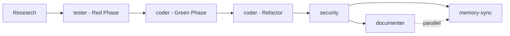

# Recipe: TDD Development Cycle

## Overview
Complete test-driven development workflow implementing the Red-Green-Refactor cycle using agent orchestration for maximum quality and coverage.

## Philosophy
**"Red-Green-Refactor-Document"** - Tests first, implementation second, optimization third, documentation last. This ensures code quality, maintainability, and comprehensive test coverage from the beginning.

## Use Case
- Implementing new features with TDD methodology
- Building payment processing systems
- Creating business-critical functionality
- Ensuring high test coverage (>90%)
- Developing with BDD integration
- Complex algorithms requiring validation
- API endpoints with comprehensive testing
- Data processing pipelines

## Agent Sequence



## Step-by-Step Process

### Phase 1: RED - Write Failing Tests First
**Agent:** `/agent:tester`  
**Anti-Clutter Check:** Search for existing test patterns and utilities first

**Context Required:**
```markdown
## Feature Requirements
[Detailed functional requirements]
[Business logic specifications]
[Input/output specifications]
[Edge cases and error conditions]

## Existing Test Patterns
[Include 2-3 examples of test structure from codebase]
[Mock patterns used in project]
[Test utilities and helpers available]

## Testing Framework Context
[Jest/Mocha/Vitest/Pytest configuration]
[Assertion libraries in use]
[Coverage tools configured]

## BDD Integration (if applicable)
[Cucumber/Gherkin patterns]
[Feature file examples]
[Step definition patterns]
```

**Expected Output:**
- Comprehensive test suite (unit, integration, edge cases)
- BDD scenarios if applicable
- Mock/stub definitions
- Test data fixtures
- Expected assertions for all scenarios
- Performance test cases if needed

**Success Criteria for RED Phase:**
- [ ] All tests fail (no implementation exists)
- [ ] Tests cover all requirements
- [ ] Edge cases included
- [ ] Error conditions tested
- [ ] Mock patterns established
- [ ] Test structure follows project conventions

### Phase 2: GREEN - Minimal Implementation
**Agent:** `/agent:coder`  
**Anti-Clutter Check:** Search for reusable components and existing implementations

**Context Required:**
```markdown
## Failing Tests
[Complete test suite from tester]
[Specific assertions that need to pass]

## Implementation Context
[Programming language and framework]
[Existing code patterns to follow]
[Dependencies and libraries available]
[Database schemas if applicable]

## Minimal Implementation Goal
Focus ONLY on making tests pass, not on optimization or elegance
```

**Expected Output:**
- Minimal working implementation
- All tests passing
- No premature optimization
- Clear, simple code structure
- Proper error handling for test scenarios

**Success Criteria for GREEN Phase:**
- [ ] All tests pass
- [ ] Implementation is minimal
- [ ] No over-engineering
- [ ] Code follows basic patterns
- [ ] Error cases handled

### Phase 3: REFACTOR - Optimize and Clean
**Agent:** `/agent:coder`  
**Anti-Clutter Check:** Look for similar patterns to consolidate

**Context Required:**
```markdown
## Working Implementation
[Current code that passes all tests]

## Refactoring Goals
[Performance improvements needed]
[Code quality enhancements]
[Pattern consolidation opportunities]

## Project Standards
[Coding standards from codebase]
[Performance requirements]
[Architectural patterns to follow]
```

**Expected Output:**
- Optimized, clean code
- Improved performance
- Better code organization
- Consolidated patterns
- Enhanced readability
- All tests still passing

**Success Criteria for REFACTOR Phase:**
- [ ] All tests still pass
- [ ] Code quality improved
- [ ] Performance optimized
- [ ] Patterns consolidated
- [ ] No code duplication
- [ ] Follows project standards

### Phase 4: SECURE & DOCUMENT (Parallel)
**Agents:** `/agent:security` + `/agent:documenter` + `/agent:memory-sync`

#### Security Review
**Agent:** `/agent:security`  
**Context Required:**
```markdown
## Complete Implementation
[Final refactored code]
[Test suite]
[Data handling patterns]

## Security Requirements
[Authentication/authorization needs]
[Data validation requirements]
[Injection prevention needs]
```

**Expected Output:**
- Security vulnerability assessment
- Input validation verification
- Authentication/authorization review
- Data protection compliance
- Security fixes if needed

#### Documentation (Parallel)
**Agent:** `/agent:documenter`  
**Context Required:**
```markdown
## Final Implementation
[Complete code with tests]
[API interfaces]
[Usage patterns]

## Documentation Standards
[Project documentation format]
[Example documentation from codebase]
```

**Expected Output:**
- Technical documentation
- Usage examples
- API documentation
- Test documentation
- Integration guides

#### Memory Sync (Parallel)
**Agent:** `/agent:memory-sync`  
**Context Required:**
```markdown
## Implementation Details
[Complete code structure]
[Key architectural decisions]
[Test patterns established]
```

**Expected Output:**
- Knowledge graph updates
- Code relationship mapping
- Pattern recognition updates

## TDD-Specific Prompts

### For `/agent:tester` (RED Phase):
```
You are implementing Test-Driven Development. Your role is to write comprehensive failing tests BEFORE any implementation exists.

CRITICAL TDD RULES:
1. Write tests that FAIL initially (no implementation yet)
2. Cover ALL requirements, edge cases, and error conditions
3. Use descriptive test names that explain behavior
4. Create minimal test data fixtures
5. Establish mock patterns for dependencies
6. Focus on BEHAVIOR, not implementation details

Test Coverage Requirements:
- Unit tests for core logic
- Integration tests for external dependencies
- Edge case testing
- Error condition handling
- Performance assertions if applicable

Write tests that will guide implementation toward the correct solution.
```

### For `/agent:coder` (GREEN Phase):
```
You are in the GREEN phase of TDD. Your role is to write MINIMAL code that makes the failing tests pass.

CRITICAL GREEN PHASE RULES:
1. Make tests pass with minimal implementation
2. NO premature optimization
3. NO over-engineering
4. Focus on WORKING, not PERFECT
5. Hard-code values if it makes tests pass initially
6. Defer optimization to refactor phase

Your implementation should be the simplest thing that could possibly work.
```

### For `/agent:coder` (REFACTOR Phase):
```
You are in the REFACTOR phase of TDD. The tests are passing. Your role is to improve code quality while keeping all tests green.

CRITICAL REFACTOR RULES:
1. ALL tests must continue passing
2. Improve code structure and organization
3. Remove duplication
4. Enhance performance
5. Apply design patterns appropriately
6. Consolidate similar logic

Run tests after EVERY change to ensure nothing breaks.
```

## Comprehensive Example: Payment Processing Feature

### Requirement
Implement a payment processing system that:
- Validates payment data
- Processes credit card payments
- Handles payment failures
- Logs transactions
- Sends confirmation emails
- Supports refunds

### Phase 1: RED - Failing Tests

```javascript
// payment.test.js
describe('Payment Processing', () => {
  describe('Payment Validation', () => {
    test('should reject invalid card numbers', async () => {
      const invalidPayment = { cardNumber: '1234', amount: 100 };
      await expect(processPayment(invalidPayment))
        .rejects.toThrow('Invalid card number');
    });

    test('should reject expired cards', async () => {
      const expiredCard = { 
        cardNumber: '4111111111111111', 
        expiryDate: '01/2020',
        amount: 100 
      };
      await expect(processPayment(expiredCard))
        .rejects.toThrow('Card expired');
    });

    test('should reject insufficient funds', async () => {
      const payment = { 
        cardNumber: '4111111111111111',
        expiryDate: '12/2025',
        amount: 999999
      };
      mockPaymentGateway.mockRejectedValue(new Error('Insufficient funds'));
      await expect(processPayment(payment))
        .rejects.toThrow('Insufficient funds');
    });
  });

  describe('Successful Payment Processing', () => {
    test('should process valid payment successfully', async () => {
      const validPayment = {
        cardNumber: '4111111111111111',
        expiryDate: '12/2025',
        cvv: '123',
        amount: 100
      };
      
      mockPaymentGateway.mockResolvedValue({ 
        transactionId: 'tx_123',
        status: 'success' 
      });
      
      const result = await processPayment(validPayment);
      
      expect(result).toEqual({
        transactionId: 'tx_123',
        status: 'success',
        amount: 100
      });
    });

    test('should log transaction details', async () => {
      const payment = { /* valid payment data */ };
      mockPaymentGateway.mockResolvedValue({ transactionId: 'tx_123' });
      
      await processPayment(payment);
      
      expect(mockLogger.info).toHaveBeenCalledWith(
        'Payment processed',
        expect.objectContaining({
          transactionId: 'tx_123',
          amount: 100
        })
      );
    });

    test('should send confirmation email', async () => {
      const payment = { 
        /* valid payment data */
        email: 'customer@example.com' 
      };
      
      await processPayment(payment);
      
      expect(mockEmailService.send).toHaveBeenCalledWith({
        to: 'customer@example.com',
        subject: 'Payment Confirmation',
        template: 'payment-success'
      });
    });
  });

  describe('Refund Processing', () => {
    test('should process refund for valid transaction', async () => {
      const refundRequest = { 
        transactionId: 'tx_123',
        amount: 50 
      };
      
      mockPaymentGateway.refund.mockResolvedValue({
        refundId: 'rf_456',
        status: 'success'
      });
      
      const result = await processRefund(refundRequest);
      
      expect(result.refundId).toBe('rf_456');
      expect(result.status).toBe('success');
    });
  });
});
```

### Phase 2: GREEN - Minimal Implementation

```javascript
// payment.js
const validateCard = (cardNumber) => {
  if (cardNumber.length < 13) throw new Error('Invalid card number');
  // Minimal validation
};

const checkExpiry = (expiryDate) => {
  const [month, year] = expiryDate.split('/');
  const expiry = new Date(`20${year}`, month - 1);
  if (expiry < new Date()) throw new Error('Card expired');
};

const processPayment = async (payment) => {
  validateCard(payment.cardNumber);
  checkExpiry(payment.expiryDate);
  
  try {
    const result = await paymentGateway.charge(payment);
    
    // Log transaction
    logger.info('Payment processed', {
      transactionId: result.transactionId,
      amount: payment.amount
    });
    
    // Send email
    await emailService.send({
      to: payment.email,
      subject: 'Payment Confirmation',
      template: 'payment-success'
    });
    
    return {
      transactionId: result.transactionId,
      status: result.status,
      amount: payment.amount
    };
  } catch (error) {
    throw error;
  }
};

const processRefund = async (refundRequest) => {
  const result = await paymentGateway.refund(refundRequest);
  return result;
};
```

### Phase 3: REFACTOR - Optimize

```javascript
// payment.js (refactored)
class PaymentProcessor {
  constructor(gateway, logger, emailService) {
    this.gateway = gateway;
    this.logger = logger;
    this.emailService = emailService;
  }

  async processPayment(payment) {
    this.validatePayment(payment);
    
    try {
      const result = await this.gateway.charge(payment);
      await this.recordTransaction(result, payment);
      await this.sendConfirmation(payment, result);
      
      return this.formatResponse(result, payment);
    } catch (error) {
      this.logger.error('Payment failed', { error: error.message, payment });
      throw error;
    }
  }

  validatePayment(payment) {
    const validators = [
      () => this.validateCardNumber(payment.cardNumber),
      () => this.validateExpiry(payment.expiryDate),
      () => this.validateAmount(payment.amount)
    ];
    
    validators.forEach(validator => validator());
  }

  validateCardNumber(cardNumber) {
    if (!cardNumber || cardNumber.length < 13) {
      throw new PaymentError('Invalid card number');
    }
    // Luhn algorithm implementation
  }

  validateExpiry(expiryDate) {
    const [month, year] = expiryDate.split('/');
    const expiry = new Date(`20${year}`, month - 1);
    if (expiry < new Date()) {
      throw new PaymentError('Card expired');
    }
  }

  async recordTransaction(result, payment) {
    this.logger.info('Payment processed', {
      transactionId: result.transactionId,
      amount: payment.amount,
      timestamp: new Date().toISOString()
    });
  }

  async sendConfirmation(payment, result) {
    if (payment.email) {
      await this.emailService.send({
        to: payment.email,
        subject: 'Payment Confirmation',
        template: 'payment-success',
        data: { transactionId: result.transactionId }
      });
    }
  }

  formatResponse(result, payment) {
    return {
      transactionId: result.transactionId,
      status: result.status,
      amount: payment.amount,
      processedAt: new Date().toISOString()
    };
  }
}

class PaymentError extends Error {
  constructor(message, code = 'PAYMENT_ERROR') {
    super(message);
    this.name = 'PaymentError';
    this.code = code;
  }
}
```

## Parallel Execution Strategy

### After Implementation (Phases 2-3), run simultaneously:
1. **Security Review** - `/agent:security`
   - Input validation review
   - PCI compliance check
   - Injection prevention
   - Error handling security

2. **Documentation** - `/agent:documenter`
   - API documentation
   - Usage examples
   - Integration guides

3. **Memory Sync** - `/agent:memory-sync`
   - Update knowledge graph
   - Map code relationships

## Success Criteria
- [ ] All tests pass (100% test success rate)
- [ ] Code coverage >90%
- [ ] All requirements implemented
- [ ] Security review passed
- [ ] Performance acceptable
- [ ] Documentation complete
- [ ] BDD scenarios pass (if applicable)
- [ ] No code duplication
- [ ] Error handling comprehensive
- [ ] Memory sync completed

## Time Estimates
- Research Phase: 10-15 minutes
- RED Phase (Tests): 30-45 minutes
- GREEN Phase (Implementation): 45-60 minutes
- REFACTOR Phase: 20-30 minutes
- Security Review: 15-20 minutes
- Documentation: 15-20 minutes
- Memory Sync: 5-10 minutes

**Total: 2.5-3.5 hours**

## BDD Integration
When using Behavior-Driven Development:

### Feature File Example
```gherkin
Feature: Payment Processing
  As a customer
  I want to make secure payments
  So that I can complete my purchases

  Scenario: Successful payment
    Given I have a valid credit card
    And I want to pay $100
    When I submit the payment
    Then the payment should be processed successfully
    And I should receive a confirmation email
    And the transaction should be logged

  Scenario: Invalid card rejection
    Given I have an expired credit card
    When I submit the payment
    Then the payment should be rejected
    And I should see an "Card expired" error message
```

## Common Issues and Solutions

| Issue | Solution |
|-------|----------|
| Tests too complex initially | Start with simpler assertions, build up |
| Over-engineering in GREEN | Focus only on passing tests, defer optimization |
| Refactoring breaks tests | Run tests after every small change |
| Security context missing | Include data flow and threat model |
| Mock patterns inconsistent | Establish mock utilities early |
| Coverage gaps | Use coverage tools to identify missing tests |
| BDD scenarios unclear | Write scenarios in plain business language |

## Tips for Success

1. **RED Phase Quality**: Spend time writing comprehensive tests
2. **GREEN Discipline**: Resist the urge to optimize too early
3. **REFACTOR Confidence**: Make small changes, run tests frequently
4. **Parallel Efficiency**: Run security and documentation simultaneously
5. **Context Quality**: Include real examples from codebase
6. **BDD Integration**: Write scenarios before technical tests

## Recipe Variations

### API TDD
- Focus on endpoint testing
- Include request/response validation
- Add integration testing with databases

### Algorithm TDD
- Emphasize mathematical correctness
- Include performance benchmarks
- Add property-based testing

### UI Component TDD
- Component behavior testing
- User interaction testing
- Accessibility testing

### Database TDD
- Schema migration testing
- Data integrity testing
- Query performance testing

---

*Recipe Version: 1.0 | Last Updated: 08-09-2025*