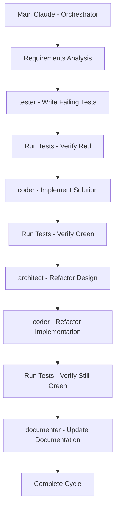

# Recipe: TDD Workflow with Agents

## Overview
Comprehensive Test-Driven Development workflow that automates the red-green-refactor cycle using specialized agents. Ensures high code quality through test-first development with agent-driven test generation, implementation, and refactoring.

## Philosophy
"Write the test first, make it pass, then make it better" - Automated TDD ensures reliable, maintainable code with comprehensive test coverage from the start.

## Use Case
- New feature development requiring high reliability
- Refactoring existing code with safety net
- API development with contract testing
- Complex business logic implementation
- Library or framework development

## Prerequisites
- Clear requirements or user stories
- Testing framework configured (Jest, Pytest, etc.)
- Development environment setup
- Code coverage tools available

## Agent Sequence



## Step-by-Step Process

### Phase 1: Requirements Analysis
**Agent:** Main Claude  
**Time:** 10-15 minutes

**Actions:**
```bash
# Analyze the feature requirements
Read user_story.md or requirements.txt

# Check existing test structure
ls tests/
find . -name "*.test.*" -o -name "*_test.*"

# Identify test framework and patterns
grep "describe\|test\|it" tests/* | head -20
```

**Output:**
```markdown
## TDD Plan for [Feature Name]

### Requirements:
- [ ] Requirement 1: [Description]
- [ ] Requirement 2: [Description]
- [ ] Requirement 3: [Description]

### Test Strategy:
- Unit tests for core logic
- Integration tests for API endpoints
- Edge cases and error scenarios
- Performance benchmarks if needed
```

### Phase 2: Write Failing Tests (Red)
**Agent:** `/agent:tester`  
**Time:** 20-30 minutes

**Context for Agent:**
```markdown
## TDD Test Generation Task

### Requirements to Test:
[List all requirements]

### Testing Framework:
- Language: [JavaScript/Python/Go/etc.]
- Framework: [Jest/Pytest/Testing/etc.]
- Assertion Library: [built-in/chai/etc.]

### Test Structure to Follow:
```javascript
describe('FeatureName', () => {
  describe('FunctionName', () => {
    it('should handle normal case', () => {
      // Arrange
      // Act
      // Assert
    });
    
    it('should handle edge case', () => {
      // Test edge cases
    });
    
    it('should handle error case', () => {
      // Test error scenarios
    });
  });
});
```

### Generate Tests For:
1. Happy path scenarios
2. Edge cases (empty, null, boundary values)
3. Error conditions
4. Performance requirements
5. Security validations

### Important:
- Tests should fail initially (no implementation exists)
- Use descriptive test names
- Include appropriate assertions
- Cover all acceptance criteria
```

**Expected Output:**
- Complete test suite file(s)
- All tests failing (red state)
- Clear test descriptions
- Comprehensive coverage of requirements

### Phase 3: Verify Red State
**Agent:** Main Claude  
**Time:** 5 minutes

**Actions:**
```bash
# Run the tests to verify they fail
npm test -- --no-coverage
# or
pytest tests/test_feature.py -v
# or
go test ./... -v

# Verify all new tests are failing
# Expected: All tests should fail with "not implemented" or similar
```

**Validation:**
- ✅ All new tests are failing
- ✅ Failure messages are clear
- ✅ No false positives

### Phase 4: Implement Solution (Green)
**Agent:** `/agent:coder`  
**Time:** 30-45 minutes

**Context for Agent:**
```markdown
## TDD Implementation Task

### Failing Tests to Fix:
[List of test files and test cases]

### Test Output:
```
[Include the failure output from test run]
```

### Requirements:
- Write minimal code to make tests pass
- Don't add unnecessary features
- Focus on making tests green
- Follow existing code patterns

### Code Structure:
- Location: [where to implement]
- Pattern: [MVC/Service/etc.]
- Dependencies: [required libraries]

### Success Criteria:
- All tests pass
- No regression in existing tests
- Clean, readable implementation
- Proper error handling
```

**Expected Output:**
- Implementation that passes all tests
- Minimal code (no over-engineering)
- Proper structure and organization

### Phase 5: Verify Green State
**Agent:** Main Claude  
**Time:** 5 minutes

**Actions:**
```bash
# Run all tests to verify they pass
npm test
# or
pytest
# or
go test ./... -cover

# Check code coverage
npm run coverage
# or
pytest --cov=src --cov-report=term-missing
```

**Validation:**
- ✅ All tests passing
- ✅ No regression in existing tests
- ✅ Code coverage meets threshold (>80%)

### Phase 6: Refactor Design
**Agent:** `/agent:architect`  
**Time:** 15-20 minutes

**Context for Agent:**
```markdown
## Refactoring Analysis

### Current Implementation:
[Code structure overview]

### Code Smells to Check:
- Long methods (>20 lines)
- Duplicate code
- Complex conditionals
- Poor naming
- Tight coupling
- Missing abstractions

### Refactoring Opportunities:
- Extract methods/functions
- Introduce design patterns
- Improve naming
- Reduce complexity
- Add abstractions

### Constraints:
- Tests must continue to pass
- No change in external behavior
- Maintain backward compatibility
```

**Expected Output:**
```markdown
## Refactoring Plan

### Identified Issues:
1. [Issue 1 and location]
2. [Issue 2 and location]

### Recommended Refactorings:
1. Extract method X from function Y
2. Apply Strategy pattern for Z
3. Rename variables for clarity

### Risk Assessment:
- Low risk: [refactorings]
- Medium risk: [refactorings]
```

### Phase 7: Refactor Implementation
**Agent:** `/agent:coder`  
**Time:** 20-30 minutes

**Context for Agent:**
```markdown
## Refactoring Implementation

### Refactoring Plan:
[From architect agent]

### Current Tests:
- All tests passing
- Coverage at X%

### Refactoring Rules:
1. Make one change at a time
2. Run tests after each change
3. Commit working state before next refactoring
4. Don't change test expectations

### Quality Metrics:
- Cyclomatic complexity < 10
- Method length < 20 lines
- Class cohesion > 0.8
- Test coverage maintained
```

**Expected Output:**
- Refactored code with improved structure
- All tests still passing
- Better readability and maintainability

### Phase 8: Final Validation
**Agent:** Main Claude  
**Time:** 10 minutes

**Actions:**
```bash
# Run full test suite
npm test

# Run linting
npm run lint
# or
flake8 src/
# or
golint ./...

# Check code quality metrics
npm run quality
# or custom quality checks

# Run mutation testing if available
npm run stryker
# or
mutmut run
```

**Quality Gates:**
- ✅ All tests passing
- ✅ Code coverage >80%
- ✅ No linting errors
- ✅ Complexity metrics within limits
- ✅ No code duplication

### Phase 9: Documentation Update
**Agent:** `/agent:documenter`  
**Time:** 15 minutes

**Context for Agent:**
```markdown
## Documentation Update Task

### Implemented Feature:
[Feature description and location]

### Test Coverage:
- Unit tests: [files]
- Integration tests: [files]
- Coverage: X%

### Documentation to Update:
1. API documentation
2. README.md
3. Code comments
4. Test documentation
5. Architecture diagrams if needed

### Include:
- How to run tests
- Test coverage reports
- Example usage
- Performance characteristics
```

## Recipe Variations

### API TDD Workflow
```bash
# Additional steps for API development
1. Write API contract tests first
2. Generate OpenAPI spec from tests
3. Implement endpoints to match contracts
4. Add integration tests
5. Document with examples
```

### Frontend TDD Workflow
```bash
# Component testing focus
1. Write component tests with React Testing Library
2. Test user interactions
3. Implement components
4. Add visual regression tests
5. Test accessibility
```

### Microservice TDD Workflow
```bash
# Service-level testing
1. Write contract tests
2. Write integration tests
3. Implement service logic
4. Add performance tests
5. Test fault tolerance
```

## Success Metrics
- ✅ 100% test-first development
- ✅ >90% code coverage achieved
- ✅ All tests passing
- ✅ Reduced bug density
- ✅ Improved code maintainability
- ✅ Clear documentation

## Common Patterns

### Test Organization Pattern
```
tests/
├── unit/           # Fast, isolated tests
├── integration/    # Component interaction tests
├── e2e/           # End-to-end tests
├── fixtures/      # Test data
├── helpers/       # Test utilities
└── mocks/         # Mock objects
```

### AAA Pattern (Arrange-Act-Assert)
```javascript
it('should calculate total correctly', () => {
  // Arrange
  const items = [{ price: 10 }, { price: 20 }];
  const calculator = new PriceCalculator();
  
  // Act
  const total = calculator.calculateTotal(items);
  
  // Assert
  expect(total).toBe(30);
});
```

### Test Data Builder Pattern
```javascript
class UserBuilder {
  constructor() {
    this.user = {
      id: 1,
      name: 'Test User',
      email: 'test@example.com'
    };
  }
  
  withName(name) {
    this.user.name = name;
    return this;
  }
  
  withEmail(email) {
    this.user.email = email;
    return this;
  }
  
  build() {
    return this.user;
  }
}

// Usage in tests
const user = new UserBuilder()
  .withName('John Doe')
  .withEmail('john@example.com')
  .build();
```

## Troubleshooting

| Issue | Solution |
|-------|----------|
| Tests too slow | Use test doubles, parallel execution |
| Flaky tests | Remove timing dependencies, use deterministic data |
| Hard to test code | Refactor for testability, use dependency injection |
| Low coverage | Add edge cases, error scenarios |
| Brittle tests | Test behavior not implementation |

## Integration with CI/CD

```yaml
# Example GitHub Actions workflow
name: TDD Workflow
on: [push, pull_request]

jobs:
  test:
    runs-on: ubuntu-latest
    steps:
      - uses: actions/checkout@v2
      - name: Setup
        run: npm install
      - name: Lint
        run: npm run lint
      - name: Test
        run: npm test
      - name: Coverage
        run: npm run coverage
      - name: Quality Gates
        run: |
          if [ $(npm run coverage:check) -lt 80 ]; then
            echo "Coverage below 80%"
            exit 1
          fi
```

## Best Practices
- Write one test at a time
- Keep tests independent
- Use descriptive test names
- Test behavior, not implementation
- Maintain test quality like production code
- Regular test refactoring
- Fast test execution (<10 seconds for unit tests)

---

*Recipe tested with: Jest, Pytest, Go testing, various project types*